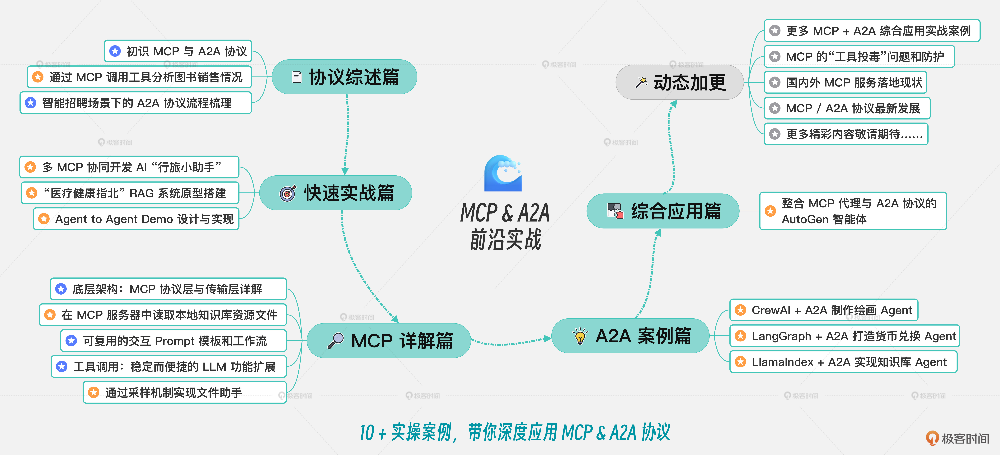
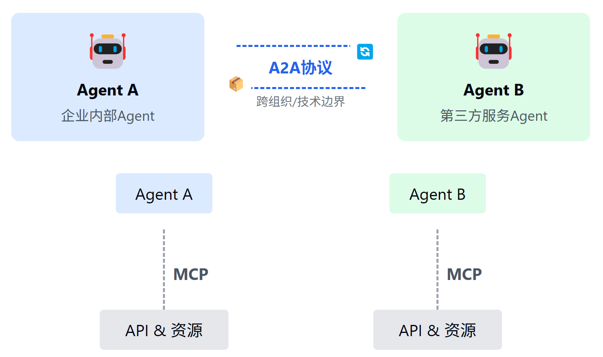
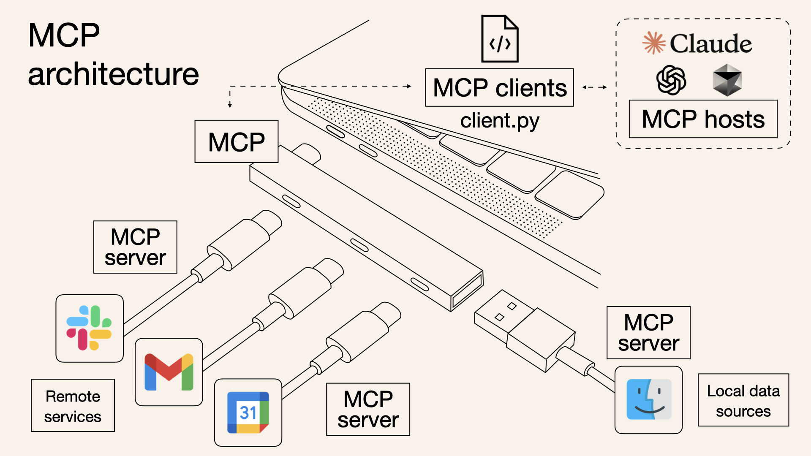
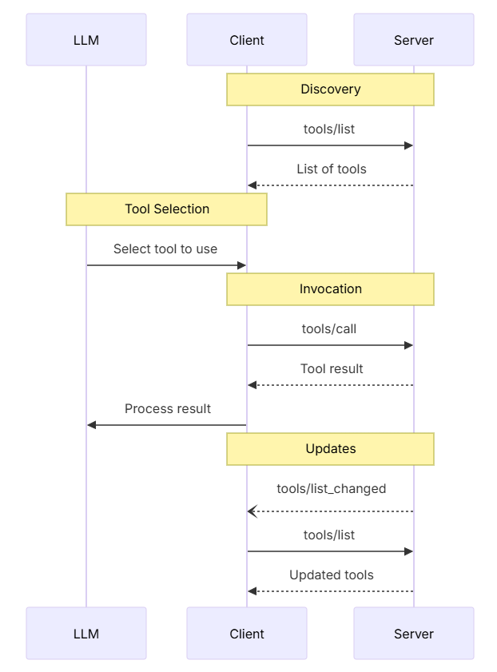

课程设计了六大模块，涉及 10 + 实操案例，带你深度理解和应用 MCP & A2A 协议。这门课程中的所有代码都在 GitHhub 上面开源，你可以在（[ mcp-in-action ](https://github.com/huangjia2019/mcp-in-action)）和（[ a2a-in-action ](https://github.com/huangjia2019/a2a-in-action)）仓库下载代码，一起动手实操，并提交 PR 共同维护 Repo。

# MCP

MCP 是一个客户端 - 服务器的架构，其核心理念是“模型主控、客户端驱动服务器调用”——模型负责推理和决策，客户端则动态提供上下文、工具和资源，而这些工具和资源则由外部服务器来提供。

MCP 功能：

- 统一工具描述：所有 Search、Translate、QueryDB 等能力用同一份 tool.json 注册，模型只按名字“call”就行。 
- 会话与权限：自动管理多轮对话状态、工具访问权限与鉴权流程，模型无需关心鉴权细节。 
- 流式与事件：内建流式数据返回、异步回调和事件订阅，让长任务、实时监控、异步通知都能自然融入推理流程。 
- 多传输层：既可跑 HTTP/REST，也可挂 WebSocket、RPC 框架或消息队列，灵活适配不同部署场景。

概念：

- MCP “Server” 则是真正提供上下文内容和工具执行能力的进程或服务
  - 它在启动时会注册一系列接口（Resource 列表、工具调用、文件系统访问、外部 API 调用等），并监听来自 Client 的 JSON-RPC 消息。当收到“调用某个工具”这样的请求时，Server 会校验参数、调用相应逻辑，将结果封装成 Result 消息回传；如果出现异常，则返回带有标准错误码（如 ParseError、InvalidParams、MethodNotFound）的 Error 响应。
- Resources
- Tools
  - MCP Server 声明和实现 Tools，Server 向 Client 注册可用的 Tools，Client 发现 Tools 并调用这些 Tools

Tools 声明和调用

 

资源发现（Resources）

- 服务端向客户端提供资源，客户端查询服务端提供了哪些资源。
- 服务器通过 resources/list 接口，声明自己提供了哪些 URI（或 URI 模板），并给出名称、描述、MIME 类型等元信息。
- 客户端调用 resources/list 拿到资源清单（或模板），再根据清单中的 URI 调用 resources/read 获取实际内容

# RAG

RAG（Retrieval-Augmented Generation，检索增强生成），它是一种将检索与生成结合起来的对话或问答技术。当用户提出问题时，系统先把问题转成向量（Embedding），在事先构建好的向量数据库中检索出与问题最相关的文档片段，再把这些片段连同原始问题一起喂给大模型（LLM）生成回答。这样可以让模型“看到”最新、最准确的外部知识，弥补它自身训练数据的盲区或时效性不足。

具体流程可以分为三步：

- 第一步，嵌入（Embedding）——将用户问题转化为向量。
- 第二步，检索（Retrieval）——在向量索引中找出与这个向量最相近的若干文档块。 
- 第三步，生成（Generation）——把检索到的文档片段和问题一起作为提示，交给大模型输出最终答案。

# A2A

特点：

- 统一协议：所有 Agent 均使用同一消息 schema 进行能力发现与调用。 
- 异步协作：支持流式与异步返回，可并发处理多任务。 
- 灵活扩展：新 Agent 即插即用，无需额外适配器。 
- 解耦实现：Agent 专注业务，底层传输、鉴权、错误处理由协议层统一管理。

结构：A2A 协议设计了一套完整的对象体系，包括 Agent Card、Task、Artifact 和 Message

- Agent Card：每个支持 A2A 的远程 Agent 需要发布一个 JSON 格式的 “Agent Card”，描述该 Agent 的能力和认证机制。Client 可以通过这些信息选择最适合的 Agent 来完成任务。
- Task：Task 是 Client 和 Remote Agent 之间协作的核心概念。一个 Task 代表一个需要完成的任务，包含状态、历史记录和结果。
- Artifact：Artifact 是 Remote Agent 生成的任务结果。Artifact 可以有多个部分（parts），可以是文本、图像等。
- Message：Message 用于 Client 和 Remote Agent 之间的通信，可以包含指令、状态更新等内容。一个 Message 可以包含多个 parts，用于传递不同类型的内容。

A2A 协议的典型工作流程如下： 

- 能力发现：每个 Agent 通过一个 JSON 格式的 “Agent Card” 公布自己能执行的能力（如检索文档、调度会议等）。 
- 任务管理：Agent 间围绕一个 “task” 对象展开协作。该对象有生命周期、状态更新和最终产物（artifact），支持即时完成与长跑任务两种模式。 
- 消息协作：双方可互发消息，携带上下文、用户指令或中间产物；消息中包含若干 “parts”，每个 part 都指明内容类型，便于双方就 UI 呈现形式（如图片、表单、视频）进行协商。
-  状态同步：通过 SSE 等机制，Client Agent 与 Remote Agent 保持实时状态同步，确保用户看到最新的进度和结果。