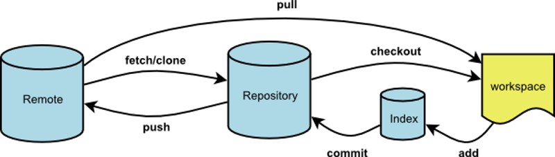
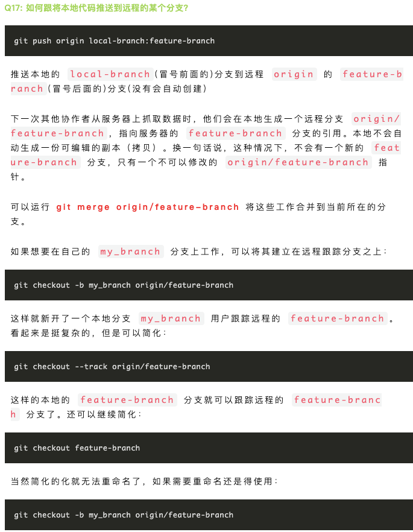

[Git官网](https://git-scm.com/) 

[国外网友制作的Git Cheat Sheet](https://gitee.com/liaoxuefeng/learn-java/raw/master/teach/git-cheatsheet.pdf) 

[Git骚操作](https://mp.weixin.qq.com/s/1wFDbOm-FJ_NlBYvxN05Ng) 

[团队合作必备的 Git 操作](https://mp.weixin.qq.com/s/xQY5oFjwV7EAcWxT_7njfw)  

[sourcebot](https://github.com/sourcebot-dev/sourcebot)： 开源的代码搜索工具，可以快速对代码建立索引。

**git \<command> [options] [arguments]**

- []: 可选
- <>:  必选
- {}:  单选

 


**pull rebase** 

```shell
git stash
git pull --rebase
git push
git stash pop
```

**git rebase**

- [git merge 与 git rebase的区别](https://juejin.im/post/6844903603694469134)  
- [rebase](https://www.liaoxuefeng.com/wiki/896043488029600/1216289527823648)

# 配置

本地Git仓库和GitHub仓库之间的传输是通过SSH加密的，生成公钥私钥后，分发公钥，自己保留私钥。

- 生成SSH密钥

```shell
1. 创建密钥
ssh-keygen -t rsa -C <注册使用的邮箱>
或 ssh-keygen -t ed25519 -C "your_email@example.com"

将 user/.ssh/id_rsa.pub 中的内容复制到Github/Setting/SSH and GPG keys
2. 测试
ssh -T git@github.com
```

如果出现 `ssh -T xxx` 报错提示：`git@gitlab.com: Permission denied (publickey).`，先执行 `ssh-add -l` 查看 ssh-agent 中是否有秘钥，如果没有则执行 `ssh-add xx/.ssh/id_rsa` 将某个秘钥加入到 ssh-agent 的高速缓存中。


执行 `ssh-add -d xx/.ssh/id_rsa`  删除某个秘钥，执行 `ssh-add -D`  删除 ssh-agent 中的所有的秘钥。


默认SSH只会读取 id_rsa，所以为了让SSH识别新的私钥，需要将其添加到SSH agent使用命令：`ssh-add ~/.ssh/id_rsa_xxx`，如果报错：`Could not open a connection to your authentication agent.无法连接到ssh agent`，执行 `ssh-agent bash` 后再执行 `ssh-add` 命令。

- Git 是分布式版本管理，因此每台电脑需要自报家门。

```shell
git config --global user.name "xxx"
git config --global user.email "xxx"
```

`global` 表示该电脑上的所有Git仓库都使用该配置信息。

- 配置命令别名，当常用的命令或长的命令用短的别名代替

```shell
git config --global alias.last = cat-file commit HEAD
# 用 last 代替 cat-file commit HEAD
```

- 设置`git commit`时打开的默认编辑器

```shell
# 指定使用sublime Text编辑commit
#修改或添加下面内容到git的全局配置文件.gitconfig，通常该文件在~/.gitconfig
[core]
  editor = '/Applications/Sublime Text.app/Contents/SharedSupport/bin/subl' -n -w

#或者命令行中输入
git config --global core.editor "'/Applications/Sublime Text.app/Contents/SharedSupport/bin/subl' -n -w"
```

# [多用户配置](https://www.cnblogs.com/anyefrozen/p/6379046.html) 


## 不同域名不同秘钥

> 一个电脑上配置多个git 代码托管 Host 域名

创建key，执行多次在 `.ssh` 目录下生成多个秘钥对

```shell
ssh-keygen -t ed25519 -C xxx@email -f /xxx/xx/id_ed25519_xx
```

在 `.ssh` 目录下新建 `config` 文件并添加以下内容

```
# company
Host git.xxx.com
  HostName git.xxx.com
  Port xxx
  IdentityFile ~/.ssh/id_ed25519_xxx

# self
# [通过 HTTPS 端口使用 SSH](https://docs.github.com/en/authentication/troubleshooting-ssh/using-ssh-over-the-https-port)
Host github.com
  Hostname ssh.github.com
  Port 443
  User git
  IdentityFile ~/.ssh/id_ed25519_xxx

Host gitlab.com
  Hostname gitlab.com
  User git
  IdentityFile ~/.ssh/id_ed25519_xxx

Host gitee.com
  Hostname gitee.com
  User git
  IdentityFile ~/.ssh/id_ed25519_xxx

# git@codeup.aliyun.com:68e757ca9add35de197aab53/wx-pwd.git
Host codeup.aliyun.com
  Hostname codeup.aliyun.com
  User git
  IdentityFile ~/.ssh/xxx
```

**备注：**

- `Host` 对应的值不能随便填，这个值对应的在终端使用 `git` 命令时的域名，比如 `git@github.com:xxx/project-x.git` 中的 `github.com`，相当于将 `Host` 映射为 `HostName`。
  - `Host` 可以自定义，Host 与终端输入的命令匹配

- Port 不是必填

将 `.ssh` 下的公钥添加加对于的 gitlab、github 项目中

到此实现不同的 git 项目使用不同的秘钥对


## 配置多个 user.name

目的：当不同的项目想使用不同的 user.name user.email 进行 git commit 等操作时，可以配置 `.gitconfig` 文件实现某个目录下的 git 项目使用相同的 user.name


在 `~/.gitconfig` 文件中添加以下内容

```
[user]
	name = erik
	email = czlong607@gmail.com

# somedir 目录下的 git 项目都会引入 /xxx/.git-config 并且会覆盖上面的配置
[includeIf "gitdir:/xxx/xxx/somedir/"]
  path = /xxx/.git-config
```

在 `.git-config` 中添加以下内容


```
[user]
	name = erik
	email = czlong607@gmail.com
```

到此完成


## 同一域名不同账户

> 一个电脑上针对同一个域名配置不同的账号秘钥对

1. 根据2.1中的内容，使用自定义 `Host` ，不同的账户使用不同的 Host
2. 配置 `insteadOf` 自动将自定义的 Host 还原为真实的 Host


```
# See custom `Host github-plnx` in ~/.ssh/config
[url "github-plnx:planet-express"]
  insteadOf = git@github.com:planet-express
```

# 创建版本库

1. 本地创建

```shell
git init
```

# 管理本地仓库

- 本地文件更新，且未 add 到暂存区，撤销本地更改。

```shell
git restore <file>
```

- add 到暂存区(stage)，且未commit 到版本库，撤销add 更改，不影响本地文件。

```shell
git restore --staged <file>
```

- 撤销最近的一次 commit 

```shell
git revert HEAD
在当前提交后面，新增一次提交，抵消掉上一次提交导致的所有变化。
```

- 修改commit的message

```shell
  git commit --amend "xxx"
  git commit -am "message";  //
```

- 版本回退 git reset

git reset让最新提交的指针回到以前某个时点，该时点之后的提交都从历史中消失。
默认情况下，git reset不改变工作区的文件（但会改变暂存区），--hard参数可以让工作区里面的文件也回到以前的状态。

```shell
git reset HEAD^1  // 回退一个版本
git reset --hard HEAD^1
```

- git diff：查看改动(谁和谁之间的改动？)

- 删除reflog 中的提交记录？

```shell
git log --oneline
git reflog
git diff 工作区和版本库里面最新版本的区别：
```

# 远程仓库

本地Git仓库和GitHub仓库之间的传输是通过SSH加密的，生成公钥私钥后，分发公钥，自己保留私钥。

每个远程主机都有一个主机名，默认为 origin，

- 克隆远程仓库

```shell
git clone git@github.com:xx.git [本地目录名]
git clone -o <主机名> 地址
```

- 查看

```shell
git remote -v
```

- 删除远程主机

```shell
git remote rm <主机名>
```

- 重命名

```shell
git remote rename <原主机名> <新主机名>
```

- 本地仓库关联远程仓库

一个本地库可以关联多个远程库

```shell
git remote add [shortname] <url>
git remote add origin <url>
```

- 将本地仓库的当前分支推送到远程库。

```shell
# git push <远程主机名> <本地分支名>:<远程分支名>
git push -u origin master
```

- git fetch

这个命令会访问远程仓库，从中拉取所有你还没有的数据。 执行完成后，你将会拥有那个远程仓库中所有分支的引用，不会自动与本地仓库合并，可以随时合并或查看。fetch 后可以使用在本地使用'远程库/分支'访问，相当于远程库在本地的副本。

```shell
git fetch <远程仓库>  // 拉取远程仓库的全部分支的更新
git fetch <远程仓库> <远程分支>
git merge <远程库>/<分支>  // 将拉取的更新合并到当前分支
origin/master
```

- 更新本地仓库到最新的版本，git pull
  

git pull等于git fetch + git merge或fetch + git rebase。

```shell
git pull <远程主机名> <远程分支名>:<本地分支名>
默认与本地当前分支合并

git pull origin master --allow-unrelated-histories
```


git pull --rebase
合并远程仓库的变化到当前分支

- git merge

- git rebase

# 分支

关键字：HEAD  master

每个分支都有一个指向该分支上提交节点的指针(引用)，如master 分支用master 指向节点，dev分支用dev 指向节点。在master分支上新增一个 `commit` 时，就会在该分支上新增一个节点，并且master 也会移动指向新的节点。HEAD 指向当前工作所在的分支中的位置，可以看作当前分支的别名，如HEAD指向master，master指向某个节点。[参考](https://www.liaoxuefeng.com/wiki/896043488029600/900003767775424)

- 查看分支

```shell
git branch [-v | -a| -vv]
-v: 查看本地分支
-vv: 查看本地分支与远程分支之间的关联关系
```

- 新建分支

```shell
git branch dev
```

- 切换分支

```shell
git checkout dev #新版中使用 switch 替换checkout
```

- 切换分支会更新本地文件和暂存区(index)，工作区中的修改会保存(kept)。工作区和提交到暂存区中的修改，切换到其他分支时，这些修改会带到其他分支去(在其他分支也能看到)。

- 新建并切换分支

```shell
// 注意是从哪个分支新建
git checkout -b dev / git swich -c dev
```

**注：**在本地工作时要明确当前是在哪个分支上工作。

已某个远程分支为基础新建分支

```shell
git checkout -b 本地分支名x origin/远程分支名x
```

- 本地分支关联远程分支，建立追踪关系

```shell
//  如果远程已经有了feature-branch，通过git fetch拉到本地，并通过以下命令在本地新建了feature-branch，并同远程分支关联。
git checkout -b feature-branch origin/feature-branch

// 手动关联
git branch --set-upstream-to=<远程分支/branch_name> 本地分支
```

- 本地分支push到远程分支

```shell
//
git push <远程主机名> <本地分支名>:<远程分支名>
git push origin local-branch:remote-branch
```

 

- 删除分支

```shell
# 删除本地分支
git branch -d <branchname>
# 删除远程分支
git push origin --delete <branchName>
```

- [git stash](https://cloud.tencent.com/developer/article/2177783) 

进度尚未完成，保存进度。保存后工作区是干净的。

切换分支会改变本地文件，如果本地修改未commit 是不能切换分支，但如果当前工作尚未完成不便提交 commit ，此使使用 stash 暂时保存本地文件。

```shell
# 查看stash
git stash list

# 保存stash
git stash -u
# 或者 git stash save "some msg"

# 恢复stash
# 将缓存堆栈中的第一个stash删除，并将对应修改应用到当前的工作目录下
git stash pop  

# 将缓存堆栈中的stash多次应用到工作目录中，但并不删除stash拷贝，默认使用最近的stash
git stash apply stash@{n}

# 删除stash
git stash drop stash@{n}
```

参考: [Bug分支](https://www.liaoxuefeng.com/wiki/896043488029600/900388704535136)

- 合并某个提交

```
git cherry-pick
```

[如何获取某个分支的某次提交内容？](https://mp.weixin.qq.com/s/1wFDbOm-FJ_NlBYvxN05Ng) 

- git pull

```shell
// 拉取远程origin仓库的remote-branch 分支，然后与本地的 local-branch 分支合并
git pull [origin] [remote-branch]:[local-branch]

// 拉取远程仓库中与本地当前分支建立追踪关系的分支，然后与本地当前分支合并
git pull 

git pull --rebase origin master
```

参考：[Git远程操作-阮一峰](https://www.ruanyifeng.com/blog/2014/06/git_remote.html) 

- git fetch

拉取远程仓库的分支，在本地生成或更新本地的引用(`origin/remote-branch`)

```shell
// 默认拉取远程仓库的全部分支的更新
git fetch [remote-repository] [remote-branch]
// 拉取远程仓库的全部更新
git fetch
// 只拉取远程仓库中master分支的更新
git fetch origin master
```

- 在本地分支与远程分支之间建立追踪关系

```shell
git branch --set-upstream local-branch origin/remote-branch
```

- 合并分支

```shell
// 将dev分支合并到当前所在分支，当前所在分支会更新，将其他分支上的修改补充到当前分支
git merge dev  

// 不使用fast forward快速合并
git merge --no-ff -m "xx" dev

git merge --abort

git merge --allow-unrelated-histories

git merge origin/remote-branch
```

- rebase模式合并？参考：[Git骚操作](https://mp.weixin.qq.com/s/1wFDbOm-FJ_NlBYvxN05Ng) 


**参考**：

- [Git远程操作-阮一峰](https://www.ruanyifeng.com/blog/2014/06/git_remote.html) 
- [Git骚操作](https://mp.weixin.qq.com/s/1wFDbOm-FJ_NlBYvxN05Ng) 


# Git Commit

一次commit只对应一件事，需清晰明了，说明本次提交的目的。

commit message格式为`$type: $description`。

type用于说明commit的类型，只允许使用以下类型。

```
* feat：新功能（feature）
* fix：修补bug
* docs：文档（documentation）
* style： 格式（不影响代码运行的变动）
* refactor：重构（即不是新增功能，也不是修改bug的代码变动）
* test：增加测试
* chore：构建过程或辅助工具的变动
```

比如：一个组件现在有2个bug，按照以前我们是把2个bug都改了，再commit。而现在需要，解决一个bug就提交一次，并在commit message中写上**fix: bug#1234**（bug号）。


# 标签

Tag 与commit 相关联，创建的Tag存储在本地，不会自动上传到远程库，

- 查看Tag：`git tag`

- 添加Tag

```shell
git tag <TagName>
% 默认将Tag添加到最新的commit上(HEAD指向的commit)，可以通过指定commit id，为指定的commit添加Tag.
git tag <TagName> [commitId]

git tag -a v1.4 -m "my version 1.4"
% 添加带注释的Tag
git tag -a <TagName> -m "xx" commitID
```

- 推送到远程

`git push origin TagName` 
`git push origin --tags` 

- 删除

```shell
git tag -d TagName  % 删除本地Tag
git push origin :refs/tags/v0.9 % 删除远程Tag
```


# Commitizen

- [优雅的提交你的 Git Commit Message-掘金](https://juejin.im/post/5afc5242f265da0b7f44bee4) 
- [看下大厂 Git 提交规范是怎么做的-腾讯云](https://cloud.tencent.com/developer/article/1580371) 


# 理论

`HEAD` 文件存放的是当前所在分支的引用。


# 统计

统计某次 commit 提交的代码量

```sh
git diff --stat commitid^1 commitid
```


# 其他

- [Gitee](https://gitee.com/) 国内Git托管平台，[api](https://api.gitee.com/api/v5/swagger#/getV5ReposOwnerRepoStargazers?ex=no) 

- [Github 搜索](https://docs.github.com/en/search-github) 

- [sourcegraph - 仓库搜索](https://sourcegraph.com/search?q=context:global+repo:github.com/ruanyf/weekly+%E5%AD%98%E5%82%A8&patternType=keyword&sm=0) 

- [Commit message 和 Change log 编写指南](https://www.ruanyifeng.com/blog/2016/01/commit_message_change_log.html) 

- [git rebase 与 merge的区别](https://mp.weixin.qq.com/s/XDINQCV2uv7TMhCi-ldGSw) 

- [通过 HTTPS 端口使用 SSH](https://docs.github.com/en/authentication/troubleshooting-ssh/using-ssh-over-the-https-port) 