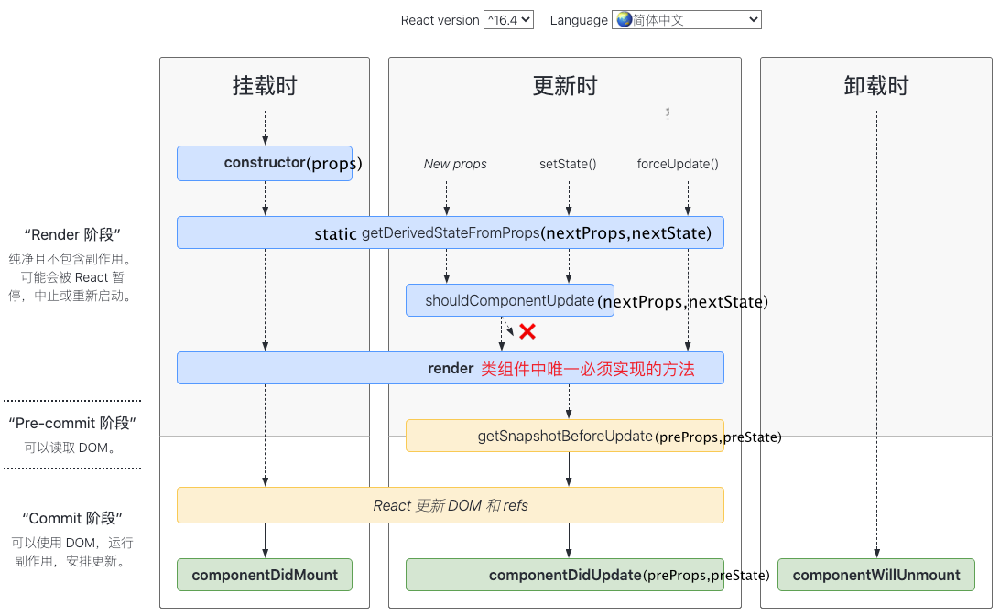

React 可以使用 Node 进行服务器渲染，或使用 React Native 开发原生移动应用。

虚拟 DOM 渲染成页面上的UI的几种场景：

1. 通过 react-dom 在浏览器上渲染，react-dom 将虚拟dom节点转换为浏览器的dom节点。
2. 使用node在服务端渲染
3. 使用react native在手机上渲染

# 索引

[英文官网](https://react.dev/) [中文官网1](https://react.docschina.org/) [中文官网2](https://zh-hans.react.dev/) 

**核心概念**

- 组件、组件通信
- 状态管理
- UI 复用，组件传递
- 样式
- 渲染机制、更新机制、**组件什么情况下 re-render**

## 开发规则

1. React 组件必须以大写字母开头，而 HTML 标签则必须是小写字母，html 属性都在 React 中需要改为小驼峰形式。
2. 组件不能返回多个 JSX 标签


# 概念思想

> 思想

React components are JavaScript functions. 

1. Web 应用是一个状态机，视图与状态是一一对应的，旧的状态只能被新的状态替换不能被修改【不可变性】。
2. 所有的状态，保存在一个对象里面。Redux 规定， 一个 State 对应一个 View。只要 State 相同，View 就相同。你知道 State，就知道 View 是什么样，反之亦然。


从概念上讲，React 分两个阶段工作：

1. **渲染** 阶段会确定需要进行哪些更改，比如 DOM。在此阶段，React 调用 `render`，然后将结果与上次渲染的结果进行比较。
2. **提交** 阶段发生在当 React 应用变化时。（对于 React DOM 来说，会发生在 React 插入、更新及删除 DOM 节点的时候。）在此阶段，React 还会调用 `componentDidMount` 和 `componentDidUpdate` 之类的生命周期方法。

当 React 元素为用户自定义组件时，它会将 JSX 所接收的属性（attributes）转换为单个对象传递给组件（组件内部），这个对象被称之为**props**。

# 渲染机制

React makes **UI trees** from your JSX. Then React DOM updates the browser DOM elements to match that UI tree. (React Native translates these trees into elements specific to mobile platforms.)

 


> DOM 显示到页面上的过程

组件显示在屏幕上之前，它们必须由 React 进行渲染，分为以下三个步骤

1. **触发渲染**：初始渲染或组件、父组件状态更新时 re-render

Updating your component’s state automatically queues a render. 

2. **React 渲染组件**

触发渲染后 React 会调用您的组件来确定要在屏幕上显示的内容。渲染过程是递归的，如果某个更新的组件返回了其他组件，React 会渲染这些组件直到没有嵌套的组件。

组件每次 render 时都获取独立的状态值（props、state），这些状态值是【不可变】，当状态值变化时又会重新 render 组件。

在任意一次渲染中，props和state是始终保持不变的。如果props和state在不同的渲染中是相互独立的，那么使用到它们的任何值也是独立的（包括事件处理函数）。它们都属于一次特定的渲染。即便是事件处理中的异步函数调用“看到”的也是这次渲染中的状态值。


re-render 时 React 会计算与上次渲染相比哪些属性发生变化。

<p style="color:red">默认情况下，若一个父组件 re-render，父组件包含的子组件也会 re-render，即使子组件没有接收任何的 props 也没有访问任何数据。使用 memo 包裹子组件可以避免子组件无效渲染</p>

3. **更新DOM**

React 把更改提交到 DOM 上，在渲染（调用）您的组件之后 React 将会修改 DOM。
- 对于初次渲染， React 会使用 appendChild() DOM API 将其创建的所有 DOM 节点放在屏幕上。
- 对于重渲染， React 将应用最少的必要操作（在渲染时计算！），以使得 DOM 与最新的渲染输出相互匹配。

在渲染完成并且 React 更新 DOM 之后，浏览器就会重新绘制屏幕。尽管这个过程被称为“浏览器渲染”（“browser rendering”），但我们还是将它称为“绘制”（“painting”）

Commit 阶段需要做哪些？

- Effects run at the end of a [commit](https://react.dev/learn/render-and-commit) after the screen updates.

- React sets `ref.current` during the commit. Before updating the DOM, React sets the affected `ref.current` values to `null`. After updating the DOM, React immediately sets them to the corresponding DOM nodes.

## 渲染优化

**父组件 re-render 时子组件一定会 re-render**

By default, when a component re-renders, React re-renders all of its children recursively.

When a component visually wraps other components, let it [accept JSX as children.](https://react.dev/learn/passing-props-to-a-component#passing-jsx-as-children) Then, if the wrapper component updates its own state, React knows that its children don’t need to re-render.


使用 `memo`

默认情况下一个组件 re-renders 时它的子组件会递归 re-renders，当子组件的 props 和 state 没有变化时这种 re-renders 是多余的。为了避免这种无效的 re-renders 可以使用以下 API：useMemo、useCallback、memo

- useMemo、useCallback 主要是【缓存】组件内定义的局部变量、函数，主要是当【副作用】的依赖没有变化时避免执行副作用。
- 自定义 hook 内定义的局部函数建议都用 useCallback 包裹
- memo 主要是缓存组件（替换已经废弃的 `PureComponent`）

单独使用 useMemo、useCallback 没有意义，需要和 useEffect、memo 配合使用。

# 组件

从概念上讲，React components are JavaScript functions. 可以像普通函数一样调用并传递参数。


组件并不是真实的 DOM 节点，而是存在于内存之中的一种数据结构，叫做虚拟 DOM （virtual DOM）。只有当它插入文档以后，才会变成真实的 DOM 。根据 React 的设计，所有的 DOM 变动，都先在虚拟 DOM 上发生，然后再将实际发生变动的部分，反映在真实 DOM上，这种算法叫做 [DOM diff](http://calendar.perfplanet.com/2013/diff/) ，它可以极大提高网页的性能表现。

```tsx
function Greeting({ name, onClick }) {
  return <h1 onClick={onClick}>Hello, {name}</h1>;
}
const App = () => {
  const onClick = (e) => console.debug(e);
  // 函数调用
  return Greeting({ name: 'xas', onClick });
}
```

定义组件有两种方法：

1. 函数组件(无状态组件)，return ，返回 React 元素
   - 函数名必须大写开头，没有实例
   - 必须有返回值，可以返回 JSX对象或 null，当返回 JSX时，只能有一个根元素

2. class组件(有状态组件)<b style="color:red">废弃</b>，render--> return，返回 React 元素
   组件可以维护其内部的状态数据（通过 `this.state` 访问）。当组件的状态数据改变时，组件会再次调用 `render()` 方法重新渲染对应的标记。`render` 不负责组件的实际渲染工作，实际的渲染由 React 负责。

> 组件定义需要遵守的规则

1. 组件名必须以大写开头，小写字母开头的被视为原生DOM标签
2. 不能返回多个标签，必须用一个标签（或空标签`<>xxx</>`）包裹
3. 必须闭合标签（``  或 `<div></div>`）
4. 不要在组件内定义其他组件，会导致性能和未知bug

> 受控组件和非受控组件

非受控组件：组件自身有状态，该状态不受父组件控制

受控组件：组件自身没有状态，数据来源于父组件

> 组件什么时候 re-render？

父组件 re-render、组件本身 state 更新

## React 元素

`<Contacts />` 和 `<Chat />` 之类的 React 元素本质就是对象（object），所以可以把它们当作 props，像其他数据一样传递。React 元素是不可变的。

React elements like `<button>` are regular JavaScript objects
React 元素就是 JS 对象(一个轻量、不可变的虚拟DOM)，用于描述 UI。创建 React 元素的方法有两种

1. `React.createElement` 
2. `JSX` (JSX 是 `createElement` 的语法糖，本质还是调用的 `createElement` )。`<div/>` 和 `<MyCmp>` 都是React Element，`<div/>` 被渲染为DOM Node，`<MyCmp>` 被渲染为自定义组件。

```tsx
function Greeting() {
  return <h1 data-id="abcd"><span>Hello</span></h1>;
}
console.debug(<Greeting />);
console.debug(Greeting());
```

## Props

props are the only argument to your component! React component functions accept a single argument, a props object

props 是不可变的，不能被修改，当需要修改 props 时应该让父组件生成【新的props对象】

**props 透传**

```jsx
function Profile(props) {
  return (<Avatar {...props} />);
}
```

> 特殊 props 属性

- children

## 纯函数

> 什么是纯函数

1. 多次调用时，相同的输入一定返回相同的输出，重复调用没有影响（幂等性）
2. 纯函数没用副作用，不会修改函数调用代码之前的变量（它不会更改在该函数调用前就已存在的对象或变量。）

React 假设所有的组件都是纯函数

React 的渲染过程必须始终是纯净的，组件应该只返回它们的 JSX，而**不改变渲染前**存在的任何对象或变量——那会使它们变得不纯！

> react 中哪些函数必须是纯函数

1. 组件 render 函数
2. setState 的更新函数
3. useMemo
4. reducer function
5. 自定义 Hook

> 什么是 “Side Effect”?

比如 Cup 就有副作用
```jsx
let guest = 0;
function Cup() {
  // Bad: changing a preexisting variable!
  guest = guest + 1;
  return <h2>Tea cup for guest #{guest}</h2>;
}
```

“Side effects” means modifying things outside the scope of that immediate function.（修改当前作用域之外的状态）

- 修改输入参数
- Modifying any other state outside the function, like global variables, or `document.(anything)` or `window.(anything)`
- Making API calls
- `console.log()` 
- `Math.random()` 

React 内置的 `StrictMode` 模式在开发环境下通过调用组件两次来检测组件是否有副作用，StrictMode 对生产环境没有影响。

## JSX

JSX 最终编译为 JS 对象，这也是为什么组件不能返回多个标签而是必须要用一个标签包裹，即使是用 `<></>` 空标签，用空标签包裹编译后是一个对象数组。

JSX turns into JavaScript and attributes written in JSX become keys of JavaScript objects. 

JSX 仅仅只是  React.createElement(component, props, ...children) 函数的语法糖，Reacr.createElement函数返回一个对象(这类对象称为**React元素**)

```xml
<MyButton color="blue" shadowSize={2}>
  Click Me
</MyButton>
// 函数组件
function MyButton(props){
    return <button>{ props.children }</button>;
}
```

标签MyButton被编译为变量（函数 MyButton）的直接引用，也可以使用对象属性的形式，`<Mybutton.DatePicker>`

> JSX  规则

1. Return a single root element 
2. Close all the tags
3. camelCase most of the things（多数都是小驼峰），For historical reasons, `aria-*` and `data-*` attributes are written as in HTML with dashes.
4. 使用 `{expression}`  插入表达式，JSX 中只有两个位置可以使用插值：标签内容、标签属性值
5. 内联样式 style 的属性值一个对象，对象的属性采用小驼峰命名

> [HTML SVG 转为 JSX](https://transform.tools/html-to-jsx) 


# 组件通信

思想：单向数据流

通信方式：

1. props + 事件
2. 事件总线
3. Provider 
4. redux

> porps

you can pass any JavaScript value through them, including objects, arrays, functions, and even JSX

# 状态管理

运行过程中随时间变化的数据才是状态，当需要记住（维持、维护）一个状态时才需要使用状态管理，否则可以直接定义局部变量。

状态机：状态本身不可改，只能用新的状态替换旧的状态【快照】。

当您提供组件状态时，您可能会认为该状态“存在于”组件内部。但状态实际上保存在 React 内部。React 通过组件在 【UI 树】中的位置将其持有的每个状态与正确的组件相关联。

Treat all state in React as immutable.

<p style="color:red">React 会等到事件处理函数执行结束后才处理 state update（React waits until all code in the event handlers has run before processing your state updates.）</p>

[为什么React中使用不可变状态](https://react.dev/learn/updating-objects-in-state#why-is-mutating-state-not-recommended-in-react)

因为React不依赖于突变，所以它不需要对对象做任何特殊处理。它不需要劫持它们的属性，总是将它们包装到代理中，或者像许多“响应式”解决方案那样在初始化时做其他工作。这也是为什么React允许你将任何对象置于状态——无论有多大——而没有额外的性能或正确性陷阱。

> 响应式数据

Mutable values (including global variables) aren’t reactive. 因此不能作为 useEffect 的依赖。

什么是响应式数据：

All variables declared in the component body are reactive，在 rendering 时计算的值并且当数据更新时会触发 re-renders

React中只有3种响应式数据

1. props：read-only只读，单向数据流
2. state：组件内更新数据用setState
3. context

> 状态的结构

避免状态重复、冗余、矛盾、嵌套过深

## useState

state 存在 React 本身，在组件之外。无论 state 的值是 number、string 还是 object 都应该视为不可修改，只能用一个新的值替换旧值。

```js
const [state, setState] = useState(0);

setState((curState, props)=>{});
setState(updater,  [callback]])
```

setState 第一个参数可以是值或"update function"

得益于 setState() 的调用，React 能够知道 state 已经改变了，即使渲染的UI与该状态变量无关也会触发 re-render

无论您在 React 事件处理程序中使用多少个setState（）调用了多少个组件，它们在事件结束时只会产生一次重新渲染。


> state 使用规则

1. state 应该由使用该数据的所有组件的最近共有祖先组件维护【状态提升】
2. 不要直接修改state，这样不会重新渲染组件，应该使用 setState
3. state 只能由拥有它们的组件进行更改

> 返回值

All Hooks re-run every time your component re-renders.

多次渲染时 useState 返回的函数是完全相等，[详情原理](https://react.dev/learn/state-a-components-memory#how-does-react-know-which-state-to-return) 。但是当 setState 前后的值不同时，useState 返回的状态值是不一样的[详情](https://react.dev/learn/state-as-a-snapshot#state-over-time)。

```tsx
let buffer = null;
export default function () {
  const [state, setState] = useState(1);
  // re-render 时输出为 false
  log('buffer === state', buffer === state);
  buffer = state;
  
  const handleClick = ev => {
      setState(state + 1);
      setTimeout(() => {
      // setTimeout 中输出的还是旧的值【快照+闭包】  
      log('修改后: ', state);
    }, 2000);
  };
  return (<button onClick={handleClick}>更新</button>);
}
```


当父组件 re-render 导致子组件 re-render 时，子组件内部 useState 的返回值在 re-render 前后不变

```jsx
function App() {
  const [num, setNum] = R.useState(0);
  const onChange = () => setNum(num + 5)
  log(`App render num: ${num}`);
  return (<Parent onChange={onChange}></Parent>)
}

let buffer = null, buffer2 = null;
const Parent = ({onChange}) => {
  const [state, setState] = R.useState({age: 0});

  log(`Parent render
    state === buffer: ${state === buffer}
    setState === buffer2: ${setState === buffer2}
  `);
  buffer = state;
  buffer2 = setState;

  return (<button onClick={onChange}>onChange</button>);
};
```

点击按钮触发事件导致 App 组件的 num 值变化，然后 App 和 Parent 组件都会 re-render，输出日志为：
```shell
App render num: 5
Parent render
  state === buffer: true
  setState === buffer2: true
```

> 更新函数

`setState(update-func)`

使用场景：

1. 在一个事件循环中执行多次更新
2. 在 useEffec、useCallbakc 中更新状态时，使用 update-function 可以省略依赖避免无效 re-renders

### render 期间更新 state

> props & useState

使用 props 作为 useState 的初始值。使用场景：

1. 当组件想忽略某个 props 属性的更新时
2. 保存 previous renders 的数据

```javascript
function Message({ initialColor }) {
  // The `color` state variable holds the *first* value of `initialColor`.
  // Further changes to the `initialColor` prop are ignored.
  const [color, setColor] = useState(initialColor);
  if (color !== initialColor) {
    setColor(color);
  }
}
// 以后父组件更新 initialColor 后 color 的值不会变
```

> render 期间更新 state

it’s better than updating state in an effect. When you call the set function during render, React will re-render that component immediately after your component exits with a return statement, and before rendering the children. This way, children don’t need to render twice. The rest of your component function will still execute (and the result will be thrown away). If your condition is below all the Hook calls, you may add an early return; to restart rendering earlier.

如果 if 语句后面没有调用 hook ，可以提前 `return null`

```tsx
function Parent ({ initCount }) {
  const [parentCount, setParentCount] = useState(initCount);
  log('Parent render');
  // 1. render 中更新
  // if(parentCount !== initCount) {
  //   setParentCount(initCount);
  // }
  // 2. useEffect 中更新
  useEffect(() => {
    setParentCount(initCount);
  }, [initCount])

  return (<div className="wrap">
    <Child>{`${initCount} - ${parentCount}`}</Child>
  </div>);
}

const Child = (props) => {
  log('  Child render');
  return (<div>{props.children}</div>)
};
```

当 initCount 更新时，render 和 useEffect 中 setParentCount 的区别：

- render 中执行 setParentCount，输出结果
  `Parent render`
  `Parent render`
    `Child render`

输出两次Parent render 是因为：“The rest of your component function will still execute (and the result will be thrown away)”

- useEffect 中执行 setParentCount，输出结果
  `Parent render`
    `Child render`
  `Parent render`
    `Child render`

### 同步更新

默认状态 state 是【异步更新】，当需要强制 React 同步刷新DOM时可以使用 `react-dom.flushSync`

This will instruct React to update the DOM synchronously.

`flushSync` can significantly hurt performance, and may unexpectedly force pending Suspense boundaries to show their fallback state.

```jsx
import { flushSync } from 'react-dom';
import R from 'react';

function App() {
  const [txt, setTxt] = R.useState(0);

  const onChange = () => {
    log('flushSync 执行前 txt=', txt);
    flushSync(() => {
      setTxt(txt + 5);
    });
    log('flushSync 执行后 txt=', txt);
  };

  log('App render, txt=', txt);

  return (
    <div>
      <p>{txt}</p>
      <Parent onChange={onChange}></Parent>
    </div>
  )
}

const Parent = R.memo(({onChange}) => {
  log('Parent render');

  return (
    <div>
      <h2>Paren</h2>
      <button onClick={onChange}>onChange</button>
    </div>
  );
});
```

点击按钮触发 onChange 后输出日志为：
```shell
flushSync 执行前 txt= 0
App render, txt= 5
Parent render
flushSync 执行后 txt= 0 // 重点！！！【快照】
```

如果将 `onChange` 函数改为：

```js
const onChange = () => {
	log('setTxt 执行前 txt=', txt);
	setTxt(txt + 5);
	log('setTxt 执行后 txt=', txt);
}
```

触发点击事件后输出日志为：

```tex
setTxt 执行前 txt= 0
setTxt 执行后 txt= 0
App render, txt= 5
Parent render
```

### 特殊用法

```tsx
export default function () {
  let [count, setCount] = useState(0);
  log('render\n');

  return (<div>
    <button onClick={() => {
      count++;
      log(count);
    }}>add</button>

    <button onClick={() => {
      setCount(count + 10);
    }}>setState</button>
    <p>{count}</p>
  </div>);
}
```

useState 可以当作 useRef 使用，第一个 onClick 会修改 count 的值并且会影响执行 setCount 时 count 的值，但是不会触发 re-renders。第二个 onClick 会触发 re-render。例如第一个 onClick 执行了 2 次，打印的值为 2，然后执行第二个 onClick 页面显示的是12

## 更新机制

状态变化后 React 将再次调用你的组件函数

- 【异步更新】Setting state does not change the variable in the existing render, but it requests a new render。Promise 和定时器中执行 setState 也是一样异步、**批量处理**。

- Setting a state variable will queue another render.

- After the event handler completes, React will trigger a re-render. During the re-render, React will process the queue. Updater functions run during rendering, so **updater functions must be [pure](https://react.dev/learn/keeping-components-pure)** and only *return* the result. Don’t try to set state from inside of them or run other side effects. In Strict Mode, React will run each updater function twice (but discard the second result) to help you find mistakes.

```tsx
export default function () {
  const [state, setState] = useState(1);
  log('render\n');
  const handleClick = ev => {
    // 传入 update function 而不是新的【状态值】
    // React 会将 update function 加入一个队列中，在事件处理函数执行结束后处理
    // During the next render, React goes through the queue and gives you the final updated state.
    setState(oldState => oldState + 1);
    setState(oldState => oldState + 1);
  };
  return (<button onClick={handleClick}>{state}</button>);
}
// state 会加2，但是 render 只会输出一次
```

- When you call `useState` during the next render, React goes through the queue. 
- 旧的状态作为第一个更新函数的实参，第一个更新函数的返回值作为下一个更新函数的实参。最后将最终计算得到的新状态值作为 useState 的返回值。（The previous `number` state was `0`, so that’s what React passes to the first updater function as the `n` argument. Then React takes the return value of your previous updater function and passes it to the next updater as `n`, and so on:）
- 在一个函数中更新组件内部 state，并且通过调用 props 传递的方法更新父组件 state，结果只会 render 一次

> 批量更新

在组件中调用setState不会立即导致重新渲染。相反，React将首先执行所有事件处理程序，然后触发一次重新渲染，将所有更新批处理在一起。

```jsx
function Parent() {
  const [count, setCount] = useState(0);
  const onChange = () => setCount(10);
  const onClick = () => setCount(old => old + 5);
  console.debug('render!');
  return (
    <div onClick={onClick}>
      {count}
      <Child onChange={onChange} />
    </div>
  );
}

function Child({onChange}) {
  return (<button onClick={onChange}>onChange</button>);
}
```
点击按钮后会执行父组件的 `onChange` 函数，并且事件冒泡后会触发父组件的 click 事件并执行 `onClick` 函数。页面 count 显示为 15，但是 Parent 组件只会渲染一次，‘render!’ 只会输出一次。


> 组件 re-render 时状态变化

**Q：组件 re-render 时组件内部哪些状态(state、局部变量、hook返回值)会变，哪些不会变**

组件 re-render 时组件内部的 hook （内置hook 和自定义 hook）会重新执行。根据触发 render 的原因分为：

- 父组件更新触发子组件 render：
  - useState：
  - useRef：
  - useMemo
  - useCallback

- 组件内部状态变量A更新：
  - useState：
  - useRef：
  - useMemo
  - useCallback

## 状态重置

当 JSX 生成的 UI 树变化时，state 可能被重置，也可能保持。具体情况：

1. UI 树中同一个位置上渲染相同的组件，状态会保留

在这种情况下如果不想保留状态可以使用 key

```tsx
import { useState } from 'react';

export default function App() {
  const [isFancy, setIsFancy] = useState(false);
  return (
    <div>
      {isFancy ? (
        <Counter isFancy={true} /> 
      ) : (
        <Counter isFancy={false} /> 
      )}
      <label>
        <input
          type="checkbox"
          checked={isFancy}
          onChange={e => {
            setIsFancy(e.target.checked)
          }}
        />
        Use fancy styling
      </label>
    </div>
  );
}

function Counter({ isFancy }) {
  const [score, setScore] = useState(0);

  let className = 'counter';
  if (isFancy) {
    className += ' fancy';
  }
  return (
    <div className={className} >
      <h1>{score}</h1>
      <button onClick={() => setScore(score + 1)}> Add one </button>
    </div>
  );
}
```

2. 同一个位置上渲染不同的组件时 state 会重置（Different components at the same position reset state）

when you render a different component in the same position, it resets the state of its entire subtree

```tsx
// 同一个位置渲染不同的 UI
{isFancy ? (
  <div>
      <Counter isFancy={true} /> 
  </div>
) : (
<section>
  	<Counter isFancy={false} />
  </section>
)}

// 这个视为不同位置
return (
    <div>
      {isPlayerA &&
        <Counter person="Taylor" />
      }
      {!isPlayerA &&
        <Counter person="Sarah" />
      }
    </div>
  );
}
```

如果你想在两次渲染间保留状态，两次渲染的 UI 树的结构应该保持一致。如果结构不同，状态就会被破坏，因为 React 在从树中移除组件时会破坏状态。这也是为什么不应该在函数组件内部定义组件，因为每次 re-renders 都会创建的函数组件，然后生成不同的组件，导致嵌套定义的函数组件的状态被重置。

[原文](https://react.dev/learn/preserving-and-resetting-state#the-ui-tree) 

> key

By default, React uses order within the parent (“first counter”, “second counter”) to discern between components.

Specifying a `key` tells React to use the `key` itself as part of the position, instead of their order within the parent. This is why, even though you render them in the same place in JSX, React sees them as two different counters, and so they will never share state. Every time a counter appears on the screen, its state is created. Every time it is removed, its state is destroyed. Toggling between them resets their state over and over.

> 保留已删除组件的状态

- 使用状态提升将状态提升到父组件中，这样组件删除后状态依然存在
- 使用 sessionStorage、localStorage 保存在本地

## 设置非受控组件的state

对于**不受控**的组件，当你想在 prop 变化（通常是 ID ）时重置 state 的话，可以选择以下几种方式：

- **建议: 重置内部所有的初始 state，使用 `key` 属性**
- 选项一：仅更改某些字段，观察特殊属性的变化（比如 `props.userID`）。
- 选项二：使用 ref 调用实例方法。

## reducer

`const [state, dispatch] = useReducer(reducer, initialArg, init?)`

**使用场景：**一个组件内的 state update 逻辑分散在多个事件处理函数中，用 reducer 封装 state update 逻辑，在事件处理函数中只需要通知 reducer 执行哪种类型的更新，简化事件处理函数。

reducer 函数必须是 pure-function，接收 state 和 action 生成新的 state

reducers run during rendering! (Actions are queued until the next render.) 

- 将状态更新的逻辑统一保存在 reduce 中，在组件的事件处理函数中派发 dispatch action来修改状态。
- reducer 的含义是叠加多个 action 的结果
- reducer 可以将多个状态变量统一到一个对象中
- reducer 函数必须是纯函数，和 render 函数一样
- 使用 useImmerReducer 简化对象、数组的修改
`import {useImmerReducer} from 'use-immer';`

[useReducer 和 useState 区别](https://react.dev/learn/extracting-state-logic-into-a-reducer#comparing-usestate-and-usereducer)

## [Context](https://react.dev/learn/passing-data-deeply-with-context) 

Context 允许父组件向其下方树中的任何组件提供一些信息——无论它有多深——而**无需通过 props 显式传递**。

Context 主要应用场景在于很多不同层级的组件需要访问同样一些的数据。

Context lets you write components that “adapt to their surroundings” and display themselves differently depending on where (or, in other words, in which context) they are being rendered.

> 使用 Context

1. 创建：`createContext(initialValue)`
2. 提供：`<SomeContext.Provider value={someValue}>`
3. 读取：`useContext(someCtx)`，useContext 返回 context 的值，To determine the context value, React searches the component tree and finds **the closest context provider above** for that particular context.

> context 更新时哪些组件会 re-renders

React automatically re-renders components that read some context if it changes.

React **automatically re-renders** all the children that use a particular context starting from the provider that receives a different `value`. The previous and the next values are compared with the [`Object.is`](https://developer.mozilla.org/en-US/docs/Web/JavaScript/Reference/Global_Objects/Object/is) comparison. Skipping re-renders with [`memo`](https://react.dev/reference/react/memo) does not prevent the children receiving fresh context values.

当 context 更新时，React will also have to re-render all components deep in the tree that call `useContext(AuthContext)`.

## 订阅外部状态

**[useSyncExternalStore(subscribe, getSnapshot, getServerSnapshot?)](https://react.dev/reference/react/useSyncExternalStore)** 

外部状态指 React 外部的数据，当外部数据变化时自动同步到组件内。

**subscribe**：A function that takes a single `callback` argument and subscribes it to the store. When the store changes, it should invoke the provided `callback`. This will cause the component to re-render. The `subscribe` function should return a function that cleans up the subscription.

# Ref

当你想让一个组件“记住”一些信息，但又不想让这些信息触发新的渲染【非响应式数据】。

- 与 useState 一样，refs 在重新渲染之间由 React 保留。但是更新 state 会重新渲染组件。更改 ref 不会！您可以通过该属性访问该 ref 的当前值ref.current。
- 和 state 不同，在事件处理函数中修改 `ref.current` 的值后可以立即读取到修改后的值【同步更新】
- 如果一个数据需要在 render 中使用，那这个数据应该用 state 管理，否则应该用 ref 管理
- 若 ref 应用到原生 DOM 元素上，ref.current 指向真实的DOM
- useRef 返回的值在每次 render 时都是一样的（the `ref` object has a *stable identity:* React guarantees [you’ll always get the same object](https://react.dev/reference/react/useRef#returns) from the same `useRef` call on every render.）

[ref 和 state 的区别](https://react.dev/learn/referencing-values-with-refs#differences-between-refs-and-state)

```javascript
function useRef(initialValue) {
  const [ref, unused] = useState({ current: initialValue });
  return ref;
}
```

> 值

ref.current 的值不存在状态快照，修改 ref.current 可以立即读取到修改后的值

> [ref callback](https://react.dev/learn/manipulating-the-dom-with-refs#how-to-manage-a-list-of-refs-using-a-ref-callback)

ref 应用到 DOM 列表上

> 获取其他组件中的DOM引用

默认情况下函数组件上不能使用 ref，如果想使用需要用 `React.forwardRef()` 包装函数组件。forwardRef 的表示转发从父组件接收的 ref，并且可以多次转发。

当一个组件获取到另一个组件中的DOM引用后可以对 DOM 进行很多修改，如果想限制组件只能进行某些操作时可以使用 `React.useImperativeHandle`

```tsx
const MyInput = forwardRef(function MyInput(props, ref) {
  const inputRef = useRef(null);

  useImperativeHandle(ref, () => {
    return {
      scrollIntoView() {
        inputRef.current.scrollIntoView();
      },
    };
  }, []);

  return <input {...props} ref={inputRef} />;
});
```

# 列表渲染

使用 Javascript 中的` map()`方法来遍历 `numbers` 数组。将数组中的每个元素变成 `<li>` 标签，最后我们将得到的数组赋值给 `listItems`

```js
function NumberList(props) {
  const numbers = props.numbers;
  const listItems = numbers.map((number) =>
    <li key={number.toString()}>{number}</li>
  );
  return (<ul>{listItems}</ul>);
}

const numbers = [1, 2, 3, 4, 5];
ReactDOM.render(
  <NumberList numbers={numbers} />,
  document.getElementById('root')
);
```

1. 如果没有指定显式的 key 值，那么 React 将默认使用索引用作为列表项目的 key 值，不建议使用索引作为key值
2. 一个好的经验法则是：在 `map()` 方法中的元素需要设置 key 属性。

## key

数组元素中使用的 key 在其兄弟节点之间应该是独一无二的。然而，它们不需要是全局唯一的。当我们生成两个不同的数组时，我们可以使用相同的 key 值：

`<></>` 简写形式的标签不能使用 key 属性，`<Fragment>` 内置元素可以使用 key 属性。

- https://zh-hans.reactjs.org/docs/reconciliation.html#recursing-on-children
- https://medium.com/@robinpokorny/index-as-a-key-is-an-anti-pattern-e0349aece318


# HOOK

[hook 内部实现介绍-英文](https://medium.com/@ryardley/react-hooks-not-magic-just-arrays-cd4f1857236e) 

在同一组件的每次渲染中，Hooks 都依托于一个稳定的调用顺序。在 React 内部，为每个组件保存了一个数组，其中每一项都是一个 state 对。它维护当前 state 对的索引值，在渲染之前将其设置为 “0”。每次调用 useState 时，React 都会为你提供一个 state 对并增加索引值。


- Hooks are special functions that are only available while React is [rendering](https://react.dev/learn/render-and-commit#step-1-trigger-a-render) 
- Hook 就是 JavaScript 函数，Hook 是 React 16.8 的新增特性。它可以让你在不编写 class 的情况下使用 state 以及其他的 React 特性，如生命周期函数。
- **All Hooks re-run every time your component re-renders.**
- Hook 函数只能在组件top-level 或自定义 Hook 中使用，不能在条件、循环、嵌套函数中使用。
- 我们推荐启用 [`eslint-plugin-react-hooks`](https://www.npmjs.com/package/eslint-plugin-react-hooks#installation) 中的 [`exhaustive-deps`](https://github.com/facebook/react/issues/14920) 规则，此规则会在添加错误依赖时发出警告并给出修复建议。
- 没有指定 hook 的依赖数组，每次组件 re-renders 时 hook 都会重新执行
- Hook 为已知的 React 概念提供了更直接的 API：props， state，context，refs 以及生命周期。

```js
// 声明一个新的叫做 “count” 的 state 变量
const [count, setCount] = useState(0);
// 不像 class 中的 this.setState，更新 state 变量总是替换它而不是合并它。
// 变量定义为const!
```


Hook 就是 JavaScript 函数，但是使用它们会有两个额外的规则：

1. 只能在**函数最外层**调用 Hook，不要在循环、条件判断或者子函数中调用。
2. 只能在 **React 的函数组件**中调用 Hook。不要在其他 JavaScript 函数中调用。（还有一个地方可以调用 Hook —— 就是自定义的 Hook 中。）


> 在组件之间复用状态逻辑和共享状态的方法

1.  [render props](https://zh-hans.reactjs.org/docs/render-props.html) 和[高阶组件](https://zh-hans.reactjs.org/docs/higher-order-components.html) ：render props和高阶组件只渲染一个子节点。

2. **自定义HOOK：** 你可以使用 Hook 从组件中提取状态逻辑，使得这些逻辑可以单独测试并复用。**Hook 使你在无需修改组件结构的情况下复用状态逻辑**， 这使得在组件间或社区内共享 Hook 变得更便捷。

## useEffect

**useEffect(setup, dependencies?)** 

> 【使用场景】什么时候需要使用 Effect

Use Effects only for code that should run because the component was displayed to the user.

当一段代码的执行不是由用户行为触发，可以考虑使用 Effect

- 定时器
- 绑定事件监听器
- 同步不由 React 系统管理的三方库
- 自定义 Hook
- 在服务端和客户端环境下渲染不同的内容：利用 useEffect 在服务端环境下不会执行的特点

> [useEffect 执行过程](https://react.dev/learn/synchronizing-with-effects#each-render-has-its-own-effects)

When your component is first added to the DOM, React will run your setup function. After every re-render with changed dependencies, React will first run the cleanup function (if you provided it) with the old values, and then run your setup function with the new values. After your component is removed from the DOM, React will run your cleanup function one last time.

Then React will [“commit”](https://react.dev/learn/render-and-commit) these changes to the DOM, updating the screen. Then React will run your Effects. 

```js
useEffect(setup(){
  return cleanFn(){}
}, [dependA, dependB]);
```

**什么时候执行 setup 函数？**

**描述：**首次渲染时，在组件挂载后执行传入 useEffect 的回调函数，在组件 re-render 并且依赖变化时，先根据旧的状态值执行 cleanup 函数，然后根据新的状态值执行回调函数。

在**渲染后**（包括首次渲染和组件更新后）执行某些操作，React 会等待浏览器完成页面渲染之后（挂载后，可以获取DOM）才延迟调用 useEffect。可以把 `useEffect` Hook 看做 `componentDidMount`，`componentDidUpdate` 和 `componentWillUnmount` 这三个函数的组合。

浏览器完成布局与绘制之后，传给 `useEffect` 的函数会延迟调用。这使得它适用于许多常见的副作用场景，比如设置订阅和事件处理等情况，因此不应在函数中执行阻塞浏览器更新屏幕的操作。

非首次渲染时，执行的顺序依次是:  render--> clean 函数-->useEffect。

每个 Effect 都应该代表一个独立的过程，一个组件中有多个 Effect Hook 时 React 将按照 effect 声明的顺序依次调用组件中的 effect。

如果想在 browser paint 之前执行 setup 改用 `useLayoutEffect`。比如要在 setup 中读写 DOM 样式（tooltip）。（useLayoutEffect 会影响性能，The code inside `useLayoutEffect` and all state updates scheduled from it **block the browser from repainting the screen.** When used excessively, this makes your app slow. ）

> 回调函数 setup

传递给 useEffect 的函数在每次渲染中都会有所不同（每次都创建一个新的函数），这是刻意为之的。事实上这正是我们可以在 effect 中获取最新的 count 的值，而不用担心其过期的原因（<span style="color:red">状态快照</span>）。每次我们重新渲染都会生成新的 effect 替换掉之前的。某种意义上讲，effect 更像是渲染结果的一部分 —— 每个 effect 属于一次特定的渲染。回调函数中拿到的总是定义它的那次渲染中的props和state。

<b style="color:red">注意：</b>回调函数中的异步操作，包括事件监听函数、定时器函数、回调函数等访问的数据（state、局部变量等）是这些函数定义时的状态，可能不是最新的值。

```tsx
export default function () {
  const [count, setCount] = useState(0);

  useEffect(() => {
    setInterval(() => {
      log(`Parent useEffect count: ${count}`);
      setCount(count + 2);
    }, 1000);
  }, []);
  return (<div>{count}</div>)
}
// 依赖列表是空数组，effect 在初始渲染时执行一次，执行时 count 的值为 0，所以 log 输出的 count 永远是 0，页面上永远显示 2
// 将 setCount(count + 2) 改为 setCount(nowVal => nowVal + 2) 可以实现需求
```

> 依赖

- 什么变量可以作为 useEffect 依赖

props、state、context 响应式数据、组件内部定义的变量和函数、由响应式数据计算得到的组件局部变量

- useEffect 使用 `Object.is ` 判断依赖是否变化

- 没有声明依赖数组和依赖数组为空数组的区别

useEffect、useCallback 没有声明依赖时每次 re-renders 都会执行 useEffect 回调，依赖数组是空数组时只会在首次 mounted 时执行 useEffect。

依赖数组为空时，useEffect 的回调函数只在在组件首次渲染和组件销毁时执行。并且当依赖数组为空时 effect 内部的 props 和 state 就会一直持有其初始值。

- 如何验证依赖的正确性？没有遗漏依赖项

[使用 eslint 插件](https://react.dev/learn/editor-setup#linting)，比如 eslint-plugin-react-hooks 或者 eslint-config-react-app

eslint 插件只检查直接使用 useEffect，不会检查自定义 hook 中的 useEffect 调用

关闭 eslint 检查：eslint-ignore-next-line react-hooks/exhaustive-deps

- 每次 re-render 时组件内部定义的对象和函数都会重新创建，局部函数作为 useEffect 的依赖时可能需要使用 useCallback 包裹函数

<b style="color:red">总结：尽量使用基础类型作为 useEffect 依赖</b>。Try to avoid object and function dependencies. Move them outside the component or inside the Effect.


> 删除依赖

useEffect 内部代码读取了某个变量，但是这个变量变化时不需要重新执行 effect，如何处理？

1）：把该变量从依赖数组中删除并关闭这行代码的 eslint 检查
2）：如果是 `setState(nowState + xx)` 可以改为 `setState(update-function)` 形式
3）：使用 [useEffectEvent ](https://react.dev/learn/separating-events-from-effects#declaring-an-effect-event)将 useEffect 中的部分代码变为非响应式（当依赖更新时不执行）

Effect Event 中访问的变量不会作为 useEffect 的依赖，并且可以访问到变量的最新值【没有快照】

> useEffect clean function 什么时候执行

两种情况下执行 clean function：
1. useEffect 依赖更新时执行上一次的 clean function
2. 组件 unmounted 时执行最后一次的 clean function

> 当组件props 更新时更新组件内部的state

```tsx
function List({ items }) {
  const [isReverse, setIsReverse] = useState(false);
  const [selection, setSelection] = useState(null);

  // Better: Adjust the state while rendering
  const [prevItems, setPrevItems] = useState(items);
  if (items !== prevItems) {
    setPrevItems(items);
    setSelection(null);
  }
}
```

> 父子组件中 useEffect 执行顺序

parent render ==> child render ==> child useEffect ==> parent useEffect

> useEffect 的其他版本

If your Effect wasn’t caused by an interaction (like a click), React will let the browser **paint the updated screen first before running your Effect.** If your Effect is doing something visual (for example, positioning a tooltip), and the delay is noticeable (for example, it flickers), replace `useEffect` with [`useLayoutEffect`.](https://react.dev/reference/react/useLayoutEffect)

Even if your Effect was caused by an interaction (like a click), **the browser may repaint the screen before processing the state updates inside your Effect.** Usually, that’s what you want. However, if you must block the browser from repainting the screen, you need to replace `useEffect` with [`useLayoutEffect`.](https://react.dev/reference/react/useLayoutEffect)

1. [`useLayoutEffect`](https://react.dev/reference/react/useLayoutEffect) fires before the browser repaints the screen. You can measure layout here.
2. [`useInsertionEffect`](https://react.dev/reference/react/useInsertionEffect) fires before React makes changes to the DOM. Libraries can insert dynamic CSS here.

> 监听React外部数据变化

监听不是 React 管理的数据的变化时使用 [useSyncExternalStore](https://react.dev/reference/react/useSyncExternalStore)，比如DOM是否可见、标签页是否可见、sessionStorage 更新

> [Effect Event](https://react.dev/learn/separating-events-from-effects#reading-latest-props-and-state-with-effect-events) 

场景：you’ll want to read the latest props and state from an Effect without “reacting” to them

## useMemo

在多次重渲染过程中缓存函数的返回值，第一个参数是函数（fn），并且该函数必须是 pure-function 并且没有参数。

把“创建”函数和依赖项数组作为参数传入 `useMemo`，它仅会在某个依赖项改变时才重新计算 memoized 值。这种优化有助于避免在每次渲染时都进行高开销的计算。

[函数什么时候执行？](https://zh-hans.react.dev/reference/react/useMemo#parameters) 

组件首次渲染时会执行函数 fn，即使 useMemo 的返回值没有被组件使用。


> 使用场景

1. 当某个值作为 props 传递给 memo 包裹的子组件时
2. 当某个值作为其他 hook 的依赖时
3. 高消耗计算(计算属性)

```jsx
const main = useMemo(() => {
  console.debug('执行useMemo中的函数!');
  return (props.data || []).map((item, index) => {
    return <div key={index}>{item}</div>;
  });
}, [props.data]);

// 父组件
return (
  <div>
    <p>{count}</p>
    <button onClick={handleCount}>setCount</button>
    {main}
  </div>
);
```

**结论**

- 当依赖`props.data`不变时，main 的引用不变
- useMemo类似于计算属性，useMemo返回的是一个记忆后的**值**，这个值由其他数据计算得到并且与页面渲染有关(需要在页面上显示)。
- 上述demo中如果没有使用useMemo，则点击事件导致count更新并触发页面渲染时`main`也要重新计算(每次点击都会输出console.debug中的内容)，虽然main没有改变。

## useCallback

`useCallback` caches a function between re-renders until its dependencies change.

Note that `useCallback` does not prevent creating the function. You’re always creating a function (and that’s fine!), but React ignores it and gives you back a cached function if nothing changed.

```js
// 在 React 内部的简化实现
function useCallback(fn, dependencies) {
  return useMemo(() => fn, dependencies);
}
```


> 使用场景

1. 当需要将一个函数传递给一个 memo 包裹的组件时
2. 当一个函数作为其他 hook 的依赖时

> 总结

- `useMemo`缓存值，这个值(React元素)用于渲染页面或传递给子组件。
- `useCallback`缓存函数，这个函数通常传递给子组件，避免组件重复渲染。

> 参考

[useCallback、useMemo 分析 & 差别-github](https://github.com/monsterooo/blog/issues/37) 

## 其他

> [useTransition](https://react.dev/reference/react/useTransition) 

更新 state 来切换组件显示时，如果渲染组件的时间很长会阻塞用户操作（点击其他地方），使用 useTransition 可以避免这种情况。

- 立即执行
```
console.log(1);
startTransition(() => {
  console.log(2);
  setPage('/about');
});
console.log(3);
```
输出 1 2 3


- useTransition 可以配合路由使用
```js
function navigate(url) {
  startTransition(() => {
      setPage(url);
  });
}
```

- [startTransition api](https://react.dev/reference/react/startTransition) 和 useTransition 效果类似

## 自定义HOOK

自定义 Hook 更像是一种约定而不是功能。如果函数的名字以 `use` 开头并调用其他 Hook，我们就说这是一个自定义 Hook，自定义hook只是用自己写的函数包裹原生的hook， `useSomething` 的命名约定可以让我们的 linter 插件在使用 Hook 的代码中找到 bug。自定义 hook 的主要使用场景是替换 useEffect。

作用：在组件之间共用代码

<p style="color:red">组件 re-render 时自定义 hook 也会重新执行，自定义 hook 必须是 pure-function。</p>

Because custom Hooks re-render together with your component, they always receive the latest props and state.

在两个组件中使用相同的 Hook 会共享 state 吗？

不会。自定义 Hook 是一种重用状态逻辑的机制(例如设置为订阅并存储当前值)，所以每次使用自定义 Hook 时，其中的所有 state 和副作用都是完全隔离的。

> 示例

```jsx
const useHackerNewsApi = () => {
  const [data, setData] = useState({ hits: [] });
  const [url, setUrl] = useState('https://hn.algolia.com/api/v1/search?query=redux');
  const [isLoading, setIsLoading] = useState(false);
  const [isError, setIsError] = useState(false);
  useEffect(() => {
    const fetchData = async () => {
      setIsError(false);
      setIsLoading(true);
      try {
        const result = await axios(url);
        setData(result.data);
      } catch (error) {
        setIsError(true);
      }
      setIsLoading(false);
    };
    fetchData();
  }, [url]);
  return [{ data, isLoading, isError }, setUrl];
}

//  使用
function App() {
  const [query, setQuery] = useState('redux');
  const [{ data, isLoading, isError }, doFetch] = useHackerNewsApi();
 
  return (
    <Fragment>
      <form onSubmit={event => {
        doFetch(`http://hn.algolia.com/api/v1/search?query=${query}`);
        event.preventDefault();
      }}>
        <input
          type="text"
          value={query}
          onChange={event => setQuery(event.target.value)}
        />
        <button type="submit">Search</button>
      </form>
      ...
    </Fragment>
  );
}
```

> 参考

- [useEffect完整指南](https://overreacted.io/zh-hans/a-complete-guide-to-useeffect/) **重点** 
- 每一个组件内的函数（包括事件处理函数，effects，定时器或者API调用等等）会捕获每次 re-render 中定义的props和state 的最新值---**闭包**


# [HOC(高阶组件)](https://zh-hans.reactjs.org/docs/higher-order-components.html) 

HOC的作用是对现有的组件进行封装扩展，添加新的功能。

组件是将 props 转换为UI，高阶组件是将组件转换为新组件的函数（创建组件的函数，相当于组件工厂），因此高阶组件的参数是组件，返回值也是组件。

HOC 是**纯函数**，没有副作用。HOC 不会修改传入的组件，也不会使用继承来复制其行为。相反，HOC 通过将组件**包装**在容器组件中来组成新组件。

高阶组件的实现方式本质上是装饰者设计模式。

# API

> createPortal 

createPortal api 可以将组件挂载在指定的DOM上，应用于 tooltip、modal 场景。并且 createPortal 只修改DOM位置，对组件之间的关系和其他逻辑没有影响。


# [事件](https://react.dev/reference/react-dom/components/common#react-event-object) 

Your event handlers will receive a React event object. It is also sometimes known as a “synthetic event”.【合成事件】

`e.nativeEvent` 可以读取浏览器原生的事件对象，`e.currentTarget` 和 `e.nativeEvent.currentTarget` 可能不一样。

## 事件传播

每个事件传播的三个阶段：

1. 事件捕获，从根节点向下传播并调用所有的 `onEventNameCapture`  事件监听函数
2. 处于目标事件：调用 `event.target` 元素上的事件监听函数
3. 事件冒泡：从目标元素向上冒泡并调用 `onEventName` 事件监听函数

在 React 中所有事件都会传播，除了 `onScroll`，它仅适用于你附加到的 JSX 标签。执行 `event.stopPropagation()` 可以阻止事件传播。

**捕获事件**

事件名添加 `Capture` 后缀可以监听捕获阶段事件

## 回调函数中的 this 指向

class的方法默认不会绑定this，解决方法有三种：

1. class fields: create React App默认启用此语法，这种语法还处于试验性阶段！

```js
class MyComp extends React.Component {
    handleClick = ()=>{
        // 此处的this已经绑定
    }
}
```

2. 回调中使用箭头函数

```xml
  <button onClick={ (e)=> this.handleClick(e)} ></button>
```

3. bind

```js
class WordAdder extends React.Component {
    constructor(props) {
        super(props);
        this.state = {
            words: ['marklar']
        };
        this.handleClick = this.handleClick.bind(this);
    }

    handleClick() {
        // 如果constructor中没有用bind绑定this, 此处无法访问this.state, 
        // this指向undefined
        let words = this.state.words;
        console.log('call handleClick!');        
    }

    render() {
        return (
            <div>
                <button onClick={this.handleClick} >按钮</button>
            </div>
        );
    }
}
```

## 向事件处理程序传递参数

在循环中，通常我们会为事件处理函数传递额外的参数。例如，若 `id` 是你要删除那一行的 ID，以下两种方式都可以向事件处理函数传递参数：

```xml
  <button onClick={(e) => this.deleteRow(id, e)}>Delete Row</button>

  <button onClick={this.deleteRow.bind(this, id)}>Delete Row</button>
```

在这两种情况下，React 的事件对象 `e` 会被作为第二个参数传递。如果通过箭头函数的方式，事件对象必须显式的进行传递，而通过 `bind` 的方式，事件对象以及更多的参数将会被隐式的进行传递。

# 样式

内联样式 style 只能传递对象，并且对象的属性需要使用驼峰命名

React 中用以下几种方式使用样式：

1. 使用对象形式以 props.style 的形式，这种形式只作用于当前组件；
```js
const Sider = () => {
  const style = {
    display: 'block',
    listStyleType: 'none'
  }
  return (
    <a style={style}>link to header.js</a>
  );
}
```

2. import 外部 CSS 文件，以类的形式应用样式表中的规则，等价于普通情况
```js
import "/css/index.css";
const comp = () => {
    return (
        <div className="xx"></div>
    );
}
```

使用 classnames 库可以简化有添加的 className
```jsx
import cn from 'classnames';

function Row({ isSelected }) {
  return (
    <div className={cn('row', isSelected && 'selected')}></div>
  );
}

function Row({ isSelected, size }) {
  return (
    <div className={cn('row', {
      selected: isSelected,
      large: size === 'large',
      small: size === 'small',
    })}></div>
  );
}
```


[CSS 解决方案](https://juejin.im/post/5b39e63ae51d4562aa017c81)


# 数据请求

> useEffect

[使用useEffect发送请求-fetch](https://www.robinwieruch.de/react-hooks-fetch-data) 

```jsx
import React, { Fragment, useState, useEffect } from 'react';
import axios from 'axios';
 
function App() {
  const [data, setData] = useState({ hits: [] });
  const [query, setQuery] = useState('redux');
  const [url, setUrl] = useState(
    'https://hn.algolia.com/api/v1/search?query=redux',
  );
  const [isLoading, setIsLoading] = useState(false);
  const [isError, setIsError] = useState(false);
 
  useEffect(() => {
    const fetchData = async () => {
      setIsError(false);
      setIsLoading(true);
 
      try {
        const result = await axios(url);
        setData(result.data);
      } catch (error) {
        setIsError(true);
      }
 
      setIsLoading(false);
    };
 
    fetchData();
  }, [url]);
}
```

**缺点**：不能在服务端使用、容易导致网络瀑布、可能出现 [race conditions](https://maxrozen.com/race-conditions-fetching-data-react-with-useeffect) ，这些缺点不是 React 独有。

**解决方法：**：
1. 定义一个 boolean 标识 + clean-up function
2.  AbortController + clean-up function

**参考**：
1. [fetch data 并处理条件竞争文件-react.18](https://react.dev/learn/you-might-not-need-an-effect#fetching-data)
2. [loadding & error处理](https://www.robinwieruch.de/react-hooks-fetch-data#error-handling-with-react-hooks) 
3. [将fetch data封装为自定义hook](https://www.robinwieruch.de/react-hooks-fetch-data#custom-data-fetching-hook) 
4. [使用useReducer进行fetch data](https://www.robinwieruch.de/react-hooks-fetch-data#reducer-hook-for-data-fetching) 
5. [abort-data-fetching-in-effect-hook](https://www.robinwieruch.de/react-hooks-fetch-data#abort-data-fetching-in-effect-hook)  


> race condirions

条件竞争：多个异步任务按时间顺序执行，它们的执行结束的顺序可能和开始的顺序不一致。比如在 useEffect 中发送请求，当 useEffect 的依赖更新时会再次发送一个请求，两次请求完成到达 client 的顺序是未知的，可能第一次请求最后到达。

> Suspense 

> [其他数据请求的方式](https://react.dev/learn/synchronizing-with-effects#what-are-good-alternatives-to-data-fetching-in-effects) 

# Diff

[Diff官网](https://zh-hans.reactjs.org/docs/reconciliation.html)


# 生命周期

    

componentDidMount: 挂载-当组件添加到 DOM 树之后执行；

React组件的生命周期分为三个阶段：1. 挂载  2. 更新 3. 卸载。

当组件的 props 或 state 变化时，组件的 render 方法会重新执行并返回新的虚拟DOM对象。在组件重渲染的过程中依次调用componentWillReceiveProps及上述其他4个方法。componentShouldUpdate方法默认返回true，如果componentShouldUpdate返回false，componentShouldUpdate之后的方法就不会调用，也就不会生成新的虚拟DOM对象和使用Diff算法比较新旧虚拟DOM。实现性能优化。

**getDerivedStateFromProps**  : 在组件内部保存上一次的 `props` 来区分是`props` 还是 `state` 变化导致的重渲染。

# 静态类型检查

组件的属性可以接受任意值，字符串、对象、函数等等都可以。有时，我们需要一种机制，验证别人使用组件时，提供的参数是否符合要求。你可以使用 [Flow](https://flow.org/) 或 [TypeScript](https://www.typescriptlang.org/) 等 JavaScript 扩展来对整个应用程序做类型检查。但即使你不使用这些扩展，React 也内置了一些类型检查的功能。

## PropTypes

要在组件的 props 上进行类型检查，你只需配置特定的 [propTypes](<https://react.docschina.org/docs/typechecking-with-proptypes.html>)属性：

## Flow & TypeScript

> Flow 或 TypeScript 来代替  PropTypes

- Flow是针对JS代码的静态类型检测器，
- TypeScript 是一种由微软开发的编程语言。它是 JavaScript 的一个类型超集，包含独立的编译器。作为一种类型语言，TypeScript 可以在构建时发现 bug 和错误，这样程序运行时就可以避免此类错误。

# 服务端渲染

This is why, for [hydration](https://react.dev/reference/react-dom/client/hydrateRoot#hydrating-server-rendered-html) to work, your initial render output must be identical on the client and the server.

The React tree you pass to `hydrateRoot` needs to produce **the same output** as it did on the server.

# 其他

> [html 转换为 jsx](https://transform.tools/html-to-jsx)

> 状态切换

[`startTransition`](https://react.dev/reference/react/startTransition) or [`useDeferredValue`](https://react.dev/reference/react/useDeferredValue)

- startTransition(scope)

startTransition mark a state update as a 【transition】，[`startTransition`](https://react.dev/reference/react/startTransition) lets you mark a state update as non-urgent. Similar to [`useTransition`.](https://react.dev/reference/react/useTransition)

startTransition 更新 state 并且不阻塞DOM（用户行为）（update the state without blocking the UI.）

```js
startTransition(() => setState(newState));
```
React immediately calls 传递给startTransition的函数 with no parameters and marks all state updates scheduled synchronously during the scope function call as transitions. `startTransition` does not provide a way to track whether a transition is pending. To show a pending indicator while the transition is ongoing, you need [`useTransition`](https://react.dev/reference/react/useTransition) instead.

`startTransition` does not provide a way to track whether a transition is pending. To show a pending indicator while the transition is ongoing, you need [`useTransition`](https://react.dev/reference/react/useTransition) instead.

 If you want to start a transition in response to some prop or a custom Hook return value, try [`useDeferredValue`](https://react.dev/reference/react/useDeferredValue) instead.

- startTransition 和 useTransition 的区别

`startTransition` is very similar to [`useTransition`](https://react.dev/reference/react/useTransition), except that it does not provide the `isPending` flag to track whether a transition is ongoing. You can call `startTransition` when `useTransition` is not available. For example, `startTransition` works outside components, such as from a data library.


> [组件懒加载](https://react.dev/reference/react/lazy#suspense-for-code-splitting)

```js
const MarkdownPreview = lazy(() => import('./MarkdownPreview.js'));
```

lazy 动态加载的组件会拆分为单独的 chunk，在组件需要 render 时才从网络上加载。可以配合 Suspend 显示加载中的状态。


> markdown 解析为 html

remarkable 库

```jsx
import { Remarkable } from 'remarkable';

const md = new Remarkable();

function renderMarkdownToHTML(markdown) {
  // This is ONLY safe because the output HTML
  // is shown to the same user, and because you
  // trust this Markdown parser to not have bugs.
  const renderedHTML = md.render(markdown);
  return {__html: renderedHTML};
}
```
