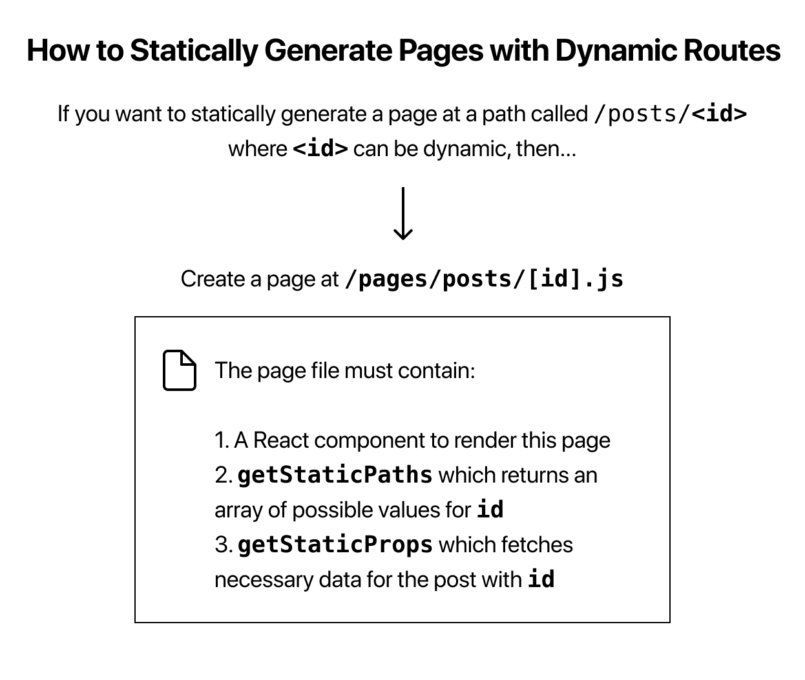

# 概览

[官网](https://nextjs.org/)

由Vercel开发的Next.js，长期以来都是**服务器端渲染(SSR)**的不二之选。凭借强大的社区支持、与**React**的紧密集成以及灵活的渲染选项，Next.js广受欢迎。

Next.js 仍然是**SEO优先**的应用程序和SSR密集型应用程序的绝佳选择


**优点：**

- **SSR和静态生成：** 通过直接从服务器提供静态HTML，非常适合**SEO**和快速初始加载。
- **自动代码拆分：** 只加载当前页面所需的JavaScript代码，从而缩短加载时间。
- **基于文件的路由：** 简单易用的路由系统，使用文件结构映射路由。

**缺点：**

- **构建时间：** 尤其是对于大型项目，使用Webpack会随着项目规模的增长而减缓开发速度。
- **数据获取：** Next.js在服务器端数据获取方面表现良好，但在客户端密集型应用程序中可能会变得更加复杂。
- **SSR开销：** 如果你不需要SSR，Next.js可能显得过于复杂，可能会增加不必要的复杂性。

serverless function？

> 目录

├─public
├─style
├─components
│  ├─layout
│  └─comp2
│─pages
    ├─_app.j
    └─page-1
    └─page-2


# 渲染方式

水合（Hydration）过程

- Next.js 在服务端渲染时，会先在服务器上生成包含页面内容的 HTML 结构。
- 当这个 HTML 被发送到客户端浏览器后，React 对 HTML 文件进行解析，识别 HTML 中特点的标记和属性，然后与客户端的 React 组件进行关联激活
- 然后，React 会将客户端的 JavaScript 逻辑和事件处理程序附加到相应的 HTML 元素上，使得页面具备交互能力，比如可以响应用户的点击、输入等操作

## Pre-rendering

默认所有的页面都会被 pre-rendering，Next.js 有两种 pre-rendering 形式，他们的区别在于生成 HTML 的时机。

Next.js has two forms of pre-rendering: [**Static Generation**](https://www.nextjs.cn/docs/basic-features/pages#static-generation-recommended) and [**Server-side Rendering**](https://www.nextjs.cn/docs/basic-features/pages#server-side-rendering). 

一、 [**Static Generation**](https://www.nextjs.cn/docs/basic-features/pages#static-generation-recommended) is the pre-rendering method that generates the HTML at **build time**. The pre-rendered HTML is then reused on each request.

- 在用户请求之前生成页面，不涉及动态数据，无法使用仅在请求期间可用的数据，例如查询参数或HTTP标头。

- **API**：getStaticProps，只在服务端执行

- 开发模式下, every page is [pre-rendered](https://www.nextjs.cn/docs/basic-features/pages#pre-rendering) on each request — even for pages that use [Static Generation](https://www.nextjs.cn/docs/basic-features/pages#static-generation-recommended).

- [`getStaticProps`](https://www.nextjs.cn/docs/basic-features/data-fetching#getstaticprops-static-generation) runs **only on the server-side**. It will never run on the client-side. It won’t even be included in the JS bundle for the browser. 


推荐使用 `getStaticProps` 而不是 `getInitialProps`

- getInitialProps 不能与 getStaticProps 或 getStaticPaths 同时用于任何给定页面。如果您有动态路由，则需要在 next.config.js 文件中配置 exportPathMap 参数，让输出程序知道应该输出哪些 HTML 文件，而不是使用 getStaticPaths。
- When `getInitialProps` is called during export, the `req` and `res` fields of its [`context`](https://www.nextjs.cn/docs/api-reference/data-fetching/getInitialProps#context-object) parameter will be empty objects, since during export there is no server running.
- `getInitialProps` **will be called on every client-side navigation**, if you'd like to only fetch data at build-time, switch to `getStaticProps`.
- `getInitialProps` should fetch from an API and cannot use Node.js-specific libraries or the file system like `getStaticProps` can.


二、 [**Server-side Rendering**](https://www.nextjs.cn/docs/basic-features/pages#server-side-rendering) is the pre-rendering method that generates the HTML on **each request**.

- 每次请求时，获取数据，然后生成 HTML 文件

- **API**：getServerSideProps，只在服务端执行

- Serve-Side Rendering 的 TTFB 比 Static Generation 慢

- Q：如何判断一个页面是静态生成的页面？
  - A：如果没有阻塞数据要求，Next.js 就会自动判断页面是静态的。这意味着页面中没有 getServerSideProps 和 getInitialProps。


> 根据动态路由生成静态 HTML

 

## Client-side Rendering

Client-side 请求数据推荐使用 Nextjs 内置的 `swr` hook。

在 `jsx` 文件顶部添加 React 的 `"use client"` 指令，将文件转换为客户端组件。

通过添加 `'use server'`，您将文件中的所有导出函数标记为服务器函数。然后可以将这些服务器函数导入到 Client 和 Server 组件中，使它们变得非常灵活。

#  Incremental Static Regeneration (ISR)

增量静态再生

# 服务端

[自定义服务器](https://nextjs.org/docs/pages/building-your-application/configuring/custom-server) 

[nextjs + koa](https://github.com/liujin0215/koa-next-app/blob/main/src/main.ts) 

A custom server **cannot** be deployed on [Vercel](https://vercel.com/solutions/nextjs).

-------------------------------------------
# [Next](https://nextjs.org/) 


## 介绍

用于React应用的极简的服务端渲染框架。

Next 创建的应用中只有初始页面采用服务端渲染，其他通过路由操作到达的页面均为客户端渲染。

- pages：./pages 是一个保留路径，在 /pages 路径下任何js文件中导出的默认 React 组件都被视作一个页面；pages中的文件结构自动映射为对应的路由结构；
- static：保留路径，存放静态资源；

- package.json

```json
{
  "scripts": {
    "dev": "next",
    "build": "next build",
    "start": "next start"
  }
}
```

- 使用了 Next.js 作为服务端渲染工具，切记仅使用 next/link 中的 Link 组件。

```vue
<Link href="/about">
	<a style={{fontSize: 20}}>About Page</a>
</Link>
```

## 组件

### Head

```vue
<Head>
	<title>My page title</title>
	<meta name="viewport" content="initial-scale=1.0, width=device-width" />
</Head>
```

### link

### document

自定义自己的服务端渲染模板，创建 /_document.js 

```jsx
// pages/_document.js
import Document, { Head, Main, NextScript } from 'next/document'
export default 
class MyDocument extends Document {
static async getInitialProps (ctx) {
 const props = await Document.getInitialProps(ctx)
 return { ...props, customValue: 'hi there!' }
}

render () {
 return (
  <html>
    <Head>
      <style>{`body { margin: 0 } /* custom! */`}</style>
    </Head>
    <body className="custom_class">
      {this.props.customValue}
      <Main />
      <NextScript />
    </body>
  </html>
 )
}
}
```

### 错误处理

Next中，有一个默认组件error.js，负责处理404或者500这种错误。当然，你也可以自定义一个_error.js组件覆盖默认的错误处理组件：

## 自定义服务器和路由

项目根目录下创建 server.js 文件：

```js
// server.js

const { createServer } = require('http')
const { parse } = require('url')
const next = require('next')

const dev = process.env.NODE_ENV !== 'production'
const app = next({ dev })
const handle = app.getRequestHandler()

app.prepare().then(() => {
  createServer((req, res) => {
    const parsedUrl = parse(req.url, true)
    const { pathname, query } = parsedUrl

    if (pathname === '/a') {
      app.render(req, res, '/b', query)
    } else if (pathname === '/b') {
      app.render(req, res, '/a', query)
    } else {
      handle(req, res, parsedUrl)
    }
  })
  .listen(3000, (err) => {
    if (err) throw err
    console.log('> Ready on http://localhost:3000')
  })
})
```

## CSS

NEXT组件中声明CSS，目前主要有两种方式：

1. 内嵌CSS：组件级的独立作用域，利用 styled-jsx 库

 ```jsx
export default () => (
  <div>
    Hello world
    <p>scoped!</p>
    <style jsx>{`
      p {
        color: blue;
      }
      div {
        background: red;
      }
      div:hover {
        background: blue;
      }
      @media (max-width: 600px) {
        div {
          background: blue;
        }
      }
    `}</style>
  </div>
)
 ```


`scope CSS`的作用范围，如果添加了 `jsx`属性，则是不包括子组件的当前组件；如果添加了 `global` 和 `jsx`属性，则是包括了子组件在内的当前组件；如果没添加任何属性，则作用与 添加了 `global` 和 `jsx`的作用类似，只不过 `next`不会对其进行额外的提取与优化打包。

2. CSS-in-JS 内联样式

```js
export default () => (
  <div style={{color: red}}>
    Hello world
  </div>
)
```

## 服务端框架

next.js自带服务器，但是它可以做的事情很有限，只能处理 ssr 渲染。 我们可以将next.js作为 koa 的一个中间件来使用，当然您也可以选择 express 和 egg.js，使用方式都很类似。

## 部署

生产模式下，需要先使用生产模式构建代码，再启动服务器。因此，需要两条命令：

1. npm run build
2. npm run start

Next官方推荐使用now作为部署工具，只要在package.json文件中写入：

```json
{
  "name": "my-app",
  "dependencies": {
    "next": "latest"
  },
  "scripts": {
    "dev": "next",
    "build": "next build",
    "start": "next start"
  }
}
```

接着运行now命令，就可以实现一键部署。

## 参考

- [next 官网](https://nextjs.org/learn/basics/navigate-between-pages)
- [next.js+koa2+antd环境轻松搭建](https://juejin.im/post/5cbb362351882532525a1082)
  [看了就会的next.js路由](https://juejin.im/post/5cbc0b3ae51d456e46603e31)

- [中文](https://github.com/accforgit/DayLearnNote/blob/master/React/Next.js-README.md#%E8%B7%AF%E7%94%B1)
- [入门教程](https://my.oschina.net/chkui/blog/2872965) 
