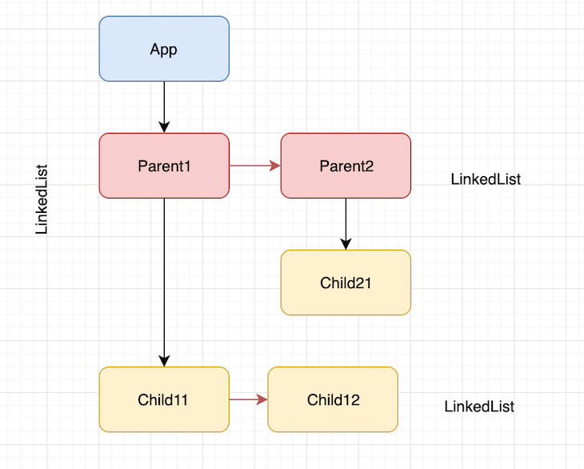

# React Fiber

[react 技术揭秘](https://react.iamkasong.com/process/fiber.html#fiber%E7%9A%84%E7%BB%93%E6%9E%84) 

[深入 Fiber 架构和协调算法-code花园](https://mp.weixin.qq.com/s/VPehJjEvyxfGLJnGmLDs2Q) 

[走进 React Fiber 的世界-大淘宝前端技术](https://mp.weixin.qq.com/s/zjhCIUtJrSmw2icy2zkKFg)

[React Fiber 架构原理剖析-SegmentFault](https://mp.weixin.qq.com/s/KHaAcxz8w2pxOeli2gaaGA)

[并发模式，双缓冲，优先级 - 掘金](https://mp.weixin.qq.com/s/8sfcqG7pMzdvDydn2iPhNQ) 

React Fiber 是 React 16 中引入的一种新的协调算法，被称为 `Fiber Reconciler`，基于` Fiber` 节点实现，支持**可中断异步更新**。

React Fiber 的工作原理是将【协调过程】分解为更小的工作单元，称为纤程。纤程可以按任何顺序调度和执行，这使得 React 可以确定工作的优先级并避免阻塞主线程。

将复杂任务分块处理，并根据重要性对任务进行优先排序。

> 概念

新的 React 架构包含了：调度器（Scheduler）、协调器（Reconcilers）、渲染器（Rendered），`Reconciler`内部采用了`Fiber`的架构

双缓存：WokeInProgress、current

旧协调器：stack reconciler.

reconciliation：这种**递归遍历**树以了解React应用组件树的底层DOM标签元素的确切过程被称为 reconciliation

render 阶段会找到 vdom 中变化的部分，创建 dom，打上增删改的标记，这个叫做 reconcile。

- `Reconciler`工作的阶段被称为`render`阶段。因为在该阶段会调用组件的`render`方法。
- `Renderer`工作的阶段被称为`commit`阶段。`commit`阶段会把`render`阶段提交的信息渲染在页面上。

在新的架构中，更新工作从递归变成了可以中断的循环过程。每次循环都会调用 `shouldYield` 判断当前是否有剩余时间。

- 更新首先会被【调度器】处理，在调度器中会调度这些更新的优先级，更高优的更新会首先进入协调器，在本次更新的 `Reconcile` 中正在执行 Diff 算法时，如果此时产生了更高优先级的更新，本次正在协调的更新会被中断
- 由于 `Scheduler` 和 `Reconcile` 都是在视图中完成的操作，因此即使更新中断，用户也不会看到更新不完整的视图。
- 当某次更新完成了 `Reconcile` 中的工作时，协调器会通知渲染器，本次更新有哪些组件需要执行对应的视图操作（CRUD），当渲染器完成了它的工作，调度器又会开始新一轮的调度

Firber 节点表示一个 react element，属性有：type、key、child、return、sibling、Alternate、output

一个 fiber 节点就是最小的任务单元，reconcile 阶段每次处理一个 fiber 节点，处理前会判断下 shouldYield，如果有更高优先级的任务，那就先执行别的。

commit 阶段不用再次遍历 fiber 树，为了优化，react 把有 effectTag 的 fiber 都放到了 effectList 队列中，遍历更新即可。

根据虚拟dom（React 元素）去生成 Fiber 树，child，sibling 和 return 三个属性构成链表。在 Fiber tree 的情况下，React不执行递归遍历。而是创建一个单链表，并执行父级优先、深度优先的遍历

**双缓存**

- 在 React 中最多会同时存在两棵 Fiber 树。当前屏幕上显示内容对应的 Fiber 树称为 current Fiber 树，正在内存中构建的 Fiber 树称为 workInProgress Fiber 树。
- 每次状态更新都会产生新的 workInProgress Fiber 树，通过 current 与 workInProgress 的替换，完成 DOM 更新。
- 在构建 workInProgress Fiber 树时会尝试复用 current Fiber 树中已有的 Fiber 节点内的属性。

> Fiber 如何工作

1. 为不同类型的任务分配不同的优先级
2. 暂停、恢复任务
3. 取消不需要的任务
4. 重用之前完成的任务

React Fiber 的原理主要包括以下几个方面：

- 任务分解：将渲染过程分解为多个小的任务单元（Fiber 节点）。
  - 每处理完一个 fiber 节点都会判断下 `shouldYield`，如果有更高优先级的任务，那就先执行别的

- 双缓存：使用两个 Fiber 树结构（当前树和工作树），在渲染过程中逐步构建新的树。
- 可中断与恢复：可以在执行过程中暂停，优先处理更紧急的任务，然后再回到之前暂停的任务继续执行。
- 优先级调度：根据任务的优先级来安排执行顺序，确保高优先级的任务先被处理。
- 协调更新：通过对 Fiber 节点的标记和处理，实现高效的更新协调。

> 组件更新流程

一个 React 组件的渲染主要经历两个阶段：

- render：用新的数据生成一棵新的树，然后通过 Diff 算法，遍历旧的树，快速找出需要更新的元素，放到【更新队列】中去，得到新的更新队列。
- commit：遍历更新队列，通过调用宿主环境的 API，实际更新渲染对应的元素。宿主环境如 DOM，Native 等。

对于调度阶段，新老架构中有不同的处理方式：

- React 16 之前使用的是 Stack Reconciler（栈协调器），使用**递归**的方式创建虚拟 DOM，递归的过程是不能中断的。如果组件树的层级很深，递归更新组件的时间超过 16ms，用户交互就会感觉到卡顿。
- React 16 及以后使用的是 Fiber Reconciler，将递归中无法中断的更新重构为迭代中的异步可中断更新过程，这样就能够更好的控制组件的渲染。

Fiber 的主要工作流程：

- `ReactDOM.render()` 引导 React 启动或调用 `setState()` 的时候开始创建或更新 Fiber 树。
- 从根节点开始遍历 Fiber Node Tree， 并且构建 WokeInProgress Tree（reconciliation 阶段）。 
  - 本阶段可以暂停、终止、和重启，会导致 react 相关生命周期重复执行。
  - React 会生成两棵树，一棵是代表当前状态的 current tree，一棵是待更新的 workInProgress tree。
  - 遍历 current tree，重用或更新 Fiber Node 到 workInProgress tree，workInProgress tree 完成后会替换 current tree。
  - 每更新一个节点，同时生成该节点对应的 Effect List。
  - 为每个节点创建更新任务。
- 将创建的更新任务加入任务队列，等待调度。 
  - 调度由 scheduler 模块完成，其核心职责是执行回调。
  - scheduler 模块实现了跨平台兼容的 **requestIdleCallback**。
  - 每处理完一个 Fiber Node 的更新，可以中断、挂起，或恢复。
- 根据 Effect List 更新 DOM （commit 阶段）。 
  - React 会遍历 Effect List 将所有变更一次性更新到 DOM 上。
  - 这一阶段的工作会导致用户可见的变化。因此该过程不可中断，必须一直执行直到更新完成。

> 任务优先级

React Fiber 任务的优先级从高到低可以分为以下几个级别：

1. **同步任务（Synchronous Task）**：
   - 同步任务是指需要立即执行的任务，如用户交互、用户事件处理等。这些任务具有最高的优先级，因为它们直接影响到用户体验。
2. **批量更新任务（Batched Updates）**：
   - 批量更新任务是指通过 React 的 setState() 函数触发的更新。React 会将多个 setState() 调用合并成一个更新批次，并在下一个帧中执行。这些任务的优先级次于同步任务，但高于其他类型的任务。
3. **动画任务（Animation Task）**：
   - 动画任务是指需要在下一个帧中执行的动画效果，如 CSS 动画、过渡效果等。这些任务具有较高的优先级，以保证动画的流畅性。
4. **闲置任务（Idle Task）**：
   - 闲置任务是指一些低优先级的后台任务，如预加载数据、缓存更新等。这些任务的优先级最低，只在系统资源完全空闲时才会执行。

# SSR

服务器端渲染（SSR）是一种在将 React 应用程序发送到客户端之前在服务器上渲染它们的技术。

SSR 可以通过减少客户端需要下载和执行的 JavaScript 量来提高性能。SSR 还可以通过使搜索引擎更轻松地索引您的 React 应用程序来提高 SEO。

以下是 React 中服务器端渲染工作原理的高级概述：

1. 初始请求：当用户向服务器发出页面请求时，服务器接收该请求并开始处理它。

2. 组件渲染：服务器识别需要为请求的页面渲染的 React 组件。然后，它使用服务器端渲染引擎（例如 ReactDOMServer）将这些组件渲染为 HTML。

3. 数据获取：如果组件需要来自 API 或数据库的数据，服务器会获取该数据并在渲染过程中将其传递给组件。

4. HTML 生成：渲染组件并获取任何必要的数据后，服务器会生成页面的完整 HTML 表示形式，包括应用程序的初始状态。

5. 向客户端发送 HTML：服务器将生成的 HTML 发送回客户端作为对初始请求的响应。

6. 客户端水合：当客户端收到 HTML 时，它还会下载包含 React 代码的 JavaScript 包。

7. 然后，客户端 JavaScript 会“水化” HTML，附加事件侦听器并重新建立任何客户端状态，使页面具有交互性。