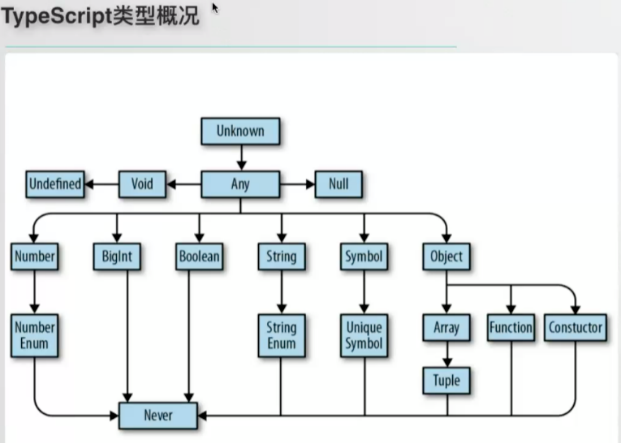
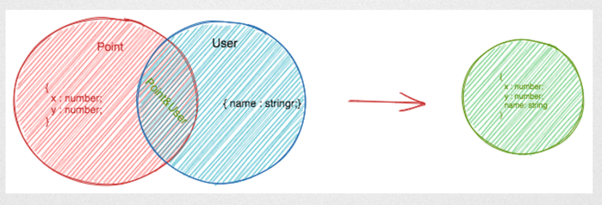

> `ReactNode` 、 `ReactElement` 和 `JSX.Element` 的区别？

`children?: React.ReactNode ` 

> 任意数量的参数、剩余参数、默认参数的类型声明


> Class private 声明？

> 交叉类型、联合类型、extends 区别


>  infer

> 泛型只能用在函数中，`()` 前面？


# 概况

  

  

上面的是父级，下面是子级，子级类型可以赋值给父级。

TS简单的说就是为JS中的变量指定了类型，JS中的变量本身是没有类型的。有了TS就可以为变量指定一个类型，这样在【编译阶段】就可以检查变量是否赋予了正确的类型，提前发现错误，配合编辑器的语法提示能有效提高开发效率。

> TypeScript体系

**值 、变量 和 类型** 

- 类型的标注/推导确定
- 类型的检查，检查数据类型是否安全


> TS资源

[TS入门教程-阮一峰](https://ts.xcatliu.com/) 
[深入理解TS](https://jkchao.github.io/typescript-book-chinese/#why) 


# 类型声明

类型是值的集合，比如：
Null  只有`null`一个元素的集合
Boolean  有两个元素`false`和`true`的集合

变量的类型有：基本数据类型、数组、对象、函数、枚举。

基本数据类型除了 number、string 等还包括 TS 中 3 种特殊类型：`never`、`undefined`、`null`、`any`、`void`
- undefined 、null、any 可以视为不进行类型检查
- void 表示函数没有返回值

- `never` 表示永远不存在的值的类型，即这个类型没有对应的值，never 只能被 never 赋值
```ts
function fail(message: string): never {
  throw new Error(message);
}
```

## 指定变量的类型

- 变量声明为基本数据类型
```ts
const name: string = 'xxx'
```

- 变量声明为数组类型
```
const arr: number[]
```

- 变量声明为对象
```ts
interface Person {
  name: string;
  age: number;
  seedrandom(seed?: string): void;
}
interface Array<T> {
  reverse(): T[];
}
// 或者使用【内联类型】，省略类型的定义
let name: {
  first: string;
  second: string;
};
```

- 变量声明为函数
```ts
const onBlur:  (value: string, e?: React.FocusEvent<HTMLInputElement>) => void;

const listener: (ev: MouseEvent) => any  // 指定listener 是一个函数，同时指定该函数的输入输出类型

let mySum: (x: number, y: number) => number = function (x: number, y: number): number {
    return x + y;
};
```

- 变量声明为枚举
```ts
type Week = 'Mon' | 'Tue'
```

- 元组类型
```ts
let nameNumber: [string, number];
```

## 字面量类型

string、boolean、number 类型的值可以作为字面量类型

```ts
let foo: 'Hello';
type OneToFive = 1 | 2 | 3 | 4 | 5;
type Bools = true | false;
```

## 索引签名

指定对象的 key 或 key-value 对应该符合的类型
```ts
interface Foo {
  [key: string | number]: any
}

const foo: {
  [key: string]: { message: string }; // key 可以改为任意名称
} = {};

type Index = 'a' | 'b' | 'c';
type FromIndex = { [k in Index]?: number };
const good: FromIndex = { b: 1, c: 2 };
```

# 类型运算

操作数应该是【类型】

## type 别名

与接口不同，接口定义了一种新的类型，别名只是对现有的类型声明了新的名字，别名通常与字面量类型、联合类型、交叉类型、泛型使用，例如：

```typescript
// 为string起一个别名Name，
type Name = string;
let myName:Name = 'abc';

// 等号右边是字符串字面量类型，Easing是这个字面量类型的别名
type Easing = "ease-in" | "ease-out" | "ease-in-out";
let easing: Easing = 'ease-in';
let easing: Easing = 'other'; // 报错
// easing这个变量只能被赋值为"ease-in" 或 "ease-out" 或 "ease-in-out"这三个字符串中的一个，赋值为其他值就会报错

type Callback = (data: string) => void;
```

interface 可以作为 `implements` 和 `extends` 的操作数，type 声明的别名不能。

## enum 枚举

```ts
enum CardSuit {
  Clubs,
  Diamonds = 1,
  Hearts,
  Spades
}
// 简单的使用枚举类型
let Card = CardSuit.Clubs;
```

## 或运算  联合类型

多个类型的或运算，逆 `extends` ，生成的类型是参与运算的类型的父类型。

```typescript
// 声明了NumOrStr为一个联合类型
type NumOrStr = sting | number;

let x: NumOrStr = 1; // success
x = 'abc'; // success
x = [1]; // error
```

## 与运算  交叉类型

合并多个类型

```typescript
type Parent1 = {
  name: string;
}
type Parent2 = {
  age: number;
}
type Child = Parent1 & Parent2;

// 子级类型可以赋值给父类型(属性只能多不能少)
let my: Parent1 = {
  age: 2,
  name: ''
}
```

## as  类型断言

当 `S` 类型是 `T` 类型的子集，或者 `T` 类型是 `S` 类型的子集时，`S` 能被成功断言成 `T`。

如果 S 和 T 类型不存在包含关系时，可以使用【双重断言】

```ts
let foo = 123;
let bar = 'hey';
bar = foo as any; // ok
// 双重断言
bar = (foo as string) as any;
```

使用类型断言手动去除某个类型中的`null`和`undefined` 

```typescript
name!.charAt(0)  // name为undefined 时会报错,!的意思是显式告诉编译器name不会为undefined
name?.charAt(0) // 可选链运算符，name为undefined 时不会报错
```

> const 断言

使用 const 断言构造新的字面量表达式时，我们可以向编程语言发出以下信号：
- 表达式中的任何字面量类型都不应该被扩展；
- 对象字面量的属性，将使用 readonly 修饰；
- 数组字面量将变成 readonly 元组。

```ts
let z = { text: "hello" } as const;
type Z = typeof z; // let z: { readonly text: "hello"; }
```

## 类型保护

缩小类型范围或更精确的指明变量的类型，具体实现方法有：instance、typeof、in

```ts
function doSome(x: number | string) {
  if (typeof x === 'string') {
    // 在这个块中，TypeScript 知道 `x` 的类型必须是 `string`
    console.log(x.subtr(1)); // Error: 'subtr' 方法并没有存在于 `string` 上
    console.log(x.substr(1)); // ok
  }

  x.substr(1); // Error: 无法保证 `x` 是 `string` 类型
}
```

typeof 类型保护只支持两种形式：typeof v === "typename" 和 typeof v !== typename，"typename" 必须是 "number"， "string"， "boolean" 或 "symbol"。但是 TypeScript 并不会阻止你与其它字符串比较，语言不会把那些表达式识别为类型保护

> 自定义类型保护

当 instance、typeof、in 无法满足复杂的类型判断场景时可以自定义类型保护

自定义类型保护的主要特点是：

- 返回类型谓词，如 `vehicle is Car`；
- 包含可以准确确定给定变量类型的逻辑语句，如 `xx.someProp !== undefined && xx.someProp !== 0`。

```ts
function isOfType<T>(
  varToBeChecked: any,
  propertyToCheckFor: keyof T
): varToBeChecked is T {
  return (varToBeChecked as T)[propertyToCheckFor] !== undefined;
}

// 使用
if (isOfType<Car>(vehicle,  'turnSteeringWheel')) {
  console.log("这是一辆车");
} else {
  console.log("这不是一辆车");
}
```

## 类型推断

TypeScript 能根据一些简单的规则推断变量的类型

1. 变量定义并赋值
2. 赋值
3. 函数返回值
4. 对象、数组解构

> 示例

```ts
let foo = 123;
let bar: typeof foo; 

// 捕获 key 的名称
const colors = {
  red: 'red',
  blue: 'blue'
};

type Colors = keyof typeof colors;

let color: Colors; // color 的类型是 'red' | 'blue'
color = 'red'; // ok
color = 'blue'; // ok
color = 'anythingElse'; // Error
```

从实现中推断类型

```ts
const initialState = {
  show: false,
};
type State = Readonly<typeof initialState>;
type ToggleableComponentProps = {
  show: State['show'];
};
```

xxx

```ts
type ToggleableComponentProps = {
  toggle: Toggleable['toggle'];
  // Toggleable 本来就是类型，不能是变量
};

export class Toggleable extends Component<Props, State> {
  readonly state: State = initialState;
  render() {
    // 
  }
  private toggle = (event: MouseEvent<HTMLElement>) => this.setState(updateShowState);
}
```

## keyof & typeof

`keyof` 后面跟一个【类型】，获取该类型的所有 key，产生联合类型。
在 TS 中 `typeof` 后面跟一个【变量】，得到的是类型。

```ts
type State = Readonly<typeof initialState>;

const COLORS = {
  red: 'red',
  blue: 'blue'
}

// 首先通过 typeof 操作符获取 Colors 变量的类型，然后通过keyof操作符获取该类型的所有键，
// 即字符串字面量联合类型 'red' | 'blue'
type Colors = keyof typeof COLORS
let color: Colors;
color = 'red'// Ok
color = 'blue'// Ok

// Type '"yellow"' is not assignable to type '"red" | "blue"'.
color = 'yellow'// Error
```

定义一个获取对象属性值的函数
```ts
function prop<T extends object, K extends keyof T>(obj: T, key: K) {
  return obj[key];
}
```

## 索引访问类型

```ts
type P3 = string["charAt"];  // (pos: number) => string
type P4 = string[]["push"];  // (...items: string[]) => number
```

## 类型提取

从复合类型中提取出单个类型，方法有索引访问类型、条件类型+infer、ReturnType

```ts
type Person = {
  name: string;
  age: number;
}
type PersonName = Person["name"];
```

## 条件类型

根据某些条件得到不同的类型，这里所说的条件是类型兼容性约束

```ts
T extends U ? X : Y
```

上述表达式为若 `T` 能够赋值给 `U`，那么类型是 `X`，否则为 `Y`

## infer

`infer` 声明一个类型变量并且对它进行使用

## readonly

readonly 作用于属性，表示属性不能被修改

- Readonly

```ts
interface Foo {
  readonly [x: number]: number;
}

type Foo = {
  bar: number;
  bas: number;
};
// 将所有属性标记为只读类型
type FooReadonly = Readonly<Foo>;
```

- ReadonlyArray
```ts
let foo: ReadonlyArray<number> = [1, 2, 3];
```

## extends

使用 extends 给泛型添加约束

有时候我们定义的泛型不想过于灵活或者说想继承某些类等，可以通过 extends 关键字添加泛型约束。

extends ：ts 中的 extends 理解为扩展更合适，用 `& ` 可以实现和 `extends` 类似的效果。

```ts
interface ILengthwise {
  length: number;
}
function loggingIdentity<T extends ILengthwise>(arg: T): T {
  console.log(arg.length);
  return arg;
}

// 这时我们需要传入符合约束类型的值，必须包含必须的属性：
loggingIdentity(3);  // Error, number doesn't have a .length property
loggingIdentity({length: 10, value: 3});
```

## implements

implements：在 TypeScript 中，`implements`操作只是为`class`提供一种类型约束。

```ts
interface Alarm {
  alert(): void;
}
class Door {
}

class SecurityDoor extends Door implements Alarm,接口B {
  alert() {
    console.log('SecurityDoor alert');
  }
}

class Car implements Alarm {
  alert() {
    console.log('Car alert');
  }
}
```

## 参考

- [原始数据类型](https://ts.xcatliu.com/basics/primitive-data-types.html)
- [任意值](https://ts.xcatliu.com/basics/any.html)
- [类型推论](https://ts.xcatliu.com/basics/type-inference.html)
- [联合类型](https://ts.xcatliu.com/basics/union-types.html) 
- [对象的类型——接口](https://ts.xcatliu.com/basics/type-of-object-interfaces.html)
- [数组的类型](https://ts.xcatliu.com/basics/type-of-array.html)
- [函数的类型](https://ts.xcatliu.com/basics/type-of-function.html)
- [类型断言](https://ts.xcatliu.com/basics/type-assertion.html)
- [声明文件](https://ts.xcatliu.com/basics/declaration-files.html)
- [内置对象](https://ts.xcatliu.com/basics/built-in-objects.html)


# Interfaces

使用接口（Interfaces）来定义对象的类型，它是对行为的抽象，而具体如何行动需要由类（classes）去实现（implement）。除了可用于[对类的一部分行为进行抽象](https://ts.xcatliu.com/advanced/class-and-interfaces.html#类实现接口)以外，也常用于对「对象的形状（Shape）」进行描述。

> example

```typescript
interface Person {
    name: string;
    age: number;
}

let tom: Person = {
    name: 'Tom',
    age: 25
};
```

> 有时候我们希望一个接口允许有任意的属性，可以使用如下方式

```typescript
interface Person {
    name: string;
    age?: number; // 可选
    [propName: string]: string | number; // 任意属性，一旦定义了任意属性，那么确定属性和可选属性的类型都必须是它的类型的子集。 
}

let tom: Person = {
    name: 'Tom',
    gender: 'male'
};
```

> 使用接口定义类数组数据

```typescript
function sum() {
    let args: {
        [index: number]: number;
        length: number;
        callee: Function;
    } = arguments;
}
```

## 接口继承

接口是一个类型，接口可以继承类和其他interface(包括自定义类)。
接口继承类的时候，只会继承它的实例属性和实例方法。

```ts
interface ApiError extends Error {
  code: number;
}
```

https://ts.xcatliu.com/advanced/class-and-interfaces.html 

## interface 和 type 的区别

1.  interface 可以用于 extends 和 implements，type 不能；
2. `type` 可以声明联合、交叉类型，interface 不能； 
3. `type` 可以与 `typeof ` 联用，从变量值推断类型；
4. interface 存在声明合并的情况，可以用来重载函数，[详解](https://www.tslang.cn/docs/handbook/declaration-merging.html) 

# 函数

在没有提供函数实现的情况下，有两种声明函数类型的方式:

```ts
type LongHand = {
  (a: number): number;
};

// 内联注释
type ShortHand = (a: number) => number;
const simple: (foo: number) => string = foo => foo.toString();
```

当你想使用【函数重载】时，只能用第一种方式:

```ts
type LongHandAllowsOverloadDeclarations = {
  (a: number): number;
  (a: string): string;
};
```

更复杂的例子

```ts
interface Complex {
  (foo: string, bar?: number, ...others: boolean[]): number;
}

// ==============================================
interface Overloaded {
  (foo: string): string;
  (foo: number): number;
}

// 实现接口的一个例子：
function stringOrNumber(foo: number): number;
function stringOrNumber(foo: string): string;
function stringOrNumber(foo: any): any {
  if (typeof foo === 'number') {
    return foo * foo;
  } else if (typeof foo === 'string') {
    return `hello ${foo}`;
  }
}

const overloaded: Overloaded = stringOrNumber;

// 使用
const str = overloaded(''); // str 被推断为 'string'
const num = overloaded(123); // num 被推断为 'number'
```

> 函数重载

```ts
function padding(all: number);
function padding(topAndBottom: number, leftAndRight: number);
```

> 可实例化

表示需要使用 `new` 关键字去调用它

```ts
interface CallMeWithNewToGetString {
  new (): string;
}
// 使用
declare const Foo: CallMeWithNewToGetString;
const bar = new Foo(); // bar 被推断为 string 类型
```

# 泛型

泛型（Generics）是指在定义函数、接口或类的时候，不预先指定具体的类型，而在使用的时候再指定类型的一种特性。

对类型的进一步抽象，与模板的概念相似，例如：

```typescript
// 定义一个泛型函数
function logging<T>(arg: T[]): T[] {
    console.log(arg.length);  // Array has a .length, so no more error
    return arg;
}

// 分别使用number 和 string 指定泛型的类型
logging<number>([1,2,3]); // ok
loggin<string>(['a','b','c']); // ok
```

> 示例

```typescript
function createArray<T>(length: number, value: T): Array<T> {
    let result: T[] = [];
    for (let i = 0; i < length; i++) {
        result[i] = value;
    }
    return result;
}
createArray<string>(3, 'x');

const getJSON = <T>(config: { url: string; headers?: { [key: string]: string } }): Promise<T> => {
  const fetchConfig = {
    method: 'GET',
    Accept: 'application/json',
    'Content-Type': 'application/json',
    ...(config.headers || {})
  };
  return fetch(config.url, fetchConfig).then<T>(response => response.json());
};
```

> 复杂示例

```ts
export interface ResponseData<T = any> {
  code: number;
  result: T;
  message: string;
}

import Ax from './axios';
export function getUser<T>() {
  return Ax.get<ResponseData<T>>('/somepath')
    .then(res => res.data)
    .catch(err => console.error(err));
}

// 使用
interface User {
  name: string;
  age: number;
}
async function test() {
  // user 被推断出为
  // {
  //  code: number,
  //  result: { name: string, age: number },
  //  message: string
  // }
  const user = await getUser<User>();
}
```

> 数组泛型

```typescript
let fibonacci: Array<number> = [1, 1, 2, 3, 5];
```

## 内置高级泛型

内置高级类型泛型有： Partial、Required、Pick、Exclude、Omit

### Partial

将某个类型里的属性全部变为可选项
```ts
type Partial<T> = { [P in keyof T]  ?:  T[P] };
```

### Required

 将所有属性变为必选
```ts
type Required<T> = { [P in keyof T]  -?:   T[P] };
// -? 作用是移除 ?
```

### Readonly

将某个类型所有属性变为只读属性
```ts
type Readonly<T> = {
    readonly [P in keyof T]  : T[P];
};
```

### Extract

Extract：从类型 T 中提取 U，类似于取交集
```ts
type Extract<T, U> = T extends U ? T : never;

// 使用
type T1 = Extract<string | number | (() => void), Function>; // () =>void
```

### Pick

Pick：从类型 T 中选中部分，得到选中的类型
```ts
type Pick<T, K extends keyof T> = {
    [P in K]: T[P];
};
// 使用
interface Todo {
  title: string;
  description: string;
  completed: boolean;
}
type TodoPreview = Pick<Todo, "title" | "completed">;
const todo: TodoPreview = {
  title: "Clean room",
  completed: false
};
```

### Exclude

Exclude：从类型 T 中剔除部分类型，得到剩余的类型
```ts
type Exclude<T, U> = T extends U ? never : T;

// 使用
type T2 = Exclude<string | number | (() => void),  Function>; // string | number
```
如果 T 能赋值给 U 类型的话，那么就会返回 never 类型，否则返回 T 类型。最终实现的效果就是将 T 中某些属于 U 的类型移除掉

### Omit

用 T 类型中除了 K 类型的所有属性，来构造一个新的类型。
```ts
type Omit<T,  K extends keyof any> = Pick<T,  Exclude<keyof T, K>>;

// 使用
interface Todo {
  title: string;
  description: string;
  completed: boolean;
}
type TodoPreview = Omit<Todo, "description">;
const todo: TodoPreview = {
  title: "Clean room",
  completed: false
};
```

> Omit 和 Exclude 的区别

xxxxxxxxxxxxxxx

### Record

`Record` :  `Record<K extends keyof any, T>` 的作用是将 `K` 中所有的属性的值转化为 `T` 类型。
```ts
type Record<K extends keyof any, T> = {
    [P in K]: T;
};

interface PageInfo {
  title: string;
}
type Page = "home" | "about" | "contact";

const x: Record<Page, PageInfo> = {
  about: { title: "about" },
  contact: { title: "contact" },
  home: { title: "home" }
};
```

### RetureType

ReturnType：用于获取函数 `T` 的返回类型。
```ts
type ReturnType<T extends (...args: any) => any>   = T extends (...args: any) => infer R ? R : any;

// 使用
type T0 = ReturnType<() =>string>; // string
```

### InstanceType

获取构造函数类型的实例类型

### ThisType

指定上下文对象的类型，使用 `ThisType<T>` 时，必须确保 --noImplicitThis 标志设置为 true
```ts
interface Person {
    name: string;
    age: number;
}

const obj: ThisType<Person> = {
  dosth() {
    this.name // string
  }
}
```

### 参考

[TS内置高级泛型](https://mp.weixin.qq.com/s?__biz=MzI2MjcxNTQ0Nw==&mid=2247484142&idx=1&sn=946ba90d10e2625513f09e60a462b3a7&scene=19#wechat_redirect) 


## 泛型参数组件

> 类组件定义及使用

```tsx
// 定义泛型参数的组件
class GenericComponent<P> extends React.Component<P> {
  internalProp: P;
  constructor(props: P) {
    super(props);
    this.internalProp = props;
  }
  render() {
    return null;
  }
}

type Props = { a: number; b: string };

<GenericComponent<Props> a={10} b="hi" />; // OK
<GenericComponent<Props> a={10} b={20} />; // Error
```

> 函数式组件

```tsx
function GenericComponent<P>(props: P) {
  const internalProp = useRef(props)
  return null;
}
```

> 箭头函数

```tsx
// 这样会解析错误
const GenericComponent = <P>(props: P) =>{
  const internalProp = useRef(props);
  return null;
}

// 泛型必须使用extends关键字才能解析
const GenericComponent = <P extends any>(props: P) =>{
  const internalProp = useRef(props);
  return null;
}
```

# 类型兼容

一种类型能否赋值给另一种类型，比如 string 不能赋值给 number、子类可以赋值给父类

# 声明文件

你可以通过 `declare` 关键字来告诉 TypeScript，你正在试图表述一个其他地方已经存在的代码

```ts
interface ReturnString {
  (): string;
}

declare const foo: ReturnString;
const bar = foo(); // bar 被推断为一个字符串。
```


> demo.d.ts

```tsx
declare let process: any;

export declare enum ButtonsPopoverConfigIconType {
    XiaoSen = "XiaoSen",
    Scan = "Scan",
    AppStore = "AppStore",
    Setting = "Setting"
}
export interface ButtonsPopoverConfig {
    positionX: number;
    buttons: Array<{
        iconType: ButtonsPopoverConfigIconType;
        title: string;
    }>;
}

export declare function openButtonsPopover(cfg: ButtonsPopoverConfig): Promise<ButtonsPopoverResult>;

// 暴露在最外层的 interface 或 type 会作为全局类型作用于整个项目中，我们应该尽可能的减少全局变量或全局类型的数量。故最好将他们放到 namespace 下
declare namespace jQuery {
  interface AjaxSettings {
    method?: 'GET' | 'POST'
    data?: any;
  }
  function ajax(url: string, settings?: AjaxSettings): void;
}
```

> 声明合并

当一个变量有多种类型时(如：jQuery 既可以作为函数被调用也可以作为对象)可以组合多个声明语句，它们会合并起来。

```tsx
declare function jQuery(selector: string): any;
declare namespace jQuery {
    function ajax(url: string, settings?: any): void;
}  
```

# 模块

使用其他模块中声明的类型

# TS & React

## 内置类型

```ts
type Props = { 
 onClick(e: MouseEvent<HTMLElement>): void
 children?: ReactNode 
}
 
type RenderCallback = (args: ToggleableComponentProps) => JSX.Element;
```


> React源码

  ```ts
type ComponentType<P = {}> = ComponentClass<P> | FunctionComponent<P>;

interface ReactDOM extends ReactHTML, ReactSVG { }

interface ReactElement<P = any, T extends string | JSXElementConstructor<any> = string | JSXElementConstructor<any>> {
  type: T;
  props: P;
  key: Key | null;
}

type ReactElement = ReactComponentElement | ReactDOMElement;

interface ReactComponentElement<
  T extends keyof JSX.IntrinsicElements | JSXElementConstructor<any>,
  P = Pick<ComponentProps<T>, Exclude<keyof ComponentProps<T>, 'key' | 'ref'>>
> extends ReactElement<P, Exclude<T, number>> { }


type ReactText = string | number;
type ReactChild = ReactElement | ReactText;

type ReactFragment = {} | ReactNodeArray;

type ReactNode = ReactChild | ReactFragment | ReactPortal | boolean | null | undefined;

interface ReactNodeArray extends Array<ReactNode> {}

//------------------------------------------------------
interface ReactDOM extends ReactHTML, ReactSVG { }
// ReactHIML:  a\h\div等

type ReactNode = ReactElement | ReactFragment | ReactText;

// type ReactElement = ReactComponentElement | ReactDOMElement;

interface ReactDOM extends ReactHTML, ReactSVG { }

type ReactDOMElement = {
  type : string,
  props : {
    children : ReactNodeList,
    className : string,
    etc.
  },
  key : string | boolean | number | null,
  ref : string | null
};

type ReactComponentElement<TProps> = {
  type : ReactClass<TProps>,
  props : TProps,
  key : string | boolean | number | null,
  ref : string | null
};

type ReactFragment = Array<ReactNode | ReactEmpty>;

type ReactNodeList = ReactNode | ReactEmpty;

type ReactText = string | number;

type ReactEmpty = null | undefined | boolean;
  ```

**[React Virtual DOM 术语](https://gist.github.com/sebmarkbage/fcb1b6ab493b0c77d589)**  

- ReactElement
- ReactNode


> 一些`React`的内置类型

- `React.ReactElement` —— 使用`React.createElement`创建的，可以简单理解为`React`中的`JSX`的元素

- `React.ReactNode` —— `<div>xxx</div>` xxx的合法类型

- `React.ReactDOM`


- `React.CSSProperties` —— 组件内联的`style`对象的类型

- `React.RefObject` —— `React.createRef`创建的类型，只读不可改

- `React.MutableRefObject` —— `useRef`创建的类型，可以修改


> 内置事件类型

- `React.MouseEventHandler<HEMLInputElement>`
- `React.ChangeEventHandler<HTMLInputElement>`
- `React.FocusEventHandler<HTMLInputElement>`


> 无状态组件

```jsx
import { SFC } from 'react'
import { MouseEvent } from 'react'
import * as React from 'react'
interface IProps {
  onClick (event: MouseEvent<HTMLDivElement>): void,
}
const Button: SFC<IProps> = ({onClick, children}) => {
  return (
    <div onClick={onClick}>
      { children }
    </div>
  )
}
export default Button
```


> 函数组件

函数组件定义的方式有两种：

1. 使用`React.FC`

```typescript
interface IProps {
  value: string;
  onClick(event: React.MouseEvent<HTMLButtonElement>): void
  // 使用React.FC定义函数式组件时不用声明children
}
const App: React.FC<IProps> = (props)=>{
  return <div>{children}</div>
}
```

2. 使用接口定义`props`

```typescript
interface IProps{
  value: string;
  onClick(event: React.MouseEvent<HTMLButtonElement>): void
  children?: React.ReactNode; // 需要自己定义children的类型
}
function App(props:IProps){
  return <div>{children}</div>
}
```