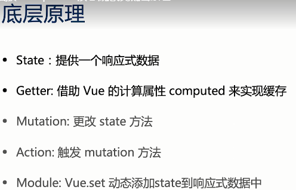
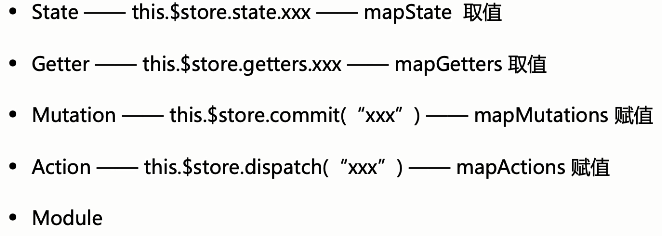

# Vue全家桶

- vuex：状态管理
- vue-router：路由
- vue-resource & axios(通用)：http请求
- vuelidate：表单验证

# [Nuxt3](https://nuxt.com/) 

# Vuex

## 基本使用

```js
import Vuex from 'vuex';
import Vue from 'vue';

Vue.use(Vuex);

const store = new Vuex.Store({
    state: {
        count: 0
    },
    // 读取状态, 插值表达式{{ $store.getters.doubleCount }}
    getters: {
        // 类似计算属性computed, 起到缓存的作用
        doubleCount(state){
            return state.count * 2;
        }
    }
    
    /*
	mutations:
    	由组件触发:
    	<button @click="$store.commit('increment', 2)">触发commit</button>
    */
    mutations: {
        increment(state, newV){
            state.count = state.count + newV;
        }
    },
    
    /*
    触发方式
    	<button @click="$store.dispatch('incrementAction', 2)">触发dispatch</button>
    	
    	actions 应该避免直接操作 state，state 的更改应该由 mutations 完成, 否则vue-devtools插件无法记录state的变更。
    	actions 可以根据当前 state 进一步处理数据, 计算或请求后端接口, 然后通过commit的方式提交给mutations去处理。

    */
    actions: {
        incrementAction(ctx, newV){
            let commit = ctx.commit;
            setTimeout( () => commit('increment'), 3000);
        }
    }
});

new Vue({
    store: store,		// 在组件实例中通过this.$store访问该store
    render: h => h(App)
}).$mount('#app');

// 在组件实例中读取store
computed: {
	count(){
        return this.$store.state.count;
    }
}

// 修改store
```

**注意**

- 刷新浏览器，vuex中的 state 会重新变为初始状态
解决方案：vuex-persistedstate 插件

- 如何监听 vuex 中数据变化？
  1. store.subscrib
  2. watch

## 核心概念和原理

    


>  vuex底层实现

```js
// 简化版Vuex vue-min.js
import Vue from 'vue'
const Store = function Store (options = {}) {
  const {state = {}, mutations={}} = options;
  this._vm = new Vue({
    data: {
      $$state: state
    },
  })
  this._mutations = mutations
}

Store.prototype.commit = function(type, payload){
  if(this._mutations[type]) {
    // this.state访问的是原型上面的state 数据项
    this._mutations[type](this.state, payload)
  }
}

Object.defineProperties(Store.prototype, { 
  state: { 
    get: function(){
      // this._vm._data 而不是 _vm.data,  
      return this._vm._data.$$state
    } 
  }
});
export default {Store}

// 使用简化版Vuex
impore vuexMin from 'vue-min.js';

const store = new vuexMin.Store({
    state: {
        count: 0
    },
    mutations: {
        increment(state, newV){
            state.count = state.count + newV;
        }
    }
})

Vue.prototype.$store = store;
new Vue({
    el: 'xx',
    rendre: ...
});
```


## Vuex结构

<table style='width:50px'>
<tr>
	<th colspan="2">this.$store</th>
</tr>
<tr>
	<td rowspan="2" style='vertical-align:center'>getter</td>
	<td>action</td>
</tr>
<tr>
	<td>mution</td>
</tr>
<tr>
	<td colspan="2">this.$store.state</td>
</tr>
</table>
# [vitepress](https://vitejs.cn/vitepress/) 

VitePress是一个静态站点生成器(SSG)，用于快速构建以内容为中心的网站。简而言之，VitePress使用Markdown编写源内容，为其应用主题，并生成可以轻松部署在任何地方的静态HTML页面。

VitePress提供了灵活的api来加载数据(本地或远程)和动态生成路由。你可以用它来构建几乎任何东西，只要数据可以在构建时确定。

每个Markdown页面也是一个Vue单文件组件。您可以使用Vue模板功能或导入的Vue组件在静态内容中嵌入交互性。每个Markdown页面都被处理为Vue组件并编译为JavaScript