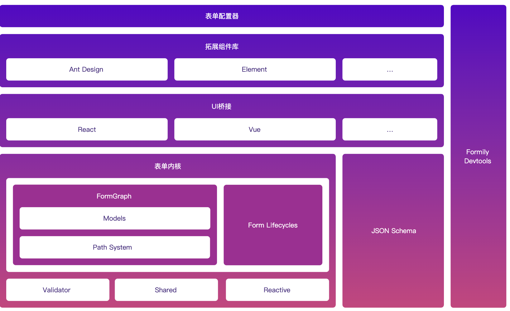
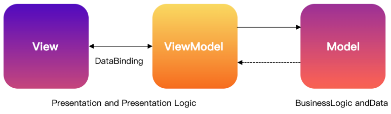

# vue + formily

- 组件作为 Field 的props使用时，不需要调用 `observer` 或 `useObserver`
  ```vue
  <VoidField title="SetupJSx" name="SetupJSx" :component="[SetupJSx]" :decorator="[FormItem]" />
  ```

- `@formily/reactive-vue.observer` + 【选项式api setup jsx】 + useForm 读form数据

  ```jsx
  observer(defineComponent({
    setup() {
      const formRef = useForm()
      return () => {
        const formVal = JSON.stringify(formRef.value?.values ?? null, null, 2)
        return ( <pre>{ formVal }</pre>)
      }
    },
  }))
  ```

- sfc + 组合式api

- sfc + 选项式api

# 概览

 

依赖

- @formily/core
- @formily/reactive
- @formily/vue

依赖追踪机制和响应式模型

- [@formily/reactive](https://reactive.formilyjs.org/zh-CN) 延续了 Mobx 的核心思想
- 借助 @formily/reactive，@formily/core 天然获得了依赖追踪，高效更新，按需渲染的能力

JSON Schema 独立存在，给 UI 桥接层消费

```js
import { useObserver } from '@formily/reactive-vue'
// vue sfc 组合式api + fomilyjs
```


**MVVM**

 


- View(视图层)负责维护 UI 结构与样式，同时负责与 ViewModel(视图模型)做数据绑定
  - 这里的数据绑定关系是双向的，也就是，ViewModel(视图模型)的数据发生变化，会触发 View(视图层)的更新，同时视图层的数据变化又会触发 ViewModel(视图模型)的变化。
- Model 则更偏实际业务数据处理模型。ViewModel 和 Model 都是充血模型，两者都注入了不同领域的业务逻辑，比如 ViewModel 的业务逻辑更偏视图交互层的领域逻辑，而 Model 的业务逻辑则更偏业务数据的处理逻辑
- Formily 它提供了 View 和 ViewModel 两层能力，View 则是@formily/react @formily/vue，专门用来与@formily/core 做桥接通讯的，
- 在 Formily 中，@formily/core 就是 ViewModel，Component 和 Decorator 就是 View，@formily/vue 就是将 ViewModel 和 View 绑定起来的胶水层，ViewModel 和 View 的绑定就叫做模型绑定
  - 实现模型绑定的手段主要有[useField](https://vue.formilyjs.org/api/hooks/use-field)，也能使用[connect](https://vue.formilyjs.org/api/shared/connect)和[mapProps](https://vue.formilyjs.org/api/shared/map-props)，需要注意的是，Component 只需要支持 value/onChange 属性即可自动实现数据层的双向绑定。


# [模型](https://core.formilyjs.org/zh-CN/guide/form) 

如何描述一个字段

- 路径
- 状态属性（visible、disabled）
- 值
- UI组件
  - UI 组件的属性

值的管理，都是在**顶层表单**上管理的，字段的值与表单的值是通过 path 来实现的绝对幂等。

- 表单值管理，其实就是一个对象结构的 values 属性，只是它是一个 @formily/reactive **observable** 属性，同时借助了 @formily/reactive 的深度 observer 能力，监听了它任意属性变化，如果发生变化，便会触发 onFormValuesChange 的生命周期钩子。

- 字段值管理，是在每个数据型字段的 value 属性上体现的，formily 会给每个字段维护一个叫 path 的数据路径属性，然后 value 的读写，都是对顶层表单的 values 进行读写，这样保证了字段的值与表单的值是绝对幂等的，同理字段默认值也一样。

## [字段模型](https://core.formilyjs.org/zh-CN/guide/field) 

Formily 的字段模型核心包含了两类字段模型：

- 数据型字段 Field、ArrayField、ObjectField
- 虚数据型字段 VoidField

Field 的属性（也就是 Field.props）IFieldFactoryProps， `@formily/vue.mapProps` 的功能就是将 Field.props 映射成自定义组件的 props

```js
mapProps(
  {
    title: 'label',
    description: 'extra',
    required: true,
    validateStatus: true,
  },
  (props, field) => {
    return {
      ...props,
      help: field.selfErrors?.length ? field.selfErrors : undefined,
    }
  }
)
```


ArrayField 和 ObjectField 都是继承自 Field，Field 的定位就是维护非自增型数据字段，对比 ArrayField/Object，并不是说 Field 就不能存数组类型或者对象类型的数据，Field 其实可以存任意数据类型的数据

只是，如果用户期望实现数组的添加删除移动这样的交互，则需要使用 ArrayField，对象属性的添加删除交互，则需要使用 ObjectField，如果没有这样的需求，所有数据类型统一用 Field 即可。

## 数据读写规则

因为 Field 是数据型字段，它负责维护表单数据的某个节点的数据，这里的读取，其实是直接读取的表单数据，通过 path 属性来寻址，这样也保证了表单数据与字段数据的绝对幂等，读取的方式直接读取 value/initialValue 即可。

数据写入规则与读取规则一致，Field 不会独立维护一份数据，它操作的直接就是具体表单的数据，通过 path 属性来寻址，写入的方式主要有：

- 直接修改 value/initialValue 属性
- 调用 onInput 会写入数据，同时设置字段的 inputValue 为入参数据，inputValues 为多参数据，然后设置 modified 属性为 true，代表该字段被手动修改过，最后触发 triggerType 为 onInput 的校验规则
- 调用 setValue 方法

## 组件规则

formily 提供了 component 属性，专门用于代理 UI 组件信息，component 是一个数组`[Component,ComponentProps]`，第一个元素代表是哪个组件，第二个代表组件的属性有哪些

读取组件信息的方式直接读取 component 属性即可。

写入组件信息的方式主要有：

- 直接修改 component 属性，传入数组
- 调用 setComponent 方法，第一个参数是组件，第二个是组件属性
- 调用 setComponentProps 方法，直接会设置组件属性


# [响应式](https://reactive.formilyjs.org/zh-CN/guide/concept) 

```js
import { action, observable } from '@formily/reactive'
import { observer } from '@formily/reactive-react'

action.bound((data) => {
    field.dataSource = transform(data)
    field.loading = false
})

// 可订阅对象
const obs = observable({
  input: '',
})
```

一个 observable 对象，字面意思是可订阅对象，我们通过创建一个**可订阅对象**，在每次操作该对象的属性数据的过程中，会自动通知**订阅者**，@formily/reactive 创建 observable 对象主要是通过 ES Proxy 来创建的，它可以做到完美劫持数据操作

观察者和被观察者

- 观察者 observer：监听者，监听其他数据变化
- 被观察者（可观察到的）observable，也就是【依赖】
- 当【被观察者】变化时，观察者更新变化，observable 是依赖

当form值变化时，组件跟着更新，需要用 observer 包裹组件


# 联动

在 Formily2.x 中描述逻辑的方式有

- 纯 JSX 模式下的 effects 或 reactions 属性
- Schema 模式下的 effects 或结构化 x-reactions 属性
- Schema 模式下的 effects 或函数态 x-reactions 属性

我们可以在响应器(Reactions)中消费 Form/Field/ArrayField/ObjectField/VoidField 模型中的任意属性，依赖的属性发生变化，**响应器就会重复执行**。

**(1)：**reactions 是用在具体字段属性上的响应器，它会基于函数内依赖的数据变化而重复执行

```jsx
/* eslint-disable */
<Field
  name="A"
  reactions={(field) => {
    /**具体逻辑实现**/
  }}
/>
```

**(2)：**effects 是用于实现副作用隔离逻辑管理模型，它最大的优点就是在字段数量超多的场景下，可以让视图代码变得更易维护，同时它还有一个能力，就是可以批量化的对字段做处理。

- 比如我们在 A,B,C 字段属性显示声明 x-reactions，如果这 3 个字段的 x-reactions 逻辑都是一模一样的，那我们在 effects 中只需这么写即可：

```jsx
onFieldReact('*(A,B,C)', (field) => {
  //...逻辑
})
```

**(3)：**如果字段数量很少，逻辑相对简单的，直接在字段属性上写 reactions 也是不错的，清晰明了。

```jsx
{
  "x-reactions": {
    "dependencies": ["aa"],
    "fulfill": {
      "state": {
        "visible": "{{$deps[0] == '123'}}"
      }
    }
  }
}
```


## [联动方式](https://formilyjs.org/zh-CN/guide/advanced/linkages) 

1. x-reactions
2. effects + onFieldValueChange
3. 主动模式：effects、schema.target
4. 被动模式：`@formily/core.onFieldReact` 、schema.dependencies
   1. onFieldReact 的第一个参数是【观察者】
   2. onFieldValueChange 的第一个参数是【被观察者】


```js
const form = createForm({
  effects() {
    onFieldValueChange('select', (field) => {
      form.setFieldState('*(input1,input2)', (state) => {
        //对于初始联动，如果字段找不到，setFieldState会将更新推入更新队列，直到字段出现再执行操作
        state.display = field.value
      })
    })
  },
})


field.setComponentProps({
        style: {
          backgroundColor: field.value,
        },
      })

x-reactions={[
          {
            target: 'count',
            effects: ['onFieldInputValueChange'],
            dependencies: ['price'],
            fulfill: {
              state: {
                value: '{{$deps[0] ? $self.value / $deps[0] : $target.value}}',
              },
            },
          },
          {
            target: 'price',
            effects: ['onFieldInputValueChange'],
            dependencies: ['count'],
            fulfill: {
              state: {
                value: '{{$deps[0] ? $self.value / $deps[0] : $target.value}}',
              },
            },
          },
        ]}

x-reactions={{
          target: 'color',
          fulfill: {
            state: {
              'component[1].style.backgroundColor': '{{$self.value}}',
            },
            //以下用法也可以
            // schema: {
            //   'x-component-props.style.backgroundColor': '{{$self.value}}',
            // },
          },
        }}
```


## 异步数据源

在 effects 中修改 Field 的 dataSource，也可以在 reactions 中修改 dataSource 属性。

```tsx
import { createForm, onFieldReact, FormPathPattern, Field } from '@formily/core'
import { observable, action } from '@formily/reactive'

const useAsyncDataSource = (
  pattern: FormPathPattern,
  service: (field: Field) => Promise<{ label: string; value: any }[]>
) => {
  onFieldReact(pattern, (field) => {
    field.loading = true
    service(field).then(
      action.bound((data) => {
        field.dataSource = data
        field.loading = false
      })
    )
  })
}

const form = createForm({
  effects: () => {
    useAsyncDataSource('select', async (field) => {
      const linkage = field.query('linkage').get('value')
      if (!linkage) return []
      return new Promise((resolve) => {
        setTimeout(() => {
          if (linkage === 1) {
            resolve([
            ])
          } else if (linkage === 2) {
            resolve([])
          }
        }, 1500)
      })
    })
  },
})
```

## 表单受控

Formily 就不再支持受控模式了，推荐的是使用[@formily/reactive](https://reactive.formilyjs.org/zh-CN) 实现响应式受控，既能实现值受控，也能实现字段级受控


## 自定义组件

```js
const phoneSchema = {
  type: 'object',
  properties: {
    phone: {
      type: 'string',
      title: '手机号',
      'x-component': 'Input',
      'x-validator': [{ required: true }, 'email'],
    },
    verifyCode: {
      type: 'string',
      title: '验证码',
      'x-component': 'VerifyCode',
      'x-reactions': [
        {
          dependencies: ['.phone#value', '.phone#valid'],
          fulfill: {
            state: {
              // 组件 props
              'component[1].readyPost': '{{$deps[0] && $deps[1]}}',
              'component[1].phoneNumber': '{{$deps[0]}}',
              
              selfErrors: '{{$deps[0] && $self.value && $self.value !== $deps[0] ? "确认密码不匹配" : ""}}',
            },
          },
        },
      ],
    },
  },
}

// VerifyCode 组件  自定义组件
interface IVerifyCodeProps {
  value?: any
  onChange?: (value: any) => void
  readyPost?: boolean
  phoneNumber?: number
  style?: React.CSSProperties
}
export const VerifyCode: React.FC<React.PropsWithChildren<IVerifyCodeProps>> =
  ({ value, onChange, readyPost, phoneNumber, ...props }) => {
    const [lastTime, setLastTime] = useState(0)
    // ....
}
```


# 路径

```js
field.query('.[].name').value()

$self.query(".name").value()
```

- 数据路径 path
- 绝对路径 address

Address 永远是代表节点的绝对路径，Path 是会跳过 VoidField 的节点路径，但是如果是 VoidField 的 Path，是会保留它自身的路径位置。

用 query 方法查询字段的时候，既可以用 Address 规则查询，也可以用 Path 规则查询


# 校验

Formily 的表单校验使用了极其强大且灵活的@formily/validator 校验引擎，校验主要分两种场景：

- Markup(JSON) Schema 场景协议校验属性校验，使用 JSON Schema 本身的校验属性与 x-validator 属性实现校验
- 纯 JSX 场景校验属性，使用 validator 属性实现校验

同时我们还能在 effects 或者 x-reactions/reactions 中实现联动校验

具体规则校验文档参考 [FieldValidator](https://core.formilyjs.org/zh-CN/api/models/field#fieldvalidator)

```js
validator_style_1: {
      title: '局部定义风格',
      required: true,
      'x-validator': `{{(value)=> {
            if (!value) return ''
            return value !== '123' ? '错误了❎' : ''
          }}}`,
      'x-component': 'Input',
      'x-decorator': 'FormItem',
    },
      
      
'x-validator': {
        pattern: /123/,
        message: '错误了❎',
      },
        
'x-reactions': `{{(field) => {
          field.selfErrors =
            field.query('bb').value() >= field.value ? 'AA必须大于BB' : ''
      }}}`,
```


# 协议

实现动态可配置表单

JSON-Schema + 扩展，UI 协议与数据协议混合在一起

- void 类型描述 UI 容器，void 代表一个虚数据节点，表示该节点并不占用实际数据结构

```json
{
  "type": "void",
  "title": "卡片",
  "description": "这是一个卡片",
  "x-component": "Card",
  "properties": {
    "string": {
      "type": "string",
      "title": "字符串",
      "description": "这是一个字符串",
      "x-component": "Input",
      "x-component-props": {
        "placeholder": "请输入"
      }
    }
  }
}
```
