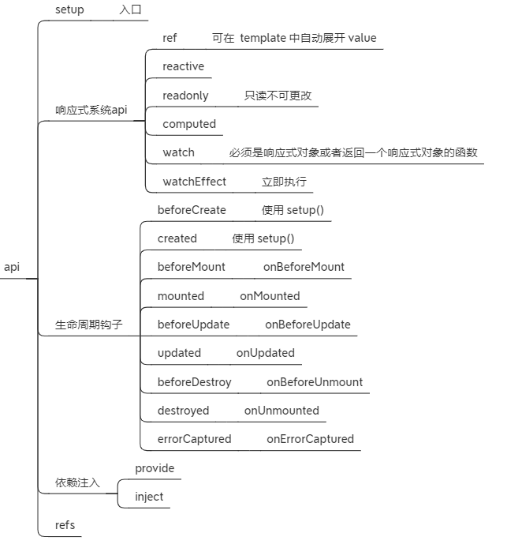

# 概览

[vue2 源码](https://github.com/vuejs/vue) 
[vue3](https://vuejs.org/guide/introduction.html) [源码](https://github.com/vuejs/core) 
[Vue3 响应式是如何实现的](https://mp.weixin.qq.com/s/Os-yxAcIrcC9rvfXyyvPHA) 

**核心概念**：组件 | 组件通信 | 指令 | 插槽 | 生命周期 | 响应式状态 | API 


 


- `$mount('#app')` 组件会替换 `#app`  元素本身（`outerHtml`）

- 一个指令的功能/作用是在其表达式的值变化时响应式地更新 DOM

- 使用了 `<script setup>` 的组件是默认私有的：一个父组件无法访问到一个使用了`<script setup>` 的子组件中的任何东西，除非子组件在其中通过 defineExpose 宏显式暴露

- 如果你是直接在 DOM 中书写模板 (例如原生 `<template>` 元素的内容)，模板的编译需要遵从浏览器中 HTML 的解析行为。在这种情况下，你应该需要使用 kebab-case 形式并显式地关闭这些组件的标签

# 新特性

- template 支持多个根标签
- 组合式API、组合式函数
- Teleport 内置组件
- 性能优化：
  - 模板编译新增静态标记、静态提升
  - diff算法新增【更新类型标记】
  - 响应式原理：给响应式变量增加标记（旧依赖、新依赖）、只删除失效的依赖


>  Vue3 性能提升体现在哪些方面

- 代码层面性能优化主要体现在全新响应式API，基于Proxy实现，初始化时间和内存占用均大幅改进；
- 编译层面做了更多编译优化处理，比如静态标记pachFlag（diff算法增加了一个静态标记，只对比有标记的dom元素）、事件增加缓存、静态提升（对不参与更新的元素，会做静态提升，只会被创建一次，之后会在每次渲染时候被不停的复用）等，可以有效跳过大量diff过程；

[Vue3 速度快的原因](https://mp.weixin.qq.com/s/WKqVSuCsM5CvO0dAHWUYfA?poc_token=HOXIrGSjvnTk9zHUAGKjB9wdFox3MhJf2NGGBPSw) 

- 打包时更好的支持tree-shaking，因此整体体积更小，加载更快
- ssr渲染以字符串方式渲染

> Vue2 和 Vue3之间的一些区别

- 性能：Vue.js 3采用了新的响应式引擎，它比Vue.js 2更快。在Vue.js 3中，许多内部实现都被优化，包括虚拟DOM的生成和更新、组件实例化和更新等等。

- Tree Shaking 支持：Vue.js 3 支持tree shaking，可以更容易地剔除没有使用的代码，使得打包后的代码更小更快。

- Composition API: Vue.js 3 引入了Composition API，可以让开发者更灵活的组织和重用组件逻辑。它允许将逻辑按照功能而不是选项分离，并且让开发者可以更好地重用逻辑。

- 指令的钩子函数变化
  created、beforeMount、mounted、beforeUpdate、updated、beforeUnmount、unmounted

- Teleport 组件：Vue.js 3 引入了Teleport组件，它允许组件在DOM树中的不同位置进行渲染。这使得开发者可以更轻松地实现模态框等功能。

- TypeScript支持：Vue.js 3 对TypeScript的支持更好。Vue.js 3中的TypeScript类型定义更加精确，使得开发者更容易使用TypeScript编写Vue.js应用。

总的来说，Vue.js 3是一个更快、更灵活、更易于维护的框架，它为开发者带来了许多新的功能和改进。

## 组件选项配置

- emits：声明组件触发的事件，（可选）
- expost
- `props` 和 事件名会自动格式转换，将驼峰转为短横线形式
- 双向绑定 `v-model` 的 props 由 `value` 改为 `modelValue`
- 用响应式API替换事件总线

# Vue3 应用开发

> 应用开发步骤

1. 调用 createApp 创建应用实例
2. 设置应用级配置 `app.config.xxx`
3. 挂载根组件 `app.mount()`：mount() 方法应该始终在整个应用配置和资源注册完成后被调用

# template

template 中可以访问的属性
- $slots
- $attrs
- $emit

# 组合式 API

 

`<script setup>` 形式书写的组件模板被编译为了一个内联函数，和 `<script setup>` 中的代码位于同一作用域。不像选项式 API 需要依赖 this 上下文对象访问属性，被编译的模板可以直接访问 `<script setup>` 中定义的变量，无需一个代码实例从中代理。这对代码压缩更友好，因为本地变量的名字可以被压缩，但对象的属性名则不能。

- 仅调用 `setup()` 或 `<script setup>` 的代码一次。这使得代码更符合日常 JavaScript 的直觉，不需要担心闭包变量的问题。组合式 API 也并不限制调用顺序，还可以有条件地进行调用。

- Vue 的响应性系统运行时会自动收集计算属性和侦听器的依赖，因此无需手动声明依赖。

- 无需手动缓存回调函数来避免不必要的组件更新。Vue 细粒度的响应性系统能够确保在绝大部分情况下组件仅执行必要的更新。对 Vue 开发者来说几乎不怎么需要对子组件更新进行手动优化。

```js
export default {
  emits: ['inFocus', 'submit'],
  setup(props, ctx) {
    // setup 函数中的this 为 undefined
    ctx.emit('submit')
  }
}
```

>  `<script setup>` 作用

1. 导入的组件可以直接使用，无需局部注册
2. 以`v` 为前缀驼峰形式声明的指令可以直接使用，无需注册
3. 声明的顶层变量可以在 template 中直接使用
4. 可以使用编译宏命令：defineProps、defineEmits 等


> 同时使用选项式API 和 组合式API
```vue
<script>
// 使用普通的 <script> 来声明选项
export default {
  inheritAttrs: false
}
</script>

<script setup>
// ...setup 部分逻辑
</script>
```


> 全局属性

 

## 编译器宏

在使用 `<script setup>` 的单文件中直接使用某个【宏】，无需导入。

- defineProps
- defineEmits：组件触发的事件
- defineExpose
- defineOptions
- withDefaults

## 插槽

插槽内容无法访问子组件的数据。Vue 模板中的表达式只能访问其【定义时所处的作用域】，这和 JavaScript 的【词法作用域】规则是一致的。换言之。父组件模板中的表达式只能访问父组件的作用域，子组件模板中的表达式只能访问子组件的作用域。
## 代码复用

代码复用方式有：
- 组件：复用逻辑和UI
- 组合式函数：复用逻辑
- 自定义指令：处理DOM的逻辑

## 实例

```js
import { getCurrentInstance } from 'vue'
const { proxy } = getCurrentInstance()
console.log(proxy) // 和 this 的属性一样
```

## 其他

> 缓存路由视图

缓存 `router-view`

```vue
<router-view v-slot="{ Component }">
  <keep-alive>
    <component :is="Component"></component>
  </keep-alive>
</router-view>
```

- 缓存的组件如何更新数据？
1. 路由导航守卫 beforeRouteEnter
2. 组件生命周期 activated

- 如何清除缓存

绑定 key 然后设置不同的属性值

# 生命周期

Vue 的生命周期可以分为8个阶段：创建前后、挂载前后、更新前后、销毁前后，以及一些特殊场景的生命周期。Vue 3 中还新增了是3个用于调试和服务端渲染的场景。

| **Vue 2中的生命周期钩子** | **Vue 3选项式API的生命周期选项** | **Vue 3 组合API中生命周期钩子** | **描述**                                               |
| ------------------------- | -------------------------------- | ------------------------------- | ------------------------------------------------------ |
| `beforeCreate`            | `beforeCreate`                   | `setup()`                       | 创建前，此时`data`和 `methods`的数据都还没有初始化     |
| `created`                 | `created`                        | `setup()`                       | 创建后，`data`中有值，尚未挂载，可以进行一些`Ajax`请求 |
| `beforeMount`             | `beforeMount`                    | `onBeforeMount`                 | 挂载前，会找到虚拟`DOM`，编译成`Render`                |
| `mounted`                 | `mounted`                        | `onMounted`                     | 挂载后，`DOM`已创建，可用于获取访问数据和`DOM`元素     |
| `beforeUpdate`            | `beforeUpdate`                   | `onBeforeUpdate`                | 更新前，可用于获取更新前各种状态                       |
| `updated`                 | `updated`                        | `onUpdated`                     | 更新后，所有状态已是最新                               |
| `beforeDestroy`           | `beforeUnmount`                  | `onBeforeUnmount`               | 销毁前，可用于一些定时器或订阅的取消                   |
| `destroyed`               | `unmounted`                      | `onUnmounted`                   | 销毁后，可用于一些定时器或订阅的取消                   |
| `activated`               | `activated`                      | `onActivated`                   | `keep-alive`缓存的组件激活时                           |
| `deactivated`             | `deactivated`                    | `onDeactivated`                 | `keep-alive`缓存的组件停用时                           |
| `errorCaptured`           | `errorCaptured`                  | `onErrorCaptured`               | 捕获一个来自子孙组件的错误时调用                       |
| —                         | `renderTracked`                  | `onRenderTracked`               | 调试钩子，响应式依赖被收集时调用                       |
| —                         | `renderTriggered`                | `onRenderTriggered`             | 调试钩子，响应式依赖被触发时调用                       |
| —                         | `serverPrefetch`                 | `onServerPrefetch`              | 组件实例在服务器上被渲染前调用                         |

**「父子组件的生命周期」：**

- `加载渲染阶段`：父 beforeCreate -> 父 created -> 父 beforeMount -> 子 beforeCreate -> 子 created -> 子 beforeMount -> 子 mounted -> 父 mounted
- `更新阶段`：父 beforeUpdate -> 子 beforeUpdate -> 子 updated -> 父 updated
- `销毁阶段`：父 beforeDestroy -> 子 beforeDestroy -> 子 destroyed -> 父 destroyed

> 监听子组件生命周期

onVnodeBeforeMount
onVnodeMounted
onVnodeBeforeUpdate
onVnodeUpdated
onVnodeBeforeUnmount
onVnodeUnmounted

```vue
<script setup>
    import { ref } from 'vue'
    const count = ref(0)
    function onMyComponentMounted() {}
    function divThatDisplaysCountWasUpdated() {}
</script>

<template>
    <MyComponent @vnodeMounted="onMyComponentMounted" />
    <div @vnodeUpdated="divThatDisplaysCountWasUpdated">{{ count }}</div>
</template>
```

# 响应式

## 原理

**关键词**：依赖收集、触发更新、当前正在执行的副作用对象（activeEffect）、响应式副作用

响应式副作用：能自动追踪依赖的副作用，比如渲染函数

> 描述

初始化Vue实例时会创建响应式变量，在执行 render 函数或其他副作用过程中，访问响应式变量时会进行依赖收集，将正在运行的副作用作为新的订阅者添加到一个集合（Set）中，该集合保存了所有追踪该变量的订阅者。

修改响应式变量时会触发更新，将这个变量的订阅者集合中的副作用全部执行一遍

> 解释

Vue3 基于 ES6 新增的Proxy对象实现数据代理并通过Reflect对源数据进行操作，解决了Vue2中无法追踪对象新增、删除属性的问题。另外，Proxy可以直接监听数组，无需像Vue2中那样重写数组方法进行拦截。

vue3采用【数据代理+数据劫持+发布订阅模式】的方法。在初始化vue实例时用Proxy对象来代理目标对象，对目标对象的所有属性的基本操作（get、set、del）进行拦截，并通过Reflect操作对象内部数据。

当读取Proxy对象属性时，会触发Proxy属性的getter方法，然后触发它Dep实例的depend方法进行依赖收集。

当Proxy对象属性或Proxy数组元素发生变化时，会触发Proxy属性的setter方法，然后通过Reflect操作目标对象属性，同时触发它Dep实例的notify方法进行依赖分发，通知所有依赖的Watcher实例执行内部回调函数。

最后会触发renderWatcher回调，会重新执行render函数，重新对比新旧虚拟DOM，重新渲染页面。

Proxy：拦截【对象】中任意属性的变化，包括：读写、新增、删除

Reflect：对源对象的属性进行操作

使用Proxy替换 Object.defineProperty 实现响应式的优劣：
- 优点：直接劫持整个对象，不用递归对象、数组的属性；劫持数组；对象属性新增、删除等；
- 缺点：不兼容IE

## 用法

> reactive

```js
import { reactive } from 'vue'

export default {
  // `setup` 是一个专门用于组合式 API 的特殊钩子函数
  setup() {
    const state = reactive({ count: 0 })

    // 暴露 state 到模板
    return {
      state
    }
  }
}
```

1. 仅对对象类型有效（对象、数组和 `Map`、`Set` 这样的[集合类型](https://developer.mozilla.org/zh-CN/docs/Web/JavaScript/Reference/Global_Objects#使用键的集合对象)），而对 `string`、`number` 和 `boolean` 这样的 [原始类型](https://developer.mozilla.org/zh-CN/docs/Glossary/Primitive) 无效。

2. 因为 Vue 的响应式系统是通过属性访问进行追踪的，因此我们必须始终保持对该响应式对象的相同引用。这意味着我们不可以随意地“替换”一个响应式对象，因为这将导致对初始引用的响应性连接丢失。

> ref

Vue 提供了一个 [`ref()`](https://cn.vuejs.org/api/reactivity-core.html#ref) 方法来允许我们创建可以使用任何值类型的响应式 **ref**。

`ref()` 将传入参数的值包装为一个带 `.value` 属性的 ref 对象。

> ref 和 reactive 区别

**ref**

1. 通过实例化一个 `RefImpl` 对象，该对象定义了 `value`、`dep` 属性和  `get`、`set` 方法，分别进行依赖收集和触发更新。一般用来处理基本数据类型，也能处理复杂数据类型，只不过内部会自动将对象转换为reactive的代理对象。
2. 在 `<script>` 中要加.value，在模版中不需要。

**reactive**
创建一个 Proxy 实例，通过Proxy对目标对象中的所有属性动态地进行【数据劫持】，并通过Reflect操作对象内部数据来实现响应式，只能处理引用类型数据，会实现递归深度响应式


> watch 和 watchEffect 的区别

执行时机、监听数据源
1、watch是惰性执行，也就是只有监听的值发生变化的时候才会执行（忽略watch第三个参数的配置，如果修改配置项也可以实现立即执行），但是watchEffect不同，每次代码加载watchEffect都会执行
2、watch 需要传递监听的对象，watchEffect不需要
3、watch 可以访问旧状态值和当前最新状态值，watchEffect 不行
4、watch只能监听响应式数据，ref定义的属性和reactive定义的对象，如果直接监听reactive定义对象中的属性是不允许的，除非使用函数转换一下
5、watchEffect如果监听reactive定义的对象是不起作用的，只能监听对象中的属性。

## [响应式系统](https://cn.vuejs.org/guide/extras/reactivity-in-depth.html#how-reactivity-works-in-vue) 

```js
function reactive(obj) {
  return new Proxy(obj, {
    get(target, key) {
      track(target, key)
      return target[key]
    },
    set(target, key, value) {
      target[key] = value
      trigger(target, key)
    }
  })
}

function ref(value) {
  const refObject = {
    get value() {
      track(refObject, 'value')
      return value
    },
    set value(newValue) {
      value = newValue
      trigger(refObject, 'value')
    }
  }
  return refObject
}
```

# [Pinia](https://pinia.vuejs.org/zh/introduction.html) 

> 特点 | 和 vuex 的区别

1. 更简单的 API（合并 mutation 和 action），符合组合式 API 风格的 API
2. 取消嵌套结构的模块
3. 支持 TypeScript 类型推断
4. 支持 SSR

> 概念

store、state、getter、action

**action** 可以是异步也可以是同步，返回一个 Promise 或不返回

> API

```js
export const useUsers = defineStore('users', {
  state: () => ({
    userData: null,
    // ...
  }),
  actions: {
    async registerUser(login, password) {
      try {
        this.userData = await fetch({ login, password })
      } catch (error) {
        return error
      }
    },
  },
})
```

- useUsers.$reset
- useUsers.$patch
- useUsers.$subscrib
监听 store 变化，与 watch 相比区别：执行 $patch 更新多个 state 时 subscrib 只会触发一次
- someStore.$onAction：订阅action


# 其他

## [web component](https://cn.vuejs.org/guide/extras/web-components.html)

你可以用 Vue 来构建标准的 Web Component，这些 Web Component 可以嵌入到任何 HTML 页面中，无论它们是如何被渲染的。这个方式让你能够在不需要顾虑最终使用场景的情况下使用 Vue：因为生成的 Web Component 可以嵌入到旧应用、静态 HTML，甚至用其他框架构建的应用中。

[Web Components](https://developer.mozilla.org/en-US/docs/Web/Web_Components) 是一组 web 原生 API 的统称，允许开发者创建可复用的自定义元素 (custom elements)。

## [各种vue版本](https://github.com/vuejs/core/tree/main/packages/vue#which-dist-file-to-use) 

Which dist file to use

## [jsx/tsx](https://mp.weixin.qq.com/s/5V7nm9diQHUVor31Jj0xwA) 

## 图标

图标可以使用 vite-svg-loader

## API

SPA 一般要求后端提供 API 数据接口，但你也可以将 Vue 和如 [Inertia.js](https://inertiajs.com/) 之类的解决方案搭配使用，在保留侧重服务端的开发模型的同时获得 SPA 的益处

## 面试

[2023必知必问的Vue3面试题总结](https://mp.weixin.qq.com/s/0_A70Fw_TQUqpzjeIinn2g) 

[2023 前端二面高频 vue 面试题集锦](https://mp.weixin.qq.com/s/WKqVSuCsM5CvO0dAHWUYfA?poc_token=HOXIrGSjvnTk9zHUAGKjB9wdFox3MhJf2NGGBPSw) 


# 源码

> 目录结构

代码仓库中有个 packages 目录，里面是 Vue 3 的主要功能的实现，包括

- reactivity 目录：数据响应式系统，这是一个单独的系统，可以与任何框架配合使用。
- runtime-core 目录：与平台无关的运行时。其实现的功能有虚拟 DOM 渲染器、Vue 组件和 Vue 的各种API，我们可以利用这个 runtime 实现针对某个具体平台的高阶 runtime，比如自定义渲染器。
- runtime-dom 目录: 针对浏览器的 runtime。其功能包括处理原生 DOM API、DOM 事件和 DOM 属性等。
- runtime-test 目录: 一个专门为了测试而写的轻量级 runtime。由于这个 rumtime 「渲染」出的 DOM 树其实是一个 JS 对象，所以这个 runtime 可以用在所有 JS 环境里。你可以用它来测试渲染是否正确。它还可以用于序列化 DOM、触发 DOM 事件，以及记录某次更新中的 DOM 操作。
- server-renderer 目录: 用于 SSR。尚未实现。
- compiler-core 目录: 平台无关的编译器. 它既包含可扩展的基础功能，也包含所有平台无关的插件。
- compiler-dom 目录: 针对浏览器而写的编译器。
- shared 目录: 没有暴露任何 API，主要包含了一些平台无关的内部帮助方法。
- vue 目录: 用于构建「完整构建」版本，引用了上面提到的 runtime 和 compiler。


> 核心

- 全局变量 【activeEffect】表示当前正在运行的副作用，只有 `ReactiveEffect.run()` 才会设置它的值
  - ReactiveEffect 的实例只有三类：watch、computed、render

- 将当前 effect 添加到依赖中，只有 `trackEffects(dep)` <== trackRefValue  <== RefImpl.get、ComputedRefImpl.get
- trackEffects  <== track <==

> 生命周期

- instance.emit('hook:beforeMount')


> ref 完成响应式更新UI

- 每个 `ref(1)` 会创建一个 RefImpl对象，该对象有一个访问属性 `value` 和 【dep】属性，【dep】是一个【ReactiveEffect】集合。
- `value get` 会执行 `dep.add(activeEffect!)` 和 `activeEffect!.deps.push(dep)`
- `value set` 会执行 `triggerRefValue`：遍历【dep】并执行 `effect.scheduler` （添加到队列）或 `effect.run`。

- 初始化组件时会创建一个【reactive effect for rendering】，并执行 `effect.run`（调用用户定义的 render 函数）。同时设置 【activeEffect】为该 effect。

> reactive 响应式更新 

- `reactive(obj)` 会创建一个 `Proxy` 实例 【proxy】，该【proxy】代理的目标对象的【get】【set】等捕捉器。
- 在【get】捕捉器中会执行 `track(target, TrackOpTypes.GET, key)`，将【activeEffect】添加到目标对象的 `key` 对应的依赖集合中。
- 在【set】捕捉器中执行  `trigger`：遍历【dep】并执行 `effect.scheduler` （添加到队列）或 `effect.run`。

> 处理数组

> [带编译时信息的虚拟DOM](https://cn.vuejs.org/guide/extras/rendering-mechanism.html#compiler-informed-virtual-dom) 
> 标记 vnode 的类型和更新类型


> 异步更新

只使用 Promise 

> 参考

[透响应式原理](https://juejin.cn/post/7010941033554903076) 
[博客](https://vue3js.cn/global/nextTick.html) 
[浅谈Vue3响应式原理与源码解读](https://mp.weixin.qq.com/s/l2wCwX2gTaPGt-dq54gZyQ) 
