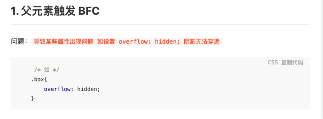

# 媒体查询

- 媒体类型

  1. screen：彩色计算机
  2. print
  3. projection
  4. all：所有媒体(默认)

- 在`<link>`链接外部样式表时可以指定媒体类型，`<link media>`

# css选择器

> 属性选择器的中使用模式匹配

```html
<div>
  <button class="ok-btn">确定</button>
  <button class="re-try-btn">重试</button>
  <button class="cancel-btn">取消</button>
</div>

<style>
  button[class$="-btn"] {
    min-width: 6em;
  }
</style>
```

上面的选择器为所有类名以 `-btn` 结尾的按钮元素添加样式。

```css
a[href*=".wikipedia.org"] {
  color: darkcyan;
}
```

它使用属性模式匹配为维基百科超链接添加不同的样式

> 功能选择器

`:has`、`:is、`、`:not`

# `<a>` 伪类顺序

- link--visited--focus--hover--active
- active必须在hover后面，hover必须在link和visited后面；

# CSS模块化

## 模块化解决方案

1. 一类是彻底抛弃 CSS，使用 JS 或 JSON 来写样式。[Radium](https://github.com/FormidableLabs/radium)，[jsxstyle](https://github.com/petehunt/jsxstyle)，<u>react-style</u> 属于这一类。优点是能给 CSS 提供 JS 同样强大的模块化能力；缺点是不能利用成熟的 CSS 预处理器（或后处理器）。

2. 另一类是依旧使用 CSS，但使用 JS 来管理样式依赖（需要构建工具支持），代表是 [CSS Modules](https://github.com/css-modules/css-modules)。CSS Modules 能最大化地结合现有 CSS 生态和 JS 模块化能力，发布时依旧编译出单独的 JS 和 CSS。它并不依赖于 React，只要你使用 Webpack，可以在 Vue/Angular/jQuery 中使用。


- CSS modules？

  - `<style module>`


- BEM策略：Block-Element-Modifier

  类命名策略：类名按  块-元素-修饰符 命名

  ```html
  <style>
    .c-Button {
      ...
    }
    .c-Button--close {
      // ...
    }
  </style>
  ```

  

# em, rem

- 2em：相对于当前元素的字体 大小，当前元素中小写字母M的宽度的2倍
- rem：相对于根元素(html中的`<html>`，也可以用伪元素 `::root` 表示根元素 )

# 变量

- css中的变量相当与宏，作用只是将一个值替换为另一个值

```css
html {
  /*自定义变量*/
  --base-color: blue;
}
:root{
  --base-color: blue;
}
p {
  color: var(--base-color);
}
```

# [At-rules](https://developer.mozilla.org/zh-CN/docs/Web/CSS/At-rule)


## @import

- @import导入的样式表A相当于被导入的样式表中的额样式规则出现在@import的位置

```css
/*相当于在此处定义样式规则*/
@import url(common.css);
```

- 页面被加载的时，link会同时被加载，而@import引用的CSS会等到页面被加载完再加载；
- 如果你想样式表并行载入，以使页面更快，请使用LINK 替代`@import`。

## [@property](https://developer.mozilla.org/zh-CN/docs/Web/CSS/@property) 

自定义css属性

## 自定义列表样式

```css
@counter-style custom-roman {
  system: numeric;
  symbols: "0" "1" "2" "3" "4" "5" "6" "7" "8" "9";
  prefix: "(";
  suffix: "). ";
}
ul {
  list-style-type: custom-roman
}
```


# 清除浮动

1. 浮动元素的后面一个元素设置 clear: both (也可以添加一个空元素用来添加该属性)；
2. 给浮动元素的容器元素设置 overflow:hidden 或 auto；
3. `::after` 伪元素；

# 视觉上隐藏一个元素

`opacity:0;`  `visibility: hidden;` `display:none;` `index: 99`

- `display` 不会占据空间，影响布局，会导致回流；`visibility` 和 `opacity` 会占据空间，不会导致回流。
- 只有 `opacity` 能触发点击事件。
- 父元素设置 `display` 和 `opacity` ，子元素一定会隐藏；父元素设置 `visibility` ，子元素 `visibility: visible` 子元素可以显示。


回流 & 重绘

- `display` 导致回流， `visibility` 导致重绘
- 在一般情况下，`opacity` 会触发重绘，即 `Recalculate style` => `Update Layer Tree`。不管你是否开启GPU提升为合成层与否。
  - 如果利用 `animation` 动画，对 `opacity` 做变化（`animation` 会默认触发GPU加速），则只会触发 GPU 层面的 composite，不会触发重绘。

[opacity、visibility、display 属性对比](https://segmentfault.com/a/1190000015116392) 

# 元素垂直居中 

1. 父元素display:flex,align-items:center;
2. 元素绝对定位，top:50%，margin-top：-（高度/2）
3. 高度不确定用transform：translateY（-50%）
4. 父元素table布局，子元素设置vertical-align:center;

## 水平对齐

- 对齐块级元素：`margin:0 auto;`  (宽度固定或者取百分比都可以)

- 块级元素中的行内元素

```css
.box-contain {
  text-align: center;
}
.box-contain::after {
  display: inline-block;
  content: ''; 
  width: 100%;
  height: 0;
}
```

## 垂直对齐

- 作用于行内元素

```css
.inline-ele {
  vertical-align: middle;
}
// 作用于 内联元素上

// 容器元素设置 line-height 为容器高度，line-height 平均分配给行内框的上、下
.container {
  font-size: 0;
  line-height: 800px;
}
```


## 未知宽高的水平垂直居中

```css
/* 1. 绝对定位 + translate */
.transform {
  position: absolute;
  left: 50%;
  top: 50%;
  transform: translate(-50%,-50%);
}

/* 2. flex布局*/
.flex {
  display: flex;
  justify-content: center;//使子项目水平居中
  align-items: center;		//使子项目垂直居中
}

/* 3. table*/
.table {
  display: table-cell;
  vertical-align: middle; //使子元素垂直居中
  text-align: center;     //使子元素水平居中
}
/* 4. inline-block*/
.box {
  display: inline-block;
  margin: auto;
  text-align: center;    // 只有一行 & 强制换行时无效
}
```

## 图像居中

1. 父元素固定宽高，利用定位及设置子元素margin值为自身的一半；
2. 父元素固定宽高，子元素设置position: absolute，margin：auto平均分配margin；
3. css3属性transform。子元素设置position: absolute; left: 50%; top: 50%;transform: translate(-50%,-50%);即可；
4. 将父元素设置成display: table, 子元素设置为单元格 display: table-cell；
5. 弹性布局display: flex。设置align-items: center; justify-content: center；


## 参考

- [CSS 垂直居中](https://mp.weixin.qq.com/s?__biz=MjM5NTEwMTAwNg==&mid=2650215660&idx=1&sn=c1aeb94de8a3a4e23402068390cc811f&chksm=befe14cd89899ddbe29f3dd00212d6678af94606ee72ca0c54206d5e643cc0c684e64db44aa2&scene=0&key=f488c6fef5eafe9dddbfc3b904090949bf299ed3bba6ade392c7cdbda3053dfbb67d3c43bd13c69ff70503e95574b5574984ab793f52d9a8b00940664c531d3419d5a84018461bb07e019315e14adf33&ascene=1&uin=Mjc2NDI1NDU2NA%3D%3D&devicetype=Windows+7&version=62060720&lang=zh_CN&pass_ticket=Pn9cJyIWK2xt%2BmQltkMddf4S5oGoplFdiJ%2B16Yj6gD8L9Zd0WMlQ1u32%2FRJtZE1p) 

# Flex布局

flex 布局分为三点：flex 容器、flex直系子元素的伸缩、flex子元素的对齐；

- flex 容器属性设置：flex-direction、flex-wrap、justify-content、align-items

- flex 元素的对齐

```css
// 全部item在主轴的对齐方式
flex-contain {
  justify-content: center;  
}
// 全部item在副轴的对齐方式
flex-contain {
  align-items: center;
}

// 多行时多个主轴的对齐方式
flex-contain {
  align-content: center;
}

// 单个item在副轴的对齐方式
flex-item {
  align-self: flex-end;
}
```

- flex 属性简写

  1. `flex: auto`：1 1 auto

  2. `flex: 2`：2 1 0


# [网格布局](https://developer.mozilla.org/zh-CN/docs/Learn/CSS/CSS_layout/Grids#flexible_grids_with_the_fr_unit) 

[网格布局-阮一峰](https://www.ruanyifeng.com/blog/2019/03/grid-layout-tutorial.html) 

**网格：**显式网格是我们用 `grid-template-columns` 或 `grid-template-rows` 属性创建的。而隐式网格则是当有内容被放到网格外时才会生成的。


**CSS 属性：**

- grid-template-columns
- grid-template-rows
- grid-template-areas
- grid-template


- grid-auto-columns
- grid-auto-rows
- grid-auto-flow
- grid
- grid-row-start
- grid-column-start
- grid-row-end
- grid-column-end
- grid-row
- grid-column
- grid-area


- grid-row-gap
- grid-column-gap
- grid-gap

**容器属性：**多少行、多少列、每行的高度、每列的宽度、（行|列）之间的间隔

`display: grid` 的声明只创建了一个只有一列的网格

- 尺寸：grid-template-columns、grid-template-rows
  - grid-template-columns 定义行高
  
  - 关键词
  
    ```css
    .container {
      display: grid;
      grid-template-columns: 100px auto 100px;
      grid-template-columns: repeat(auto-fill, 100px);
      grid-template-columns: 1fr 1fr;
      grid-template-columns: 1fr 1fr minmax(100px, 1fr);
    }
    ```
  
  - grid-auto-columns、grid-auto-rows
  
    - 一些项目的指定位置，在现有网格的外部。比如网格只有3列，但是某一个项目指定在第5行。这时，浏览器会自动生成多余的网格，以便放置项目
    - 设置浏览器自动创建的多余网格（隐式网格）的列宽和行高
  
  - 简写：grid-template


- 区域|位置：grid-template-areas


  - ```css
    .container {
      display: grid;
      grid-template-columns: 100px 100px 100px;
      grid-template-rows: 100px 100px 100px;
      grid-template-areas: 'a b c'
                           'd e f'
                           'g h i';
    }
    ```

  - 放置顺序：grid-auto-flow，先行后列

- 间隔：grid-row-gap、row-gap（新标准）、gap（简写）

- 对齐属性：


    - 设置单元格内容的位置：justify-items、align-items、place-items（简写）


    - 整个内容区域在容器里面的位置：justify-content、align-content、place-content（简写）


**子项目属性：**占用哪几行哪几列

- 位置：grid-column-start、grid-column-end、grid-row-start、grid-row-end，简写为 grid-column、grid-row，指定项目的四个边框，分别定位在哪根网格线
  - grid-area：配合 grid-template-areas 使用，指定子项目放置在哪个区域

- 子项目对齐：justify-items、align-items、place-items（简写）
  - 单元格内容对齐：justify-self、align-self、place-self（简写）


# [外边距塌陷（折叠）](https://developer.mozilla.org/en-US/docs/Web/CSS/CSS_Box_Model/Mastering_margin_collapsing) 

所有毗邻的两个或更多盒元素的 margin 将会合并为一个margin共享之。

- 毗邻的定义为：同级或者嵌套的盒元素，并且它们之间没有非空内容、Padding或Border分隔。
- 上下相邻的两个块元素A,B，会合并共同的外边距。A的**margin-botton**: 20px; B的**margin-top**: 10px; B的margin-top属性无效，较大的margin-botton才有效。
- 两个垂直外边距接触到一起（没有边框的隔离）时会发生外边距折叠，即使一个元素嵌套另一个元素也不例外。

浮动元素和绝对定位的元素不会发生边距折叠。

# img底像素空白

- [知乎](https://zhuanlan.zhihu.com/p/56815107) 

# 布局和包含块

- [布局和包含块-MDN](https://developer.mozilla.org/en-US/docs/Web/CSS/Containing_block)  

 

```css
.parent{
  content: "",
  display: table;
}
```

# 视觉格式化模型

[视觉格式化模型-MDN](https://developer.mozilla.org/zh-CN/docs/Web/Guide/CSS/Visual_formatting_model) 

# HTML5新特性

[HTML5-MDN](https://developer.mozilla.org/zh-CN/docs/Web/Guide/HTML/HTML5) 

# 文本对齐缩进

> text-indent

> text-align

- 应用于块级元素，不控制块元素自身的对齐，控制其元素内容(行内内容: 文本、图像等)的对齐

> line-height

- 设置行内元素的height和width无效，通过设置`line-height`调整高度

> vertical-align

- 指定行内元素（`display:inline`，如 `` `<span>`）或表格单元格（table-cell）元素的垂直对齐方式。
- 应用于块级容器中的行内元素的垂直对齐方式，设置行内元素的 vertical-align
