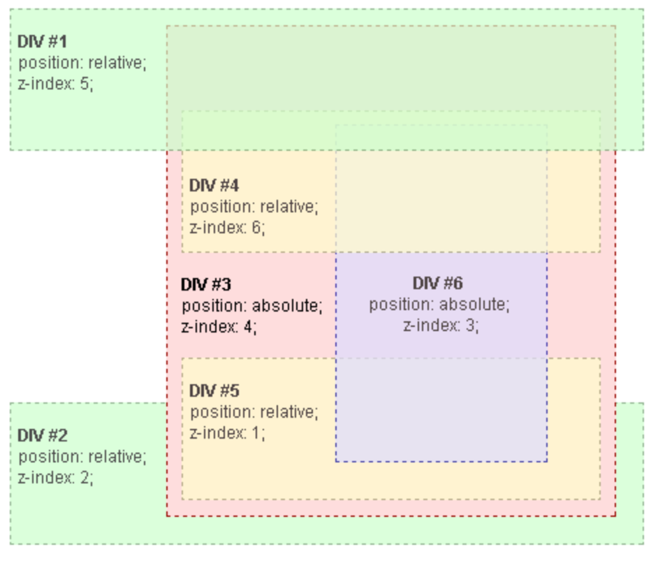
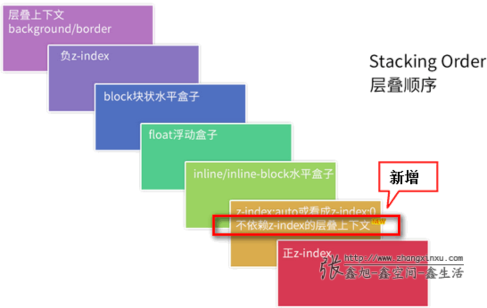

# 布局和包含块

> [布局和包含块](https://developer.mozilla.org/en-US/docs/Web/CSS/Containing_block#identifying_the_containing_block)  

包含块的作用（意义）：包含块会影响元素的定位和布局、大小。

`left` 、`margin`、`padding`（包括`margin-top` 和` padding-top`）的值是百分比时，它们的参考值就是包含块的 `width`。

- 初始包含块
  - The initial containing block has the dimensions of the viewport and is also the block that contains the `<html>` element.
  - `<html>`根元素所在包含块称为初始化包含块，它的大小和视口的大小一样。

## [格式化上下文（formatting context）](https://developer.mozilla.org/en-US/docs/Web/Guide/CSS/Block_formatting_context)  

关键词：块级格式上下文

BFC是一个独立的渲染区域，内部的**元素布局**不受外部影响，并且BFC内部的元素也不会影响到外部。

- 什么情况下会创建BFC：设置元素的`float`属性、绝对定位和固定定位、`overflow`属性不是 visible、`display`属性等

  - `contain: layout` 等是无副作用的，可在不影响已有布局的情况下触发 BFC
- BFC的作用：避免margin穿透，清除浮动

  1. 包含内部 float 元素，隔离外部 float 元素

  2. 避免外边距折叠


# 定位

> position: sticky fixed 参考点？
> [position-mdn](https://developer.mozilla.org/en-US/docs/Web/CSS/position) 

- z-index、left、top 对静态定位的元素无效。z-index 只作用于非静态定位元素和 `flex items` 。静态定位元素的 z-index 由该元素所在的 `stacking context` 决定。	

- 相对定位的元素以【正常布局的位置】为参考进行偏移，被偏移后，该元素偏移前所占的空间仍然还在，不会变化，也不会影响其他元素。

- 绝对定位脱离文档流，不在占由原有的空间，以 `containing element` 为参考（怎么确定 containing element [包含块](https://developer.mozilla.org/en-US/docs/Web/CSS/Containing_block#identifying_the_containing_block)）。left、top 指定该元素与包含块之间的距离。不会发生 margin 合并。

- fixed 固定定位：通常相对于【视口的可视区域】定位元素
  - fixed元素被另一个fixed元素包含的时候在chrome下fixed子元素的定位会受到父元素的影响。

- sticky
  - Sticky elements are "sticky" relative to the nearest ancestor with a "scrolling mechanism", which is determined by its ancestors' [position](https://developer.mozilla.org/en-US/docs/Web/CSS/position) property。scrolling mechanism 就是 overflow  is  `hidden`, `scroll`, `auto`, or `overlay`
  
  - The element is positioned according to the normal flow of the document, and then offset relative to its **nearest scrolling ancestor** and [containing block](https://developer.mozilla.org/en-US/docs/Web/CSS/Containing_block) (nearest block-level ancestor), including table-related elements, based on the values of `top`, `right`, `bottom`, and `left`. The offset does not affect the position of any other elements。
  
  - 粘性定位元素必须至少设置一个 top、left、right、bottom，没有超出设置的偏移之前元素视为相对定位，否则视为固定定位（直到该元素到达其父元素的边界）。


# z-index | stacking context（堆叠上下文）

 

div1、div2、div3 属于同一个 stacking context，div3 创建了一个新的包含了div4、div5、div6 的上下文，当两个不属于同一个上下文的元素比较 z-index 时，会一直向上直到使这两个元素属于同一个上下文。例如当 div4 与 div1比较 z-index时，div3被看作一个整体（z-index: 4）与 div1 比较。

- 技巧
  - 把 z-inde 看作版本号（目录号），从主版本依次进行比较。
  - 一个dom 元素如果没有形成新的 stacking context，那么在进行层叠顺序的比较时该元素等价于它所在的 stacking context 的层叠顺序。
  - 普通文本流中的元素，dom位置在后面的层叠顺序更高

- [什么情况会创建新的 stacking context？](https://developer.mozilla.org/en-US/docs/Web/CSS/CSS_Positioning/Understanding_z_index/The_stacking_context) 
  如果元素没有创建新的 stacking context 设置 z-index 无效。

- 参考

[深入理解CSS中的层叠上下文和层叠顺序](https://www.zhangxinxu.com/wordpress/2016/01/understand-css-stacking-context-order-z-index/?shrink=1) 

 

# scale

[清除多余空白](https://jsfiddle.net/t5utds44/7)  

- 负margin 抵消多余的空白

# 复合图层

将某个元素变成一个复合图层后会启用硬件加速，复合图层由 GPU 单独绘制

**如何创建合成层**

- 3D转换：translate3d，translateZ依此类推；
- video，canvas，iframe元件
- transform 和 opacity经由Element.animate();
- transform 和 opacity经由СSS过渡和动画;
- will-change;
- 拥有加速 CSS 过滤器的元素filter;
- 元素有一个z-index较低且包含一个复合层的兄弟元素(换句话说就是该元素在复合层上面渲染)

使用硬件加速时，尽可能的使用index，防止浏览器默认给后续的元素创建复合层渲染

- 元素有一个包含复合层的后代节点(换句话说，就是一个元素拥有一个子元素，该子元素在自己的层里)
- 更多参考 [性能优化-复合层](https://fed.taobao.org/blog/taofed/do71ct/performance-composite/)

# css 目录计数

```css
.zl_parse_t.h1::before {
  counter-increment: h1;
  content: counter(h1) ". ";
}
```

# CSS 获取屏幕宽度和高度

使用 `@property`

```css
@property --_w {
  syntax: '<length>';
  inherits: true;
  initial-value: 100vw; 
}
@property --_h {
  syntax: '<length>';
  inherits: true;
  initial-value: 100vh; 
}
:root {
  --w: tan(atan2(var(--_w),1px)); /* screen width */
  --h: tan(atan2(var(--_h),1px)); /* screen height*/
  /* The result is an integer without unit  */
}

body:before {
  content: counter(w) "x" counter(h);
  counter-reset: h var(--h) w var(--w);
  font-size: 50px;
  font-family: system-ui,sans-serif;
  font-weight: 900;
  position: fixed;
  inset: 0;
  width: fit-content;
  height: fit-content;
  margin: auto;
}
```

# 文本截断 

- 多标签溢出整块省略
```css
// 单行溢出省略
.single-overflow {
  width: 200px;
  outline: 1px solid red;
  white-space: nowrap;
  overflow: hidden;
  text-overflow: ellipsis;
}
// 多行溢出省略
.multi-overflow {
  width: 200px;
  outline: 1px solid red;
  white-space: normal;
  overflow: hidden;
  text-overflow: ellipsis;
  display: -webkit-box;
  -webkit-line-clamp: 2;
  -webkit-box-orient: vertical;
}
.item {
  display: inline-block;
  background: #673AB7;
  border-radius: 5px;
  color: #fff;
  padding: 2px 6px;
  margin-right: 6px;
  margin-bottom: 4px;
}
```

[文本强制两行超出就显示省略号](https://blog.csdn.net/Tracy_frog/article/details/77881808) 

[多行文本溢出显示省略号-WEB前端开发](https://www.html.cn/archives/5206) 

[2018年面试材料](https://mp.weixin.qq.com/s/GPQYKF-2wfBltrgziYTuRA ) 

[纯 CSS 实现多行文字截断](https://mp.weixin.qq.com/s/QT1oyc-AUIqx_tOb8J6n-A) 

[关于文字内容溢出用点点点(…)省略号表示-张鑫旭](https://www.zhangxinxu.com/wordpress/2009/09/%E5%85%B3%E4%BA%8E%E6%96%87%E5%AD%97%E5%86%85%E5%AE%B9%E6%BA%A2%E5%87%BA%E7%94%A8%E7%82%B9%E7%82%B9%E7%82%B9-%E7%9C%81%E7%95%A5%E5%8F%B7%E8%A1%A8%E7%A4%BA/#zxx_f) 

[js判断文本溢出-js判断div文本是否溢出 - 云+社区 - 腾讯云](https://cloud.tencent.com/developer/information/js%E5%88%A4%E6%96%AD%E6%96%87%E6%9C%AC%E6%BA%A2%E5%87%BA) 

# 命名空间

解决 css 类名冲突

1. 创建命名空间

```ts
// 生成带命名空间的 className 字符串
// 支持对象类型和不限数量的 modifier，例如：
// const cls = createCls('namespace')
// cls('className')
// cls('className', 'modifier1', 'modifier2')
// cls('className', {'modifier1': true, 'modifier2': false}, 'modifier3')
export const createCls = (namespace) => (
  className: string,
  ...modifiers: Array<string | number | object>
) => {
  let primitiveResult = `${namespace}-${className}`;
  const modifierResult = modifiers.map(makeObjectClassName(primitiveResult)).join(' ');
  return primitiveResult + ' ' + modifierResult;
};

const makeObjectClassName = (primitiveResult: String) => (modifier) => {
  let result = "";
  if (typeof modifier === "string") {
    result = `${primitiveResult}--${modifier}`;
  } else {
    let keys = Object.keys(modifier).filter((k) => modifier[k]);
    keys.forEach((m) => (result += `${primitiveResult}--${m}`));
  }
  return result;
};
```

2. 使用

```vue
// 可以用组件名或页面的名字作命名空间
// createCls 可以直接挂到 vue 原型链上
const cls = createCls('checkbox');
// checkbox 组件模板
<template>
  <div class="cls('wrap')">
    <input class="cls('input', {focus: true})"/>
  </div>
</template>

<style>
  /* 这个组件的所有样式都写在这个类名下面 */
  .checkbox{
    &-wrap{
      color: red;
    }
    &-input{
      color: red;
    }
    &-input--focus{
      color: blue;
    }
  }
</style>
```

# 宽高等比例缩放

高度与宽度相关联，当 padding-top 的值是百分比时，是根据父元素的宽度来计算的（margin-top 也是）。

```html
<div class='container'><div class='placeholder'>占位, 撑开高度</div></div>
.container {
  width: 50%
	.placeholder {
    width: 100%;
    height: 0;
    padding-top: 100%;
  }
}
```

# `<link>` 和 `<script>` js 的区别

```html
<link href="/assets/js/app.js" rel="preload" as="script" />
<script src="/assets/js/app.js"></script>
```

link 预加载资源，但是不会执行js，script 会执行js

# viewport | 视口

我们通常所说的**显示器分辨率**，其实是指**桌面设定的分辨率**，而不是显示器的**物理分辨率**。只不过现在液晶显示器成为主流，由于液晶的显示原理与`CRT`不同，只有在桌面分辨率与物理分辨率一致的情况下，显示效果最佳，所以现在我们的桌面分辨率几乎总是与显示器的物理分辨率一致了。


设备像素（物理像素）从生产后就固定不变，`window.screen.width`和`window.screen.height`来获取设备屏幕的物理像素宽度和高度

设备独立像素，也称为逻辑像素，简称`dip`。在一般情况下，CSS 像素等同于逻辑像素，页面缩放时 CSS 像素可能等于多个【物理像素】

CSS 像素：
- 页面缩放为1时 CSS 像素等于设备独立像素
- 页面缩放比例为1时，1设备度量像素等于1 CSS 像素，缩放比例变化是设备度量像素与 CSS 像素的比率不一样，但是缩放不会影响设备度量像素
- `CSS像素`是很容易被改变的，当用户对浏览器进行了放大， `CSS像素`会被放大，这时一个 `CSS像素`会跨越更多的物理像素。

[设备像素比](https://developer.mozilla.org/zh-CN/docs/Web/API/Window/devicePixelRatio)：
- 物理像素分辨率 /  CSS 像素分辨率，它告诉浏览器应使用多少【物理像素】来绘制单个 CSS 像素。
- 比值越大，CSS 像素分辨率越低（总的像素数量越少），单个CSS像素需要越多的物理像素显示。所以对网页进行放大时 DOM 元素会变大，可视范围内能显示的内容变少。

`页面的缩放系数=CSS像素/设备独立像素`。


打开 `chrome`的开发者工具，我们可以模拟各个手机型号的显示情况，每种型号上面会显示一个尺寸，比如 `iPhone X`显示的尺寸是 `375x812`，实际 `iPhone X`的分辨率会比这高很多，这里显示的就是【设备独立像素】。

## 视口

视觉视口（可见视口）：浏览器窗口，肉眼可见的矩形区域，它的尺寸大小会随着用户的手动缩放页面而变化

布局视口：浏览器渲染页面的区域（文档的区域），`documentElement.clientWidth/clientHeight`来获取

当用户对浏览器进行缩放时，不会改变布局视口的大小，所以页面布局是不变的，但是缩放会改变视觉视口的大小。

页面缩放比例：布局视口宽度 / 可见视口宽度


```html
 <meta name="viewport" content="width=device-width, user-scalable=yes,initial-scale=1.0, maximum-scale=1.0, minimum-scale=1.0">
```

- viewport的meta标签的设置只对移动端生效，不影响PC端视口。PC端视口大小一般固定为浏览器窗口的大小。

- viewport 中设置的缩放比例是以【理想视口】为参考

## 2K、4K

我们经常见到用`K`和`P`这个单位来形容屏幕：

`P`代表的就是屏幕纵向的像素个数，`1080P`即纵向有`1080`个像素，分辨率为`1920X1080`的屏幕就属于`1080P`屏幕。

我们平时所说的高清屏其实就是屏幕的物理分辨率达到或超过`1920X1080`的屏幕。

`K`代表屏幕横向有几个`1024`个像素，一般来讲横向像素超过`2048`就属于`2K`屏，横向像素超过`4096`就属于`4K`屏。

# 移动端适配

`RetinaDisplay`(视网膜屏幕)

设计像素？

CSS 像素与设备独立像素？

> rem

```js
(function(doc, win) {
	var docEl = doc.documentElement, // 获取html标签
		// 页面大小改变事件
	    resizeEvt = 'orientationchange' in window ? 'orientationchange' : 'resize',
        recalc = function() {
            var clientWidth = docEl.clientWidth;
            if (!clientWidth) return;
            // 动态设置html标签字体大小，便于使用rem缩放
            docEl.style.fontSize = 100 * (clientWidth / 750) + 'px';
        };
	if (!doc.addEventListener) return;
	win.addEventListener(resizeEvt, recalc, false);
	doc.addEventListener('DOMContentLoaded', recalc, false);
})(document, window);
```


[各种分辨率、各类像素、视口-segmentFault](https://mp.weixin.qq.com/s?__biz=Mzg5ODA5NTM1Mw==&mid=2247483911&idx=1&sn=beddddaffcc0de9fd8a36ae6128488b6&chksm=c0668391f7110a87d27723d05091d366f2a82b810cfe761c989c6e8d5486c3d435ed225b38f9&mpshare=1&scene=1&srcid=&key=2f4703df4564706adc195a33dbdb6449c054e0544e50992619ac8764b3d4745b46e0bf7186cfdf245b4504717511b72a669daa0a435a571f17377cf2e9b49a4aed89292e6192249305c38ff4c5930b36&ascene=1&uin=Mjc2NDI1NDU2NA%3D%3D&devicetype=Windows+7&version=62060833&lang=zh_CN&pass_ticket=96d8sQwMxGMTl%2BGh%2FUT6jpW1EMiTFQjDIfzb7Mze6vbNx7m%2F4o0fuF6MoONFDRVp) 

# CSS 生成器

- [三角形生成器](http://tool.uis.cc/sjmaker/)  
- [网格生成器](https://cssgrid-generator.netlify.app/)  
- [在线CSS编辑-EnjoyCSS](https://enjoycss.com/) 
- [平滑阴影](https://shadows.brumm.af/)  
- [CSS渐变](https://cssgradient.io/)  
- [花式边界半径](https://9elements.github.io/fancy-border-radius/)  
- [剪辑路径生成器](https://bennettfeely.com/clippy/)  
- [更改图像](https://neumorphism.io/#e0e0e0)  
- [多盒阴影生成器](https://htmlcssfreebies.com/box-shadow-generator-multiple/)  
- [SVG波浪](https://getwaves.io/) 
- [动画](https://angrytools.com/css/animation/)  [动画库](https://segmentfault.com/a/1190000023471689) 
- [CSS 动画、布局、特效](https://github.com/chokcoco/iCSS?tab=readme-ov-file) 


