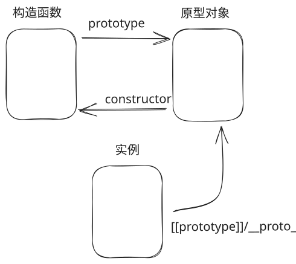
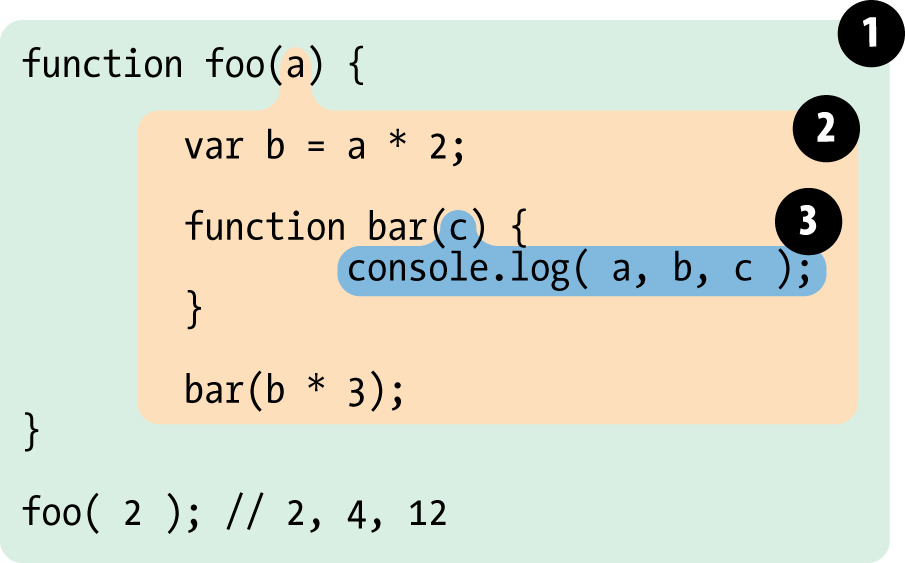
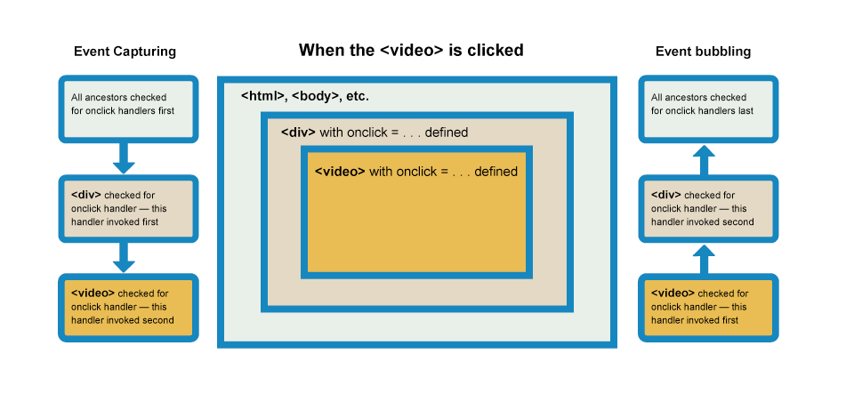
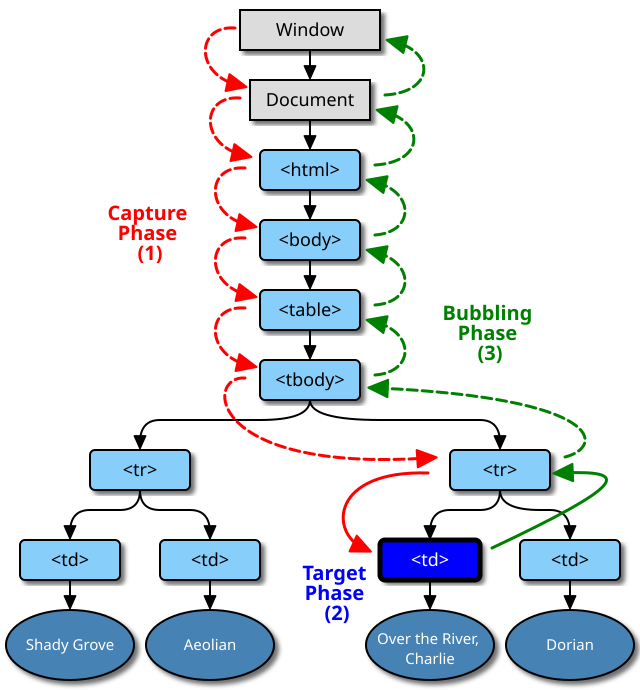
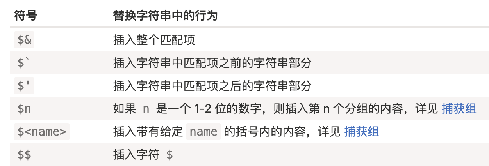
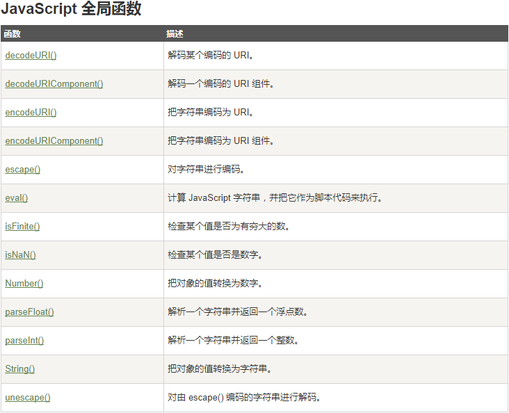

# 基本概念

1. JS 属于解释型语言，不用编译转换为其他语言(如C++需编译为汇编语言才能由计算机执行)。
2. **单线程**：同一时间只能做一件事，只能有一段代码被 JavaScript 引擎执行；

## 数据类型

参考: [你真的掌握变量和类型了吗](https://juejin.im/post/6844903854882947080)  数据存储、栈、堆

**栈中存放基本数据类型，堆中存放引用类型**

1. 基本数据类型：Number、String、Boolean、Null、Undefined、Symbol 值保存在**栈中**；
   - 变量存放的是数据本身，值是不可变的
   - 在内存中占据固定的8字节大小
   - 按值访问；
2. 引用类型：Object、Array、Function 等值保存在**堆中**(对象、数组的大小是动态的)，变量存放的是数据的引用(地址)，按引用访问；
3. 栈的速度快，但数据的大小和生命期是固定的；堆可以动态分配内存大小，速度慢；

## 赋值|深拷贝|浅拷贝

- 对于基本类型，赋值、浅拷贝、深拷贝和函数传参得到完全独立的新的变量；
- 对于引用类型，赋值(参数传递 & 返回值)相当于复制指针(引用)，新变量的内部数据与原数据完全相同；
- 浅拷贝，只会对第一层创建新的变量；

数组的 slice、from、concat 及解构运行符属于浅拷贝，`Object.assign` 也是浅拷贝。深度拷贝可以利用 `JSON.parse(JSON.stringify(obj))` 实现，但不能处理 undefine、函数、symbol 等在序列化时被忽略的值。

## 对象和数组字面量

使用对象和数组字面量创建时不会调用各自的构造函数

# 类型转换

> 参考:  [类型精度、类型转换](https://juejin.im/post/6844903854882947080#heading-23) 

基本数据类型之间的相互转换(参考JavaScript 权威指南 P49)

> 对象转换为基本数据类型

隐式类型转换的原则：

- 两个值进行数学运算及 `==` 比较时希望类型是 Number

- 两个操作数进行 `+` 运行时，若一个操作数是 String 则 `+` 进行字符串拼接，这时若另一个操作数是原始类型则转换为 String，若是引用类型则先尝试调用 `valueOf` 再尝试 `toString`。


valueOf & toString() 分别在什么情况下使用？

1. 希望对象转换为数字( Number(obj) )时：

   - 若对象有 valueOf，并且 valueOf 返回一个**原始值**(Number、String、Boolean、Null、undefined)，则调用valueOf，并在需要时将 valueOf 返回的原始值转换为 Number 类型；


   - 否则调用 toString ，若 toString 返回的不是原始值则抛出错误，否则返回 toString 的值，并在需要时将 toString 的返回值转换为 Number 类型。


2. 希望对象转换为 String(obj) 时：
   - 与上面完全类似，只是先检测 toString ，若不满足再检测 valueOf。

3. 特殊情况

   - 加法运算符(不是一元 `+` 运算符)、==、!=、关系运算符 (>、<等)这四类运算符作用于非日期对象时使用第一条规则，但是不会对 valueOf 或 toString 的返回值进一步转换。


   - 加法、==、!=运算符作用于日期对象时，都将 Date 转换为 String 类型，并返回 string 。


```javascript
let date = new Date();
print(typeof (date + 0));	// string
date == String(date);     // true

let obj = {
 valueOf() {
   print('call valueOf\n');
   return '100';
 },
 toString() {
   print('call toString\n');
   return 200;
   }
}
obj + 1;
obj + 'str'
```

> String & Number 的关系

1：数字与字符串作加法时，将数字转换为字符串；

2：其他运算符(==、比较运算符)，将字符串转换为数字；

```js
{} == ''
// 调 ({}).valueOf() 返回的是自身，一个对象
// 再调 toString()，返回 '[object Object]'
// 两个字符串做比较，结果为 false
// 如果右侧是数字，再将[object Object] 转换为数字 NaN，再做比较

'1' == 1;  // true
```

> Boolean、String、Number 包装对象

```js
var x = new Boolean(false); // x 是一个对象
if(x){
   console.log(true);  // true
}
```


以下数据在转换为 Boolean 类型时为 false

- 0 -0 +0 null defined NaN
- [] 和 {} 转换为 true

```js
undefined == null; // undefined === null 为 false
NaN == NaN;		   // false , JS 中唯一的一个
```
# 数组

本质是对象，数字索引在内部被转换为字符串，因为 JS 对象的属性名只能是字符串。

使用 [] 字面量创建数组比使用 new 效率更高。


## forEach 和 map 的区别

1. `forEach` 执行后返回 `undefined`，不会修改原数组，不能提前终止和跳出循环；
2. `map` 执行后返回新的数组，不会修改原数组，不能提前终止和跳出循环；
3. `for in ` & `for of` 可以提前终止(break、continue)循环；


# [对象](https://developer.mozilla.org/zh-CN/docs/Web/JavaScript/Reference/Global_Objects/Object) 

1. 如何创建对象
2. 对象的原型
3. 对象的属性

> 如何创建对象

1. 字面量
2. 构造函数
3. `Object.create(proto)`

> 对象的原型

如何读、写一个对象的原型？如何判断对象的原型？

访问对象的原型：

&nbsp;      (1)  `obj.__pro__`
&nbsp;      (2)  `Object.getPrototypeof(obj)`
&nbsp;      (3)  `obj.constructor.prototype`

修改对象的原型：

&nbsp;     `Object.setPrototypeof`

判断对象的原型：

&nbsp;     (1)  `obj.isPrototypeof`
&nbsp;     (2)  `instanceof`

## 对象的属性

对象只能用 String、Symbol 类型作为键，Map 的键可以是任何类型。

对象的某个属性只能是【数据属性】或【访问器属性】中的一种；

- 数据属性，属性描述符有：

  - value
  - writable：        属性是否可写只需要看 `writable` 配置
  - enumerable
  - configurable：值为 false 时属性不能被重新定义（definProperty），不能被删除，【只能将属性由不可写改为可写】

- 访问器属性，属性描述符有：

  - get
  - set
  -  enumerable
  - configurable

可配置但不可写的属性的值不能使用赋值语句修改，但可以使用 `Object.defineProperty` 修改。

不可配置但可写的属性的值可以被赋值语句修改。

- 获取属性的描述符

  - `Object.getOwnPropertyDescriptor(obj, prop)`

  - `Object.getOwnPropertyDescriptors(obj)`

- 设置属性的描述符

  - `Object.defineProperty(obj, prop, descriptor)`

  - `Object.defineProperties(obj, props)` 


## in 运算符

有两种方式使用 `in` 运算符

- `prop in obj`，判断对象能否访问某个属性（对象本身或对象的原型链上，包括【不可枚举】属性）；
- `for prop in boj` 返回所有能够通过对象访问的【可枚举】属性。

> for...in

- 遍历可枚举的字符串属性，不包括 Symbol 类型的 key
- 无序、含继承属性、可枚举、有值(含undefined null)、可终止循环；
- in 运算符判断属性是否在对象或对象的原型链上，可以判断**不可枚举 & valueOf 等原生属性**，不含空值；


<p style="color:red;font-weight:bold">遍历顺序</p>

- ES6 之前规范没有明确规定
- ES6 之后 Object.keys 输出键值的顺序按以下规则：先遍历自身属性，再遍历原型对象上的属性
  - 先按升序遍历自身属性中 key 为自然数的属性
  - 然后按加入顺序遍历非数字并且类型为 String 的属性
  - 浮点数、负数、NaN或者Infinity 按 String 类型处理
  - 自身属性遍历完后再依次遍历原型对象上的属性

```javascript
const obj = {
  3: 'val-3',
  b: 'val-b',
};
obj.__proto__[2] = '2';
obj.__proto__['a'] = '2';

obj.c = 'val-c';
obj[1] = 'val-1';
obj[Symbol('aa')] = 'symbol';

let keys1 = [], keys2 = [];
for (let k in obj) {
  keys1.push(k);
}
keys2 = Object.keys(obj);
// keys1:  ['1', '3', 'b', 'c', '2', 'a']
// keys2:  ['1', '3', 'b', 'c']
```

参考: [对象属性的顺序](https://stackoverflow.com/questions/5525795/does-javascript-guarantee-object-property-order/38218582#38218582)

## 几种遍历的区别

- for...in 遍历自有及原型链上的可枚举属性，是唯一一个可以遍历**原型链**上的属性，不需要对象实现 Iterable 接口；
- `Object.getOwnPropertyNames(obj)`  & `obj.hasOwnProperty`是唯一一个可以遍历**不可枚举**属性；
- for...of 调用的是 Iterable 接口，遍历**自有可枚举**属性，唯一可遍历**无值**的方法；

```js
Object.prototype.objCustom = function () {};
Array.prototype.arrCustom = function () {};

const iterable = [3, 5, 7];
iterable.foo = "hello";

for (const i in iterable) {
  console.log(i);
}
// "0", "1", "2", "foo", "arrCustom", "objCustom"

for (const i in iterable) {
  if (Object.hasOwn(iterable, i)) {
    console.log(i);
  }
}
// "0" "1" "2" "foo"

for (const i of iterable) {
  console.log(i);
}
// 3 5 7
```

其余的 Array.map、forEach、Object.keys、Object.values()都是遍历自身、可枚举、有值的属性；
- map & forEach 都不能使用`break 、continue`；
- `map` 返回新的数组，forEach 返回 undefined；


## API

**原型相关：** 

- `Object.getPrototypeOf(obj)` 
- `Object.setPrototypeOf(obj, protoObj)`
- `Object.prototype.isPrototypeOf(obj)` 

**属性相关：** 

- `Object.keys(obj)`：自身**可枚举**属性，返回字符串数组，由对象自身可枚举属性组成，并且只包含类型是字符串的属性。Object.keys 返回的属性顺序与 `for in` 遍历的顺序一致。
- `Object.getOwnPropertyNames(obj)`:  返回包括**不可枚举**在内的自有属性
- `Object.getOwnPropertySymbols(obj)` 
- `Object.getOwnPropertyDescriptor(obj,prop)`：返回`obj.proto`属性描述符对象
- `Object.getOwnPropertyDescriptors(obj)`：返回`obj` 的所有自身属性(包括 Symbol )的描述符对象
- `Object.defineProperty(obj,prop, descriptor)` 
- `Object.defineProperties(obj,props)` 
- `Object.prototype.hasOwnProperty(prop)`：

**冻结对象**

- 使对象不可扩展
&nbsp;       `Object.preventExtension`

- 使对象不可扩展，并且已有属性不可配置，原型不能修改
&nbsp;       `Object.seal`

- 冻结对象，使它不可扩展，并且已有属性不可配置，属性值不能修改，原型不能修改
&nbsp;       `Object.freeze`

<br />

Object.create、assign、defineProperty、defineProperties、getOwnPropertyDescriptor、getOwnPropertyDescriptors

- create 与 defineProperties 的第二个参数是相同类型，都是一个【属性描述符对象】。使用 create、defineProperty、definePropteries 方法定义对象的属性时，value、configurable、enumerable、writable 默认值分别是 undefined、false、false、false，而使用属性访问(点运算符 `obj.prop`)定义的属性的 configurable、writable、enumerable 默认值是 true；

- assign 浅拷贝源对象的属性时，只能拷贝源对象的可枚举的自身属性，同时拷贝时无法拷贝属性的特性们(configurable、writable、enumerable 的值被忽略，被全设为 true)，而且访问器属性会被转换成数据属性；

- configurable 为 false 时，属性的 `configurable、enumerable、getter、setter` 不能被修改，唯一能修改的是将 `writable` 从 true 改为 false；属性的值是否能被修改只需要看 `writable` 属性。

- 无值：没有值与值为 undefined 不同 

```js
var arr = new Array(3);
arr[0] = undefined;
// 第一项有值，其余项没有值
```

## 拷贝

> 浅拷贝对象

Object.assign() 方法只能拷贝源对象的可枚举的自身属性，同时拷贝时无法拷贝属性的特性们，而且访问器属性会被转换成数据属性，也无法拷贝源对象的原型，该方法配合 Object.create() 方法可以实现上面说的这些。

```js
Object.create(
  Object.getPrototypeOf(obj),
  Object.getOwnPropertyDescriptors(obj)
)；
```

参考：[getOwnPropertyDescriptors]( https://developer.mozilla.org/zh-CN/docs/Web/JavaScript/Reference/Global_Objects/Object/getOwnPropertyDescriptors) 

> 深拷贝

1)  `JSON.stringify + JSON.parse` :  `undefined`、symbol、函数

[深拷贝实现](https://juejin.im/post/6844903929705136141) 

```js
export function deepClone(srcData, hash = new WeakMap()) {
  // 基本数据类型 | 函数
  if (srcData === null || typeof srcData !== 'object') {
    return srcData;
  }
  if (srcData instanceof Date) return new Date(srcData);
  if (srcData instanceof RegExp) return new RegExp(srcData);

  if (hash.get(srcData)) {
    return hash.get(srcData);
  }

  // 引用类型: 包括数组
  let newData = new srcData.constructor();
  hash.set(srcData, newData);

  let keys = [...Object.keys(srcData), ...Object.getOwnPropertySymbols(srcData)];
  keys.forEach((k) => {
    newData[k] = deepClone(srcData[k], hash);
  });
  return newData;
}
```

# this

**结论**

this的绑定规则有4条，优先级从高到低依次是：

1. new
2. 显式绑定
   - bind、call、apply
3. 隐式绑定
   - 对象的方法调用
4. 默认规则
   - 严格模式下绑定到 undefined，否则绑定到全局对象

注意：

- 如果把 null 或 undefined 作为参数传递给 call、apply、bind，在函数执行时应用的是默认绑定规则

> 定义：**运行时**函数的执行环境；

函数中的`this` 在函数调用时被绑定，完全由函数的调用位置决定

JS 中一切皆对象，运行环境也是对象，函数、对象方法都是运行在某个环境中(this)；

this 指向代码运行时所在的对象，非箭头函数的 this 由运行时(**调用时**)决定。箭头函数的 this 与运行时它的外层函数的 this 一致。


> 函数调用的形式

1. 普通形式：fn(12)
2. 箭头函数调用
3. 对象方法 & 数组元素：
```js
// 以对象的方法调用
obj.fn(12)

function fn(){
 console.log(this.val);
}
let arr = [fn];
arr.val = 100;
arr[0]();  // 100; 数组也是对象
```

4. 构造函数：new fn(12)
调用构造函数会自动创建一个新的实例对象，通过this获取该实例，构造只是用于初始化该对象；构造函数的prototype属性作为实例对象的原型；

5. bind apply call：fn.apply(proto, 12)
6. 回调函数，自动调用：

```js
arr.map( function(item){
 // 回调函数是非箭头函数时, 回调函数的this指向全局对象
 // 回调函数是箭头函数时，this 与外层函数的 this 一致
})
```


同一个函数可以在不同的环境中执行，而且函数内部可以访问当前环境的其他变量，因此需要能引用当前的执行环境。

箭头函数中this由词法作用域决定，this 被设置为包含该箭头函数的执行上下文的this（运行时的父级上下文），**且不受调用方式影响**。
<p style="color:red">无法通过 call、apply、bind 修改箭头函数的 this</p>


```js
var globalObject = this;
var foo = () => this;
console.log(foo() === globalObject);    // true

var obj = {foo: foo};
console.log(obj.foo() === globalObject); // true

console.log(foo.call(obj) === globalObject); // true

foo = foo.bind(obj);
console.log(foo() === globalObject); // true
```


函数(方法)中的 this 指向调用该函数(方法)的对象，ES5在非严格模式下的函数调用中，this 指向全局对象(函数作为全局对象的属性，调用函数类似调用全局对象的方法)，严格模式下指向 `undefined`。strict模式下，this指向全局对象会报错，所以strict模式下禁止将对象中使用了this的方法导出至全局环境中。

> 参考

[JS 中的 this 的原理-阮一峰](https://www.ruanyifeng.com/blog/2018/06/javascript-this.html)


# bind apply

`fn.bind(obj)` 之后 fn 的执行上下文就无法更改；

```js
// 即使是执行 fn.bind(obj2) 或 fn.call(obj2) 或者以对象的方法调用
fn.bind(obj);
let obj3 = {
  print: fn
}
obj3.print();  // print 的执行上下文依然是 obj
```


## fn.apply

指定函数 fn 的 this 对象，并且将参数的传递方式改为数组(即参数为数组)

> 应用

1. apply 修改参数的传递方式

```js
Math.max(1,2,3);    // 3
Math.max( [1,23] )  // NaN

// 目的: 以数组的形式传参
let max = function(arr){
  return Math.max.apply(Math, arr);
}
max([1,2,3]);
```

2. 类数组使用数组方法


> 手写实现

```javascript
function.prototype.myBind = function bind(ctx) {
  let preArg = [].slice.call(arguments, 1);
  let self = this;
  let binded = function () {
    let arg = [].slice.call(arguments);
    arg = preArg.concat(arg);
    preArg = null;
    self.apply(new.target ? this : ctx, arg);
  }
  if (self.prototype) {
    binded.prototype = Object.create(self.prototype);
  }
  return binded;
}
```


# 原型



每个对象都有一个属性（`__proto__` 或 `[[Prototype]]`）指向它的原型，同一个构造函数实例化出来的对象都指向同一个原型，原型又有自己的原型对象，依次直到 `Object.prototype`

- 只要创建一个函数 fn，fn 会自动创建一个 `prototype` 属性，该属性指向一个具有 `constructor` 属性的对象，`constructor` 属性指向 fn。
- 每个函数都有一个 `prototype` 属性，该属性是指针，指向一个对象，这个对象的用途是包含由这个函数实例化的所有实例**共享**的属性和方法。这个对象是通过调用构造函数而创建的对象实例的原型对象。

- 每个对象都有一个【原型对象】，这个原型对象本身也是一个对象，它包含了可被当前对象继承的属性和方法。
  - 当你尝试访问一个对象的属性或方法时，如果该对象本身没有这个属性或方法，JavaScript引擎会沿着原型链向上查找，直到找到该属性或方法或者到达原型链的末端。
  - 原型链的末端是 `Object.prototype` 对象，它是所有对象的最终原型，其原型为 `null`

- 原型链的建立基于构造函数的 `prototype` 属性和对象的 `__proto__` 隐藏属性（非标准但被广泛支持）。
  - 构造函数的 `prototype` 属性指向一个对象，这个对象将成为由该构造函数创建的所有对象的原型。而每个实例对象的 __proto__ 属性则指向其构造函数的 `prototype` 对象。
  - 通过这种方式，当一个对象被创建时，它不仅拥有自己的属性，还间接拥有原型对象上的属性和方法，形成了一个层次结构的属性查找路径。


> 自定义类型的最佳实践

```js
function Person(name, age) {
  // 属性定义在构造函数中
  this.name = name;
  this.age = age;
}
// 方法定义在原型中
Person.prototype = {
  constructor: Person,
  getName: function() {
    return this.name;
  }
}
```


## 动态原型

JS中原型上的方法可以访问该原型的实例的上下文，即访问实例的数据或方法；

```js
Vue.prototype.$reverseText = function (propertyName) {
  this[propertyName] = this[propertyName]
    .split('')
    .reverse()
    .join('')
}

new Vue({
  data: {
    message: 'Hello'
  },
  created: function () {
    console.log(this.message) // => "Hello"
    this.$reverseText('message')
    console.log(this.message) // => "olleH"
  }
})
```

# 继承

继承的实现方式有：

- 原型链继承
- 借用构造函数继承
- 组合式继承
- 寄生式继承
- 寄生组合式继承

> API

原型相关
```js
// 原型链, 可以是原型的原型
obj.isPrototypeOf()
Object.getPrototypeOf()
Object.setPrototypeOf()
//obj instanceof 构造函数
```


访问对象的原型

1: `__proto__`
2: Object.setPrototypeOf、Object.getPrototypeOf
3: 通过构造函数 obj.constructor.prototype

> 最佳实现: 组合寄生式继承

1. 子类的构造函数中通过 call、apply 调用父类的构造函数
2. 通过 Object.create 创建一个继承了父类的 prototype 的对象，并赋值给子类的 prototype

```js
function Sup(name) {
  this.name = name;
}

function Sub(name, age) {
  Sup.call(this, name);
  this.age = age;
}
// 避免调用两次Sup
Sub.prototype = Object.create(Sup.prototype);
Sub.constructor = Sub;
```

如果不能用 `Object.create` 
```js
function create(proto) {    
  function F(){}    
  F.prototype = proto;
  return new F();
}
Child.prototype = create(Parent.prototype);
```

> 参考

[双重继承](https://mp.weixin.qq.com/s?__biz=MjM5NTEwMTAwNg==&mid=2650215832&idx=1&sn=7e48c9ef8bf7c4ccaa246907eb6579f5&chksm=befe15b989899caf8612620992acdb67783396f1b2bf981fae71cf761fac43c16b4b60457975&scene=0&key=06b6f34db6d09e01cbeea01642f35f6916e02c7d3cc0c4d1b777d666c2d8d94cacb1516bc3b5a608a6713416a69e553d88c1feba945dc494447e016071b279de4675b2ca438636285d10a796bdf5b3b2&ascene=1&uin=Mjc2NDI1NDU2NA%3D%3D&devicetype=Windows+7&version=62060739&lang=zh_CN&pass_ticket=ltTFzXuqdXnUtMsLWgFnt%2B8zWUV2F%2B3hSDDtrPIUYwtCjZ5qZr5AlYFajnxJ9w5P) 

[继承与原型链-MDN](https://developer.mozilla.org/zh-CN/docs/Web/JavaScript/Inheritance_and_the_prototype_chain) 

# 作用域

在 JavaScript 中，【执行上下文】和【作用域】是两个重要的概念，它们有以下区别和联系： 

**执行上下文**：
- 定义：执行上下文是 JavaScript 代码执行时的环境，它包含了变量、函数声明等信息。 
- 类型：主要有全局执行上下文、函数执行上下文、Eval 执行上下文。 
- 创建时机：在代码执行前被创建。 

**作用域**： 
- 定义：作用域决定了变量和函数的可见性和可访问性。 
- 类型：主要有全局作用域和函数作用域。 
- 关联：执行上下文与作用域相关联，执行上下文中的变量和函数声明会受到作用域的限制。

**Scope**：当前执行上下文，包含当前所有可见的变量，Scope在我们写代码的时候就被定义好了，比如谁嵌套在谁里面。

作用域为可访问变量，函数的集合。

当函数被调用，一个 execution context 被创建，这个执行上下文包涵信息：函数在哪调用（call-stack），函数怎么调用的，参数等等；执行上下文的一个属性就是this，指向函数执行期间的this对象。



- 泡泡1是全局作用域，有标识符foo；
- 泡泡2是作用域foo，有标识符a,bar,b；
- 泡泡3是作用域bar，仅有标识符c。


每次调用函数都会创建新的执行上下文，具体分解为两步：

1. creation stage(调用函数时，但在执行函数内部代码之前)
   - 创建scope chain(**作用域链**)，包含至少一个 VO：[vo1, v02, ...]
   - 创建变量对象：形参、arguments、函数体中声明的变量和函数，此时变量的值为 undefined ；当变量和函数使用相同的标识符声明时，函数的优先级更高；
   - 确定 **this**
2. activation\code execution stage
   - 分配值，引用函数和解释/执行代码；

将执行上下文表述为对象，其属性分别为：作用域链 变量 this；

> 作用域链

作用域链的作用是保证对执行环境有权访问的所有变量和函数的有序访问，通过作用域链，我们可以访问到外层环境的变量和函数。

作用域链的本质上是一个指向【变量对象】的指针列表。变量对象是一个包含了执行环境中所有变量和函数的对象。作用域链的前端始终都是当前执行上下文的变量对象。全局执行上下文的变量对象（也就是全局对象）始终是作用域链的最后一个对象。

当我们查找一个变量时，如果当前执行环境中没有找到，我们可以沿着作用域链向后查找。

作用域链的创建过程跟执行上下文的建立有关....

## 参考

- [执行上下文-重点-英文](http://davidshariff.com/blog/what-is-the-execution-context-in-javascript/)
- [作用域链-重点-英文](http://davidshariff.com/blog/javascript-scope-chain-and-closures/)
- [执行上下文-segementFault](https://mp.weixin.qq.com/s?__biz=MjM5NTEwMTAwNg==&mid=2650215808&idx=1&sn=8c882586a033f58a56498c02f5b88792&chksm=befe15a189899cb7c66ab13e987130c3aa72d5888e5da6676b9aa37a664012cb9e5bcc02ac7f&scene=0&key=aed6be2b7ed28ff5f6586ea4cb6bdcf73f5d9f7317d7c6ca48d223d2c2cbe07e5ee4cfed2395e25889e258ccbc81272f38ba2c899370291e19cd8aff41009769922c6d9df34c30b99f745bbd3e4ce914&ascene=1&uin=Mjc2NDI1NDU2NA%3D%3D&devicetype=Windows+7&version=62060720&lang=zh_CN&pass_ticket=Pn9cJyIWK2xt%2BmQltkMddf4S5oGoplFdiJ%2B16Yj6gD8L9Zd0WMlQ1u32%2FRJtZE1p)
- [变量对象-掘金](https://juejin.im/post/58ec3cc944d90400576a2cdc)


# [闭包](https://developer.mozilla.org/zh-CN/docs/Web/JavaScript/Closures) 

**结论：**当函数可以记住并访问所在的词法作用域，即使函数是在当前作用域之外执行，这时就产生了闭包。

词法作用域：变量的作用域，即变量能被访问的区域；每个函数都有一个与之关联的作用域链，**函数定义时创建作用域链**，调用函数时创建一个新的对象用来保存当前函数作用域；内嵌函数的作用域上至少有3个作用域对象(内嵌函数作用域、外部函数作用域、全局作用域)；

- 函数对象的内部状态除了包含函数的代码，还必须引用当前作用域链；
- JavaScript 允许函数嵌套，并且内部函数可以访问定义在外部函数中的所有变量和函数，以及外部函数能访问的所有变量和函数。但是，外部函数却不能够访问定义在内部函数中的变量和函数(函数作用域 & 局部作用域)。这给内部函数的变量提供了一定的安全性。此外，由于内部函数可以访问外部函数的作用域，因此当内部函数生存周期大于外部函数时，外部函数中定义的变量和函数的生存周期比内部函数执行时间长。当内部函数以某一种方式被任何一个外部函数作用域访问时，一个闭包就产生了；

- **JS 每次执行一个函数**，都会创建一个新的**作用域对象**(scope object)，用来保存在该函数中创建的局部变量；通常在函数返回时，垃圾回收器会在这时回收这个作用域对象；如果这个函数返回的函数或对象方法却保留一个指向这个作用域对象的引用，因此这个作用域对象不会被回收；

```javascript
function outside(x){
  var privateVar;     // 此处可以定义私有数据
  function inside(y){
   	return x+y;
	}
	return inside;
}
var fn_inside = outside(3); // fn_inside的功能是将实参加3
var result = fn_inside(2);  // 5
var result2 = outside(3)(2);// 5
```

- inside 被 return 后，传入 outside 的实参(当前是3)是如何保存的( outide 的形参 x 与在该函数内部定义的 privateVar 一样)。一个闭包必须保存它可见作用域中所有的参数、变量，因为每次调用 outside 传入的参数可能不同，每次调用 outside (外部函数 )实际上都重新创建了一遍这个闭包(**本质是内部函数被重新定义，关联了新的作用域链**)。只有当返回的inside 没有被引用时，内存才会被释放。上式的作用域链为：inside--->outside--->全局；

**注：**不能在内嵌函数中(特别是形参)定义与外部函数同名的变量，否则将无法访问定义在外部函数中的变量；参考：函数 MDN

- **测试**

```js
// 情况1
function fn(){
  var n = 0;
  function add(){
    n++;
    console.log(n);
  }
  return {
    n: n,
    add: add
  }
}
var r1 = fn();	var r2 = fn();	
r1.add();	r1.add();
console.log(r1.n);
r2.add();
// 输出：1 2 0 1, 第三个为什么不是 2


/* 情况2：如果 r1.n 是引用类型, 此时输出的值与前一个值相同 */
function fn(){
  let obj = {};
  obj.n = 0;
  function add(){
    obj.n++;
    console.log(obj.n);
  }
  return {
    n: obj,  // 不能用 n: obj.n, 必须是引用类型, 
    add: add // 因为函数返回是按值传递(复制), 如果返回的是基本数据类型, 
  }
}
var r1 = fn();	var r2 = fn();	
r1.add();	r1.add();
console.log(r1.obj.n);
r2.add();
// 输出 1 2 2 1
// 答: 这种情况与闭包无关, 是因为return 返回的是对象的引用(与赋值一样), 
// 所以当返回的是基本数据类型时, 返回的这个值与闭包中的值已经没有关联了;

// 情况3
function fn(){
  var n = 0;
  setTimeout( () => ++n );
  function add(){
    return n;
  }
  return {n: n, add: add  }
}
var r1 = fn();
setTimeout(()=>{
  console.log('1s 后 r1.n: ' + r1.n);    // 输出 0
  console.log('1s 后 闭包: ', r1.add());  // 输出 1
}, 1000);
```

- 定义一个函数时，会创建一个**作用域链**，包含了该函数可以访问的作用域对象(VO变量对象)， 作用域链以数组的形式赋值给该函数的 [[Scopes]] 属性，作用域链中至少包含一个全局作用域对象；例如当执行 fn() 时，会创建 add 函数，同时创建包含两个**作用域对象**的作用域链，([[Scopes]] 数组有两个元素，Scopes[0] 代表的是外层函数 fn 的作用域对象，该对象只有 obj 一个属性；Scopes[1] 代表全局作用域对象)；

- 调用函数 add 时，会为函数创建一个执行上下文，然后**复制** add 函数的 Scopes 属性值，构建当前执行环境的作用域链，再将当前 add 函数的作用域对象加入到所构建的作用域链的前端，组成 add 函数所能访问的全部作用域对象。 

参考：JS 高阶程序设计 P179、P181


- 测试2

```js
function sayHi(person) {
  const name = person.name;
  setTimeout(() => {
    console.log('Hello, ' + name); // 改为console.log(person.name)
  }, 3000);
}

let someone = {name: 'Dan'};
sayHi(someone);

someone = {name: 'Yuzhi'};  // someone.name = 'two'
sayHi(someone);

someone = {name: 'Dominic'}; //someone.name = 'three'
sayHi(someone);

// 输出是什么？
```

# 函数-函数式编程

## arguments

定义：函数调用时，传递给函数的实参的有序列表；

Q：arguments 与声明的形参是否同步

- 同步：非严格模式下没有使用默认参数、剩余参数、解构赋值；
- 其余情况都不会同步；

**严格模式**

- 函数内部开启严格模式，则该函数不能使用默认参数、剩余参数、解构赋值、arguments.caller;
- 使用函数表达式形式、或将 `use strict` 移至函数外可以解决上述问题；

## 柯里化

**作用**：将一个函数拆分为多个函数，将多参形式转为单参形式，预先设置函数的参数；
**形式**：函数的封装，一个函数返回另一个函数；

Thunk 函数

```js
var Thunk = function(fn) {
  return function (...args) {
    return function (callback) {
      return fn.call(this, ...args, callback);
    }
  };
};
```

# 事件

## 事件流（事件传播）

> 事件流

事件冒泡 & 事件捕获，用来描述从页面中接收事件的顺序。

- IE 的事件流是事件冒泡机制，即事件是由最具体的元素(触发事件的那个元素)接收事件，然后沿 DOM 树逐级向上传播直到 document 对象，在每一级节点上都会发生该事件；
- Netscape 是事件捕获机制，
- 事件流即执行事件处理程序有三个阶段：事件捕获、处于目标阶段( event.target )、事件冒泡阶段；

> 事件处理程序

描述：又称事件监听器
注册事件监听器的方法有3种：

1. 内联标签属性，监听器函数中的 this 执行全局对象 window；
```html
<input type="button" onclick="需要执行的JS代码 alert(event.type, 23)">
```

2. DOM 0 级事件处理程序：

事件处理程序在事件冒泡阶段执行
```javascript
btn = document.getElementById(btn'');
btn.onclick = function (event){
  // 需要执行的代码
  // this 指向当前元素, this === event.target
  // 返回false会阻止事件的默认行为
  // 一类事件只能有一个事件监听器，多个监听器以最后一个注册的有效； 
}
```

3. DOM2 级事件处理程序：

```javascript
btn = document.getElementById(btn'');
btn.addEventListener('click', function(event){
  // this 指向当前元素, this === event.target
});
```

一类事件可以注册多个事件监听器，按注册的顺序调用执行。

<b style="color:red">event.target</b> 指向用户交互（点击）的那个最具体的元素（DOM树中层级最深的元素，事件起源的那个元素），<b style="color:red">event.currentTarget</b> 指向事件处理程序绑定的那个元素。

三种方法的事件处理程序函数中的 <b style="color:red">this</b> 都指向绑定事件监听器的那个元素(`this === event.currentTarget`)，参考《JS高级程序设计-P356》。事件处理程序是在其依附的元素的作用域中运行。

当某种事件(如 click )通过三种方法注册了多个事件监听器时，他们的调用顺序为：

- 标签属性注册的事件监听器最先执行；
- DOM0 优先级高于 DOM2级的事件处理程序；

- 通过 addEventListener注册的完全相同的事件监听器按注册的顺序执行；
- `addEventListener(type, listener, options)`  options 选项
  [passive: 不会阻止默认事件](https://zh.javascript.info/default-browser-action#chu-li-cheng-xu-xuan-xiang-passive) 
> 清除事件监听器

通过 HTML 属性和 DOM0 级方式添加的事件监听器可以使用 `element.onclick = null;` 清除；
通过 `addEventListener` 添加的事件监听器使用 `removeEventListener` 清除；

移除元素上的所有监听器
1. `$0.parentNode.replaceChild($0.cloneNode(true), $0)`
2. `ele.outHtml = element.outHtml` (元素多时慢)


## 事件捕获与事件冒泡





当某类事件发生在一个元素上，现代浏览器运行两种方式：捕获和冒泡；
- 捕获以 `<html>` 元素沿 DOM 树到该元素为路径，从 `<html>` 检测该路径上的元素是否注册了某类事件处理程序，若是，则运行该程序，然后继续检测路径上的下一个元素；
- 冒泡：与捕获的不同之处在于，沿与捕获相反的方向开始检测，即从该元素开始到 html 元素；
- 如今，默认所有事件处理程序都在<b style="color:red">冒泡</b>阶段执行，若想在事件捕获阶段执行事件处理函数，可以用 `addEventListener(name, func, true)`，指定在该回调函数在事件捕获阶段执行。
- 实际的目标元素的监听器的执行阶段始终在第二阶段(处于目标)，DOM2 级事件规范明确要求捕获阶段不涉及事件目标；

**例子**

- div--->p--->button 表示 DOM 树，div 是 p 的父级，三个元素都用 addEventListener() 注册了 click 事件监听器，默认第三个参数为 false ，默认情况下三个元素的监听器的执行顺序为 ：button(第2阶段执行)、p(第3阶段执行)、div(第3阶段执行)；
- 当第三个参数都设为 true 时，监听器的执行顺序为：div(第1阶段执行)、p(第1阶段执行)、button(第2阶段执行)；
- 当div 和 button 使用 false注册事件监听，p使用 true 注册，点击button后执行的顺序为：p(事件捕获阶段)、button(处于目标阶段)、div(事件冒泡阶段)

**小结**

1. 一个事件被触发后(如点击页面上的一个元素，触发click类型的事件，这个元素称作目标元素)；
2. 首先进行事件捕获，以根元素html元素为起点，沿DOM树直到目标元素，检查路径上的元素是否注册了同一类型的事件，并且指定了该事件处理程序在事件捕获阶段执行，若是，则执行事件处理程序；
3. 处于目标阶段，执行目标元素的事件理程序；
4. 最后是事件冒泡阶段，以目标元素为起点，直到根元素，若路径上的元素注册了相同类型的事件处理程序，并且指定了事件处理程序在事件冒泡阶段执行，则执行该事件处理程序；
5. 若同一元素同一事件类型，在事件捕获和事件冒泡阶段都指定了事件处理函数，则这两个事件处理函数都会执行，即使该元素是目标元素也是，若是目标元素，则第三个参数无效，都是在第二阶段执行，按注册的顺序执行；
6. event.stopPropagation(); 阻止捕获 & 冒泡阶段事件的传播，捕获阶段事件从根元素向目标元素传递，冒泡阶段事件从目标元素向根元素传递；
7. event.preventDefault(); 取消默认事件；event.stopPropagation() 和 event.preventDefault()也可以在另外两种注册事件处理器的方法中使用；
8. 内联事件处理程序 & `btn.onclick = handle` 都是在事件**冒泡**阶段执行回调函数；

一句话：`addEventListener` 的第三个参数指定回调函数在事件的捕获或冒泡阶段执行。

### 事件委托

- 将监听器注册在父级元素上，监听来自子元素的事件，根据事件对象 event.target 来区分子元素；如 `<ul>` 及 `<li>`；
- event.preventDefault() 阻止默认事件；
  - Event.cancelable:  事件是否可以被取消，当 `cancelable` 为 `false` 时调用 `preventDefault` 无效。

## [自定义事件](https://developer.mozilla.org/en-US/docs/Web/Events/Creating_and_triggering_events) 

接口：postMessage  CustomEvent  initEvent

> 触发事件

如何手动触发事件：IE 中使用 fireEvent，标准浏览器中使用 dispatchEvent。

接口：EventTarget.dispatchEvent()

```javascript
let event = new MouseEvent("click", {
  bubbles: true,
  cancelable: true,
});
ele.dispatch(event);
```

`dispathcEvent` 派发的自定义事件只能用 `addEventListener` 监听，不能用 `on<event>` 

## 嵌套事件的执行顺序

通常事件的执行是异步的，在执行事件a时，发生了事件b，事件b会被添加到事件队列中；但是如果在一个事件是在另一个事件中发起时，该事件会立刻执行，然后恢复到之前的执行顺序

```html
<button id="menu">Menu (click me)</button>
<script>
  menu.onclick = function() {
    console.log(1);
    menu.dispatchEvent(new CustomEvent("menu-open", {
      bubbles: true
    }));
    console.log(2);
  };
  // triggers between 1 and 2
  document.addEventListener('menu-open', () => console.log('nested'));
</script>
// 输出: 1 → nested → 2.
```

[javascript-info-event](https://javascript.info/dispatch-events) 

<span style="color:red">更新</span>：不是因为【嵌套】，而是因为事件是以编程的方式触发的。

## 焦点管理

接口：
```javascript
document.hasFocus();
document.activeElement;
// focus  blur   focusin  focusout  事件
```

focus 和 blur 事件不冒泡，但是可以在捕获阶段监听到它们。focusin 、focusout 和 focus、blur 等价，但它们冒泡。

当焦点从元素A 移动到元素B 上时，依次触发下列事件：
（1）focusout 在元素A 上触发
（2）focusin 在元素B 上触发
（3）blur 在元素A 上触发
（4）focus 在元素B 上触发

## 鼠标事件

事件：click  dblcick  mousedown  mouseenter mouseleave mousemove mouseout mouseover contextmenu  wheel

mouseenter 和 mouseleave 是一对，没有触发 mouseenter 就不会触发 mouseleave
- mouseenter：光标从元素外部**首次**移动到元素范围内时触发，光标移动到后代元素上时不会在父元素上触发，不冒泡；
- mouseleave：光标从元素上方移动到元素范围外时触发，光标移动到后代元素上不会触发，不冒泡；

mouseover 和 mouseout 是一对，成对出现
- mouseover：鼠标移动到元素或元素的子元素上时触发，会冒泡；
- mouseout：光标位于一个元素A 上方，然后用户将光标移入另一个元素B 时触发，元素B 可能位于元素A 的外部，也可能是**元素A 的子元素**，会冒泡；

**区别：**

- 从父元素进入子元素，会在父元素上触发 mouseout，在子元素上触发 mouseover 和 mouseenter，并且 mouseover 会冒泡到父元素；
  触发顺序：父元素mouseout、子元素mouseover、冒泡到父元素的mouseover、子元素mouseenter

- 离开子元素回到父元素范围，会在子元素上触发 mouseout、mouseleave（mouseout 会冒泡到父元素），在父元素上触发 mouseover；
  触发顺序：子元素mouseout、冒泡到父元素的mouseout、子元素mouseleave、父元素mouseover

> 双击鼠标触发的事件顺序

（1）mousedown
（2）mouseup
（3）click
（4）mousedown
（5）mouseup
（6）click
（7）dblclick

> 鼠标位置

在视口中的位置
- event.clientY：相对于 viewport 左上角的垂直坐标

在页面上的位置
- event.pageY:  相对于页面左上角的垂直坐标

```javascript
pageX = clientX + document.documentElement.scrollLeft;
```

## 拖拽

拖拽事件有：dragstart、dragend、drag、dragenter、dragleave、dragover、drop

> 注意

使用 `mousemove` 实现拖拽移动时，要阻止 `dragstart` 默认事件。

> 三方库

- [sortable](https://sortablejs.github.io/Sortable/) https://github.com/SortableJS/Sortable
- [dragula](https://bevacqua.github.io/dragula/)

> 参考

[原生JS快速实现拖放实例效果与解析](https://mp.weixin.qq.com/s/4WLbV46MsDzlNWzzDep3Pw) 
[HTML 拖放 API-| MDN](https://developer.mozilla.org/zh-CN/docs/Web/API/HTML_Drag_and_Drop_API) 
[拖拽操作 - MDN](https://developer.mozilla.org/zh-CN/docs/Web/API/HTML_Drag_and_Drop_API/Drag_operations) 


# 正则表达式

## RegExp

> RegExp 对象的属性

- lastInd: 下一次检索的起始位置，RegExp.exec() & RegExp.test() 会用到；
- source: 正则表达式的字符串形式；
- global、ignoreCase、mutiline：Boolean 类型的值，表示是否有该修饰符；

- RegExp.test('abc')：Boolean 值，是否匹配；
- RegExp.exec('abc')：[完整匹配的子串, index: 0, input: 输入的字符串]，数组的第二项开始是括号捕获的字符串，如果有修饰符 g，则可以多次调用 exec()，每次调用是从 lastInd 开始搜索；

## String 方法

- `str.indexOf(substr, pos)`、`str.lastIndexOf(substr, pos)`、`str.search(reg)` 返回第一个匹配的索引
- String.search()，首次匹配的索引，未匹配则返回 -1；
- String.match()
  1. 没有 g 修饰时，返回的结果与 RegExp.exec()相同
  2. 有 g 修饰时，返回数组，数组项包含全部匹配的子字符串；
- String.replace()
- String.split()

> 创建正则表达式的两种方式: 字面量和构造函数的区别

- 字面量形式的表达式在脚本加载后编译，正则表达式是常量是用字面量更合适；

- 构造函数形式的表达式在脚本运行时编译，构造函数用于创建动态的正则表达式；

- 反斜杠(\\)在字符串中有特殊含义，表示其后的字符作为普通字符处理（the backslash is an escape in string literals）。`/a\*b/` 和 `RegExp("a\\*b")` 等价。

  ```js
  // 字符串的特殊字符前加入反斜杠
  function escapeRegExp(string) {
    return string.replace(/[.*+?^${}()|[\]\\]/g, '\\$&'); // $& means the whole matched string
  }
  ```

- 匹配文件后缀

```js
/\.(png|jpg|gif)$/i
```

> [字符串表达式和字符串方法](https://zh.javascript.info/regexp-methods) 

 


## 参考

[正则表达式-code花园](https://mp.weixin.qq.com/s/S27FTJyKoVJoY7tcEgLo8Q) 


# JS 小技巧

## 速获取毫秒数

```js
const now = + new Date();   // +运算符将string类型转换为Number类型
```

## 小数取整 && 强转 boolean

```js
~~2.8    // 2
!!0      // false
```

## 逻辑运算 & 短路规则

```js
let result = (0 || {age:12});  // result: {age:12}
let result = (1 && {age:12});    // {age:12}
// true && expression 总是会返回 expression, 而 false && expression 总是会返回 false。
// && 运算符返回第一个 false 的值，当所有操作数都是 true 时，返回最后一个表达式的值；
// || 运算符返回第一个 true 的值，当所有操作数都返回 false 时，返回最后一个表达式的值；
```

## 判断变量是否定义

```js
(typeof x) === 'undefined';
var y;
typeof y === 'undefined'  // true, 不能区分定义了未初始化的变量
```

## 判断数据类型

- typeof：不能区分数组和对象，可以区分 function；

- constructor：不能检测 Null 和 undefined，若类的原型被重写则检测不准确；

- Object.prototype.toString.call(变量).slice(8, -1)；最准确最常用的方式；但是不能判断自定义类实例。

```js
/*
  方法1：
	使用箭头函数返回函数, 灵活；
	闭包；
	字符串模板；
*/
const isType = type => {
    // type 作为闭包
    return target => Object.prototype.toString.call(target) === `[object ${type}]`;
}
let isArray = isType('Array');
let arr = [1,2];
isArray(arr);
```

## 解构

数组对象的解构

```js
let arr = ['czl', 22];
let {0: name, 1: age} = arr;
// name = 'czl', age = 22
```

# 垃圾回收和内存泄漏

https://juejin.im/post/6844903833387155464 


# JS 全局函数

