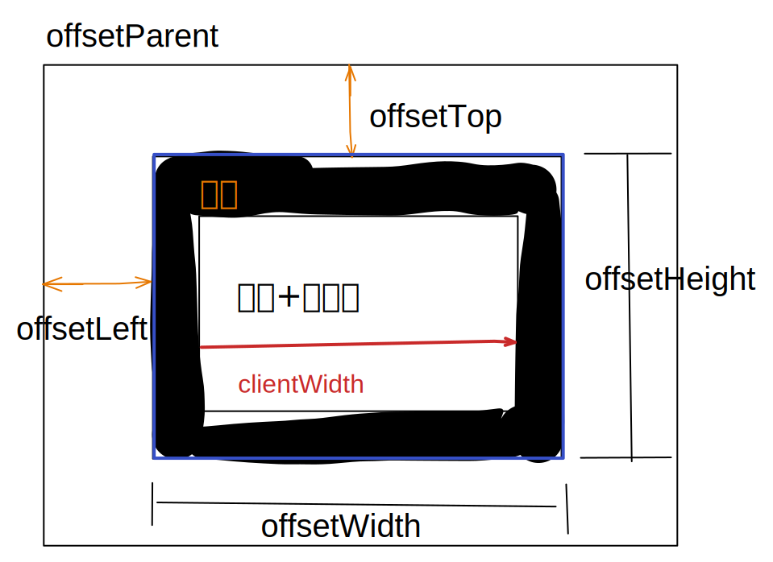
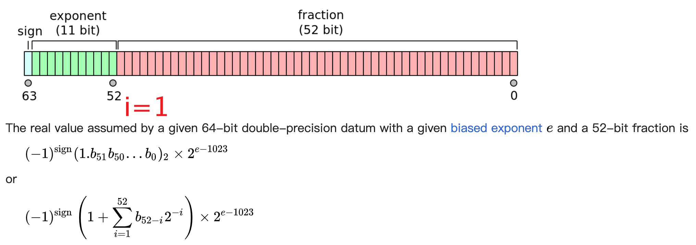

# 页面生命周期

- window.onload
- window.onunload
- window.onbeforeunload
- document.addEventListener("DOMContentLoaded", fn);  DOMContentLoaded 只能用addEventListener监听

- document.addEventListener('readystatechange', fn);
  - 对应 document.readyState 属性，取值：loading | interactive | complete
  - Loading: html 加载中
  - interactive: html加载完成, dom 解析完成，可以操作dom，但是js、图像等资源还在加载，触发 DOMContentLoaded 事件
  - complete: 资源完全加载，触发 window.onload

参考 [javascript.info](https://zh.javascript.info/onload-ondomcontentloaded) 

# viewport | 视口

缩放改变的是 `window.devicePixelRatio` 


- 布局视口：渲染后页面的实际大小，包含滚动情况下溢出的区域，页面缩放时（调整缩放级别）大小不变。

- 可见视口：页面可见的部分，缩放时尺寸不变的部分（地址栏、书签栏）都不算可见视口的区域。
  - 可见视口大小与窗口大小和缩放级别有关
  - 如何读写？

```js
let pageWidth = window.innerWidth;
let pageHeight = window.innerHeight;
if (typeof pageWidth !== 'number') {
  if (document.compatMode === 'CSS1Compat') {
    pageWidth = document.documentElement.clientWidth;
    pageHeight = document.documentElement.clientHeight;
  } else {
    // 混杂模式
    pageWidth = document.body.clientWidth;
    pageHeight = document.body.clientHeight;
  }
}
```

- `window.screen.availHeight\Width\Left\Top`
- 网页缩放时布局视口、可见视口的变化？
- https://zh.javascript.info/popup-windows#yi-dong-he-tiao-zheng-da-xiao

> 旧文档

- 布局视窗可以通过 `<meta>` 标签设置 viewport 来修改。每个浏览器默认都会有一个设置，例如iOS，Android这些机型设置布局视窗宽度为980px，所以PC上的网页基本能在手机上呈现，只不过元素看上去很小，一般可以通过手指动双击缩放网页。

- 控制放大和缩小的就是视窗Viewport
- window.screen.width：获取屏幕的宽度，等于系统设置里面的屏幕分辨率，和页面没有关系（包括resize 、缩放）

- 什么是 viewport 视口
  - 可视区域，不包含滚动之外的内容
  - 视口 === 布局视口 === document.documentElement.clientWidth
  - layout viewport | visual viewport (布局视口)
  - https://developer.mozilla.org/en-US/docs/Glossary/Viewport 

- `window.innerWidth`: visual viewport 的宽度。页面缩放会影响该值，放大时值变小。
- `window.outerWidth`: 整个浏览器窗口的尺寸，包含从标签页顶部的尺寸

- 获取文档尺寸
```js
const scrollHeight = Math.max(
  document.body.scrollHeight, document.documentElement.scrollHeight,
  document.body.offsetHeight, document.documentElement.offsetHeight,
  document.body.clientHeight, document.documentElement.clientHeight
);
```

- 获取浏览器视口大小
```javascript
function getViewportSize() {
  // 混杂模式
  if (document.compatMode === 'BackCompat') {
    return {
      width: document.body.clientWidth,
      height: document.body.clientHeight,
    };
  }
  return {
    width: document.documentElement.clientWidth,
    height: document.documentElement.clientHeight,
  }
}
```

# DOM操作

## 元素尺寸

> clientHeight  offsetHeight   scrollHeight

clientWidth、offsetWidth、scrollWidth 都是只读属性，而且每次访问这些属性时都会重新计算。

 

- `clientHeight` 内容区域加内边距，不包含滚动条和 border，可用于内容的文档的可见部分的 width/heigh，`inline` 元素获取的 clientWidth 和 clientHeight 为 0 ；
- `offsetWidth` 包含边框和滚动条的宽度，不包含伪元素 (::before、::after)
- `scrollHeight` 包含滚动隐藏尺寸，包含伪元素，如果元素没有溢出，该值等于 clientHeight

> getBoundingClientRect

**计算元素相对于视口的位置** 

 

- viewport 内(以可视区域的左上角为坐标原点)，盒模型左上角和右小脚的坐标（x, y）
- ie 不支持 element.getBoundingClientRect().x

```javascript
const rect = ele.getBoundingClientRect();
rect.right - rect.left === rect.width === ele.offsetWidth; // 三者相等
```

https://developer.mozilla.org/en-US/docs/Web/API/Element/getBoundingClientRect 
[确定元素的尺寸-MDN](https://developer.mozilla.org/en-US/docs/Web/API/CSS_Object_Model/Determining_the_dimensions_of_elements) 

- getBoundingClientRect 无法使用时计算 `element.left` 和 `element.top`
```javascript
// 相对于 viewport 的偏移
function getElementLeft(ele, left = 0, top = 0) {
  if (!ele) return { left, top };
  const { offsetLeft, offsetTop } = ele;
  return getElementLeft(ele.offsetParent, left + offsetLeft, top + offsetTop)
}
```

## 元素位置

- Element.clientTop/Element.clientLeft:  左/上边框的宽度，包含滚动条宽度，不含 margin、padding。
- Element.offsetTop:  元素的边框相对于最近的定位祖先元素的边框的距离
- Element.scrollTop:  元素内容区域滚动的距离

## 监听元素变化

- 监听DOM元素变化: [MutationObserver](https://developer.mozilla.org/en-US/docs/Web/API/MutationObserver/observe) https://zh.javascript.info/mutation-observer
- 监听DOM元素尺寸变化: [ResizeObserver](https://developer.mozilla.org/en-US/docs/Web/API/ResizeObserver) 、[Polyfill](https://github.com/juggle/resize-observer) 
- 监听DOM元素是否可见: [IntersectionObserver](https://developer.mozilla.org/en-US/docs/Web/API/IntersectionObserver/IntersectionObserver) 

- DOMSubtreeModified DOMNodeInserted DOMNodeRemoved  DOMNodeInsertedIntoDocument  DOMNodeRemovedFromDocument DOMAttrModified DOMCharacterDataModified 

## 滚动

- `window.pageYOffset` 
  以左上角为坐标原点，页面水平、垂直滚动的距离，只读

- `window.scrollBy()`  和 `window.scrollTo()` 
  `window.scrollBy(x, y)` 相对于当前位置滚动，`window.scrollTo(x, y)` 相对于文档左上角滚动

- `document.documentElement.scrollTop` 和 `document.body.scrollTop/Left`（safari）、`ele.scrollTop` 
  垂直滚动距离，可读可写
  
- `ele.scrollIntoView` 
- `element.focus()` 也会导致页面滚动并显示获得焦点的元素

- 判断是否溢出 
```js
  ele.clientWidth < ele.scrollWidth || ele.clientHeight < ele.scrollHeight
```

> [现代JS文档: size-and-scroll-window](https://zh.javascript.info/size-and-scroll-window) 
> [Jquery 拖拽 resize](https://www.runoob.com/jqueryui/example-resizable.html) 


# Web Worker

浏览器中 JavaScript 引擎是单线程执行的。也就是在同一时间内只能有一段代码被 JavaScript 引擎执行。如果同一时间还有其它代码需要执行的话，则这些代码需要等待 JavaScript 引擎执行完成当前的代码之后才有可能获得被执行的机会。正常情况下，JavaScript 引擎会顺序执行页面上的所有 JavaScript 代码。当页面加载完成之后，JavaScript 引擎会进入空闲状态。用户在页面上的操作会触发一些事件，这些事件的处理方法会交给 JavaScript 引擎来执行。由于 JavaScript 引擎的单线程特性，一般会在内部维护一个待处理的事件队列。每次从事件队列中选出一个事件处理方法来执行。如果在执行过程中，有新的事件发生，则新事件的处理方法只会被加入到队列中等待执行。如果当前正在执行的事件处理方法非常耗时，则队列中的其它事件处理方法可能长时间无法得到执行，造成用户界面失去响应，严重影响用户的使用体验。

- 主线程**异步**创建 web worker，主线程代码不会阻塞在这里等待 worker 线程去加载、执行指定的脚本文件，而是会立即向下继续执行后面代码。

- Web Worker 自身是由 webkit(浏览器内核) 多线程实现，但它并没有为 JavaScript 语言带来多线程编程特性，我们现在仍然不能在 JavaScript 代码中创建并管理一个线程，或者主动控制线程间的同步与锁等特性。

在我看来，Web Worker 是 worker 编程模型在浏览器端 JavaScript 语言中的应用。浏览器的运行时, 同其他 GUI 程序类似，核心逻辑像是下面这个无限循环: 

```js
while(true){  
  // 1 更新数据和对象状态  
  // 2 渲染可视化UI  
}
```

在 Web Worker 之前，JavaScript 执行引擎只能在一个单线程环境中完成这两项任务。而在其他典型 GUI 框架，如前文 Swing 库中，早已引入了 Swing Worker 来解决大量计算对 UI 渲染的阻塞问题。Web Worker 的引入，是借鉴了 worker 编程模型，给单线程的 JavaScript 带来了后台计算的能力。

> 参考

- [腾讯全端 AlloyTeam-Web Worker](http://www.alloyteam.com/2015/11/deep-in-web-worker/#prettyPhoto)
- [JS 工作线程实现方式-setTimeout & web worker](https://www.ibm.com/developerworks/cn/web/1105_chengfu_jsworker/index.html)
  setTimeout & setInterval 执行过程；


# 实现动画的方法

1. css:  transition animation
2. js: setTimeout、setInterval、requestAnimationFrame
3. **html5: canvas ?** 

> 参考

- [三维动画库](https://threejs.org/examples/#webgl_decals) 
- [带圆角的三角形-动画](https://www.cnblogs.com/coco1s/p/15009605.html) 
- [Animation](https://developer.mozilla.org/en-US/docs/Web/API/Canvas_API/Tutorial/Basic_animations) 

# 特殊运算符

> [可选链 空值运算符](https://developer.mozilla.org/zh-TW/docs/Web/JavaScript/Reference/Operators/Optional_chaining) 

> void 0 & undefined

undefined 不是 JS 中的保留字，而是全局对象的一个属性，在 ES5 之前是可修改的（`undefined = 1`），ES5 之后修改为只读属性，但是在局部作用域内依然可以覆盖 undefined 的值，如：`const undefined = 1;`。

> new this

使用 `new` 实例化对象时构造函数内部[执行步骤](https://developer.mozilla.org/en-US/docs/Web/JavaScript/Reference/Operators/new#description) 

- 若执行 new Foo()，过程如下：

1）创建新对象 o；
2）给新对象的内部属性赋值，关键是给[[Prototype]]属性赋值，构造原型链（如果构造函数的原型是 Object 类型，则指向构造函数的原型；不然指向 Object 对象的原型）；
3）执行函数 Foo，执行过程中内部 this 指向新创建的对象 o；
4）如果 Foo 内部显式返回对象类型数据，则返回该数据；否则返回新创建的对象 o。

- 在 Person 函数体中判断函数是否已 `new` 调用

1. `this instanceof Person`
2. ES6 环境下: `new.target === Person`


# String

> 概念

16位 Unicode 字符 | 双字节字符

UTF-16 最多能表示 2^16=65536 个字符， 这 65536 个字符称为 basic multilingual plane (BMP) 字符集，可以用 `\uxxxx` 表示。

Unicode code points range from 0 to 1114111 (0x10FFFF). The first 128 Unicode code points are a direct match of the ASCII character encoding. 

Unicode 字符集远大于 65536，超过的字符就用两个 UTF-16 编码单元(4字节)表示，这两个编码单元每个的取值在 0xD800 - 0xDFFF 范围。

每个 Unicode 字符由一个或两个 UTF-16 编码单元表示，又称 **Unicode code point**，用 `\u{xxxx}` 1到6位16进制数表示。

"unicode": "2764 FE0F",
"icon": "❤️"

"unicode": "1F525",
"icon": "🔥"

- 😀
  - length: 2
  - uncode: `[\uD83D, \uDE00]` => [55357, 56832]
  - 转义表示:  `\u{1f600}`

- a
  - ASCII:  97  0x60
  - 转义表示: `\u0061` 或 `\u{61}`

> 方法

- String.prototype.charCodeAt  String.fromCharCode  ==> UTF-16 code unit
- String.prototype.codePointAt  String.fromCodePoint  ==> Unicode code point
- btoa  atob https://developer.mozilla.org/en-US/docs/Web/API/btoa

> 参考

[Unicode-javascript.info](https://zh.javascript.info/unicode) 

# Number

在内部，数字是以 64 位格式 IEEE-754 表示的，所以正好有 64 位可以存储一个数字：1个符号位、11个指数位（exponent）、52个小数位（mantissa）。

 

`e` 等于 11 位指数位表示的数，最大为 2^11-1-1=1023，最小为1

11 位指数有两个特殊情况
1）全为0：当52位小数全为0时表示正负0，否则表示非规范化浮点数
2）全为1：当52位小数全为0时表示正负无穷大，否则表示 NaN

Integers can only be represented without loss of precision in the range  `-2^53 + 1 to 2^53 - 1`。<span style="color:red">实际测试为 -2^53 到 2^53</span>

最大安全整数：Number.MAX_SAFE_INTEGER = 2^53

[双精度浮点数-Wiki](https://en.wikipedia.org/wiki/Double-precision_floating-point_format) 

最大整数
精度丢失
isNaN
isFinite

> 解决精度问题

[mathjs](https://github.com/josdejong/mathjs/) 
[number-precision](https://github.com/nefe/number-precision) 

# eval

参数：预期是字符串
返回值：若参数是字符串，返回值就是字符串执行的结果，否则返回值是输入参数本身

两种调用方式：
  直接调用：`eval()`
  间接调用：`eval?.()`、别名、对象属性、表达式

直接调用、间接调用的区别：

- 是否继承上级作用域的 strict 模式
  - 间接调用不继承上级作用域的 'use strict' 模式，比如在一个声明了 'use strict' 的函数中以间接的方式调用 eval，eval 中代码是在非严格模式下执行
  - 直接调用会继承 strict 模式


- 执行环境（作用域）
  - 间接调用的执行作用域为全局作用域，eval 中的 script 不能访问局部作用域中的变量
  - 直接调用的作用域为？
  - 直接调用的 eval 可以访问访问其他上下文中的变量【危险，可能修改局部变量】


- 变量声明和函数声明
  - 在非 strict 模式下，对于直接调用形式，var声明的变量和函数属于上级作用域(surrounding scope)，eval 中的代码可能修改外部的变量值；对于间接调用，var声明的变量和函数属于全局作用域
  - 在 strict 模式下，var声明的变量和函数属于局部作用域，和调用方式无关
  - let 和 const 声明的变量始终属于局部作用域
  - 直接 eval 会读取和修改周围作用域中的绑定，这可能导致外部输入破坏本地数据。

# 求值策略

求值策略有两种：
- 传值调用，先把变量的值计算出来，然后直接使用计算出来的值
- 传名调用，等到需要变量的值时才计算

JS 采用的传值调用，ECMAScript 中所有的函数的参数都是按值传递的。

```js
let a = {n: 1};
let b = a;
let num = 0;
a.x = (a = {n: 2});
console.log('a: ', a)
console.log('b: ', b)
// 结果：
a:  {n: 2}
b: {n: 1, x: {n: 2}}
```