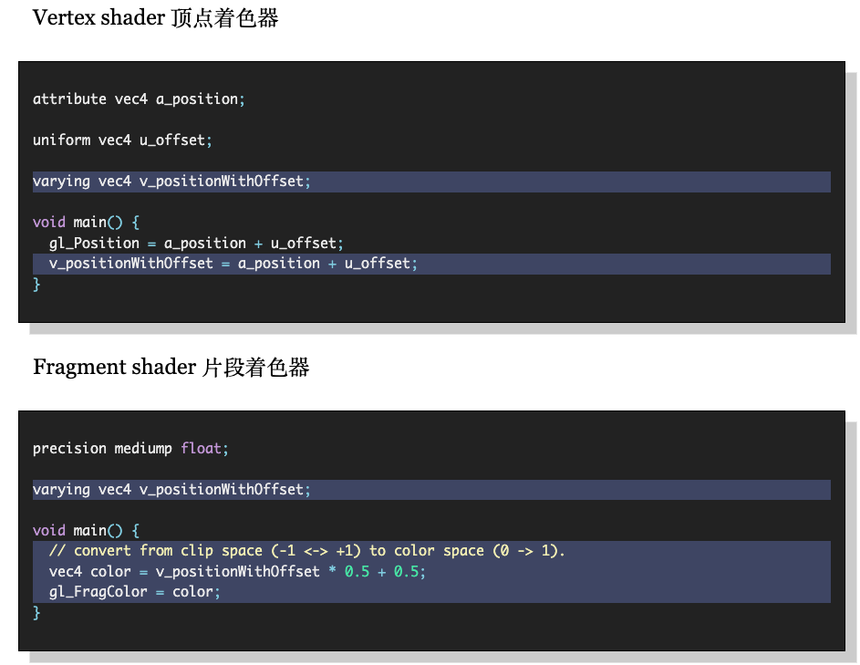

# 概览

[webGL - MDN](https://developer.mozilla.org/zh-CN/docs/Web/API/WebGL_API) 

[WebGL 理论基础](https://webglfundamentals.org/webgl/lessons/zh_cn/) 

- [可视化步骤](https://webglfundamentals.org/webgl/lessons/resources/webgl-state-diagram.html?exampleId=triangle#no-help) 

[教程](https://juejin.cn/post/7146385487039725582/) 

[矩阵库](https://glmatrix.net/) 

WebGL 使得在支持 HTML 的 canvas 标签的浏览器中，不需要安装任何插件，便可以使用基于 [OpenGL ES](https://www.khronos.org/opengles/) 2.0 的 API 在 canvas 中进行 2D 和 3D 渲染。WebGL 程序包括用 JavaScript 写的控制代码，以及在图形处理单元（GPU, Graphics Processing Unit）中执行的着色代码（GLSL，注：GLSL 为 OpenGL 着色语言）。WebGL 元素可以和其他 HTML 元素混合使用，并且可以和网页其他部分或者网页背景结合起来。


WebGL 只能绘制点、线和三角形，那些复杂的 3D 模型都是一个个三角形组成的。一个三角形是由 3 个顶点组成，如果我们想渲染两个三角形，就提供 6 个顶点，WebGL 每处理完 3 个顶点后会将这三个顶点连接成一个三角形。

WebGL 性能高的原因是它使用到了 GPU。

webGL 只关系两件事：坐标和颜色，顶点着色器提供坐标，片段着色器提供颜色

> WebGL 绘制图像的主要步骤如下：

1. **初始化 WebGL 上下文**：获取 WebGL 绘图上下文。
2. **加载和设置顶点数据**：将图像的顶点坐标等信息传入缓冲区。
3. **加载和设置纹理数据**：将纹理图像加载到纹理对象中。
4. **编写顶点着色器和片段着色器**：定义图形的绘制逻辑和效果。
5. **创建程序对象并关联着色器**：将顶点着色器和片段着色器关联起来。
6. **设置视图和投影**：确定观察视角和图像显示范围。
7. **绑定纹理**：将纹理与绘制相关联。
8. **启用顶点属性和纹理**：使能相关属性和纹理的使用。
9. **绘制图形**：使用合适的绘制方法绘制图像。


- 创建着色器 -> 传入着色器代码 -> 编译着色器 -> 创建着色器程序 -> 绑定、连接、启用着色器 -> 进行绘制
- WebGL 程序执行主要分为两个阶段，CPU 阶段和 GPU 阶段，在 CPU 中我们可以直接使用 JS 来编写代码，但是如果要控制 GPU 的渲染逻辑就需要使用着色器，也就是使用 GLSL 编写的着色器程序。


# 着色器（shader）

着色器是使用 [OpenGL ES 着色语言](https://www.khronos.org/registry/gles/specs/2.0/GLSL_ES_Specification_1.0.17.pdf)(**GLSL**) 编写的程序，它接收构成形状的顶点的信息，并生成将像素渲染到屏幕上所需的数据（像素的位置和颜色）。换句话说，它负责记录着像素点的位置和颜色。

一组顶点和片段着色器一起称为【shader program】

- 顶点着色器的功能是将输入顶点从其原始坐标系转换为 WebGL 使用的 [clip space](https://developer.mozilla.org/en-US/docs/Web/API/WebGL_API/WebGL_model_view_projection#clip_space) 坐标系。根据计算出的一系列顶点位置，WebGL可以对点、 线和三角形在内的一些图元进行光栅化处理。
  - Clip space 坐标范围：三维{x, y, z} [-1,1]

- 在光栅化这些图元时会调用片段着色器，片段着色器的作用是为当前正在绘制的图元的每个像素计算颜色。

多数 WebGL API 都是关于为这些成对的着色器设置状态。对于你想要绘制的每一个东西，你设置一堆状态，然后通过调用 gl.drawArrays 或 gl.drawElements 在 GPU 上执行着色器。

## 顶点着色器（vertex shader）

顶点是指二维或三维空间中的一个点，比如二维或三维图形的端点或交点。

每次渲染形状时，都会为形状中的每个顶点运行顶点着色器。

- 顶点着色器必须对顶点的位置进行变化，基于顶点进行其他的调整、计算，然后通过将转换后的顶点保存在 `gl_Position` 中返回
- 顶点着色器的输入：顶点着色器从「着色器代码中定义的 `attribute` 类型的变量」中接收顶点位置值
  - `attribute` 从 buffer 中获取值，每次迭代顶点着色器从分配给该 `attribute` 的 buffer 中读取下一个值

- 顶点着色器的输出：通过 `gl_Position` 返回转换后的顶点位置

- 示例
```c++
// an attribute will receive data from a buffer
attribute vec4 a_position;
 
// all shaders have a main function
void main() {
  gl_Position = a_position;
  gl_PointSize = 10.0;//设置尺寸
}
```

**创建着色器步骤**

1. 创建着色器：`gl.createShader`
2. 将源代码发送到着色器：`gl.shaderSource`
3. 编译：`gl.compileShader`

## 片段着色器

fragment 是指由 webGL 管道处理的像素，片段颜色（以及其他片段值，如深度）在图形操作过程中可能会被多次操纵和更改，然后才最终被写入屏幕。

在顶点着色器处理完形状的顶点后，使用片段着色器光栅化这些图形，也就是用像素绘制。对于要绘制的每个形状上的每个像素，将调用一次片段着色器确定像素的颜色（就是 `gl_FragColor`）。

片段着色器的工作是确定要应用于像素的纹素（即形状纹理中的像素），获取该纹素的颜色，然后对颜色应用适当的光照，从而确定该像素的颜色。

然后，通过将颜色存储在特殊变量 `gl_FragColor` 中，将颜色返回到 WebGL 层。然后，该颜色将绘制到屏幕上形状相应像素的正确位置。

- 进行逐片源处理过程如光照的程序。片元是一个WebGL术语，可以将其理解为像素（图像的单元）。
- 网格由多个三角形组成，每个三角形的表面称为片段。片段着色器的作用是计算出当前绘制图元中每个像素的颜色值，逐片元控制片元的颜色和纹理等渲染。


**创建着色器程序**

1. 创建：`gl.createProgram`
2. 添加着色器：`gl.attachShader`
3. 连接：`gl.linkProgram`

示例：
```c++
// 片段着色器没有默认精度，所以我们需要选择一个。Mediump是一个很好的默认值。意思是“中等精度”
precision mediump float;
void main() {
  // 设置颜色
  gl_FragColor = vec4(1, 0, 0.5, 1);
}
```


# 绘制Rendering

「创建着色器、program、链接 program、创建buffer、写入buffer」都是初始化代码，他们只在页面首次加载时执行一次。

每次渲染时执行下列代码：

```js
// (1)：将画布的当前大小传递给GPU
gl.viewport(0, 0, gl.canvas.width, gl.canvas.height);

// (2)：Clear the canvas
gl.clearColor(0, 0, 0, 0);
gl.clear(gl.COLOR_BUFFER_BIT);

// (3)：使用着色器
gl.useProgram(program);

// (4)：告诉 WebGL 如何从我们上面设置的缓冲区中获取数据，并将其提供给着色器中的属性
    // (4.1)：查找 program 中 attribute 的地址
    var positionAttributeLocation = gl.getAttribLocation(program, "a_position");
    // (4.2)：打开这个 attribute
    gl.enableVertexAttribArray(positionAttributeLocation);

// (5)：告诉 WebGL 如何从缓存中提取数据
    // Bind the position buffer.
gl.bindBuffer(gl.ARRAY_BUFFER, positionBuffer); 
    // Tell the attribute how to get data out of positionBuffer (ARRAY_BUFFER)
var size = 2;          // 2 components per iteration
var type = gl.FLOAT;   // the data is 32bit floats
var normalize = false; // don't normalize the data
var stride = 0;        // 0 = move forward size * sizeof(type) each iteration to get the next position
var offset = 0;        // start at the beginning of the buffer
    // 从 gl.ARRAY_BUFFER 指向的缓冲区中读取数据
gl.vertexAttribPointer(positionAttributeLocation, size, type, normalize, stride, offset)

// (6)：要求 WebGL 执行我们的 GLSL 程序（三角形）
var primitiveType = gl.TRIANGLES;
var offset = 0;
var count = 3;
// 顶点着色器执行 count 次，每次从绑定的 buffer 中读取 size 个元素
// 因为是绘制类型是 gl.TRIANGLES，顶点着色器执行 3 次后 webGL 根据 gl_Position 设置的值绘制一个三角形
gl.drawArrays(gl.TRIANGLES, offset,  count);
```

 `gl.vertexAttribPointer` 的一个隐藏部分是它将当前的 `ARRAY_BUFFER`绑定到 attribute上。换句话说，现在这个属性被绑定到`positionBuffer`。这意味着我们可以自由地将其他东西绑定到 `ARRAY_BUFFER`绑定点。该attribute 将继续使用 `positionBuffer`。


drawArrays 和 drawElements 的区别

-  `drawArrays` 是根据 `ARRAY_BUFFER` 来渲染，`drawElements` 是根据 `ELEMENT_ARRAY_BUFFER` 来渲染（根据索引来渲染）。
- `glDrawArray` 速度快，费内存（有重复顶点数据）。`glDrawElement` 稍微慢点，省内存（只有一份顶点数据）。

# GLSL 语法

webGL 需要强类型数据

着色器代码使用 GLSL 语法编写，webGL 会默认执行着色器代码中的 `main` 函数

1. GLSL 它是强类型语言，每一句都必须有分号
2. GLSL 的注释语法和 JS 一样，变量名规则也和 JS 一样，不能使用关键字，保留字，不能以 `gl_`、`webgl_` 或 `_webgl_` 开头。运算符基本也和 JS 一样，`++` `--` `+=` `&&` `||` 还有三元运算符都支持。
3. GLSL 中主要有三种数据值类型，浮点数、整数和布尔。注意浮点数必须要带小数点。类型转换可以直接使用 `float`、`int` 和 `bool` 函数。
4. GLSL 中还支持矢量和矩阵类型。矢量可以理解为一个数组，矩阵可以理解为一个二维数组。

```c
vec2, vec3, vec4 // 分别是包含 2，3，4 个浮点数的矢量
ivec2, ivec3, ivec4 // 分别是包含 2，3，4 个整数的矢量
bvec2, bvec3, bvec4 // 分别是包含 2，3，4 个布尔值的矢量

mat2, mat3, mat4 // 分别是包含 2x2，3x3，4x4 浮点数元素的矩阵

// 自定义 sruct
struct SomeStruct {
  bool active;
  vec2 someVec2;
};
uniform SomeStruct u_someThing;

// 条件
if (true) {
  
} else if (true) {
  
} else {
  
}
// 循环
for (int i = 0; i < 3; i++) {
	continue; // 或 break
}

// 函数
float add(float a, float b) {
    return a + b;
}
```


`vec4` 的默认值是：`[0,0,0,1]`，可以用 `a.xyzw` 下标访问

## GLSL变量

任何希望 shader program 访问的数据都需要提供个 GPU，GLSL 提供了4种类型的变量（数据存储）

- `attribute` 和 `uniform` 的存储地址是特定于某个 shader program
- 顶点着色器可以通过 attributes、uniforms、textures 获取数据
- 片段着色器可以通过 uniforms、textures、varyings 获取数据

```c
// js
var someThingActiveLoc = gl.getUniformLocation(someProgram, "u_someThing.active");
var someThingSomeVec2Loc = gl.getUniformLocation(someProgram, "u_someThing.someVec2");
```

**(1)：attributes + buffer**

- 这些变量保存顶点着色器程序的输入值。属性指向包含每个顶点数据的顶点缓冲区对象。每次调用顶点着色器时，属性指向不同顶点的VBO。
- 可以被顶点着色器和 JS 代码访问，由 JS 设置
  - 可以用它来传递逐顶点的数据，我们会创建一个 Buffer 把数据放入 Buffer 中发送到 GPU，为了提升性能，需要使用 `Float32Array`，这样在 GPU 中就无需再解码数据。

- attribute 的类型有：float、vec2、vec3、mat2、mat3等
- attribute 用于指定如何从缓冲区中读取数据并将其提供给顶点着色器，顶点着色器的每次迭代都从分配给该 `attribute` 的缓冲区接收下一个值。


通过 attributes list 中的索引引用某个 attributes，attributes list 由 GPU 维护

- `getAttribLocation(program, name)` 通过attribute 的 name 获取 attributes 变量的索引


应用于某个顶点的值存储在 Attributes，attributes 将顶点一个接一个的传递给顶点着色器

- attributes 默认是禁用，未启用状态下无法使用

- `gl.enableVertexAttribArray(aVertexPosition)` 
  - 该方法将 attributes list 中指定索引位置处的 attributes 打开，然后像 `vertexAttribPointer(), vertexAttrib*(), and getVertexAttrib().` 方法就可以访问 attribute
  - 告诉 GPU 这个 attribute 应该用 array buffer 中的数据填充

调用 `vertexAttribPointer(aVertexPosition)` 将 vertex buffer 和 `aVertexPosition` 建立连接（有副作用），然后可以通过访问 `aVertexPosition` 从顶点缓冲区获取数据。

- **将当前绑定到 `gl.Array_BUFFER` 的 buffer 绑定到当前顶点缓冲区对象（Vertex Buffer Object，VBO）的通用 vertex attribute。**
- 执行 `vertexAttribPointer` 后将其他 buffer 绑定到 gl.ARRAY_BUFFER 不会影响已经绑定的 attribute 的值
- 执行 `vertexAttribPointer` 后更新被绑定的 buffer 的数据，会用更新后的数据进行绘制


**(2)：uniforms**

- 由 JS 设置，可以被两种着色器访问
- 这些变量保存顶点和片段着色器通用的输入数据，例如光照位置、纹理坐标和颜色。
- uniforms 是在执行“shader program”之前设置的全局变量，在顶点着色器和片段着色器中都可以使用
- 在某次绘制过程中对所有顶点保持相同的值。
- uniforms 属于某个 program，调用 `gl.uniform???` 是为「当前 program」（最后调用 `gl.useProgram` 的 program） 设置
- 一般会使用它传递一些矩阵。

uniforms 有很多类型，不同的类型需要调对应的方法（`uniform[1234][uif][v]()`）

- i 代表整数，ui 代表无符号整数，f 代表浮点数，v 代表矢量

  - `gl.uniform[1234][fi][v]()`
  - `gl.uniform1f (floatUniformLoc, v);                 // for float`
  - `gl.uniform2f (vec2UniformLoc,  v0, v1);            // for vec2`

**(3)：varyings**

- 由顶点着色器声明，用于将数据从顶点着色器传递到片段着色器。
- varyings 是顶点着色器向片段着色器传递数据的一种方式。
- 根据正在渲染的内容（点、线或三角形），在执行片段着色器时，由顶点着色器设置在可变变量上的值将被【插值】。
- 在两个着色器中声明相同类型和名称的 `varyings` 变量
   

**(4)：Textures**

- Textures是你可以在着色器程序中随机访问的数据数组。最常见的放入纹理中的是图像数据，但纹理只是数据，也可以很容易地包含颜色以外的其他东西。

- 示例

  ```c
  precision mediump float;
  uniform sampler2D u_texture;
  void main() {
     vec2 texcoord = vec2(0.5, 0.5);  // get a value from the middle of the texture
     gl_FragColor = texture2D(u_texture, texcoord);
  }
  ```

  - u_texture 是一个`sampler2D`类型的采样器变量，用于指定要采样的纹理。
  - `sampler2D`是一种特殊的 GLSL 数据类型，它指向一个 OpenGL 纹理单元（texture unit），纹理单元中包含了实际的纹理图像数据。在使用`texture2D`之前，需要通过`uniform`关键字在着色器中定义一个`sampler2D`类型的变量，并将其与纹理对象关联起来。
  
- 绑定纹理单元
  ```js
  var textureUnitIndex = 6; // use texture unit 6.
  // Bind someTexture to texture unit 6.
  gl.activeTexture(gl.TEXTURE0 + textureUnitIndex);
  gl.bindTexture(gl.TEXTURE_2D, someTexture);
  ```

> [常量](https://developer.mozilla.org/zh-CN/docs/Web/API/WebGL_API/Constants) 

gl_Position：存储顶点着色器顶点的位置

gl_PointSize：顶点大小

gl_PointCoord：

gl_FragColor：存储片段着色器的颜色值

gl.ARRAY_BUFFER

gl.TRIANGLES：渲染三角形

gl.DEPTH_TEST


## buffer

buffer 是传递给 GPU 的二进制数据的数组，一般包含位置、normals、纹理坐标、顶点颜色等，可以向 buffer 中写入任意数据

- 缓冲区不是随机访问的。顶点着色器会执行指定的次数，每次执行时都会从每个指定的缓冲区中取出下一个值，并将其分配给一个 attribute。

**buffer 分类：**

- 绘图缓冲区、帧缓冲区、vetex 缓冲区和索引缓冲区。顶点缓冲区和索引缓冲区用于描述和处理模型的几何形状。
- 顶点缓冲区对象存储有关顶点的数据，而索引缓冲区对象存储有关索引的数据。将顶点存储到数组后，我们使用这些 Buffer 对象将它们传递给 WegGL 图形管道。
- 帧缓冲区是保存场景数据的图形内存的一部分。该缓冲区包含表面的宽度和高度（以像素为单位）、每个像素的颜色、深度和模板缓冲区等详细信息。

WebGL 允许我们在全局绑定点（比如 gl.ARRAY_BUFFER）上操作许多 WebGL 资源。你可以将绑定点视为 WebGL 内部的全局变量。

首先，将资源绑定到绑定点。然后，所有其他函数通过绑定点引用资源。


> 写入 buffer

将数据以什么格式写入哪个位置

```js
function initPositionBuffer(gl) {
  // 新建
  const positionBuffer = gl.createBuffer();

  // 绑定
  gl.bindBuffer(gl.ARRAY_BUFFER, positionBuffer);

  // Now create an array of positions for the square.
  const positions = [1.0, 1.0, -1.0, 1.0, 1.0, -1.0, -1.0, -1.0];

  // 写入缓存
  // 通过绑定点引用该缓冲区来将数据放入其中
  // 初始化并创建 buffer object's data store，如果第二个参数是 srcData 就将数据拷贝到 data store
  gl.bufferData(gl.ARRAY_BUFFER, new Float32Array(positions), gl.STATIC_DRAW);
  return positionBuffer;
}
```

> 从 buffer 中读取数据

从 buffer 的哪个地址读取数据，什么格式，读取的数据存入哪里？

告诉webGL如何从缓存中读取数据并提供给顶点着色器的 `attribute`

# 图像处理

图形管道处理顺序

- color clearing ---> 裁剪 ---> color masking  --->

webGL 绘制图像需要使用 texture，读取texture 时期望使用【texture coordinates 纹理坐标】，纹理坐标的范围是 0.0-1.0

> framebuffers

WebGL/OpenGL 帧缓冲区实际上只是一组状态（一系列附件），而并非任何类型的缓冲区。但是，通过将纹理附加到帧缓冲区，我们可以渲染到该纹理中。

# 3D

[模型、视图、投影](https://developer.mozilla.org/zh-CN/docs/Web/API/WebGL_API/WebGL_model_view_projection)

构建3D场景时常用的 3 个核心矩阵：model（模型）、view、projection（投影）

# 如何工作

webGL 只做两件事：

1. 将输入的顶点数据转换到 clip space
2. 根据第一步的结果绘制像素

# 其他

[webGL 工具函数](https://webglfundamentals.org/docs/index.html) 

