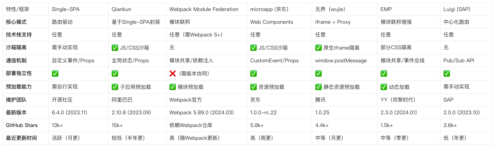

# 微前端解决方案

微前端定义：Techniques, strategies and recipes for building a **modern web app** with **multiple teams** using **different JavaScript frameworks**. — [Micro Frontends](https://micro-frontends.org/) 

微前端架构是为了在解决单体应用在一个相对长的时间跨度下，由于参与的人员、团队的增多、变迁，从一个普通应用演变成一个巨石应用(Frontend Monolith)后，随之而来的应用不可维护的问题。这类问题在企业级 Web 应用中尤其常见。
微前端框架内的各个应用都支持独立开发部署、不限技术框架、支持独立运行、应用状态隔离但也可共享等特征。

1. single-spa：single-spa 是一个用于前端微服务化的JavaScript 前端解决方案(本身没有处理样式隔离， js 执行隔离) 实现了路由劫持和应用载入
2. qiankun：基于Single-SPA, 提供了更加开箱即用的API （ single-spa + sandbox+ import-html-entry ） 做到了，技术栈无关、并且接入简单（像iframe 一样简单）

[探探各个微前端框架](https://mp.weixin.qq.com/s/7-A_WBk_kM33JyOtmdwjTQ) 

[微前端解决方案](https://segmentfault.com/a/1190000040275586) 
[qiankun 微前端方案实践及总结](https://juejin.cn/post/6844904185910018062#heading-29) 
[微前端-最容易看懂的微前端知识](https://juejin.cn/post/6844904162509979662) 
[Module Federation](https://stackblitz.com/github/webpack/webpack.js.org/tree/master/examples/module-federation?file=README.md&terminal=start&terminal=) 

[基于 qiankun 的微前端实践-腾讯IMWeb](https://mp.weixin.qq.com/s/H0Bc09yR2KPrdHmEMiZsRA) 

# 微前端架构

 

# [qiankun](https://www.npmjs.com/package/qiankun) 

1. 一个子项目一个服务，不同服务端口不同，怎么解决跨域？
2. 资源会不会重复加载？
3. 路由动态配置？
4. 沙箱？JS、CSS隔离

- onGlobalStateChange
- setGlobalState

> 微应用暴露出的生命周期钩子，微应用需要提供生命周期钩子；

-------------

**整体对比**

 

框架详细分析

Single-SPA
● 定位：微前端编排层（非完整框架）
● 优势：
  ○ 高度灵活，支持任意技术栈组合
  ○ 无框架侵入性，适合深度定制
● 劣势：
  ○ 需要自行实现沙箱隔离、资源预加载等核心功能
  ○ 对团队技术要求较高
● 适用场景：大型复杂系统，需高度定制化微前端方案
Qiankun
● 定位：生产级微前端解决方案（基于Single-SPA）
● 优势：
  ○ 开箱即用的沙箱隔离（JS/CSS）
  ○ 完善的子应用生命周期管理
  ○ 中文文档友好，阿里巴巴背书
● 劣势：
  ○ 对Vue/React支持更佳，其他框架需适配
  ○ 子应用需少量改造
● 适用场景：企业级中后台系统，快速落地微前端
Webpack Module Federation
● 定位：模块联邦（非完整微前端框架）
● 优势：
  ○ 原生支持模块级共享（减少重复依赖）
  ○ Webpack官方生态，与构建流程深度集成
● 劣势：
  ○ 依赖Webpack 5+，技术栈锁定
  ○ 缺乏运行时隔离机制
● 适用场景：模块化程度高的应用，技术栈统一团队
microapp（京东）
● 核心能力：基于Web Components的轻量级方案，支持子应用完全独立运行。
● 优势：
  ○ 零成本接入，子应用无需改造
  ○ 完善的沙箱隔离（JS Proxy + CSS Scoped）
  ○ 京东内部大规模落地验证
● 劣势：
  ○ 对Web Components兼容性有要求（需Polyfill）
  ○ 文档以中文为主
● 适用场景：快速集成第三方应用，多团队协作场景。
无界（wujie）
● 核心能力：基于iframe的“无感”微前端方案，利用Proxy实现主子应用通信。
● 优势：
  ○ 近乎原生的隔离性（iframe+Proxy）
  ○ 支持保活模式（子应用状态保留）
  ○ 腾讯内部多个业务线使用
● 劣势：
  ○ iframe带来的内存开销
  ○ 路由同步需额外配置
● 适用场景：对隔离性要求极高的场景（如金融、政务系统）。
EMP（YY）
● 核心能力：基于Module Federation的增强框架，支持跨应用状态共享。
● 优势：
  ○ 自动生成Typescript类型定义
  ○ 内置Antd/Element等UI库共享能力
  ○ 支持Vite
● 劣势：
  ○ 生态依赖较复杂
  ○ 中文文档为主
● 适用场景：中大型应用，需深度模块复用。
Luigi（SAP)
● 核心能力：企业级微前端导航框架，侧重统一管理多应用路由。
● 优势：
  ○ 提供标准化管理后台
  ○ 支持OAuth2、OpenID Connect
  ○ 企业级权限控制
● 劣势：
  ○ 架构较重，适合大型企业
  ○ 社区活跃度低
● 适用场景：SAP生态或需要强权限管控的企业应用。

关键数据参考
沙箱性能：microapp的JS沙箱性能比Qiankun快约30%（基于Chrome基准测试）。
子应用改造：microapp无需子应用改造，qiankun需要少量改造