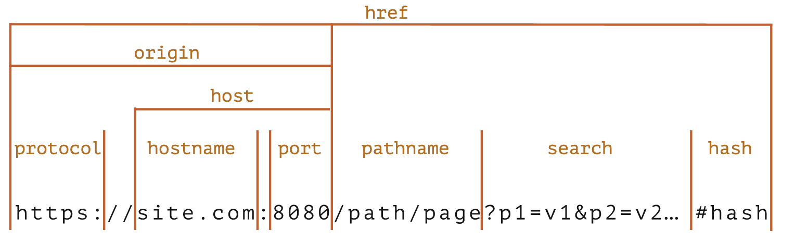
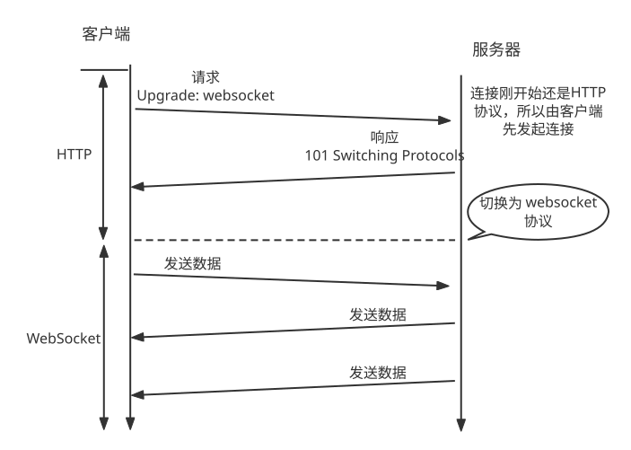
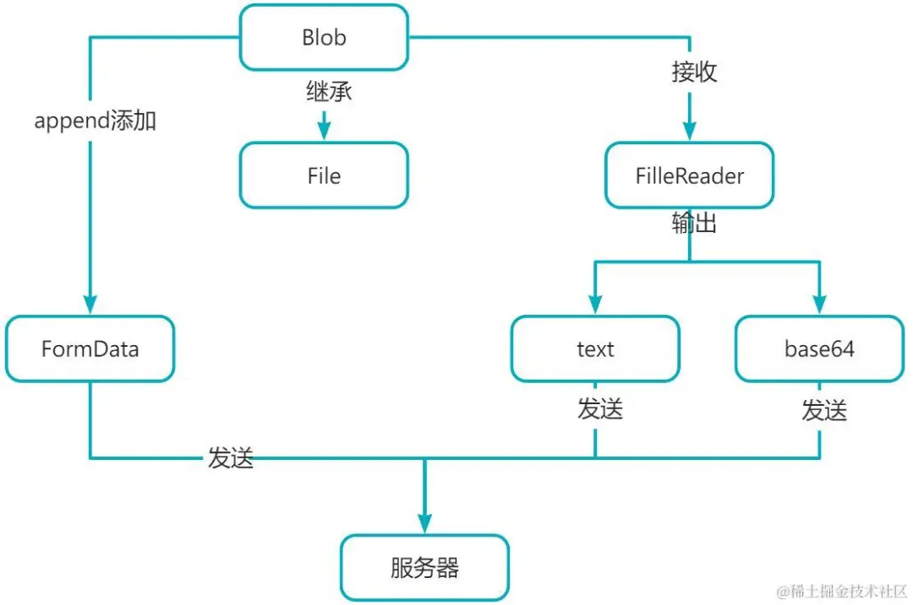
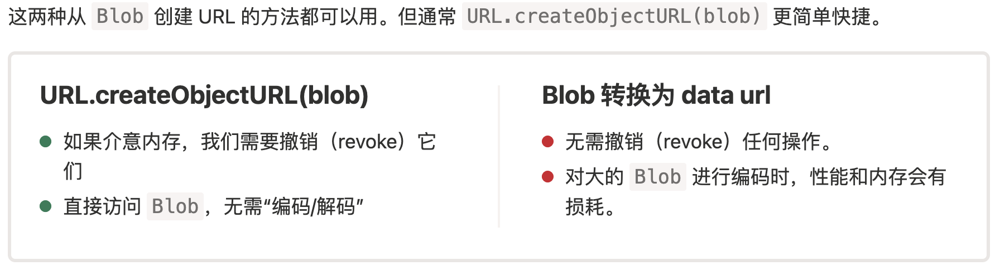
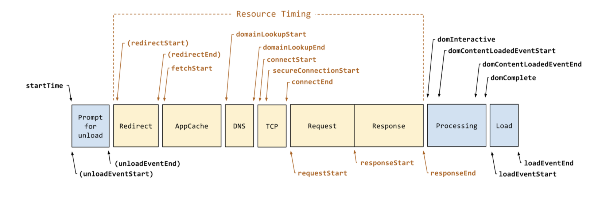

# Web 概述

## 功能

1. [Web Component](https://developer.mozilla.org/zh-CN/docs/Web/API/Web_components)
2. WebSocket：网络
3. Web Storage：数据
4. Web Work：异步线程
5. [Web Animations](https://developer.mozilla.org/zh-CN/docs/Web/API/Web_Animations_API) 
6. [WebGL](https://developer.mozilla.org/zh-CN/docs/Web/API/WebGL_API) 
7. WebGPU
8. WebAssembly：WebAssembly 技术允许使用 C、C++、Rust、Swift、C#、Go 等语言编写的程序在 Web 上运行
9. [WebDriver](https://developer.mozilla.org/zh-CN/docs/Web/WebDriver)：WebDriver 是一种浏览器自动化机制，通过模拟真实的人使用浏览器的动作来远程控制浏览器。它被广泛用于网络应用的跨浏览器测试。

## Web 开发资料

[MDN](https://developer.mozilla.org/zh-CN/docs/Web) 

[现在JavaScript 教程](https://zh.javascript.info/) 

# 前端路由

前端路由是通过改变URL，在不重新请求页面的情况下，更新页面视图。

有两种实现模式：hash & history

> Hash

- hash虽然出现在url中，但不会被包括在http请求中，它是用来指导浏览器动作的，对服务器端没影响，因此，改变hash不会重新加载页面。

- 可以为hash的改变添加监听事件：

  `window.addEventListener("hashchange",funcRef,false)`  

> History

`window.history.pushState` | `window.history.replaceState`

- pushState 和 replaceState 两种方法的共同特点：
  - 当调用他们修改浏览器历史栈后，虽然当前url改变了，但浏览器不会立即发送请求该url，重载页面，这就为单页应用前端路由，更新视图但不重新请求页面提供了基础。

- popstate事件只会在浏览器某些行为下触发， 比如点击后退、前进按钮(或者在JavaScript中调用history.back()、history.forward()、history.go()方法)。

- 调用 history.pushState() 或者 history.replaceState() 不会触发 popstate 事件。 


# 长列表(Table)渲染优化

1. 分页
1. 虚拟列表：固定渲染一定数据的列表项
   - [vue-virtual-scroll-list 组件](https://github.com/tangbc/vue-virtual-scroll-list) 
   - [react-virtualized](https://github.com/bvaughn/react-virtualized) 

3. 滚动加载、懒加载

# [时区与JS中的Date](https://juejin.cn/post/6844903885505576968) 

- 用 `new Date(timeStamp)` 输入相同的时间戳在不同的时区下返回不同的时间对象，即使使用字符串形式指定时区 `new Date` 也会转换为本地时间输出
使用构造函数实例化一个 Date 对象，该对象一定对应本地时区

- 在不同时区中用 Date.now() 获取时间戳，GMT-0400 和 GMT+0800 相差约30秒
- Date.parse(dateStr)- Date.parse('2020-11-11T11:11:11.000Z') 在不同时区下输出相同的时间戳（指定了时区），Date.parse('2020-11-11T11:11:11') 在不同时区下输出不同，使用本地时区
- Date.UTC(2011, 10, 11) 在不同时区下输出相同的时间戳，与Date.parse('2011-11-11T00:00:00.000Z')输出相同
- new Date() 输入字符串、时间戳、年|月|日- new Date(y, m): 使用本地时区- new Date(str): 字符串中指定了时区则使用指定的时区，否则使用本地时区，但是返回值都会转换为本地时区表示（new Date('2000-01-01T00:00:00Z')）

固定时区
GMT UTC
使用时间戳就不用考虑时区

- 时间戳转字符串
- 字符串转时间戳

# 事件循环

> 任务队列  宏任务（`macrotask  task job`）  微任务（`microtask`）执行栈  执行上下文。

event loop 负责调度和执行运行在线程中的每段代码。

有三种 event loop:
1. Window event loop
2. worker event loop：web workers、service workers、shared workers
3. worklet event loop

每个线程都有自己的事件循环，所以每个web worker都有自己的事件循环，所以它可以独立执行，而同源的所有窗口共享事件循环，因为它们可以同步通信。

事件循环持续运行，执行排队的任何任务。事件循环有多个任务源，它们保证了该源中的执行顺序，但浏览器可以在循环的每次循环中选择从哪个源接收任务。这使得浏览器可以优先处理性能敏感的任务，例如用户输入。


> Q：执行微任务时又添加新的微任务到队列中，新添加的微任务什么时候执行？

如果一个微任务通过调用 `queueMicrotask()` 将更多的微任务添加到队列中，这些新添加的微任务将在下一个任务运行之前执行。

这是因为事件循环会一直调用微任务，直到队列中没有剩余的微任务，即使不断添加新的微任务。

## 执行上下文

JS 代码运行在执行上下文中，有三种情况会创建新的执行上下文：
1. 全局上下文（global context）
2. 函数上下文，每个函数运行在自己的执行上下文中
3. `eval`

## 宏任务 | 微任务

> 宏任务、微任务保存在不同的队列中

1. 从宏任务队列（例如 “script”）中出队（dequeue）并执行最早的任务。【直到执行上下文结束】
2. 执行所有微任务
3. 当微任务队列非空时，出队（dequeue）并执行最早的微任务
5. 如果有变更，则将变更渲染出来
6. 如果宏任务队列为空，则休眠直到出现宏任务
7. 转到步骤 1。

任务队列中，在每一次事件循环中，`macrotask` 只会提取一个执行，而 `microtask `会一直提取，直到 `microsoft `队列为空为止。

微任务队列清空后浏览器执行需要的渲染和绘制（如果有变更）。

也就是说如果某个 `microtask` 任务被推入到执行中，那么当主线程任务执行完成后，会循环调用该队列任务中的下一个任务来执行，直到该任务队列到最后一个任务为止。

而事件循环每次只会入栈一个 `macrotask`，主线程执行完成该任务后又会检查 `microtasks`队列并完成里面的所有任务后再执行 `macrotask` 的任务。


浏览器为了能够使得JS内部task与DOM任务能够有序的执行，会在一个task执行结束后，在下一个 task 执行开始前，对页面进行重新渲染（task指宏任务）


macrotasks：setTimeout、setInterval、setImmediate、I/O、UI rendering; 

```js
setTimeout(cb, 2000);
```

意味 2秒后任务被添加到宏任务队列中。


microtasks：process.nextTick、Promise、MutationObserver、queueMicrotask；

> 微任务有

1. Promise
2. MutationObserver
3. queueMicrotask


```js
setTimeout(function () {
  console.debug("0");
}, 0);

let p = new Promise((resolve) => {
  console.debug("1");
  resolve();
});
p.then(() => console.debug("2")).finally(() => console.debug("3"));
console.debug("4");
// 1 4 2 3 0

// =======================
function test() {
  console.clear();
  setTimeout(() => {
    timerFunc(300);
    console.log('200-setTimeout-1')
  });

  console.log(0);
  const p = Promise.resolve()
  const timerFunc = (count) => {
    p.then(() => console.log(count))
  }

  timerFunc(100);

  console.log(1);

  timerFunc(101);

  console.log(2);

  setTimeout(() => {
    console.log('400-setTimeout-2');
    timerFunc(500);
    console.log(401);
  });

  Promise.resolve().then(() => console.log(102));
}
test(); // 0 1 2 100 101 102 200-setTimeout-1 300 400-setTimeout-2 401 500
```

## 特殊情况

代码触发的事件（element.onclick 或 dispatchEvent）会同步执行，不会添加到宏任务队列中。

```html
<button id="btn">按钮</button>
<script>
const log = console.debug.bind(console);
const btn = document.getElementById('btn');

const handler = (type) => {
  log('handler');

  setTimeout(() => log('setTimeout'));

  Promise.resolve().then(function () {
    log('promise');
  });

  queueMicrotask(() => log('queueMicrotask'));
};
btn.addEventListener('click', handler);
btn.addEventListener('CusEvent', handler);

log('start');

// btn.dispatchEvent(new CustomEvent('CusEvent'));
btn.click();

log('end');
</script>
```

在 Chrome、Firefox、Safari 中测试结果
- 输出：start、handler、end、promise、queueMicrotask、setTimeout
- 注释 `btn.click` ，取消 `btn.dispatchEvent` 注释，输出同上

## nodejs 中的事件循环

6个阶段：timer、pendding、idle、poll、check（setlmmediate）、close

1. 当主线程同步代码执行完毕后会优先**清空微任务**（如果微任务继续产生微任务则会再次清空），然后再到下个事件循环阶段。

2. 并且微任务的执行是穿插在事件循环六个阶段中间的，也就是每次事件循环进入下个阶段前会判断微任务队列是否为空，为空才会进入下个阶段，否则先清空微任务队列。

3. 微任务中 `process.nextTick` 的优先级最高

详细流程：

- 微任务优先级高于宏任务。当微任务事件队列中存在可以执行的回调函数时，事件循环在执行完当前阶段的回调函数后会暂停进入事件循环的下一个阶段，而会立即进入微任务的事件队列中开始执行回调函数，当微任务队列中的回调函数执行完成后，事件循环才会进入到下一个段开始执行回调函数。
- 对于微任务我们还有个点需要特别注意。那就是虽然nextTick同属于微任务，但是它的优先级是高于其它微任务，在执行微任务时，只有nextlick中的所有回调函数执行完成后才会开始执行其它微任务。
- 总的来说就是当主线程同步代码执行完毕后会优先清空微任务(如果微任务继续产生微任务则会再次清空)，然后再到下个事件循环阶段。并且微任务的执行是穿插在事件循环六个阶段中间的，也就是每次事件循环进入下个阶段前会判断微任务队列是否为空，为空才会进入下个阶段，否则先清空微任务队列。

总结：

1. 有 nextTick 就执行 nextTick
2. 执行其他微任务，直到队列中没有微任务
3. 按 6 个阶段依次执行宏任务

[Node事件循环](https://juejin.cn/post/7209698674905382973#heading-21) 

## 参考

- [事件循环-宏任务和微任务-javascript.info](https://zh.javascript.info/event-loop) 
- [In depth: Microtasks and the JavaScript runtime environment](https://developer.mozilla.org/en-US/docs/Web/API/HTML_DOM_API/Microtask_guide/In_depth) 
- [JS 运行机制-事件循环-阮一峰](https://www.ruanyifeng.com/blog/2014/10/event-loop.html)
- [这一次，彻底弄懂 JavaScript 执行机制](https://juejin.im/post/59e85eebf265da430d571f89)
- [JavaScript 运行机制--Event Loop详解](https://juejin.im/post/5aab2d896fb9a028b86dc2fd)
- [腾讯-从 setTimeout 谈事件循环](http://www.alloyteam.com/2015/10/turning-to-javascript-series-from-settimeout-said-the-event-loop-model/#prettyPhoto)


# 跨域访问

 

## [同源策略](https://developer.mozilla.org/en-US/docs/Web/Security/Same-origin_policy) 

来源于某个 Origin 的 document(html) 或 脚本能否访问其他 Origin 的资源（localStoreage、Cookie、静态资源、xhr接口等）。

**同源**：两个源相同，哪两个源？脚本所在的源和脚本要访问的资源所在的源。

XMLHttpRequest 和 Fetch 都必须遵守同源策略。

## 跨域网络访问

> 哪些请求需要遵守CORS

1. XMLHttpRequest 和 Fetch 请求
2. 字体：CSS 中使用 `@font-face` 跨域引用字体文件
3. WebGL texture
4. Images/video frames drawn to a canvas using drawImage().
5. CSS Shapes from images.

以下几个 html 标签天生支持跨域访问：script、img、iframe、link、video

`crossorigin`属性是浏览器同源策略的一部分，用于对link、script、img等元素指定是否允许以【跨域资源共享】模式加载目标资源。

> [跨域资源共享-MDN](https://developer.mozilla.org/en-US/docs/Web/HTTP/CORS) 
>
> [CORS-博客](https://www.ruanyifeng.com/blog/2016/04/cors.html) 

CORS is a part of HTTP that lets servers specify any other hosts from which a browser should permit loading of content.

跨源资源共享 (CORS) 是一种基于 HTTP 标头的机制，它允许 Origin-A 指示浏览器应允许 Origin-A 以外的其它 Origin 加载 Origin-A 中的资源。

出于安全性，浏览器限制脚本内发起的跨源 HTTP 请求。 例如，XMLHttpRequest 和 Fetch API 遵循同源策略。这意味着使用这些 API 的 Web 应用程序只能从加载应用程序的同一个域请求 HTTP 资源，除非响应报文包含了正确 CORS 响应头。

Web页面或应用部署(运行在A服务器/PC上)，用户浏览器请求A服务器上的页面进行访问，A服务器响应请求并返回页面，浏览器显示页面。

页面中的 JS 通过 XMLHttpRequest 请求A服务器上的数据时，浏览器不会阻止。但请求B服务器上(第三方)的数据时，浏览器会根据 B 服务器上的跨域配置判断是否允许当前页面获取资源。

浏览器安全策略会阻止该请求，B服务器甚至没有看到页面发出的请求。**跨域是浏览器的限制**，chrome 可以允许跨域，并且不需要修改服务端配置。

域名与对应的 ip之间通信也算跨域，因为一个ip对应的主机可以有多个网站，对应多个域名。

> 现象

客户端发出一个 XHR 请求，请求方法为 POST，请求头中 Content-Type: application/json。
在 Firfox 浏览器中会出现两次 XHR 网络请求：

- 1)：方法为 OPTIONS 的预计检请求，请求头中 Access-Control-Request-Method：POST，Access-Control-Request-Headers：content-type。
  响应200，没有与 `Access-Control-Request-*` 相关的响应头。浏览器报错：CORS 预检响应的 'Access-Control-Allow-Headers'，不允许使用头 'content-type'
- 2)：客户端发出的 POST 请求，没有与 `Access-Control-Request-*` 相关的响应头，请求失败。

- 解决办法，在服务端判断当请求为预检请求（OPTIONS）时，设置以下响应头部：
```javascript
resp.writeHead(200, {
  'Access-Control-Allow-Methods': 'POST, GET, OPTIONS',
  'Access-Control-Allow-Headers': 'Content-Type',
  'Access-Control-Allow-Origin': 'some client addre',
});
resp.end();
```

> 总结

- 从浏览器角度来看跨源请求可以分为两类：【安全请求/Simple request】和【其他请求】，<b style="color:red">安全请求要满足的[条件](https://developer.mozilla.org/zh-CN/docs/Web/HTTP/CORS#%E7%AE%80%E5%8D%95%E8%AF%B7%E6%B1%82)。</b>

- 【安全请求】始终是被支持的，浏览器不会发送【预检请求】。当尝试发送【非安全请求】时浏览器会先发送一个【预检请求（preflight）】到服务端，询问服务端是否接受该请求。

- 跨域时，默认情况下，Javascript 只能访问以下安全的响应头部字段：Cache-Control、Content-Language、Content-Type、Expires、Last-Modified、Pragma。如果想访问其他响应头部字段，需要在服务端响应中设置类似 Access-Control-Expose-Headers: Content-Length,API-Key

- 如果一个请求跨域了，浏览器始终会在请求头中添加 `Origin: https://domain.com` 字段。所以，`Access-Control-Allow-Origin`  响应字段需要在每个跨域的接口中返回，`Access-Control-Allow-Methods`、`Access-Control-Allow-Headers` 只需要在预检请求中返回。


> 相关的响应头部字段

- [Corss-Origin-Resource-Policy](https://developer.mozilla.org/en-US/docs/Web/HTTP/Cross-Origin_Resource_Policy_(CORP)) : 跨域策略，可选值为: `same-origin`、`same-site`、`cross-origin` 
  - As this policy is expressed via a *[response header](https://developer.mozilla.org/en-US/docs/Glossary/Response_header)*, the actual request is not prevented—rather, the browser prevents the result from being leaked by stripping the response body.
  - During a cross-origin resource policy check, if the header is set, the browser will deny `no-cors` requests issued from a different origin/site.
- [Access-Control-Allow-Origin](https://developer.mozilla.org/en-US/docs/Web/HTTP/Headers/Access-Control-Allow-Origin): 允许某个源或所有源访问
  - 响应头部字段，标识 response 可以被哪些请求所在 Origin 访问。
  - 服务端收到请求时，检查 request header 的 Origin, 如果允许该 Origin，则设置响应中的 Access-Control-Allow-Origin 值为该请求的 Origin。
  - 请求中没有 `credentials` 字段时，服务端响应的 `Access-Control-Allow-Origin: *` 才有效。
  - 当请求是 `credentialed requests` 时，服务端必须指定 `Access-Control-Allow-Origin` 的值为 `*` 之外的明确值。
  - 如果服务端指定了具体的域名而非“\*”，那么响应首部中的 Vary 字段的值必须包含 Origin。这将告诉客户端：服务器对不同的源站返回不同的内容。

- Access-Control-Allow-Credentials
  

如果想跨域传输 cookie，需要前后端都进行配置，将 XMLHttpRequest 的 withCredentials 标志设置为 true，并且服务器端的响应中携带 `Access-Control-Allow-Credentials: true`。

- Access-Control-Expose-Headers：在跨源访问时，XMLHttpRequest 对象的 getResponseHeader() 方法只能拿到一些最基本的响应头，该字段允许 JS 访问额外的响应头部字段。
- Access-Control-Max-Age：指定了 preflight 请求的结果能够被缓存多久


> 实际测试

- 正常的浏览器
  - 【http-http】用 XSwitch 可以成功将一个 http://serve-a/x.js 资源重定向到公网的 http://serve-b/x.js 上，并且 `serve-b/x.js` 设置了 `Corss-Origin-Resource-Policy: same-origin`，但是不能重定向到本地的 Js 文件。
  - 【https-http】用 XSwitch 不能将 https://serve-a/x.js 资源重定向到公网的 http://serve-b/x.js 上，报错为：`This request has been blocked; the content must be served over HTTPS.`。
  - 【https-https】若 https://serve-b/x.js 没有配置跨域的响应头部，XSwitch 可以将 https://serve-a/x.js 可以重定向到 https://serve-b/x.js
- 命令行启动浏览器并允许跨域
  - 【https-http】用 XSwitch 可以将 https://serve-a/x.js 资源重定向到本地的 http://127.0.0.1:9001/x.js 上


`Access-Control-Allow-Headers: 'Origin, X-Requested-With, Content-Type, Accept'`


> 正常浏览器测试场景

**(1).** nginx 没有配置跨域相关的 header

- 公网 139.xx 服务获取 http://127.0.0.1:123/demo.js （失败，报错"CORS"，用命令行启动浏览器可以解决）
- 公网 139.xx 服务获取 http://47.xx:8010/demo.js  **（成功）** 
- 127 服务获取公网 http://139.xx.xx/demo.js （成功）
- test.dev.host 服务获取 http://139.xx.xx/demo.js   test.dev.host 解析到127（成功）
- 总结
  - 本地127 或配置域名的 web 服务可以获取其他公网上的 Js 文件，公网不能获取本地 Js 文件，但另一位公网 Nginx 没有配置CORS时，从一个公网可以访问另一个公网的 Js 文件。
  - 一个公网访问跨域获取另一个公网服务商的图像


**(2).** nginx 配置跨域相关的 header

只配置 `Corss-Origin-Resource-Policy: same-origin` 没什么变化

## 跨域请求携带Cookie

默认情况下，跨域请求不会携带 Cookie，如果服务端需要 Cookie 或 HTTP Authentication 进行身份认证，则需要在客户端和服务端进行相关设置。

客户端使用 XMLHttpRequest 发送请求时

```js
xhr.withCredentials = true;
```

CORS 预检请求不能包含凭据，预检请求的响应必须指定 `Access-Control-Allow-Credentials: true` 来表明可以携带凭据进行实际的请求。

没有预检请求的跨域请求，服务端设置响应头部字段：Access-Control-Allow-Credentials：true。浏览器会拒绝响应头中没有该配置的所有响应，不会将响应内容返回给 web content。

当服务端响应一个附带身份认证的跨域请求时，Access-Control-Allow-Origin 只能设置为一个明确的 Origin，Access-Control-Allow-Headers 和 Access-Control-Allow-Headers 也不能使用通配符，必须指定为明确的属性值列表。当 Access-Control-Allow-Origin 设置为某个明确的值时，该值可能会随着请求地址变化，这时响应头部的 Vary 字段应该包含 `Origin` ，以此来告诉客户端服务端对不同的 Origin 返回不同的响应。

**注意：**跨域请求的请求头中携带的 Cookie 是请求URL所在 Origin 的 Cookie，不是 web 页面所在 Origin 的 Cookie。这种情况同样遵守第三方 cookie 策略，如果浏览器禁用了第三方 cookie ，那响应中的 Set-Cookie 不会保存。


## 解决方案

1. JSONP：JS 文件可以跨域访问。通过动态创建 script，再请求一个带参网址实现跨域通信，通过 `<script>` 标签，在 url 中指定 callback 回调函数，服务端返回一段调用某个函数的 `js`代码，当响应到来时调用回调函数，数据就是传递给回调函数的实参。

   ```js
   function handle(response){
     console.log(response);
   }
   let script = document.createElement('script');
   script.src = 'http://xxx.com/?callback=handle';
   document.body.insertBefore(script, docuent.body.firstChild);
   ```

   缺点：只支持 GET请求


2. CORS：跨域资源共享(Cross-origin resource sharing)，服务端设置 Access-Control-Allow-Origin 即可，前端无须设置，若要带 cookie 请求，前后端都需要设置。
    - CORS 支持所有类型的请求方法

3. postMessage 跨域：可以跨域操作的window属性之一，配合 iframe。
4. 代理跨域：使用代理服务器转发请求；（跨域只有在使用浏览器访问的情况下存在）
5. Websocket
6. document.domain + iframe 跨域：两个页面都通过 JS 强制设置 document.domain 为基础主域，就实现了同域。
    - 只支持主域相同，子域不同；
7. location.hash + iframe 跨域：a欲与b跨域相互通信，通过中间页c来实现。 三个页面，不同域之间利用 iframe 的 location.hash传值，相同域之间直接js访问来通信。
8. window.name + iframe 跨域：通过 iframe 的 src 属性由外域转向本地域，跨域数据即由 iframe 的 window.name 从外域传递到本地域。

## 参考

- [跨域，你需要知道的全在这里](https://juejin.im/entry/59feae9df265da43094488f6) 
- [跨域资源共享 CORS 详解 - 阮一峰的网络日志](https://www.ruanyifeng.com/blog/2016/04/cors.html) 
- [浏览器同源策略-postMessage](https://www.ruanyifeng.com/blog/2016/04/same-origin-policy.html) 
- [CORS 跨域发送 cookie](https://harttle.land/2016/12/28/cors-with-cookie.html#) 
- [Referrer Policy 的用法](https://www.ruanyifeng.com/blog/2019/06/http-referer.html) 
  1. 客服端：withCredentials=true;
  2. 服务端：Access-Control-Allow-Credentials=true; Access-Control-Allow-Origin: 单一域名

```js
access-control-allow-credentials: true
access-control-allow-headers: Content-Type
access-control-allow-origin: https://127.0.0.1:8087
```


# 网络请求

> [长轮询、WebSocket、Server Sent Event](https://zh.javascript.info/network) 

## XMLHttpRequest

fetch 无法跟踪**上传进度** ，跟踪下载进度需要知道响应头中的 `Content-Length`，使用 `XMLHttpRequest` 不存在这两个问题。


1. **XMLHttpRequest 实例的属性**

- readyState：xhr 的状态，0-4；
  - 0：unsent 未初始化，未调用open；
  - 1：opened，已建立服务器链接；【请注意，`open` 调用与其名称相反，不会建立连接。它仅配置请求，而网络活动仅以 `send` 调用开启。】调用 xhr.open 之后 readyState 表为 1，调用 send 之后也是 1
  - 2：headers_receive，接收到 response header；
  - 3：loading，接收到一个数据包，响应正在加载；
  - 4：done，完成，请求已完成；

- onreadystatechange：xhr的状态更新时触发该事件；
- onloadstart、onprogress、onload、onerror、ontimeout：通信的进度事件；
- status：HTTP 响应状态码；
- statusText：HTTP 响应状态说明；
- response\responseText：响应内容； 

> **事件**

| 事件名（按生命周期排序） | 描述                                                         |
| ------------------------ | ------------------------------------------------------------ |
| readystatechange         | readyState 属性变化时触发，除了变为 0（UNSENT）时            |
| loadStart                | 请求开始                                                     |
| progress                 | 一个响应数据包到达。在下载响应期间定期触发，报告已经下载了多少（Transmitting data.）<br> xhr.upload.onprogress 监听上传进度 |
| abort                    | 调用 `xhr.abort()` 取消了请求。                              |
| error                    | 发生连接错误，例如，域错误。不会发生诸如 404 这类的 HTTP 错误 |
| load                     | 请求成功完成                                                 |
| timeout                  | 由于请求超时而取消了该请求（仅发生在设置了 timeout 的情况下） |
| loadend                  | 在 `load`，`error`，`timeout` 或 `abort` 之后触发。          |

- error，abort，timeout 和 load 事件是互斥的，其中只有一种可能发生。readystate 的监听器在 onload、onerror、ontimeout 等之前执行。
- 下载进度 xhr.addEventListener('progress', fn)
- 上传进度 xhr.upload.addEventListener('progress', fn)，不是所有浏览器都支持

2. **使用**

- `xhr.open` 不会建立连接，仅配置请求，网络活动仅以 `send` 调用开启。
- `send` 会建立连接，并发送请求，调用 send 时 xhr 的状态必须是 1（OPENED）。
- 为了确保跨浏览器兼容，在 `open` 之前注册 `onreadystatechange` 事件监听器。
- setRequestHeader 必须在 open 方法之后send() 方法之前，且 setRequestHeader 可以调用多次，最终的值采用追加得到。

```javascript
let xhr = new XMLHttpRequest();
xhr.onreadystatechange = function (){
  if(xhr.readyState == 4){
    if((xhr.status >= 200 && xhr.status < 300) || xhr.status == 304){
       result = xhr.responseText;
		}
  }
}
// 保证这些方法一定要是大写字母，否则其他一些浏览器（比如FireFox）可能无法处理这个请求
xhr.open('GET', url);
xhr.setRequestHeader('Content-Type', 'multipart/form-data');
xhr.send(null);
```

3. **x-www-form-urlencoded  和 multipart/form-data 的区别**

- application/x-www-form-urlencoded 是默认的 Content-Type，这种方式是将表单中的数据编码成一个字符串（key1=val&key=val），再在 HTTP 请求的 body 中发送。它适用于表单中的数据量较少的情况，因为这种方式的数据会被编码成 URL 的参数形式。

- multipart/form-data 是一种将表单数据分割成多个部分发送的方式。这种方式适用于表单中的数据量比较大或者需要在表单中包含文件上传控件的情况。

- 在使用 multipart/form-data 时，表单数据会被分成多个部分，每个部分之间用分隔符隔开。每个部分由一个头信息和数据两部分组成，头信息中包含了数据的类型和编码方式等信息。
```javascript
// Create a new FormData object
var formData = new FormData();

// Append a file to the FormData object
formData.append('file', fileInput.files[0]);
// Append some text fields to the FormData object
formData.append('field1', 'value1');
formData.append('field2', 12344);

// Create a new XMLHttpRequest object
var xhr = new XMLHttpRequest();

// Open the connection and set the HTTP method to POST
xhr.open('POST', '/upload');

// 使用 XMLHttpRequest 或 Fetch API 和 FormData 发送 Content-Type 为 `multipart/form-data` 的 POST 请求时，不要在请求中明确设置 Content-Type
// 这样做会阻止浏览器使用边界表达式设置 Content-Type 标头，它将用于分隔请求正文中的表单字段。
// xhr.setRequestHeader('Content-Type', 'multipart/form-data');
xhr.send(formData);
```

4. **withCredentials**

   - 浏览器在发送跨域请求时，不能发送任何认证信息（credentials）如"cookies"和"HTTP authentication schemes"。

   - 如果想在跨域的情况下发送 cookie 需要客户端将 xhr.withCredentials 设置为true，并且server端也必须允许request能携带认证信息（即response header中包含Access-Control-Allow-Credentials:true），一旦跨域request能够携带认证信息，server端一定不能将Access-Control-Allow-Origin设置为 `*`，而必须设置为请求页面的域名。

5. **其他**

- [XMLHttpRequest Level 2 使用指南](https://www.ruanyifeng.com/blog/2012/09/xmlhttprequest_level_2.html) 

- [XMLHttpRequest 使用](https://segmentfault.com/a/1190000004322487) 

- 通常，当一个文档被卸载时（unloaded），所有相关的网络请求都会被中止。但是当请求头部字段 keepalive 设置为 true 时，即使在离开页面后也会在后台执行请求。所以此选项对于我们的请求成功至关重要。

- 需要<b style="color:red">跟踪上传进度</b>时，那么我们应该在 xhr.upload 对象上监听 progress 事件，该事件在数据<b style="color:red">被发送</b>时触发，但是服务器是否接收到了？浏览器并不知道。
  - 或许它是由本地网络代理缓冲的（buffered），或者可能是远程服务器进程刚刚终止而无法处理它们，亦或是它在中间丢失了，并没有到达服务器。这就是为什么此事件仅适用于显示一个好看的进度条。
  - 要恢复上传，我们需要**准确**知道服务器接收的字节数。而且只有服务器能告诉我们，因此需求额外的请求查询。

## axios

promise 的 HTTP 客户端 [axios](https://github.com/axios/axios) 则是其中非常流行的一种。

> 特点

客户端支持防止 **跨站请求伪造**CSRF：让你的每个请求都带一个从cookie中拿到的key, 根据浏览器同源策略，假冒的网站是拿不到你cookie中得key的，这样，后台就可以轻松辨别出这个请求是否是用户在假冒网站上的误导输入，从而采取正确的策略。


## [WebSocket](https://zh.javascript.info/websocket) 

> 浏览器与服务器进行全双工通信，可相互发送任意格式的数据。

WebSocket 没有跨源限制，可以发送/接收字符串和二进制数据。

WebSocket 建立在 HTTP 基础上，连接的发起方是客户端，WebSocket 连接建立后希望一直保持连接状态。

要实现 WebSocket 通信，在 HTTP 连接建立之后需要完成一次握手步骤：



<p align="center">WebSocket 通信</p>

> WebSocket API

```js
// websocket url 格式: ws://example.com/  wss://example.com/
const socket = new WebSocket('ws://game.example.com:1200/xx');
socket.onopen = function() {
  setInterval(() => {
    if (socket.bufferedAmount === 0) {
      socket.send('xxxx');
    }
  });
};
```

## [Server Sent Events](https://zh.javascript.info/server-sent-events) 

> EventSource

Server-Sent Events 规范描述了一个内建的类 EventSource，它能保持与服务器的连接，并允许从中接收事件。与 WebSocket 类似，其连接是持久的。但是两者之间有几个重要的区别：

| WebSocket                        | EventSource              |
| -------------------------------- | ------------------------ |
| WebSocket 协议                   | 常规 HTTP 协议           |
| 双向：客户端和服务端都能交换消息 | 单向：仅服务端能发送消息 |
| 二进制和文本数据                 | 仅文本数据               |

在很多应用中，`WebSocket` 有点大材小用，在简单场景下使用。

它还支持自动重新连接，而在 `WebSocket` 中这个功能需要我们手动实现。此外，它是一个普通的旧的 HTTP，不是一个新协议。

**限制**：HTTP/1 协议，一个激活状态的浏览器窗口最多只能有 6 个标签页连接到同一个服务，HTTP/2 增加到 100 tabs

## [长轮询](https://zh.javascript.info/long-polling) 

客户端发起一个请求，服务端挂起该请求，当需要发送新数据给客户端时返回响应并关闭连接。客户端收到响应后立即再发送一个请求，依次循环。

与 Server Sent Event 的区别，长轮询一个连接中服务端只能发送一次消息，Server Sent Event 可以在一个连接中多次发送消息。


## [sendBeacon](https://developer.mozilla.org/zh-CN/docs/Web/API/Navigator/sendBeacon) 

文档卸载期间发送发送统计数据

# [Web Storage](https://zh.javascript.info/data-storage) 

> Web 全局存储、通信

sessionStorage 不能在多个窗口或标签页之间共享数据，但是，当通过 `window.open('http://localhost:9003/a')` 用新标签页打开同一站点下的其他页面时，新的页面会**复制**上个页面的 sessionStorage。


不同浏览器对于通过`a`标签打开的新标签页是否共享`sessionStorage`的行为可能有所不同。例如，在Chrome 89版本之前，通过`a`标签`target="_blank"`跳转到新页面时会共享`sessionStorage`，但在后续版本中可能不再共享。

同一标签页下的 iframe 之间可以共享 sessionStorage（假如它们来自相同的源）。


在同一个标签页中从网站A导航到网站B，再通过点击【后退】按钮回到网站A，网站A中的 sessionStorage 数据还在。

关闭标签页后通过【历史记录】重新打开之前访问的页面，页面上的 sessionStorage 数据还在。

# [Service Worker](https://developer.mozilla.org/zh-CN/docs/Web/API/Service_Worker_API) 

缓存、离线访问、消息推送等等

[Service Worker 阮一峰](https://www.bookstack.cn/read/webapi-tutorial/docs-service-worker.md) 

[Workbox](https://mp.weixin.qq.com/s/nBujL2D8aV2MU5sEW2GDDA) ：Workbox 是由 Google 开发的一组库和工具，帮助开发者轻松地将 Service Worker 集成到他们的 Web 应用中。它简化了缓存管理和离线支持，使得 Web 应用能够在没有网络连接的情况下依然保持高性能和可靠性。

&nbsp;

# 类型化数组 | ArrayBuffer

ArrayBuffer 的原始设计目的，与 WebGL 项目有关。所谓 WebGL，就是指浏览器与显卡之间的通信接口，为了满足 JavaScript 与显卡之间大量的、实时的数据交换，它们之间的数据通信必须是二进制的，而不能是传统的文本格式。文本格式传递一个 32 位整数，两端的 JavaScript 脚本与显卡都要进行格式转化，将非常耗时。这时要是存在一种机制，可以像 C 语言那样，直接操作字节，将 4 个字节的 32 位整数，以二进制形式原封不动地送入显卡，脚本的性能就会大幅提升。


`ArrayBuffer`对象作为内存区域，可以存放多种类型的数据。同一段内存，不同数据有不同的解读方式，这就叫做“视图”（view）。`ArrayBuffer`有两种视图，一种是`TypedArray`视图，另一种是`DataView`视图。前者的数组成员都是同一个数据类型，后者的数组成员可以是不同的数据类型。


二进制数组由三类对象组成。

**（1）`ArrayBuffer`对象**：代表内存之中的一段二进制数据，可以通过“视图”进行操作。“视图”部署了数组接口，这意味着，可以用数组的方法操作内存。

**（2）`TypedArray`视图**：共包括 9 种类型的视图，比如`Uint8Array`（无符号 8 位整数）数组视图, `Int16Array`（16 位整数）数组视图, `Float32Array`（32 位浮点数）数组视图等等。

**（3）`DataView`视图**：可以自定义复合格式的视图，比如第一个字节是 Uint8（无符号 8 位整数）、第二、三个字节是 Int16（16 位整数）、第四个字节开始是 Float32（32 位浮点数）等等，此外还可以自定义字节序。

简单说，`ArrayBuffer`对象代表原始的二进制数据，`TypedArray`视图用来读写简单类型的二进制数据，`DataView`视图用来读写复杂类型的二进制数据。


ArrayBuffer 特点

- `ArrayBuffer`对象代表储存二进制数据的一段内存，它不能直接读写，只能通过视图（`TypedArray`视图和`DataView`视图)来读写，视图的作用是以指定格式解读二进制数据。

> 参考

[javascript.info](https://zh.javascript.info/arraybuffer-binary-arrays) 
[类型化数组-mdn](https://developer.mozilla.org/en-US/docs/Web/JavaScript/Typed_arrays) 

# [二进制数据&文件](https://zh.javascript.info/binary) 

 

- File 类是 Blob 的子类
- Blob 可以转换为 data-url、字符串、ArrayBuffer、Stream。

**1、 预览用户上传的图像**

```js
const img = document.createElement("img");
// ? fetch the images for actual upload later. 不知道有什么作用
img.file = file;

const reader = new FileReader();
reader.onload = (e) => {
  // base64 格式
  img.src = e.target.result;
};
reader.readAsDataURL(file); // File 类型

// 或者
// blob:http://host/xxx
img.src = URL.createObjectURL(file);
img.height = 60;
img.onload = () => {
  URL.revokeObjectURL(img.src);
}
```


**2、 下载文件**

```js
const files = e.target.files;
const a = document.createElement('a');
a.href = URL.createObjectURL(files[0]);
a.download = `test-${files[0].name}`;
a.click();
URL.revokeObjectURL(a.href);
```

对于静态文件，在服务器上设置适当的 Content-Disposition 标头也可以触发下载
```
Content-Disposition: attachment; filename="filename.jpg"
```

- 根据动态内容创建下载链接

```js
let link = document.createElement('a');
link.download = 'hello.txt';

let blob = new Blob(['Hello, world!'], {type: 'text/plain'});
link.href = URL.createObjectURL(blob);

link.click();
URL.revokeObjectURL(link.href);
```

- URL.createObjectURL 和 new FileReader().readAsDataURL 创建下载链接的区别

 


**3、 FileRead**

> 异步读取文件或 raw data bufffers 的内容

- 读取文本文件的内容
```js
const file = e.target.files[0];
const reader = new FileReader()
reader.onload = (evt) => {
  console.debug(evt.target.result);
};
reader.readAsText(file);
```

 **4、 二进制转换为字符串**

> TextDecoder 和 TextEncoder

 **5、[Stream](https://developer.mozilla.org/en-US/docs/Web/API/Streams_API)**

当我们需要处理大型 blob 时，将其转换为 stream 非常有用。你可以轻松地从 blob 创建 ReadableStream。Blob 接口的 stream() 方法返回一个 ReadableStream，其在被读取时返回 blob 中包含的数据。

```js
// 从 blob 获取可读流（readableStream）
const readableStream = blob.stream();
const stream = readableStream.getReader();

while (true) {
  // 对于每次迭代：value 是下一个 blob 数据片段
  let { done, value } = await stream.read();
  if (done) {
    // 读取完毕，stream 里已经没有数据了
    console.log('all blob processed.');
    break;
  }

  // 对刚从 blob 中读取的数据片段做一些处理
  console.log(value);
}
```

## 切片上传文件

```js
function fileToChunks(file, chunkSize = 10 * 1024 * 1024) {
      const fileSize = file.size
      const chunks = []
      let current = 0
      // 判断上一次截取的位置是否将文件截取完了
      while (current < fileSize) {
        chunks.push(file.slice(current, current + chunkSize))
        current += chunkSize
      }
      return chunks
}
```

## 流

[Streams - mdn](https://developer.mozilla.org/zh-CN/docs/Web/API/Streams_API)

# 捕获异步错误

https://juejin.im/post/6844903830409183239#heading-4  

Promise 中 throw 的错误，无论是在构造函数中的同步代码还是在 then 回调中的异步代码都只能被 promise.catch 捕获，不能被外层的 `try-catch` 捕获。

reject 返回的错误也只能被 promise.catch 捕获。

总之：promise 会吞掉自身产生的错误，只能通过 promise.catch 捕获这些错误。

  ```js
  const promiseFetch = () => {
    return new Promise(reslove => {
      throw new Error('promise 同步');
      // reslove();
    });
  };
  
  function main() {
    try {
      promiseFetch().then(() => {
        // throw new Error("promise.then 异步"); // 只能被promise.catch 捕获
      }).catch(e => {
        console.debug('promise.catch e:', e);
      });
    } catch (e) {
      console.debug('try-catch e:', e);
    }
  }
  main();
  ```

## 利用Promise捕获异步错误  

> 当异步代码发生错误时，通过 reject 抛出错误，然后用 promise.catch 捕获错误。

```js
const p3 = () =>  new Promise((reslove, reject) => {
  setTimeout(() => {
    reject('async error');
  })
});

p3().catch(e => console.log(e));
```

# CSS

## [Tailwind CSS](https://www.tailwindcss.cn/) 

# [Web 性能](https://developer.mozilla.org/zh-CN/docs/Web/Performance) 

 

[性能测量-MDN](https://developer.mozilla.org/zh-CN/docs/Learn/Performance/Measuring_performance#%E9%80%9A%E7%94%A8%E6%80%A7%E8%83%BD%E6%8A%A5%E5%91%8A%E5%B7%A5%E5%85%B7) 

有哪些性能指标？怎么测量？怎么提升？

> [性能指标](https://mp.weixin.qq.com/s?__biz=Mzk0MDMwMzQyOA==&mid=2247490403&idx=1&sn=9d408c8264fda966e3254ece8d663601&chksm=c2e2ee48f595675ef574b1e39ed72ea1e032ee0465e255da7a2dfafc7217521b205d3ef5120b&token=619618305&lang=zh_CN&scene=21#wechat_redirect) 

1. Largest Contentful Paint (LCP)：最大内容绘制，LCP 的计算逻辑是浏览器给定的，在不同页面中，浏览器所认为的 「最大的可见元素」 也未必是我们业务中 「真正重要的」 内容。

2. [Interaction to Next Paint (INP)](https://web.dev/inp/) ：响应交互的速度

3. [Cumulative Layout Shift (CLS)](https://web.dev/articles/cls?hl=zh-cn)：累积布局偏移，衡量视觉稳定性，有新的内容加载时页面的内容是否经常跳动。

   解决方法：为所有图片和视频元素设置显式的宽度和高度。或者，使用 CSS `aspect-ratio` 或类似方法预留所需的空间

4. First Contentful Paint (FCP)：首次内容绘制

5. First Input Delay (FID)

6. Time to First Byte (TTFB)

> 如何测量

- network 面板信息
- [performance 面板信息](https://zhuanlan.zhihu.com/p/403720335?utm_id=0&utm_source=wechat_session&utm_medium=social&s_r=0) 
- [performance api：腾讯前端之深入理解前端性能监控](https://mp.weixin.qq.com/s?__biz=MjM5NTEwMTAwNg==&mid=2650216060&idx=1&sn=24b22552f7e88c97d5277e05198bb15c&chksm=befe165d89899f4b794a072783e0298a2a71d3464f38ee85cdf13a69cb854916620e5c1db966&scene=0&xtrack=1&key=a18b644d4cd6fa646c40074b5adaaacacede80b599ae84b2113e5ca4f3609df1f6a358edb21d076241c47bd8e59a3fc570c881ec46bd31b52dc29bd4fef3b6f64b5a3d676ab7e15f1fb9856d2fcf389e&ascene=1&uin=Mjc2NDI1NDU2NA%3D%3D&devicetype=Windows+7&version=62060739&lang=zh_CN&pass_ticket=A8woBhgQKjHeB%2BqPYN%2BD%2FyN%2FyUMQykBn249bFCUs%2BcOzZfzrgaK8cawS3QzDiakB) 
- [Dom 数量及层级深度](https://web.dev/dom-size/) 
- [PerformanceObserver](https://developer.mozilla.org/en-US/docs/Web/API/PerformanceObserver) 
- [PerformanceElementTiming](https://developer.mozilla.org/en-US/docs/Web/API/PerformanceElementTiming) 
- [pagespeed-第三方工具](https://pagespeed.web.dev/)
- lighthouse
- pagespeed insights
- webpagetest

## 性能优化

1. 加快请求速度：预解析DNS，减少域名数，并行加载，预加载；

    - 浏览器会缓存预加载的资源，以便在需要时立即可用，预加载不会立即解析 js、css
    - [preload、prefetch、preconnect、dns-prefetch](https://mp.weixin.qq.com/s/aJU0l89otFlJ16wD7gjf5g) 
    - preload 是告诉浏览器当前导航页面中一定需要该资源并且尽快加载

```html
<meta http-equiv='X-dns-prefetch-control' content='on'>

<link rel="preload" as="script" href="critical.js">

```

2. 缓存：HTTP 协议缓存请求，离线缓存 manifest，离线数据缓存localStorage。
3. 减少请求的次数：合并资源，减少HTTP 请求数，minify / gzip 压缩，webP，lazyLoad。
4. CDN 分发：首次加载缓存无效，使用CDN进行内容分发，将静态内容分发到CDN上；
5. 使用nginx开启gzip减小网络传输的流量大小
6. 路由懒加载，组件按需加载，图像懒加载，根据分辨率加载不同大小的图像视频；
7. 节流、防抖、事件委托
8. 若首屏为登录页，可以做成多入口，登录页单独分离为一个入口
9. 渲染：JS/CSS优化，加载顺序，服务端渲染，pipeline。
10. 减少未使用的 JavaScript（chrome devtool 中的 coverage 可以查看），并在可能的情况下延迟加载脚本，直到需要时再加载
11. 使用uglifyjs-webpack-plugin插件代替 webpack 自带 UglifyJsPlugin 插件
12. 利用 `font-display` CSS 特性来确保文本在 Web 字体加载时对用户可见

**其他**

1. 减少回流、重绘次数

     - 先将DOM设置为 display:none，修改后再恢复 display
     - 利用 [DocumentFragment](https://developer.mozilla.org/zh-CN/docs/Web/API/DocumentFragment) 批量修改 DOM

2. vue 中用 shallowRef 替换 ref，减少响应式数据层级
3. Object.freeze 冻结 data 中不需要响应式的数据
4. 使用函数式组件，组件没有状态、生命周期
5. keep-live 缓存组件
6. css will-change transform 使用 GPU 加速

**事件委托的缺点**

合成器线程（compositor thread）将带有事件处理程序的页面区域标记为 “非快速可滚动区域”

如果事件发生在【非快速滚动区域】，合成器线程将事件发送给主线程（负责执行 JS 的线程），并在每次输入事件进入时等待它。因此合成器的平滑滚动能力被破坏了。

如果事件发生在非快速滚动区域之外，则合成器线程将继续合成新帧，而无需等待主线程。

为了解决在使用【事件委托】时出现上述情况，可以在使用 `addEventListener` 绑定监听器时传递 `{passive： true}` 作为第三个参数


# 浏览器|文档

- 页面可见性

```js
document.addEventListener("visibilitychange", () => {
    if (document.visibilityState === "visible") {
        // page is visible
    } else {
        // page is hidden
    }
});
```

- Web Share API

  - 它可以让你访问操作系统的原生分享机制，这对移动端用户特别有用。有了这个API，你可以分享文本、链接和文件，而不需要创建你自己的分享机制或使用第三方的分享机制

  - API：`navigator.canShare`、`navigator.share`

- [Broadcast Channel API](https://developer.mozilla.org/zh-CN/docs/Web/API/Broadcast_Channel_API) 
- 它允许浏览器上下文互相发送和接收基本数据。
  - 浏览器上下文是指标签页、窗口、iframe等元素，或任何可以显示页面的地方。
  - 出于安全考量，浏览器上下文之间的通信是不被允许的，除非它们是【同源】的并使用Broadcast Channel API。
  - 对于两个同源的浏览器上下文，它们的URL必须有相同的协议（如http/https）、域（如example.com）和端口（如:8080）。
  
- API：`BroadcastChannel`


- Internationalization API

  - 在开发一个网页或应用程序时，需要将其内容【翻译】成其他语言以覆盖更广泛的受众是非常常见的。然而，仅仅将你的网页文本翻译成你所需要的任何语言，并不足以使你的内容对讲该语言的人可用，因为像日期、数字、单位等东西在不同国家是不同的，可能会给你的用户带来困惑

  - API：`Intl对象`

> 窗口通信

1. **`postMessage`**：允许不同窗口（包括跨域窗口）之间进行安全的消息传递。
2. **`localStorage` 事件**：可以通过监听 `localStorage` 的变化来实现窗口间通信。
3. **`BroadcastChannel`**：提供了一种在不同窗口之间广播消息的机制。

## 其他

[IE 链接下载失效](https://stackoverflow.com/questions/46232980/click-giving-access-denied-in-ie11) 

