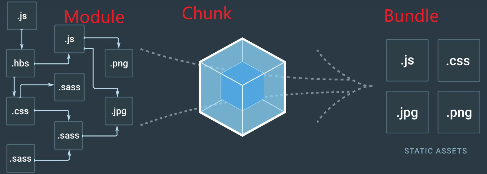
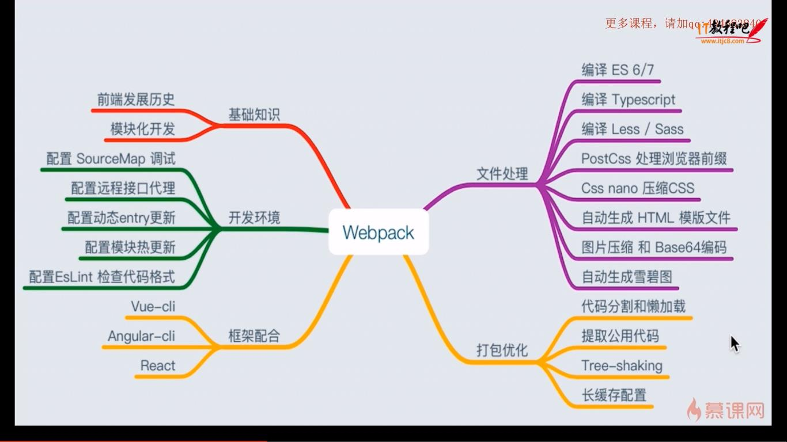

[webpack文档](https://webpack.docschina.org/concepts/) 

[createapp](https://createapp.dev/)：在线自定义 webpack 配置

[代码更新时自动编译](https://webpack.js.org/guides/development/#choosing-a-development-tool) 

1. webpack's [Watch Mode](https://webpack.js.org/configuration/watch/#watch)
2. [webpack-dev-server](https://github.com/webpack/webpack-dev-server) ：热加载，其他方式都没有
3. [webpack-dev-middleware](https://github.com/webpack/webpack-dev-middleware) 

> [代码拆分](https://webpack.js.org/guides/code-splitting/)

- SplitChunksPlugin：提取公共依赖
- [`mini-css-extract-plugin`](https://webpack.js.org/plugins/mini-css-extract-plugin): Useful for splitting CSS out from the main application.


# 目的

- 命名chunk: `output.chunkFilename: '[name].[hash:8].js'`
- webpack 提高编译速度: `rulesp[0].include = [paht.resolve(__dirname, 'src')]` 
-  性能优化: `cfg.optimization.splitChunks.chunks = "all"` 

> 前端项目配置

- 开发环境/生产环境
- 环境变量
- mock
- webpack-dev-server
- 开发环境公共样式分离为单独的css文件
- 生产环境需要压缩 HTML/CSS/JS 代码
 - 生产环境需要压缩图片
- 开发环境需要生成 sourcemap 文件
- 开发环境需要打印 debug 信息
- 开发环境需要 live reload 或者 hot reload 的功能

# 输出格式

相关配置项
1. mode
2. target
3. output.chunkFormat

# 概念

 

- module：源码、静态资源、less、ts、js 等
- [chunk](https://webpack.js.org/concepts/under-the-hood/#chunks)：多模块合成，如 entry import() splitChunk
  - Module 被组合成 chunks，chunks 组合成 chunk groups，并通过 modules 相互连接形成一个图（块组图）。当你描述一个入口点时——在幕后，你通过一个 chunk 创建一个 chunk group。
- bundle：最终输出的文件

webpack 的应用场景主要是 SPA (单页面富应用)，而 SPA 的核心是前端路由，那怎么算是SPA？

- 在前后端分离的基础上加一层前端路由。（路由就是网址）
- 专业的讲就是：每次GET、POST在服务器端有一个专门的正则配置列表，然后匹配到具体的路径后，分发到不同的Controller，进行各种操作，最后将HTML或数据返回给前端，这就完成了一次IO。

**web 开发模式**

- 后端路由（多页面）：页面可以在服务端渲染好直接返回给浏览器，不用等待加载JS和CSS文件就能显示网页。缺点在于模本由后端维护或改写，前端开发需要安装整套的后端服务，必要时还需运用PHP、JAVA这类的非前端语言来改写HTML结构，所以HTML和数据、逻辑混为一谈。

- 前后端分离：后端只提供API返回数据，前端通过Ajax获取数据后，再用一定的方式渲染页面，这样后端专注于数据，前端专注于交互和可视化。缺点在于首屏渲染需要时间加载JS和CSS文件，这种开发模式被多数公司认同，也出现了很多前端技术栈，比如JQuary+artTemplate+Seajs(requirejs)+gulp 为主的开发模式可谓是万金油。

- 大前端：得益于Node和JavaScript的语言特性，HTML模本可以完全由前端控制，同步或异步渲染完全由前端自由决定，并由前端维护模板。


## webpack结构

  

- webpack 是用来处理模块间的依赖关系，并对他们进行打包。
- webpack 基于node，在node环境下运行，可以使用ES6的模块加载方法;
- npm 命令根据 package.json 配置文件执行，在该文件中设置webpack使用的命令及哪个配置文件；
- `entry` 可以有多个，但`output` 只能有一个


## 构建流程

从启动webpack构建到输出结果经历了一系列过程，它们是：

1. 合并配置：读取配置文件，合并从 shell 传入的参数，生成最后的配置结果。
2. 注册插件：注册所有配置的插件，好让插件监听 webpack 构建生命周期的事件节点，以做出对应的反应。
3. 模块解析：从 `entry` 入口文件开始解析文件，找出每个文件所依赖的文件，递归下去构建完整的【依赖图】。
4. 模块编译：根据 loader 配置对不同类型的模块进行编译转换（ts转换为js，less转换为css等）。
5. 模块打包：将编译后的模块组合成多个包含多个模块的 Chunk，再将 chunk 打包为一个或多个 bundle ，最后输出所有 bundle 到文件系统。
   - 入口文件：每个入口文件会创建一个新的 chunk，多个入口文件，可能会产出多条打包路径，一条路径就会形成一个 chunk
   - 异步模块：动态导入的模块会创建新的 chunk
   - 代码拆分：代码分割也会产生 chunk，通过配置 optimization.splitChunks，可以将代码进行分割，把一些公共的模块或者符合特定条件的模块单独打包成一个 chunk
   - 通常情况下一个 chunk 会生成一个 bundle，但是会根据【代码拆分】和【optimization】配置进行处理
6. 需要注意的是，在构建生命周期中有一系列插件在合适的时机做了合适的事情，比如 `UglifyJsPlugin` 会在 loader 转换递归完后对结果再使用 `UglifyJs` 压缩覆盖之前的结果。

在 Webpack 中，`chunk`（代码块）和`bundle`（打包后的文件）有以下区别：
- **chunk**：
  1. 是模块的集合，可以包含一个或多个模块。
  2. 可以由多个源文件生成。
  3. 可以是动态加载的模块。
  
- **bundle**：
  1. 是最终输出的打包结果，通常是一个或多个文件。
  2. 是由多个`chunk`组合而成的。


# loader

loader 处理项目中各种类型的依赖文件，webpack 默认可以处理 JS、JSON 文件。

- webpack 只能理解 **JS** 和 **JSON** 文件，其他类型的文件需要用 loader 处理并被 loader 转换为有效的模块，然后添加到依赖图中。
- loader 可以将文件从不同的语言（如 TypeScript）转换为 JavaScript 或将内联图像转换为 data URL。loader 甚至允许你直接在 JavaScript 模块中 `import` CSS 文件！
- webpack 的其中一个强大的特性就是能通过 `import` 导入任何类型的模块（例如 `.css` 文件），
- 所有的 loader 按照**前置 -> 行内 -> 普通 -> 后置**的顺序执行
- `webpack.config.js` 中配置多个 loader 时按从后往前（从右往左）的顺序执行。

## 常用loader

- css文件处理：style-loader css-loader
- 字体和静态图像:  file-loader
```json
{
  test: /\.(png|svg|jpg|gif)$/,
	use: [
		'file-loader',
	],
},
```

- 压缩图像: [image-webpack-loader](https://github.com/tcoopman/image-webpack-loader)、[url-loader](https://webpack.docschina.org/loaders/url-loader)（图像转为base64） 

## 自定义loader

Loader 本质上是一个函数，它接受源文件作为参数，并返回转换后的结果

```js
/**
 *
 * @param {string|Buffer} content 源文件的内容
 * @param {object} [map] 可以被 https://github.com/mozilla/source-map 使用的 SourceMap 数据
 * @param {any} [meta] meta 数据，可以是任何内容
 */
function webpackLoader(content, map, meta) {
  // 你的 webpack loader 代码
}
```


[编写loader](https://webpack.js.org/contribute/writing-a-loader/)  


## loader 和 plugin的区别

- webpakc中每个文件都视为一个模块，webpack 核心只能处理JS文件(模块)，所以需要loader对非JS文件进行转换，loader不影响构建流程；
- 对于loader，它是一个**转换器**，将A文件进行编译形成B文件，这里操作的是文件，比如将A.scss转换为A.css，单纯的文件转换过程。【导出为函数的模块，对匹配的文件进行转换；】
- plugin是一个**扩展器**，它丰富了webpack本身，针对是loader结束后。webpack打包的整个过程，它并不直接操作文件，而是基于事件机制工作，会监听webpack打包过程中的某些节点，执行广泛的任务，包括：打包优化，资源管理，注入环境变量。
  - 带有apply方法的对象，apply方法被webpack的编译器调用；在构建过程中注入钩子函数来扩展 webpack 的功能；

- [webpack 中 loader 和 plugin 的区别是什么](https://github.com/Advanced-Frontend/Daily-Interview-Question/issues/308)


# 插件

> 常用插件

- 生成html文件: html-webpack-plugin
- 压缩js代码: uglifyjs-webpack-plugin
- 定义环境变量: DefinePlugin，内置插件`webpack.DefinePlugin`
- 分离单独的css文件: extract-text-webpack-plugin
- 分离单独的css文件: [MiniCssExtractPlugin](https://webpack.docschina.org/plugins/mini-css-extract-plugin/#minimizing-for-production) 插件会将 CSS 提取到单独的文件中，为每个包含 CSS 的 JS 文件创建一个 CSS 文件，并且支持 CSS 和 SourceMaps 的按需加载

## 自定义插件

webpack 插件是一个具有 apply 方法的【对象】。apply 方法会被 webpack compiler 调用，并且在整个编译生命周期都可以访问 compiler 对象。

> 如何自定义webpack插件

- JavaScript 命名函数
- 在插件函数 prototype 上定义一个apply 方法
- 定义一个绑定到webpack 自身的hook
- 处理webpack内部特定数据
- 功能完成后调用webpack 提供的回调

```js
// ConsoleLogOnBuildWebpackPlugin.js
const pluginName = 'ConsoleLogOnBuildWebpackPlugin';

class ConsoleLogOnBuildWebpackPlugin {
  apply(compiler) {
    // compiler.hooks.someHook.tap
    compiler.hooks.run.tap(pluginName, (compilation) => {
      console.log('webpack 构建正在启动！');
    });
  }
}
module.exports = ConsoleLogOnBuildWebpackPlugin;
```

[writing-a-plugin](https://www.webpackjs.com/contribute/writing-a-plugin/ ) 

# [code splitting](https://webpack.js.org/guides/code-splitting/)

# [Bundle Analysis](https://webpack.js.org/guides/code-splitting/#bundle-analysis)

# webpack配置

> [自定义配置UI](https://createapp.dev/webpack/vue--babel--typescript) 

# 依赖管理

> https://webpack.js.org/guides/dependency-management/

> 动态导入 require.context

[require.context](https://v4.webpack.js.org/guides/dependency-management/#requirecontext) 
[动态导入](https://v4.webpack.js.org/api/module-methods/#dynamic-expressions-in-import) 

`require('./template/' + name + '.ejs');`
`require.context('./test', false, /\.test\.js$/);`

使用 `import(somepath)` 动态导入资源时，资源路径不能完全是一个变量，必须以字符串开头。

如果路径指向父级目录，要避免出现循环引用

## 自动加载组件|路由

```js
var requireComponent = require.context("./src", true, /^Base[A-Z]/)
requireComponent.keys().forEach(function (fileName) {
  var cfg = requireComponent(fileName)
  cfg = cfg.default || cfg
  var componentName = cfg.name || fileName.replace(/^.+\//, '').replace(/\.\w+$/, '');
  Vue.component(componentName, cfg)
})
```

# svg处理

1. 读取 svg 文件
2. 压缩svg
    svgo-loader
3. 生成组件

# 热更新

Webpack的热更新（Hot Module Replacement，简称HMR）是一种在不完全刷新页面的情况下，更新运行时应用程序模块的技术。这在开发过程中非常有用，因为它可以**保持应用程序的状态**，减少开发时间，并提供更好的开发体验。

Webpack 热更新通过监视文件变化、生成补丁、通知客户端并应用更新来实现模块的热替换。

## Webpack 热更新的原理

Webpack热更新的原理可以概括为以下几个步骤：

1. **监视文件变化**：
   - Webpack Dev Server 或者其他构建工具会监视项目中的文件变化。

2. **编译更新的模块**：
   - 当文件发生变化时，Webpack只重新编译受影响的模块，而不是整个项目。这生成了一个新的编译结果。

3. **通知客户端**：
   - Webpack Dev Server 使用 WebSocket 连接将变更通知客户端（浏览器）。

4. **客户端接收更新**：
   - 客户端通过 WebSocket 接收到更新的模块信息。

5. **应用更新**：
   - 客户端使用新的模块替换旧的模块，更新应用程序的状态。不同类型的模块（如JavaScript、CSS、HTML等）会有不同的处理方式。

## 详细工作流程

以下是Webpack热更新的详细工作流程：

1. **启动 Webpack Dev Server**：
   - 开发服务器启动时，会在后台运行 Webpack 编译器，并通过 WebSocket 与客户端（浏览器）保持连接。

2. **文件变更检测**：
   - Webpack 使用 `watch` 模式监视文件系统中的文件变化。当文件发生变化时，Webpack重新编译受影响的模块。

3. **生成更新补丁**：
   - Webpack 只编译变化的部分，并生成一个【更新补丁（patch）】，包含变更模块的hash、名称等信息。

4. **通过 WebSocket 通知客户端**：
   - 开发服务器通过 WebSocket 向客户端发送消息，通知有新的模块可用。

5. **客户端处理更新**：
   - 客户端接收到消息后，通过 AJAX 或 WebSocket 请求新的模块代码。

6. **模块替换**：
   - 客户端使用新的模块代码替换旧的模块，更新应用的状态。对于不同类型的模块，Webpack 使用不同的处理策略：
     - **JavaScript模块**：通常直接替换旧的模块，并调用模块的 `dispose` 和 `accept` 钩子函数进行清理和重新初始化。
     - **CSS模块**：可以直接替换 `<style>` 标签内容，无需重新加载页面。
     - **其他资源**：例如图片、HTML等，可能需要自定义的处理逻辑。


# 问题

- 代码分离，路由懒加载，如果资源（组件）文件不在 `src` 目录下，使用动态 `import` 不会打包为多个 chunk
- `entry.page`
- contenthash: 根据资源内容创建出唯一 hash，但是资源没有变化，每次build时hash还是会变化。因为webpack 在入口 chunk 中，包含了某些 boilerplate(引导模板)，特别是 runtime 和 manifest。（译注：boilerplate 指 webpack 运行时的引导代码）。
- 我们将 `lodash` 安装为 `devDependencies` 而不是 `dependencies`，因为我们不需要将其打包到我们的库中，否则我们的库体积很容易变大。
- 现在，如果执行 `webpack`，你会发现创建了一个体积相当大的文件。如果你查看这个文件，会看到 lodash 也被打包到代码中。在这种场景中，我们更倾向于把 `lodash` 当作 `peerDependency`。也就是说，consumer(使用者) 应该已经安装过 `lodash` 。因此，你就可以放弃控制此外部 library ，而是将控制权让给使用 library 的 consumer
- [创建library](https://webpack.docschina.org/guides/author-libraries/) 

# 参考

[webpack定制前端开发环境](https://www.kancloud.cn/sllyli/webpack/1242347) 
[webpack 概念-解释](https://mp.weixin.qq.com/s?__biz=MjM5NTEwMTAwNg==&mid=2650306445&idx=1&sn=4ec67967ba6352fb168b4cf68af1930d&chksm=bef177ac8986feba165cd9bc818747832c52bba9100f634f61cc7911027acef2ba18adce5ba2&scene=21#wechat_redirect)
