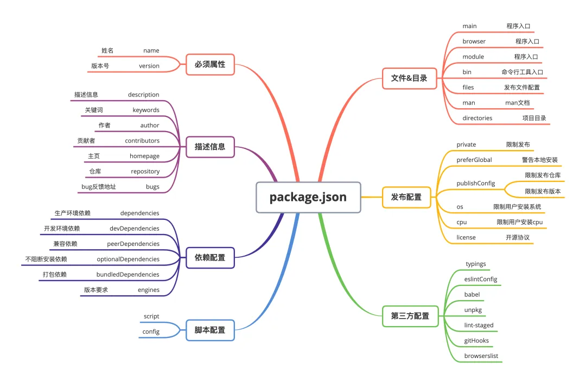
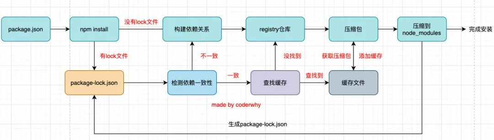

# 概述

 

[npm文档](https://docs.npmjs.com/) 

[github package](https://github.com/features/packages)

[GitHub Packages](https://docs.github.com/en/packages/learn-github-packages/introduction-to-github-packages) 

[private package](https://docs.npmjs.com/about-private-packages) 

[package.json中的main | module | browser](https://github.com/SunshowerC/blog/issues/8) 

package.json files 字段？

- 发布 npm 包时需要对外发布的文件

## 入口文件

[package.json 入口文件等属性说明](https://mp.weixin.qq.com/s/gJjXWVESk9clqapNZk5Gjw) 

main、module、browser 三个的入口入口文件相关的配置是有差别的，特别是在不同的使用场景下。

- 在Web环境中，如果使用loader加载ESM（ES module），那么这三个配置的加载顺序是browser→module→main
- 如果使用require加载CommonJS模块，则加载的顺序为main→module→browser。

Webpack在进行项目构建时，有一个target选项，默认为Web，即构建Web应用。如果需要编译一些同构项目，如node项目，则只需将webpack.config.js的target选项设置为node进行构建即可。

如果在Node环境中加载CommonJS模块，或者ESM，则只有main字段有效。

# nodejs 配置

## 全局安装路径配置


设置 npm config

`npm config set prefix <全局安装路径>`

`npm config set cache <全局缓存路径>`


配置环境变量

1. mac 环境

将 `<全局安装路径>/bin` 加入到 `~/.bash_profile` 或 `~/.zshrc`，然后执行 `source ~/.zshrc`


# [npm registry](https://docs.npmjs.com/cli/v8/using-npm/registry) 

> scope

将一个scope 与 npm registry 关联，一旦一个作用域与一个注册表相关联，任何带有该作用域的软件包的npm安装将从该注册表请求软件包。任何包含该范围的软件包名称的npm发布都会被发布到该注册表。[参考](https://docs.npmjs.com/cli/v8/using-npm/scope) 

Each npm user/organization has their own scope, and only you can add packages in your scope.


> 某个 scope 与 registry

混合使用来自 npm registry 和私有 registry 的包

```shell
npm login --registry=http://reg.example.com --scope=@myco
或者
npm config set @myco:registry http://reg.example.com
```

## [发布包](https://docs.npmjs.com/creating-and-publishing-unscoped-public-packages) 

npm 官网注册账号


1. 使用`npm login` 和 npm 账号在本地登录npm
2. 带 `scope` 的包名必须用 organization name 作前缀，每个npm用户/组织都有自己的范围，而且只有你能在你的范围内添加软件包。这意味着你不必担心有人抢先使用你的软件包名称。因此，这也是一个为组织发出官方软件包信号的好方法。

# 版本管理

- `^2.2.0`:  2.2.0 到 2.x.x  主版本号不变
- `~2.2.0`:  2.2.0 到  2.2.x  次版本号不变
- `>2.2.0`:  2.2.0 到  最新版本

[包版本查询](https://semver.npmjs.com/) 

## 锁定 Node.js 版本和包管理器

> 锁定node版本

```json
// package.json
"engines": {
  "node": "16.13.2 || 16.16.0"
},
```

同时在项目根目录下新增 `.npmrc` 文件，并编辑

```json
engine-strict = true
```

以上配置会在执行 `npm install` 时检查 nodejs 版本


> 锁定包管理器

利用 only-allow 工具包、npm scripts 快速实现锁定

```shell
npm install -D only-allow
```

然后在 ` package.json` 中添加

```json
"scripts": {
  "preinstall": "only-allow npm",
  # 或
  "preinstall": "only-allow pnpm",
  # 或
  "preinstall": "only-allow yarn",
}
```

# npm 依赖

在安装一个 package，而此 package 要打包到生产环境 bundle 中时，你应该使用 `npm install --save`。如果你在安装一个用于开发环境的 package 时（例如，linter, 测试库等），你应该使用 `npm install --save-dev`。

> dependencies、devDependencies 和 peerDependencies 的区别

当一个 package(pkg-xx) 提供给其他人使用时，这个 package 的 package.json 的 dependencies、devDependencies 和 peerDependencies 配置决定了 `npm i pkg-xx` 时哪些依赖包被安装
- dependencies: `npm i pkg-xx` 时会安装对应的依赖包
- devDependencies：不会安装
- peerDependencies：
  - npm v8.x.x 会自动安装 `peerDependencies` 依赖，之前版本的 npm 不会自动安装
  - `peerDependencies` 和 `devDependencies` 的区别：devDependencies 表示开发依赖，源码中应该要引用该依赖(`import` 或 `require`)，peerDependencies 源码中不用引用

## 依赖冲突

项目 project 中依赖组件 B、C 两个组件，组件 B、C 的依赖项中都有组件 A

- B 中对 A 的版本指定为 @latest，C 对 A 的版本指定为 C@1.0.0，在项目 project 中执行 npm install 时，安装的组件 C 的版本是 1.0.0
- B 中对 A 的版本指定为 @latest，C 对 A 的版本指定为 C>=1.0.0，在项目 project 中执行 npm install 时，安装的组件 C 的 latest 最新版本

- B 中对 A 的版本指定为 @latest，C 对 A 的版本指定为 C@1.0.0，在项目 project 的 package.json 中指定组件 C 的版本为以下情况时，执行 npm install 安装的组件 C 的版本分别对应：
  - package.json 中指定为 @latest，安装后的版本为 latest
  - package.json 中指定为 >=1.0.0，安装后版本为 latest
  - package.json 中指定为 @2.2.0，安装后版本为 2.2.0

# package-patch

修复 npm 包中的问题：项目中使用了第三方 npm 包并且这个包出现了 bug，如何快速修改 bug？

`patch-package`允许开发人员直接在`node_modules`中进行必要的修改，然后将这些更改保留为补丁，可以在安装期间自动应用。这意味着您可以修复依赖项中的bug，并立即与整个团队共享该修复，而无需分叉或等待上游更改。

```shell
npm install patch-package -D 
```

pnpm 自带了 [patching dependencies](https://pnpm.io/cli/patch) 功能，所以只有在使用 npm 或 yarn 时需要安装使用 `patch-package` 包

# 常用命令

- 查看全局包: npm list -g --depth 0sdps

- 安装全局包: npm i -g xx

- 删除全局包: npm uninstall -g vue

- 创建软链接: [npm link](https://docs.npmjs.com/cli/v8/commands/npm-link) [解读](https://juejin.cn/post/6844903960805900295) [npx link](https://www.npmjs.com/package/link) 

## npx

npx的作用非常多，但是比较常见的是使用它来调用项目中的某个模块的指令。npx 会到当前目录的node_modules/.bin目录下查找对应的命令

## npm install

> install 执行流程

 

1. 没有 package-lock.json 文件，从 registry 仓库下载，走顶层逻辑

     - 分析依赖关系，这是因为我们可能包会依赖其他的包，并且多个包之间会产生相同依赖的情况；
     - 从registry仓库中下载压缩包（如果我们设置了镜像，那么会从镜像服务器下载压缩包）；
     - 获取到压缩包后会对压缩包进行缓存（从npm5开始有的）；
     - 将压缩包解压到项目的node_modules文件夹中（前面我们讲过，require的查找顺序会在该包下面查找）

2. 有 lock 文件

     - 检测lock中包的版本是否和package.json中一致（会按照semver版本规范检测）
     - 一致的情况下，会去优先查找缓存，若查找到缓存会获取缓存中的压缩文件，并且将压缩文件解压到node_modules文件夹中，若没有查到缓存会从registry仓库下载，直接走顶层流程
     - 不一致，那么会重新【构建依赖】关系，直接会走顶层的流程


> npm install 失败

```
npm install --force --legacy-peer-deps --ignore-scripts
npm i -g nrm open@8.4.2 --save
```

# 常用包

- npm 源管理: nrm  `npm install -g nrm open@8.4.2 --save`
- n nvm nvm-windows: [一台电脑上管理多个node版本](https://docs.npmjs.com/downloading-and-installing-node-js-and-npm) 
- [qnm](https://mp.weixin.qq.com/s?__biz=Mzk0MDMwMzQyOA==&mid=2247494849&idx=1&sn=c76a70a8a99c6b71ee3416a09b7e29a6&chksm=c2e119eaf59690fc20307072e7e144c38270ee5b90843dfee1a3341f4c5a6faed4007e9591e0&cur_album_id=2160461465567166470&scene=189#wechat_redirect)：帮助我们快速梳理前端依赖信息，并且同时支持 npm 和 yarn

# npm script

[npm script 使用指南](https://www.ruanyifeng.com/blog/2016/10/npm_scripts.html) 
[Node.js 命令行程序开发教程](https://www.ruanyifeng.com/blog/2015/05/command-line-with-node.html)  


> 利用Windows软连接共用一个node_modules

多个项目共用一个node_modules

`mklink /d <项目路径>\node_modules <公共node_modules路径>`


> npm package.json script

- process.argv  <==  `npm run xx -- -val=xx`
- process.env.npm_config_xxx  <==  `npm run xx -val=xx` 
- process.env.npm_package_config_xx <=== package.json 中配置 `{ config: { xx: '12' } }` 


- `-` 或 `--` 开头会作为参数传递给 npm ，通过 `process.env.npm_config_xx` 读取
  - 例如`npm run proxy --help`， `--help` 传递给 npm 
- `npm run script -- -name`:  中间的 `--` 会停止将之后的字符解析为参数，不在传递给 npm，通过 `process.argv` 读取

> exampel

- bash版本
```shell
#!/bin/bash
registry=$(npm config get registry);
if ! [[ $registry =~ "http://registry.x.com" ]]; then
    npm config set @xscope:registry https://abc.com/npm/
fi
```

- node版本
```js
#!/usr/bin/env node
const { exec } = require('child_process');

exec('npm config get registry', function(error, stdout, stderr) {
    if (!stdout.toString().match(/registry\.x\.com/)) {
        exec('  npm config set @xscope:registry https://abc.com/npm/');
    }
});
```

> 三方库
- [google/zx](https://github.com/google/zx) : 用 JS 编写 Shell 脚本
- cross-env: 环境变量


# 脚手架

[构建前端CLI脚手架-交互式命令](https://mp.weixin.qq.com/s?__biz=Mzg5ODA5NTM1Mw==&mid=2247501024&idx=1&sn=3a098b2838454c7575e17747b9d7430a&chksm=c0654576f712cc60e2c32412757201dba7f39be01057e95b515ec8578144f57d90b42e1d07c9&mpshare=1&scene=24&srcid=0821d8fkl0Ntxc2EvromlgMR&sharer_sharetime=1692585996849&sharer_shareid=e28b67c27c5f7912e475b507d990c42c#rd%E3%80%81) 