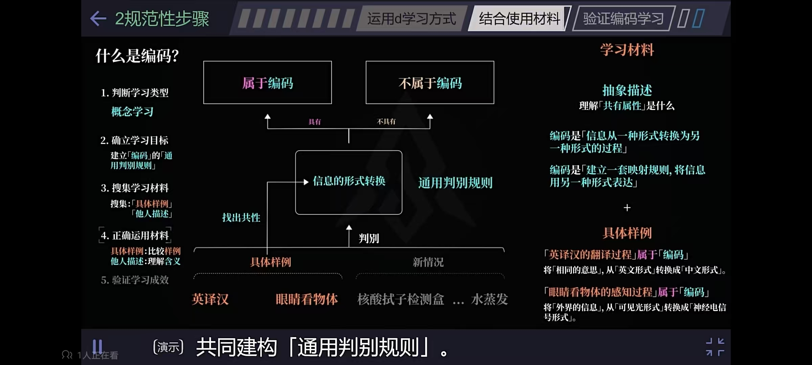

重复刻意练习 --->  测试 --->  产出 --->  反馈 + 奖励

输入 ---> 提取 ---> 回想（二八原则） ---> 测试（费曼） ---> 反馈

- 用「过程性反馈」替代「结果性评价」

偶然必然，量变质变

口默念而心得解

**使用的时候怎么用，学习的时候就怎么学，确定学习的场景和输入**

- 想在什么情况下使用，就在什么情况下学习
- 学习时模拟使用（应用）是的情况场景。在未来需要用某个知识的时候应该怎么用（选择题、填空题...）
- 明确应用场景

**输入信息时（阅读）怎么做**

1. 我获取到了什么信息？
2. 提炼：核心是什么？
3. 如果换成我，我会怎么做？
4. 联系，与哪些东西关联？

- 一定要明确输入和输出，然后分析输入到输出之间的逻辑关系
  
- 【提取】和【回想】知识让我们不再是重复的机器，在学习中进行回想——让大脑提取关键信息，而非通过重复阅读被动地获取知识。
  - 利用重读间隔进行回想，重读开始前的间隔时间才是真正有效的部分。提取过程本身增加了学习的深度。

- 针对困难 的学习内容，读一遍，拿开，回忆，同时理解正在回忆的内容，再把目光转回来，重复练习，增进对内容的理解。

# 实践步骤

**需要什么？**

&nbsp;        时间 + 一定的难度 + 专业指导（正确的答案）

**过程**

1. 设定一个任务：学一门知识、技能、看书、考试
2. 任务分解：具体到时间、任务量
3. 阅读、理解、拆解、模仿、深度加工、关联
4. 测试 + 反馈 ===> 正向反馈（奖励），调整学习过程

     - 及时反馈 - 进度条，设置奖励机制

     - 抓住引领性的指标
5. 抗遗忘：及时复习（遗忘曲线）
     - 《百家讲坛》王立强谈读书：每天结束时将今天所学复习一遍，每周结束时将这周所学复习一遍，每月、每年也是如此
     - 《打开心智》中作者谈到，自己每天闲暇时都会把之前做过的事情、读过的内容、学到的知识在脑中回放一遍，自然就会记得更牢

**结果：**

&nbsp;       最终要达到什么样的效果？

> 一、提出问题

提出一个【明确】的问题，相当于一个焦点，将目光、注意力汇聚到这一点上进行思考和扩展

理解这个【问题的来源】，怎么来的，依据是什么？理解了问题是什么就完成了一半；

具体做法：

- 头脑风暴，提出多个问题

明确输入

- 脑中的声音也是一种输入
- 比如背诵演讲稿，输入不是文稿的反光，而是实际演讲场所中的所以信息，某个座位、声音、灯光、演讲者的某个动作（扶眼镜）
  - 最有效的方式就是在实际要演讲的场地进行练习
- PPT演讲中，PPT上的图片是一种输入
  - 具体操作：先看文稿中的一句、段话，然后看着对应的PPT图片（或者做着某个肢体动作）的同时复述这句话。重复上述步骤。

当阅读、处理外界输入的信息时思考：

1. 我获取到了什么信息？
2. 提炼：核心是什么？
3. 如果换成我，我会怎么做？
4. 联系，与哪些东西关联？

> 二、搜集信息

关键：

1. 减少干扰
2. 简化信息、除去冗余信息
3. 信息的准确性
4. 足够的信息量
5. 学习内容应以核心概念、经典理论为主，目标是形成以大观点组织知识的能力，而非表面信息。

怎么做？

1. 眼到、口到、心到、手到
2. 认真严肃的态度
3. 画图、笔记

- 大脑的理解速度比阅读速度快，所以不要用指读，而用眼睛快速的移动。
- 大脑和身体经常交流，如果身体很懒散，大脑就会认为当前做的事情不重要。
- 在视野（脑海心中）中只留下重要的对象，即心无旁骛。

> 三、理解、扩展

- 想象、关联其他知识点
- 总结关键字、关键点
- 前因后果、追根究底

> 四、测试

增加学习【难度】，与正确的“答案”形成对比，看清差异

- 必要难度 + 测试效应：简单的东西意味着不重要，因此大脑更容易遗忘

例子：

- 冯唐读史书、王云伍学英语（高手的指导）

验证是否理解某个知识：

- 费曼技巧
  - 用自己的话描述（模拟面试，如果被别人问到这个问题怎么回答）
  - 用所学知识生成其他语言描述

- 用已经建构的知识预测（解决）新问题
- 举一反三

> 五、应用 | 输出

学的东西需要运用、时间、练习---这才是真正提高的实质，单纯的知识输入更轻松，却无法获得提高。

熟悉一个知识的最好方法就是【运用】，你可以更早的构建知识联结，而不是等到你学满之后再去运用，这样可以减少你的记忆量，帮助你更快的学习。

有效的训练 = 实际执行 + 反馈、纠正
- 看三遍不如做一遍

**学以致用**

- 找到应用知识的各种途径

- 在实际生活中的应用、体现、价值

快速【产出】和迭代的重要性远比你想象的要大（**笔记**）

重复练习（量变引起质变）

- 每天练习 3-5 小时（练习什么？）
- 每天练习每次争求小的【质变】，而非量多，把小的地方做到极致，再迁移到其他地方。让每一次时间的投入都保证产生质变，即便是最小的质变也比量变好---【最小质变原则】。

学而时习之，追根究底，多问为什么，直到不能再解释。

如何快速内化某个知识

1. 频繁的高强度的外部刺激
2. 自主的有意识的反复提醒

## 复盘

复盘，从来都不是去追问过去「我之前都干了些什么」，而是聚焦未来：**「我所经历的一切，对将来有什么帮助」？**

- 练习那些稍微超过现有能力的事情（跳起来才能触摸到的程度，专注必须伴随着挑战,限定时间）；

- 什么样的信息，才是真正被我们内化掌握的？用自己的话讲出来,即**复述**(分解信息之后，用自己的话重构)；

GRAI复盘法：这个复盘法有4个步骤，即Goal（目标回顾）、Result（结果陈述）、Analysis（过程分析）、Insight（归类总结）。具体来说，可以按照这个顺序来展开：

1. 回顾目标：当初的目标、任务或期望是什么；
2. 评估结果：采取了什么行动，和原定目标相比，有哪些亮点和不足；
3. 分析原因：事情成功和失败的根本原因，包括主观和客观两方面；
4. 总结规律：通过以上的分析找到更有效、更符合本质规律的做法，比如需要实施哪些新举措，需要继续哪些措施等。

# 学习规律

**基于心里学研究的高效学习策略**

1. 测试效应：测试比重复再现的长期学习效果好
2. 必要难度理论：以感受到困难的方式学习比感受轻松的学习，长期效果更好
3. 变动效应：变换学习的方式和环境，比一成不变的学习，其学习的长期效果更好。
4. 分散效应：分散时间的学习比集中式学习的长期效果更好。
5. 交错效应：不同内容交错学习

大多数技能的新鲜感都呈现U型曲线；刚入门时新鲜感最高,随着掌握程度提升，会进入一个平台期,这是需要大量的练习，新鲜感会慢慢减低；

- 过了这个阶段才算入门，之后你会接触到更多的技巧、知识，新鲜感会逐渐攀升，并稳定在一个较高水平。
- 为了度过U型的谷底阶段，你需要将目光集中在内部和过程，关注逐渐每一次的进步和收获，关注动手后的反馈，从中获得成就感；

在最少的时间内接受最大量的信息和训练才能爆发小宇宙。

最有效的学习需要一个**明确的任务**，有适当的难度、信息反馈、重复和纠错的机会。

# 专注

- 专注必须伴随着【挑战】，注意力不能长期保持稳定而是周期变化（25分钟）
  - 在有限的时间内，我们总是非常专注并且有效率。

- 你的注意力在哪里，能量就在哪里，成长就在哪里
  - 专注即是一种选择，舍弃所有不值得关注的东西，剩下的就是你要专注的

- 提取和回想知识让我们不再是重复的机器，在学习中进行回想——让大脑提取关键信息，而非通过重复阅读被动地获取知识。
  - 利用重读间隔进行回想，重读开始前的间隔时间才是真正有效的部分。提取过程本身增加了学习的难度。

- 针对困难的学习内容，读一遍，拿开，回忆，同时理解正在回忆的内容，再把目光转回来，重复练习，增进对内容的理解。

元认知：有关思考的思考，想想你怎样才会更加专注，什么时间地点、环境，考虑你是怎样思考的，了解你的学习方法理解的越多，需要记忆的就越少。

刻意练习要求持续关注难点，【回想】才是学习过程中最好的刻意练习方式。

刻意练习核心要素：
- 注意力全情投入到某个技能或概念上
- 及时的产出、反馈、调整

实现深度工作的主导力量是严肃认真致力于手头任务的【心理】，可以借助外部手段推动深度目标占据【心理优先位置】
- 比如：开始工作前整理大脑，清除干扰项，清除内存
- 烦扰心神之事是深度工作的大敌

# 记忆

二八原则：看1遍，回忆4遍。

专注的练习和重复是创造记忆痕迹的过程

- 一个记忆的好方法：让理解和回忆的次数符合【二八原则】，比如背一个单词，来回读一两遍(20%)，然后在脑海中回忆四五遍(80%)，回想我刚刚读到了什么。
  
- 我们在记忆的时候将许多线索（例如当时的场景、问题的背景，甚至所处的语言环境、空间位置）一并编码进了记忆，事后能否提取出这段记忆取决于提取线索是否丰富、以及在回忆的时候是否重现了记忆时的线索。
  - 提取线索：空间位置、声音、趣味，所谓的上下文(运行环境)，对认知、学习的潜在影响；

- 形象化：与文字相比，图片更能让人记住；因为大脑更喜欢看得见的东西。
- 交谈式风格：与人进行对话时，注意力更加集中。所以在看书时可以想象成与书本对话。
- 记忆力很大程度上取决于所记内容对我们的情绪有这样的影响。如果是我关心的东西，就更能记住，如果让我感受到了什么（惊讶、好奇、有趣、想知道问什么等），这些东西就会留在我的脑海中。(**是什么原因让某些东西留在脑海中挥之不去？？？**)
  - 如果解决了一个难题，学会了其他人都觉得很难的东西，这些都会产生一种自豪感，同时也更让记忆更加深刻。
  - 想的更深：尽可能让神经元活动起来，让更多的神经元参与思考。

- 我们不是因为强行让自己去记住一个知识点而把它记住，而是因为对它进行了思考，通过这种思考的过程，才能够真正把它牢牢记在脑海中。
- 大脑是用来思考的，不要拿来记忆。

**如何记住某些内容？**

大脑是用来思考的，不要拿来记忆。

每天闲暇的时候，都会把之前做过的事情、读过的内容、学到的知识在脑中回放一遍，自然就会记得更牢。

而对碎片时间最好的利用方式，不是阅读，不是学习，是思考。

# 阅读

**高效阅读包括两方面**

1. 快速将书本中的文字、图像映射到大脑中的能力；
2. 从阅读的【目的】出发，深刻理解映射到大脑中的文字、图像，并融入到自己的知识体系中；

对应的方法:

1. 避免音读，改用视读——一目十行，以向下移动的模式从左向右和从右到左进行阅读；
2. 多次阅读，克服一次读懂全部内容的心理障碍，不要指望一次读懂全部内容；
    根据艾宾浩斯遗忘曲线，多次少量记忆使得我们能小步快跑地稳定记忆。同时二次、三次及更多次的阅读也能够使我们有新的启发。

3. 避免音读和回读，通过视读来提升阅读速度，通过多次阅读来对抗遗忘曲线，进而保证书中的文字、图像快速映射到大脑，满足一定量的信息输入；

**阅读的时候怎么做？**

你的脑子里要有一张网络，每个知识点有明确的位置。看到它，你能迅速知道它在哪儿、跟哪些其他节点有联系，这才是最重要的。一切阅读、学习，最终都要归结到这张网络里面，才是真正有效的做法。

我们要去“记忆”的是什么呢？是关于知识的框架和位置。也就是说：对于一个知识点，我们要记住的是它的含义是什么；它的原理和机制大致是什么；它跟其他知识点之间有什么联系——这些就足够了

阅读真正的价值不在于把一本书的内容囫囵吞下去，不在于记住了多少原文，而在于你在阅读、学习的过程中，思维和作者产生了什么样的碰撞

## 如何阅读

一：读书前

- 明确问题(目标)，先在脑海中储备一定量的问题，相当于空瓶子，留出时间先自己思考会有哪些可能的解；再带着问题阅读，在阅读的过程中找答案，将空瓶子装满。

二：读书时

- 提取关键字；
- 时刻带着问题阅读，问题会筛选出你所关心的部分；
- 每段、章在讲什么？用1分钟时间写小结，强迫自己思考；

三：读书后

- 写读书笔记，针对重点问题查找其他资料。
- 在之后的学习生活中运用这些方法。把学到的东西归纳为可操作的步骤；每一天尝试实践；淘汰不适合自己的方法，将有益高效的方法深入思维，形成习惯。
- 看书学习之后留一段空白的时间，什么都不做，尽量放松。不要急着接收新的信息。

总结：读前提问题，阅后作总结

# 其他

[渐构](https://www.modevol.com/episode/i7e683lcotthtpqo69jewehn) 

