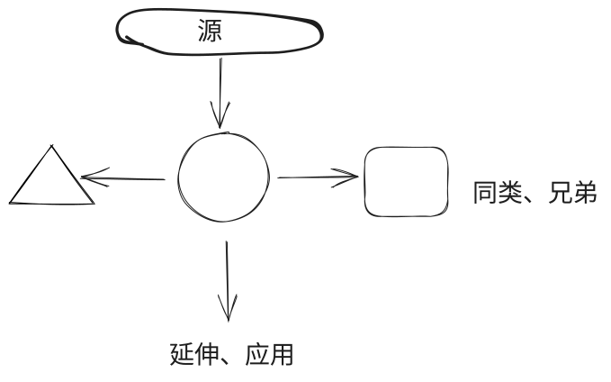
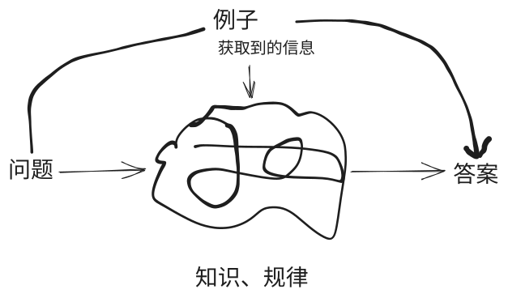

# 《如何高效学习》

> 一、创建知识间的关联

1. 为什么要创建关联？

    关联越多，理解约深，记忆越牢

2. 为什么可以创建关联？

    - 没有一个知识是独立存在的
    - 知识就是相互关联的事实，有效学习的本质就是理解和创造关联
    - 建立知识将的关联，就在创建结构

3. 如何创建关联？

      - 溯源（前因）

      - 同类（同级）对比，异同点

      - 延伸、扩展

 

1. 与熟悉的知识关联

2. 与现实生活中的例子类比（比喻、拟人、内化）

**日计划、周计划**

&nbsp;         减少做决定的次数，按照事先计划好的执行

**批量处理**

&nbsp;         能一次性完成的工作就一次性完成，不要分阶段（闭环处理）

一定要把知识变为一种行动上的习惯

思维方式也是一种习惯

将所学的知识变成指导我们生活、工作的下意识的东西，那就是习惯

# 《Deep work》

**什么是深度工作，深度工作的概念是什么？**

- 在无干扰的状态下专注进行职业活动，使个人的认知能力达到极限。这种努力能够创造新价值、提升技能，而且难以复制。
- 伴随深度工作而来的【精神紧张】状态对于提升我们的能力是必需的

# 《学习之道》

- 【提取】和【回想】知识让我们不再是重复的机器，在学习中进行回想——让大脑提取关键信息，而非通过重复阅读被动地获取知识。
  - 利用重读间隔进行回想，重读开始前的间隔时间才是真正有效的部分。提取过程本身增加了学习的深度。

- 针对困难的学习内容，读一遍，拿开，回忆，同时理解正在回忆的内容，再把目光转回来，重复练习，增进对内容的理解。

# 学习观-YJango

> 什么是学习？

从有限的例子（样本）中找到问题和答案之间的规律（函数）

&nbsp;        问题和答案都是变化的，但他们之间的映射关系是不变的	

&nbsp;        问题和答案是无穷的，用一种规律（函数关系）描述所有的问题和答案，即是对信息的压缩

&nbsp;                先把书📚读厚，再把书读薄：先输入大量的样本，从中找到规律

> 如何学习？

1. 明确问题和答案，输入、输出
2. 提供足够多的例子，用例子重塑大脑连接
3. 用新的例子验证知识的有效性

# 费曼技巧

用自己的话复述一遍之后理解得更深刻，实际上是更容易记住和提取出来——知识还是那些知识，作者的用语习惯和自己肯定不同，在提取信息时自己的话更容易想起。

费曼技巧有四个简单的步骤：

1. 选择一个概念；

2. 把它教给完全不懂的另外一个人(小孩、鸭子)；

   - 拿出一张白纸，在上方写下你想要学习的主题。想一下，如果你要把它教给一个孩子，你会讲哪些，并写下来。

   - 当你自始至终都用孩子可以理解的简单的语言写出一个想法（提示：只用最常见的单词），那么你便迫使自己在更深层次上理解了该概念，并简化了观点之间的关系和联系。如果你努力，就会清楚地知道自己在哪里还有不明白的地方。
   
3. 回顾：
   - 根据反馈发现错误、纠正错误或弥补不清楚的地方
   - 这是【学习开始的地方】。现在你知道自己在哪里卡住了，那么就回到原始材料，重新学习，直到你可以用基本的术语解释这一概念。（**这才是重点**）
   
4. 回顾后简化语言表达，条理化；
   - 现在你手上有一套自己手写笔记，检查一下确保自己没有从原材料中借用任何行话。将这些笔记用简单的语言组织成一个流畅的故事。

[费曼技巧-36氪](https://36kr.com/p/5078124) 

# 书籍电影

- 《看见成长的自己》  卡罗尔-德韦克
- 《看不懂的中国人》         梁晓声
- 《很多了不起，和钱没关系》 冯唐
- 《时间的朋友》
- 《每个人都活在套子里》
- 《复盘》                  柳传志
- 《理性动物》
- 《用理想和现实谈谈青春》  白岩松
- 《围城》
- 《身份的焦虑》
- 《暗时间》                刘未鹏
- 《巨婴国》
- 《你的知识需要管理》      田志刚
- 《思维力：高效的系统思维》王世民
- 《中国简史》              王小波
- 《给残酷社会的善意短信》  蔡康永
- 《黑客与画家》  保罗.格雷
- 《如何阅读一本书》
- 《学习的本质》
- 《人是如何学习的》
- [《约翰·克里斯朵夫》](https://www.ruanyifeng.com/blog/2005/09/post_146.html)