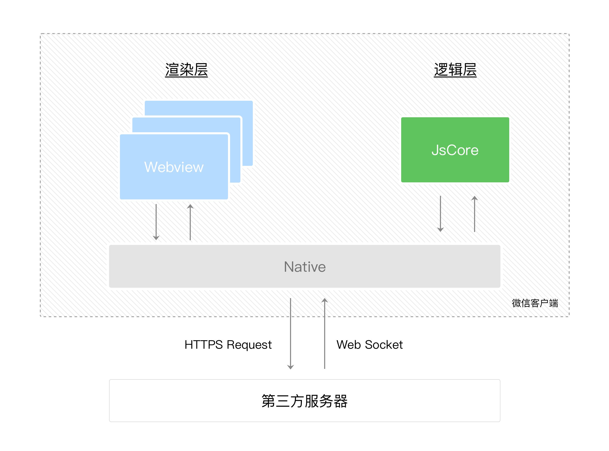

# 索引

- 语法检测
- 代码格式化

[密码管理小程序-demo](https://github.com/arleyGuoLei/wechat-1password)

[微信小程序开发资源汇总](https://github.com/justjavac/awesome-wechat-weapp) 

> [微信官方文档](https://developers.weixin.qq.com/doc/) 
> [小程序开发指南](https://developers.weixin.qq.com/ebook?action=get_post_info&docid=0008aeea9a8978ab0086a685851c0a) 
> [小程序管理后台](https://mp.weixin.qq.com/) 

小程序的逻辑层和渲染层是分开的，渲染线程和 JS 线程分别运行在不同的线程中，因此两者不互斥。

小程序内置的组件、API等都封装在【小程序基础库】中。渲染层注入的称为 WebView 基础库，逻辑层注入的是 AppService 基础库，而【基础库内置在微信客户端中】。

- 逻辑层运行在 JSCore 中，并没有一个完整浏览器对象，因而缺少相关的DOM API和BOM API。这一区别导致了前端开发非常熟悉的一些库，例如 jQuery、 Zepto 等，在小程序中是无法运行的。同时 JSCore 的环境同 NodeJS 环境也是不尽相同，所以一些 NPM 的包在小程序中也是无法运行的。

- 渲染层的界面使用了WebView 进行渲染，一个小程序存在多个界面，每个页面有自己的渲染线程，所以渲染层存在多个WebView线程

# [运行环境](https://developers.weixin.qq.com/miniprogram/dev/framework/quickstart/framework.html#%E6%B8%B2%E6%9F%93%E5%B1%82%E5%92%8C%E9%80%BB%E8%BE%91%E5%B1%82) 

[渲染层与逻辑层](https://developers.weixin.qq.com/ebook?action=get_post_info&docid=0000286f908988db00866b85f5640a) 

我们称**微信客户端**给小程序所提供的环境为**宿主环境**

小程序开发过程中需要面对的是两大操作系统 iOS 和 Android 的微信客户端，以及用于辅助开发的小程序开发者工具，小程序中三大运行环境也是有所区别的。

| **运行环境**     | **逻辑层**     | **渲染层**       |
| :--------------- | :------------- | :--------------- |
| iOS              | JavaScriptCore | WKWebView        |
| 安卓             | V8             | chromium定制内核 |
| 小程序开发者工具 | NWJS           | Chrome WebView   |

整个小程序框架系统分为两部分：逻辑层（App Service）和 视图层（View）。

小程序的运行环境分成【渲染层】和【逻辑层】，其中 WXML 模板和 WXSS 样式工作在渲染层，JS 脚本工作在逻辑层。

- 这两个线程的通信会经由微信客户端（下文中也会采用Native来代指微信客户端）做中转，逻辑层发送网络请求也经由Native转发
- 小程序提供了自己的视图层描述语言 WXML 和 WXSS，以及基于 JavaScript 的逻辑层框架，并在视图层与逻辑层间提供了数据传输和事件系统。将逻辑层的数据反映成视图，同时将视图层的事件发送给逻辑层。


 

客户端系统有JavaScript 的解释引擎（在iOS下是用内置的 JavaScriptCore框架，在安卓则是用腾讯x5内核提供的JsCore环境）

小程序的JS脚本是运行在JsCore的线程里，小程序的每个页面各自有一个WebView线程进行渲染，所以小程序切换页面时，小程序逻辑层的JS脚本运行上下文依旧在同一个JsCore线程中。

所有页面的脚本逻辑都跑在同一个JsCore线程，页面使用 setTimeout 或者 setInterval 的定时器，然后跳转到其他页面时，这些定时器并没有被清除，需要开发者自己在页面离开的时候进行清理。


## 应用实例

整个小程序只有一个 App 实例，是全部页面共享的。

每个小程序都需要在 `app.js` 中调用 App 方法注册小程序实例，绑定生命周期回调函数、错误监听和页面不存在监听函数等。

获取实例：`const appInstance = getApp()`

## 视图层

框架的视图层由 WXML 与 WXSS 编写，由组件来进行展示。

将逻辑层的数据反映成视图，同时将视图层的事件发送给逻辑层。

- WXML(WeiXin Markup language) 用于描述页面的结构。

  - 因为 WXML 节点标签名只能是小写字母、中划线和下划线的组合，所以自定义组件的标签名也只能包含这些字符。并且WXML 要求标签必须是严格闭合的。
  - WXML 属性名区分大小写

- WXSS(WeiXin Style Sheet) 用于描述页面的样式。

- WXS(WeiXin Script) 是小程序的一套脚本语言，结合 WXML 可以构建出页面的结构。

> 数据绑定

数据来自于页面Page构造器的data字段，例如绑定属性值

```xml
<text data-test="{{test}}"> hello world</text>
```
没有被定义的变量的或者是被设置为 undefined 的变量不会被同步到 wxml 中。

使用 `ths.setData` 修改状态并自动更新到渲染层。

> 动态渲染 | 模板

类似与动态组件
```xml
<template name="odd">
  <view> odd </view>
</template>

<template name="even">
  <view> even </view>
</template>

<block wx:for="{{ [1, 2, 3, 4, 5] }}">
  <template is="{{item % 2 == 0 ? 'even' : 'odd'}}"/>
</block>
```

> 导入

import 和 include


> 尺寸单位

rpx（responsive pixel）响应式单位，可以根据屏幕宽度进行自适应。

小程序编译后，rpx会做一次px换算。换算是以375个物理像素为基准，也就是在一个宽度为375物理像素的屏幕下，1rpx = 1px。

规定屏幕宽为750rpx。如在 iPhone6 上，屏幕宽度为375px，共有750个物理像素，则750rpx = 375px = 750物理像素，1rpx = 0.5px = 1物理像素。

## [运行机制](https://developers.weixin.qq.com/miniprogram/dev/framework/runtime/operating-mechanism.html) 

小程序的运行过程：

1. 微信客户端在打开小程序之前，会把整个小程序的代码包下载到本地
   - 从哪下载？

2. 通过 `app.json` 的 `pages` 字段就可以知道你当前小程序的所有页面路径
3. 微信客户端就把首页（pages 中的第一项）的代码装载进来，通过小程序底层的一些机制，就可以渲染出这个首页
   - 什么机制？
   - 微信客户端会先根据 `index.json` 配置生成一个界面，顶部的颜色和文字你都可以在这个 `json` 文件里边定义好。
   - 紧接着客户端就会装载这个页面的 `WXML` 结构和 `WXSS` 样式。
   - 最后客户端会装载 `index.js`
   - 在渲染完界面之后，页面实例就会收到一个 `onLoad` 的回调
4. 小程序启动之后，在 `app.js` 定义的 `App` 实例的 `onLaunch` 回调会被执行


冷启动小程序、热启动？

前台、后台？

# 页面

一个页面的源码由 wxml、wxss、js、json配置组件，wxml 和 js 必须有。

每一个小程序页面是由同路径下同名的四个不同后缀文件的组成，如：index.js、index.wxml、index.wxss、index.json。

- `.js`后缀的文件是脚本文件
- `.json` 后缀的文件是配置文件，
- `.wxss`后缀的是样式表文件，
- `.wxml`后缀的文件是页面结构文件。


在小程序代码调用 Page 构造器的时候，小程序基础库会记录页面的基础信息，如初始数据（data）、方法等。

- `Page` 构造器适用于简单的页面。但对于复杂的页面， `Page` 构造器可能并不好用，此时，可以使用 `Component` 构造器来构造页面。
-  `Component` 构造器的主要区别是：
  - 方法（包括页面的生命周期）需要放在 `methods: { }` 里面。
  - 可以像自定义组件一样使用 `behaviors` 等高级特性
  - 对应 json 文件中包含 `usingComponents` 定义段

需要注意的是，如果一个页面被多次创建，并不会使得这个页面所在的JS文件被执行多次，而仅仅是根据初始数据多生成了一个页面实例（this），在页面JS文件中直接定义的变量，在所有这个页面的实例间是共享的。


## 页面导航

- navigateTo、redirectTo 只能打开非 tabBar 页面。
- switchTab 只能打开 tabBar 页面。
- reLaunch 可以打开任意页面。
- 页面底部的 tabBar 由页面决定，即只要是定义为 tabBar 的页面，底部都有 tabBar。
- 调用页面路由带的参数可以在目标页面的onLoad中获取。

## [页面生命周期](https://developers.weixin.qq.com/miniprogram/dev/framework/app-service/page-life-cycle.html) 

[路由变化和切换tab时页面的生命周期调用](https://developers.weixin.qq.com/ebook?action=get_post_info&docid=0004eec99acc808b00861a5bd5280a)

## [路由](https://developers.weixin.qq.com/miniprogram/dev/framework/app-service/route.html) 

- 请求页面数据：`wx.onBeforePageLoad`

## 页面的用户行为

小程序宿主环境提供了四个和页面相关的用户行为回调：

1. 下拉刷新 onPullDownRefresh
监听用户下拉刷新事件，需要在app.json的window选项中或页面配置page.json中设置enablePullDownRefresh为true。当处理完数据刷新后，wx.stopPullDownRefresh可以停止当前页面的下拉刷新。

2. 上拉触底 onReachBottom
监听用户上拉触底事件。可以在app.json的window选项中或页面配置page.json中设置触发距离onReachBottomDistance。在触发距离内滑动期间，本事件只会被触发一次。

3. 页面滚动 onPageScroll
监听用户滑动页面事件，参数为 Object，包含 scrollTop 字段，表示页面在垂直方向已滚动的距离（单位px）。

4. 用户转发 onShareAppMessage
只有定义了此事件处理函数，右上角菜单才会显示“转发”按钮，在用户点击转发按钮的时候会调用，此事件需要return一个Object，包含title和path两个字段，用于自定义转发内容。
```js
// page.js
Page({
onShareAppMessage: function () {
 return {
   title: '自定义转发标题',
   path: '/page/user?id=123'
 }
}
})
```

## Tabbar页

xxx

# 状态管理

> 页面的状态管理

```js
Page({
  data: {
    text: 'init data',
    array: [{msg: '1'}, {msg: '2'}]
  },
  onLoad() {
    this.setData({
      k: newVal,
    })
  }
})
```

`setData` 是异步的，可以接受一个回调函数作为第2给参数，在这次setData对界面渲染完毕后执行回调函数。

setData 的第 1 个参数中的属性可以接受【数据路径的形式】，比如 `this.setData({"d[0]": 100})` 、`this.setData({"d[1].text": 'Goodbye'});`

视图层可以在开发者调用 setData 后执行界面更新。在数据传输时，逻辑层会执行一次JSON.stringify来去除掉setData数据中不可传输的部分，之后将数据发送给视图层。同时，逻辑层还会将setData所设置的数据字段与data合并，使开发者可以用this.data读取到变更后的数据。

**注意**

1. 不能直接用 `this.data.xx = xx` 修改数据
2. <p style="color:red">不要把data中的任意一项的value设为undefined，否则可能会有引起一些不可预料的bug</p>

3. 不要过于频繁调用setData，应考虑将多次setData合并成一次setData调用
4. 如果有一些数据字段不在界面中展示且数据结构比较复杂或包含长字符串，则不应使用setData来设置这些数据
5. 与界面渲染无关的数据最好不要设置在data中，可以考虑设置在page对象的其他字段下。

# 事件

视图层和逻辑层通过事件通信

bind事件绑定不会阻止冒泡事件向上冒泡，catch事件绑定可以阻止冒泡事件向上冒泡

组件自定义事件，如无特殊声明都是非冒泡事件

> 绑定事件监听函数的方式

1. bind

   基础库版本 [2.8.1](https://developers.weixin.qq.com/miniprogram/dev/framework/compatibility.html) 起所有组件可以使用 `bind:xxx`

   ```xml
   <view bindtap="handleTap">
       Click here!
   </view>
   ```

2. catch

    catch 会阻止事件冒泡
    
    ```xml
    <view catchtap="handleTap2"></view>
    ```
    
    

3. mut-bind

    - 自基础库版本 [2.8.2](https://developers.weixin.qq.com/miniprogram/dev/framework/compatibility.html) 起，除 `bind` 和 `catch` 外，还可以使用 `mut-bind` 来绑定事件。一个 `mut-bind` 触发后，如果事件冒泡到其他节点上，其他节点上的 `mut-bind` 绑定函数不会被触发，但 `bind` 绑定函数和 `catch` 绑定函数依旧会被触发。
    
    - 换而言之，所有 `mut-bind` 是“互斥”的，只会有其中一个绑定函数被触发。同时，它完全不影响 `bind` 和 `catch` 的绑定效果。
    
    ```xml
    <view mut-bind:tap="handleTap1"></view>
    ```
    
    

4. capture-bind、capture-catch

    在捕获阶段执行事件监听函数

> 事件监听器中的数据传递

- dataset
- mark：在事件冒泡中会包含触发事件的路径上的值
- detail：自定义事件携带的数据

# 组件

微信小程序中的组件框架—Exparser，内置在小程序基础库中，为小程序的各种组件提供基础的支持。小程序内的所有组件，包括内置组件和自定义组件，都由Exparser组织管理。

Exparser的组件模型与WebComponents标准中的ShadowDOM高度相似。Exparser会维护整个页面的节点树相关信息，包括节点的属性、事件绑定等，相当于一个简化版的Shadow DOM实现。

[*glass-easel*](https://github.com/wechat-miniprogram/glass-easel) 是一个新的组件框架，是对旧版组件框架 *exparser* 的一个重写，拥有比旧版组件框架更好的性能和更多的特性。

目前 glass-easel 组件框架仅可用于 [Skyline 渲染引擎](https://developers.weixin.qq.com/miniprogram/dev/framework/runtime/skyline/introduction.html)

## 功能

1. 支持 slot 及命名 slot
2. 监听数据变化 （observers	）
数据监听器监听的是 setData 涉及到的数据字段，即使这些数据字段的值没有发生变化，数据监听器依然会被触发。
3. 动态组件/抽象节点


## [组件生命周期](https://developers.weixin.qq.com/miniprogram/dev/framework/custom-component/lifetimes.html) 

1. created
    实例被创建好， 此时还不能调用 setData 。 通常情况下这个生命周期只应该用于给组件 this 添加一些自定义属性字段。

2. attached
    在组件完全初始化完毕、进入页面节点树后， attached 生命周期被触发。此时， this.data 已被初始化为组件的当前值。这个生命周期很有用，绝大多数初始化工作可以在这个时机进行。

3. ready

   在组件在视图层布局完成后执行

4. moved

  在组件实例被移动到节点树另一个位置时执行

5. detached
    在组件离开页面节点树后， detached 生命周期被触发。退出一个页面时，如果组件还在页面节点树中，则 detached 会被触发。

6. error

  每当组件方法抛出错误时执行


## 组件通信

- 父组件向子组件传递属性（2.0.9版本以上可以传递函数）
- 子组件向父组件触发事件
  - 监听自定义组件事件的方法与监听基础组件事件的方法完全一致
  - 触发事件：`this.triggerEvent(eventName, detail, opt)`

- 父组件获取子组件示例（`this.selectComponent`）


**自定义的组件实例获取结果**

- `this.selectComponent`、`behaviors`、`export`

```javascript
// 父组件
Page({
  data: {},
  getChildComponent: function () {
    const child = this.selectComponent('.my-component');
    console.log(child)
  }
})

// 自定义组件 my-component 内部
Component({
  behaviors: ['wx://component-export'],
  export() {
    return { myField: 'myValue' }
  }
})
```

[Shadow Tree 和 Composed Tree 上的冒泡事件](https://developers.weixin.qq.com/ebook?action=get_post_info&docid=0000aac998c9b09b00863377251c0a) 

## [原生组件](https://developers.weixin.qq.com/ebook?action=get_post_info&docid=000caab39b88b06b00863ab085b80a) 

## 自定义组件

组件(Component)是视图的基本组成单元

> 注意事项

- 所有组件与属性都是小写，以连字符`-` 连接
- 组件和引用组件的页面不能使用id选择器（#a）、属性选择器（[a]）和标签名选择器，请改用class选择器。

> 示例

```js
Component({
  properties: {
    // 这里定义了innerText属性，属性值可以在组件使用时指定	
    innerText: {
      type: String,
      value: 'default value',
    }
  },
  data: {
    // 这里是一些组件内部数据
    someData: {}
  },
  methods: {
    // 这里是一个自定义方法
    customMethod: function(){}
  }
})
使用自
```

> 样式隔离

`styleIsolation`

自定义组件 JSON 中的 `styleIsolation` 选项从基础库版本 [2.10.1](https://developers.weixin.qq.com/miniprogram/dev/framework/compatibility.html) 开始支持。它支持以下取值：

- `isolated` 表示启用样式隔离，在自定义组件内外，使用 class 指定的样式将不会相互影响（一般情况下的默认值）；
- `apply-shared` 表示页面 wxss 样式将影响到自定义组件，但自定义组件 wxss 中指定的样式不会影响页面；
- `shared` 表示页面 wxss 样式将影响到自定义组件，自定义组件 wxss 中指定的样式也会影响页面和其他设置了 `apply-shared` 或 `shared` 的自定义组件。（这个选项在插件中不可用。）

## [weui组件库](https://github.com/Tencent/weui-wxss?tab=readme-ov-file) 

# WXS

WXS（WeiXin Script）是小程序的一套脚本语言，结合 WXML 可以构建出页面的结构。

- WXS 内联在 WXML 中的脚本段， 运行在视图层（Webview）。

- WXS 还可以用来编写简单的 [WXS 事件响应函数](https://developers.weixin.qq.com/miniprogram/dev/framework/view/interactive-animation.html)。

WXS 运行在视图层（Webview），在 WXS 中使用 `ComponentDescriptor.callMethod` 可以调用开发者在逻辑层中声明的方法，而 `WxsPropObserver` 是在逻辑层中调用 WXS 逻辑的机制。

```xml
<!--wxml-->
<wxs module="m1">
var msg = "hello world";

module.exports.message = msg;
</wxs>

<wxs module="wxs" src="./test.wxs"></wxs>

<view> {{m1.message}} </view>
```


## [JS 模块化](https://developers.weixin.qq.com/miniprogram/dev/framework/app-service/module.html) 

CommonJS 

# 配置

- 修改 project.config.json 后需要重启项目

# 编译发布

源码无法在开发者工具和微信客户端中运行，需要经过本地预处理、本地编译、服务器编译，开发者工具中的模拟器运行的代码没有服务器编译而微信客户端中运行的小程序代码经过了服务器编译。


通过编译过程我们将WXML文件和WXSS文件都处理成JS代码，使用script标签注入在一个空的html文件中（我们称为：page-frame.html）；我们将所有的JS文件编译成一个单独的app-service.js。
在小程序运行时，逻辑层使用JsCore直接加载app-service.js，渲染层使用WebView加载page-frame.html，在确定页面路径之后，通过动态注入script的方式调用WXML文件和WXSS文件生成的对应页面的JS代码，再结合逻辑层的页面数据，最终渲染出指定的页面。

# 其他

## 分包加载

[分包加载是目录及配置](https://developers.weixin.qq.com/ebook?action=get_post_info&docid=000c8a2f9ac0b0ab0086aafeb5d80a) 

## 捕获异常

WebView层有两种方法可以捕捉JS异常：

1. `try catch`
2. `window.onerror`，通过window.addEventListener("error", function(evt){})，这个方法能捕捉到语法错误跟运行时错误，同时还能知道出错的信息，以及出错的文件，行号，列号

逻辑层的异常捕获使用 App构造器里提供了onError的回调

## [官方样式库](https://github.com/Tencent/weui-wxss) 

## 组件库

[TDesign](https://tdesign.tencent.com/miniprogram/getting-started) 

# API

## 小程序全局API

- wx：小程序的宿主环境所提供的全局对象
- App：注册小程序实例
- Page：页面构造器，注册页面。这个构造器就生成了一个页面。在生成页面的时候，小程序框架会把 data 数据和 index.wxml 一起渲染出最终的结构
- behaviors：多个页面复用页面配置，类似于 Vue 中的 mixins
- Component：构造复杂页面

## 微信API

- 事件监听：wx.onXX，如 wx.onCompassChange 
- 同步API：以 `Sync` 结尾，如 wx.getSystemInfoSync
- 异步API：多数都是异步API，如 wx.login、wx.request
  基础库 2.10.2 版本起，异步 API 支持 callback & promise 两种调用方式。当接口参数 Object 对象中不包含 success/fail/complete 时将默认返回 promise，否则仍按回调方式执行，无返回值。

- 云开发 API：开通并使用微信云开发，即可使用云开发API，在小程序端直接调用服务端的云函数。
```js
wx.cloud.callFunction({
  // 云函数名称
  name: 'cloudFunc',
  // 传给云函数的参数
  data: {
    a: 1,
    b: 2,
  },
  success: function(res) {
    console.log(res.result) // 示例
  },
  fail: console.error
})
```

## 样式

safe-area-inset-top

```css
padding-top: constant(safe-area-inset-top); 
padding-top: env(safe-area-inset-top);
```

