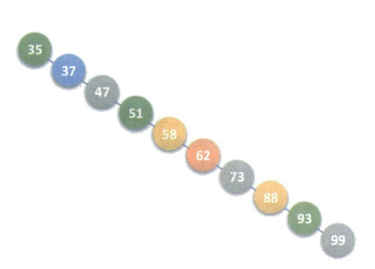

[用 JavaScript 实现的算法和数据结构](https://www.conardli.top/) 

[代码随想录](https://programmercarl.com/) 

# 基本本概念和术语

- 数据：数据是描述客观事物的符号，是计算机中可以操作的对象，是能被计算机识别，并输入给计算机处理的符号集合。
  - 数据不仅仅包括整型、实型等数值类型，还包括字符及声音、图像、视频等非数值类型。
- 数据元素：数据元素是组成数据的、有一定意义的【基本单位】，在计算机中通常作为整体处理，也被称为【记录】。
  - 数据项：一个数据元素可以由若干个数据项组成。
  - 数据项是数据不可分割的最小单位
- 数据对象：是性质相同的数据元素的集合，是数据的子集。


**常用数据结构**

- 线性表：有限序列，元素有顺序
  - 栈、队列是线性表的一种
  - 线性表有两种存储方式：顺序存储结构、链式存储结构
    - 顺序存储需要提前确定长度
    - 链式存储需要一个指针域记录后驱元素的位置


# 链表

- 单链表
- 循环链表：最后一个节点指向第一个节点
  - 尾指针：与头指针类似，指向最后一个节点的指针，尾指针可以很方便的访问到链表的第一个和最后一个节点
- 双向链表：每个节点有两个指针，分别指向上一个和下一个节点

# 栈

栈：后进先出，Last In First Out，只能在一端进行插入和删除

栈顶：允许插入和删除的一端

**栈的重点是不同类型的元素，什么时候出栈什么时候进栈（进出栈的逻辑）**


**两个栈共享一个存储空间**

- 场景：当两个栈存在相反关系（一方卖出，一方买入）
- 使用同一个数组作为两个栈的存储空间，数组的两个端点分别作为两个栈的栈底，进栈时向数组中间靠拢

# 队列

**定义：**只能允许在一端进行插入，另一端进行删除的线性表，先进先出，运行插入的一端称为队尾，另一端称为队头

**循环队列：**用两个指针分别指向队头、对尾，插入和删除元素时移动队尾指针和队头指针。避免插入元素时移动其他位置的元素

# 树🌲

树的属性：
- 节点的度（degree）：节点的子节点的数量。在二叉树中，度的取值范围是 0、1、2 。
- 节点所在的层（level）：从顶至底递增，根节点所在层为 1 。
- 叶节点（leaf node）：没有子节点的节点，其两个指针均指向 None 。


树的存储结构有多种表示方法，其中【孩子兄弟表示法】可以把任意复杂树变成【二叉树】

这种表示法中每个节点的属性有：data、firstChild、rightsib

- firstChild 指向这个节点的第一个子节点
- rightsib 指向这个节点的下一个兄弟（右侧）节点

## 二叉树

> 二叉树：子节点个数最多为 2 个；

[用递归的思想实现二叉树前、中、后序迭代遍历](https://mp.weixin.qq.com/s/gFT4b79EDnDXT3wi4P9-bQ)

> 二叉树的广度优先遍历

```js
/**
 * 
 * @param {TreeNode} tree 树的根节点
 */
function treeLevelTraverse(tree) {
  if (!tree) {
    console.log("empty tree");
    return;
  }
  let node = tree;
  let list = [];
  // 将跟节点入队
  list.push(node);
  // 如果队列不为空，则进行遍历
  while (list.length > 0) {
    // 从队首取出一个元素用以处理
    const curNode = list.shift();
    console.log(curNode.data);
    // 如果存在左子树，将左子树入队
    if (curNode.left) {
      list.push(curNode.left);
    }
    // 如果存在右子树，将右子树入队
    if (curNode.right) {
      list.push(curNode.right);
    }
  }
  /**
   * 因为队列先入先出的特性，所以最后的打印顺序总是按层从上至下，每层从左到右的顺序输出
   */
}
```

> 深度优先遍历

1. 先序：先访问根节点--->左节点--->右节点；

```js
function preOrder(node, list = []){
 if(!node){
   list.push(node.val);
   preOrder(node.left, list);
   preOrder(node.right, list);
 }
}
```

2. 中序：先访问左节点--->根节点(根节点在中间)--->右节点；

```js
function inOrder(node) {
    if (!node) {
        inOrder(node.left);
        print(node.val);
        inOrder(node.right);
    }
}
// 使用循环
function inOrder(root) {
    let cur = root;
    let arr = []
      , stack = [];
    while (cur || stack.length > 0) {
        while (cur) {
            stack.push(cur);
            cur = cur.left;
        }
        cur = stack.pop();
        arr.push(cur.val);
        cur = cur.right;
    }
    return arr;
}
```

3. 后序：先访问左节点--->右节点--->根节点；


## 满二叉树

所有非叶子节点都有两个子节点，所有叶子节点都在同一层

```markdown
      d
    /   \
   b      f
  / \    / \
 a   c  e   g
```

## 完全二叉树

1. 除最后一层外，其他每层节点都是满的，最后一层从左向右填满二叉树
2. 如果树的深度为h，那么除了第 h 层，其他层的节点数都是满的，第 h 层有的节点数在 1 和 2h−1 之间。

```markdown
      1
    /   \
   2     3
  / \    /
 4   5  6
```

完全二叉树非常适合用数组来表示，当使用广度优先遍历完全二叉树得到数组时，元素代表节点值，索引代表节点在二叉树中的位置。

节点指针通过索引映射公式来实现，给定索引  𝑖

- 其左子节点的索引为  2 𝑖 + 1 
- 右子节点的索引为  2 𝑖 + 2 
- 父节点的索引为  ( 𝑖 − 1 ) / 2 （向下整除）
- 当索引越界时，表示空节点或节点不存在。


## 二叉查找树

二叉查找树：特殊的二叉树，左节点的值比其父节点的值小，右节点大于父节点

二叉查找树的插入、删除、查找时间复杂度为：logn


> 删除

按被删除节点的位置有三种情况：

1. 删除叶子节点：直接删除，不需要调整树
2. 被删除节点只有左子树或只有右子树：用左（右）子节点替换被删除节点的位置（独子继承）
3. 被删除节点同时有左、右子树：找到排序后距离该节点最近的节点（有两个节点，一个比它大一个比它小），替换被删除节点


## 平衡二叉树（AVL树）

如果二叉查找树非常不平衡，比如

 

查找的时间复杂度为 O(n)，因此如果我们希望对一个集合按二叉查找树查找，最好是把这个集合构建成一颗平衡二叉查找树🌲

平衡二叉树是一种特殊的二叉查找树，它具有以下重要特征：

1. **平衡条件**：它的每一个节点的左子树和右子树的高度差的绝对值不超过 1。
2. **保持平衡**：通过特定的调整操作（如旋转）来确保树在插入和删除节点后仍能保持平衡状态。
3. **优点**：使得查找、插入和删除等操作的时间复杂度能稳定在 O(logn)

**平衡因子**：节点的左子树的高度减右子树的高度

- 平衡二叉树所有节点的平衡因子只可能是0或1或-1

最小不平衡子树：距离插入节点最近的祖先节点中，平衡因子大于1的节点，以该节点为根的子树

## 多路查找树（B树）

B树是专门针对内存和外存（硬盘）之间的存取设计的

特点：

- 每个节点的子节点可以多余 2
- 每个节点可以存储多个数据元素


## 红黑树

红黑树（Red-Black Tree）是一种自平衡二叉搜索树，它通过在每个节点上添加一个存储位来确保树的平衡。这个存储位被称为“颜色”，它可以是红色或黑色。红黑树满足以下几个性质：

1. 每个节点都有一个颜色，要么是红色，要么是黑色。
2. 根节点是黑色的。
3. 每个叶子节点（NIL节点，空节点）都是黑色的。
4. 如果一个节点是红色的，则它的两个子节点都是黑色的。
5. 对于每个节点，从该节点到其所有后代叶子节点的简单路径上，均包含相同数目的黑色节点。

这些性质确保了红黑树具有良好的平衡性，使得其各种操作的时间复杂度都能够保持在 O(log n) 级别，其中 n 是树中节点的数量。因此，红黑树常常被用作实现集合、映射等数据结构的基础。


# [堆](https://www.hello-algo.com/chapter_heap/) 

堆（heap）是一种满足特定条件的【完全二叉树】，主要可分为两种类型

- 小顶堆（min heap）：任意节点的值  ≤ 其子节点的值。 
- 大顶堆（max heap）：任意节点的值  ≥ 其子节点的值。

一般用数组来表示堆

# 图

图由【点】和【边】组成，点称为【顶点】，即数据元素。图中的顶点一定是非空有穷，边可以是空

