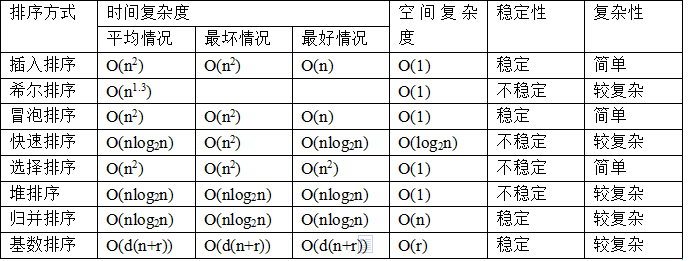

[Hello 算法](https://www.hello-algo.com/) 

# 算法度量

算法具有5个基本特性：输入、输出、有穷、确定性、可行性

算法的时间复杂度：

- 常数阶 O(1)
- 线性阶 O(n)
- 平方阶 O(n2)
- 对数阶 O(logn)

算法的时间复杂度推导：

- 只保留最高阶项，并且将系数设置为 1

下面的算法时间复杂度为 O(n2)

```js
for (let i = 0; i < n; ++i) {
    //
}

for (let i = 0; i < n; ++i) {
    for (let j = i; j < n; ++j) {
        //
    }
}
```

# 递归|分治

> 递归

递归本质上就是一个栈结构

将问题（数据）分成已经解决的部分和待解决的部分，待解决的部分又是一个同类型的问题


> 分治


# 查找 

- 二分查找、哈希表查找、二叉查找树查找；
- 哈希表(散列表查找的时间复杂度是 O(1))
- 线性索引查找

## 散列查找（哈希表）

散列函数（哈希函数）：`数据元素的地址 = f(关键字)` 

# 排序

[排序算法-动态图](https://blog.csdn.net/yushiyi6453/article/details/76407640) 

**在内存中进行排序主要有两种操作：比较 + 移动**

排序一个长度为 n 的数组的时间复杂度是 O(nlogn)；

- 冒泡、选择、插入排序的耗时比较：冒泡 > 选择 > 插入；
- 高阶算法：希尔、归并、快速排序：
- 空间消耗、平均时间复杂度、最差时间复杂度；

1. 冒泡排序
     - 2 个嵌套的循环
     - 冒泡排序从小到大排序：一开始交换的区间为0~N-1，将第1个数和第2个数进行比较，前面大于后面，交换两个数，否则不交换。
     - 再比较第2个数和第3个数，前面大于后面，交换两个数否则不交换。
     - 依次进行，最大的数会放在数组最后的位置。然后将范围变为0~N-2，数组第二大的数会放在数组倒数第二的位置。
     - 依次进行整个交换过程，最后范围只剩一个数时数组即为有序。

2. 选择排序
     - 一开始从0~n-1区间上选择一个最小值，将其放在位置0上，然后在1~n-1范围上选取最小值放在位置1上。重复过程直到剩下最后一个元素，数组即为有序

3. 插入排序
     - 将 0 ~ i 排好序，取 i + 1 作为当前比较的【目标值】，将这个目标值插入到已经排序的序列中构成新的排序列表
     - 适用于在已经排序的序列中插入新的元素
     
4. 快排
     - 快速排序从小到大排序：在数组中随机选一个数（默认数组首个元素），数组中小于等于此数的放在左边，大于此数的放在右边，再对数组两边递归调用快速排序，重复这个过程。
     - 首尾双指针，从 【0 ~ 当前元素】范围内第一个大于当前元素的值，从 【n-1 ~ 当前元素】范围内第一个小于当前元素的值，交换这两个的值
5. [堆排序](https://www.hello-algo.com/chapter_sorting/heap_sort/#1171)：时间复杂度 O(nlongn)，空间复杂度 O(1)




# 方法总结

1. 查找二维数组上的搜索路径：**回溯法**；
2. 某个问题的最优解，且该问题可以分解为多个子问题，子问题也存在最优解，如果将每个小问题的最优解组合可以得到目标问题的最优解，这类情况可以考虑使用**动态规划**；
3. 在某种特殊情况下可以得到目标问题的最优解：**贪心算法**； 

# 资料

[《大话数据结构》](https://pan.baidu.com/disk/pdfview?path=%2F%E7%94%B5%E5%AD%90%E4%B9%A6%2F%E7%A8%8B%E6%9D%B0%E3%80%8A%E5%A4%A7%E8%AF%9D%E6%95%B0%E6%8D%AE%E7%BB%93%E6%9E%84%EF%BC%88%E6%BA%A2%E5%BD%A9%E5%8A%A0%E5%BC%BA%E7%89%88%EF%BC%89%20%E3%80%8B.pdf&fsid=659848894549130&size=164713872) 

《算法图解》

《数据结构和算法分析》 《数据结构与算法分析：C++ 描述》 《数据结构与算法 JavaScript 描述》

《编程珠玑》豆瓣评分非常高，有 9 分

《编程珠玑（续）》

《剑指 offer》

《编程之美》


> 

[十本数据结构与算法书籍推荐](https://cloud.tencent.com/developer/article/1148238)

《算法导论》-MIT出版社-《数据结构与算法JacaScript描述》所推荐；

算法		Robert Sedgewick	谢路云

算法导论 	Thomas H.Cormen,Charles E.Leiserson		偏向理论和算法证明，不适合初学者，更适合入门之后打算继续钻研算法的人群

数据结构与算法分析——C语言描述 	冯舜玺

数据结构与算法分析——C++描述  	张怀勇

漫画算法：小灰的算法之旅 全网阅读量近1000万次的算法故事；一群可爱的小仓鼠，带你轻松入门算法与数据结


[可视化解读](https://visualgo.net/en/array) 

[书籍📚](https://www.cnblogs.com/qing-gee/p/13666052.html) 
