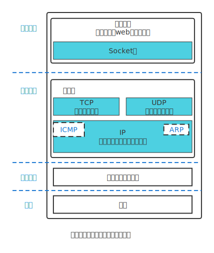
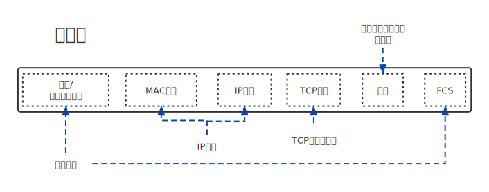
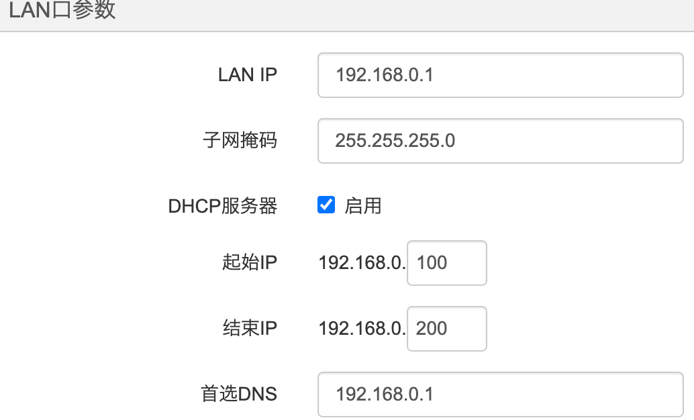
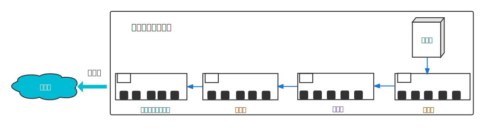
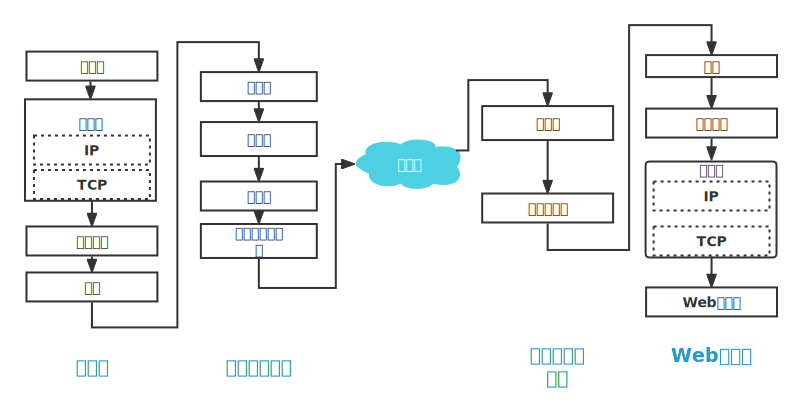

> 资料

[中科大郑烇、杨坚全套《计算机网络（自顶向下方法 第7版，James F.Kurose，Keith W.Ross）》课程](https://www.bilibili.com/video/BV1JV411t7ow?p=2&spm_id_from=pageDriver&vd_source=bd65c223ad05da7787aa7edaf82077eb) 

# OSI网络模型

OSI七层框架： 应用层、表示层、会话层、传输层、网络层、数据链路层、物理层；

从客户端发出http请求到服务器接收，从上到下经过一系列的流程：
1. 应用层(dns,http) DNS解析成IP并发送http请求；
2. 表示层：主要处理两个通信系统中信息的表示方式，包括数据格式交换，数据加密与解密，数据压缩等；
3. 会话层：它具体管理不同用户和进程之间的对话，如控制登陆和注销过程；
4. 传输层(tcp,udp) 建立tcp连接（三次握手）；
5. 网络层(IP,ARP) IP寻址； 
6. 数据链路层(PPP) 封装成帧； 数据链路层包括控制操作系统、硬件的设备驱动、网卡等，硬件上的范畴均在链路层的范围。
7. 物理层(利用物理介质传输比特流) 物理传输（然后传输的时候通过双绞线，电磁波等各种介质）；

浏览器等网络应用程序调用操作系统内部的 socket 组件，委托协议栈（网络控制软件）收发数据。

客户端与服务端建立连接实际上是通信双方交换控制信息（IP、端口等），包括以下目的：
- 客户端应用程序告诉操作系统中的协议栈服务器的IP、端口等信息。
- 客户端向服务器发送开始通信的请求。
- 分配内存空间用于临时存放收发数据

# TCP

  

# 网络包结构

   

以 HTTP 为例：

- 客户端在应用层 (HTTP) 发出一个获取 HTML 页面的请求；
- 传输层 (TCP协议) 把从应用层接收到的数据进行分割，并加上标记序号、端口号等控制信息；
- 网络层 (IP协议) 加上 MAC 地址、目标IP地址后转发给数据链路层；

[一个网络包包含了三种头部信息](https://blog.51cto.com/u_11207102/3275250)：

- TCP头部：由 TCP 模块添加到数据包中，包含发送方端口、接收方端口、序号、ACK、控制位（ACK、SYN）、窗口等
 - 通过TCP头部中的序号和ACK可以确认接收方是否收到网络包
- IP头部：由 IP 模块添加到数据包中，包含双方IP、版本号等，接收方的IP是TCP模块告诉IP模块的，TCP模块是在建立连接从应用程序得到发送方IP地址。
- MAC头部：由 IP 模块添加到数据包中，包含双方MAC地址等

# IP

每台联网的计算机至少有一个IP地址，IP是分配给计算机中安装的网络硬件(网卡)，多网卡可以配置多个IP。IP地址是软件层面，可以修改。

接入互联网时，运营商向网络设备分配公有地址。

每台计算机都有一个MAC地址，MAC地址是网络设备制造商生产时烧录在**网卡**的EPROM，MAC地址就如同身份证上的身份证号码，具有唯一性。

IP由32bit组成，包含了网络号（子网地址）和主机号（主机编号），IP与计算机的【子网掩码】作【与运算】可以计算出子网地址和主机号。
比如IP为 10.1.2.3/24 表示：
网络号：10.1.2
主机号：3
主机号为0表示IP代表整个子网，主机号为1代表向子网中所有的设备发送包，即广播。

- Q【子网掩码】是人设置的？
子网掩码可以在路由器等设备上设置
 

> 域名与IP

域名可以指向 IP 也可以指向其他域名

在互联网上，每个域名都对应着一个或多个IP地址。这是因为域名系统（DNS）使用域名解析将域名映射到其对应的IP地址。这个过程中，DNS服务器会将域名转换为IP地址，从而让计算机能够定位和连接到所请求的网络资源。

同时，一个IP地址也可以对应多个域名。这通常是因为多个域名指向同一个服务器或同一组服务器，这些服务器都使用相同的IP地址。这个过程称为虚拟主机。例如，多个网站可以共享同一个IP地址，并且通过不同的域名来区分不同的网站。

因此，域名和IP地址之间的关系是一对多或多对一的，而不是一对一的。

# 交换机 | 路由器

[交换机、路由器、IP、MAC、子网掩码](https://mp.weixin.qq.com/s/jiPMUk6zUdOY6eKxAjNDbQ)  

 

从计算机发出的网络包会通过集线器、交换机、路由器等转发设备，最终到达目的地。

交换机基于以太网规则工作，即根据MAC地址运行；路由器基于IP工作，即根据IP地址运行。

家用路由器集成了集线器和交换机的功能。

计算机网卡和路由器可以支持以太网、无线局域网等多种通信技术。

以太网和无线局域网都是被IP委托传输网络包，有相似的功能，都是将网络包发送到包的MAC头部标识的目标MAC地址的目的设备上，用发送方MAC地址标识发送方，用以太网类型（或其他参数）标识包的内容。

## 数据包从客户端发送到服务器的过程

 

- 网络包从计算机发送到【集线器】。集线器会进行【广播】无脑将电信号转发到所有出口，将网络包发送给所有连接到它上面的设备。设备根据网络包中的【接收方MAC】和自己的MAC地址判断应该接收哪些网络包。是发给自己的包就接收，否则忽略。上述过程适用于客户端、服务器、路由器等具有收发【以太网网络包】功能的设备。集线器属于物理层。
  - 网络包中的接收方MAC地址怎么来的？【ARP协议】
  - 集线器有MAC地址吗？
  
- 网络包到达【交换机】，交换机无视接收方MAC地址，将所有包都接收下来原样转发到目的地。属于数据链路层。
  - 交换机内部维护了一张【MAC地址表】，该表记录了MAC地址与交换机端口的对应关系。当交换机某个端口接收到网络包时，会将网络包中发送方MAC地址与该端口添加到地址表中。
  - 当交换机转发网络包时，根据包中的接收方MAC地址和MAC地址表将该包发送到相应的端口。如果MAC地址表中没有与接收方MAC地址匹配的记录，那交换机会将该网络包发送给源端口之外的所有端口。
  - 交换机只将网络包转发到具有MAC地址的设备连接的端口（与交换机相连的设备都有MAC地址？）
  
- 网络包到达【路由器】，并在此转发到下一个路由器。属于网络层。

  - 路由器的每个端口都具有MAC地址和IP地址，路由器会作为以太网的发送方或接收方。与交换机不同，路由器只接收发送给自己的包（通过路由器转发的网络包中的接收方MAC地址是路由器某个端口的MAC地址）。

  - 路由器内部维护一张路由表

    | 目标地址    | 子网掩码      | 网关                  | 端口/接口 | 跃点数 |
    | ----------- | ------------- | --------------------- | --------- | ------ |
    | 192.168.1.0 | 255.255.255.0 | -                     | e2        | 1      |
    | 0.0.0.0     | 0.0.0.0       | 192.0.2.1（默认网关） | e1        | 1      |

    网络包中的接收方IP和路由表中的目标地址分别与子网掩码作`与运算`，当两个结果相同时表示与该条记录匹配。任意一个接收方IP至少匹配默认路由这条记录。匹配多条记录时会先按“最长匹配原则”筛选，如果筛选后还有多条记录再按跃点数判断，跃点数越小优先级越高。

    最长匹配原则：地址匹配的比特数的长度，即子网掩码中1的数量，默认路由的优先级最低。

    网关列为空表示网络包中的接收方IP地址就是下一个转发目标。

  - 路由表的维护有两种方式：1）手动维护；2）根据路由协议机制，通过路由器之间的信息交换由路由器自行维护，路由协议有RIP、OSPE、BGP等。

  - 任何目标地址至少能匹配到`0.0.0.0`这条记录，这条记录称为默认路由，对应的网关为【默认网关】。

  - 默认网关一般填写接入互联网的路由器地址。
  
  - 总结：一个网络包发送到路由器，路由器判断包中的接收方MAC地址和自己的MAC地址是否匹配，如果匹配则接收下来同时丢弃网络包的MAC头部（已经没用了）。然后根据网络包中的接收方IP和路由表查找下一个转发目标的IP，再利用ARP查找对应的MAC地址，确定接收方的MAC地址。最后给网络包加上MAC头部并发送出去。路由器将发送方MAC地址设置为自己的MAC地址，将接收方MAC地址设置为下一个转发目标的MAC地址，不会修改IP地址。

## 地址转换

> NAT（Network Address Translator）

IP 分为外网 IP 、内网 IP ，只有外网 IP 才能与 Internet 上的其他计算机进行通信。不同内网中的内网IP可以重复。

同一个内网中的设备**使用同一个外网IP访问互联网**，内网地址(私有地址)由路由器\交换机自动分配，公网IP需要申请并由运营商分配。

内网分为两部分：1）对互联网开发的服务器；2）内网设备。

第1）部分分配公有地址，可以直接和互联网通信；内网设备分配私有地址，无法直接与互联网直接通信，需要通过【地址转换】机制与互联网通信。路由器、防火墙等具有地址转换的功能。

例如内网中的设备A访问互联网中的某个服务器，设备A向服务器发送数据包时，路由器或防火墙等会把数据包中的发送方地址从私有地址改为公有地址。

| 公有地址 | 端口 | 私有地址    | 端口 |
| -------- | ---- | ----------- | ---- |
| xxx      | 1232 | 192.168.1.1 | 80   |

公有地址的端口是从空闲端口中随机选一个。

当数据收到结束，断开连接时表中的这条记录就被删除。

> 为什么外网无法访问内网？
>
> 外网要与内网中的某个设备通信，需要知道内网设备的私有地址、端口与公有地址、端口的映射关系，除非手动添加这样的记录，否则外网无法访问内网设备。

## 内网穿透

[FRP内网穿透实践教程](https://zhuanlan.zhihu.com/p/337939762) 
[使用frp做内网穿透实现公网访问本地web服务](https://zhuanlan.zhihu.com/p/359632152) 

## 测试

当计算机连接的是局域网(路由器、集线器分配)时，此时通过 ipconfig (win系统)查看的是路由器分配给该主机的内网 IP ，该 IP 地址不能与 Internet 上的计算机通信。

ping 127.0.0.1 127.0.0.1 或 localhost 测试当前计算机网络连接是否正常；
如何ping局域网？

两台计算机PC1、PC2同时连接到一台路由器，路由器连接到学校的局域网，使用 ipip.net/ip.html 和 ipconfig 查询本机IP地址。

| 主机 | ipconfig      | ipip.net    |
| ---- | ------------- | ----------- |
| PC1  | 192.168.0.100 | 180.85.7.73 |
| PC2  | 192.168.0.101 | 180.85.7.73 |

ipip.net 查询 pc1和 pc2地址相同，该地址代表外网IP，子网在互联网中的地址

ipconfig 查询得到的是局域网的地址，是子网分配给计算机主机的地址。192.168.0 代表子网号，100和101代表主机号。

使用 ping ip地址时，ping 外网地址失败，ping 局域网地址成功。

- 内网私有地址段:
  - 10.0.0.0~10.255.255.255
  - 172.16.0.0~172.31.255.255
  - 192.168.0.0~192.168.255.255

## 互联网接入

客户端发送的网络包通过ADSL和FTTH（光纤）等接入网到达运营商的宽带接入服务器（BAS）。BAS会向客户端下发包括公网IP、默认网关在内的配置信息。这些配置信息配置在路由器上，公网IP就分配给路由器，连接到路由器的计算器则使用私有IP。

# 防火墙

> 允许发往指定服务器中的指定应用程序的网络包通过，阻止其他包通过。

防火墙分为：包过滤（主流）、应用层网关、电路层网关等。

**包过滤** 

网络包的各种头部（MAC头部、IP头部、TCP头部）包含了用于控制通信操作的控制信息，根据这些信息设置相应的过滤规则就可以允许特定的包通过并阻止其他包通过。

主要用于设置过滤规则的控制信息有：IP、端口、控制位。

# 参考

《网络是怎样连接的》 

