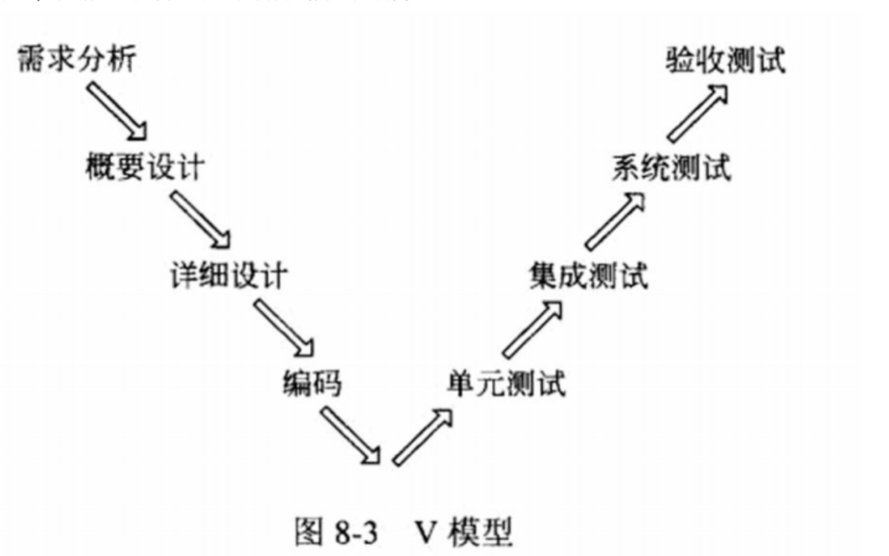
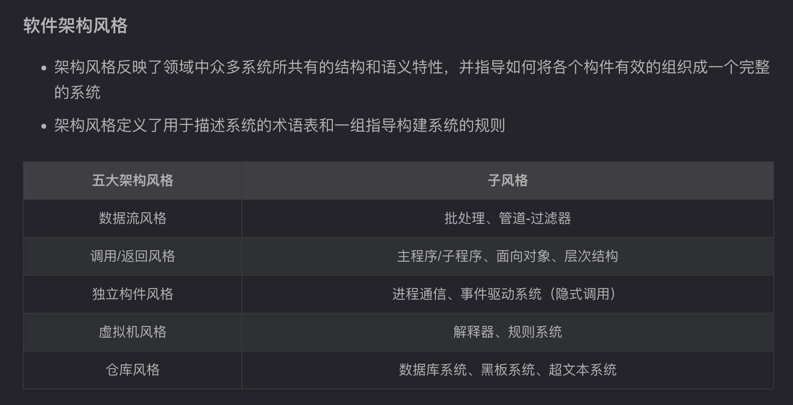

[官网考试说明](https://www.ruankao.org.cn/article/content/bkzn/03_03.html) 

[方才练题](https://fangcaicoding.cn/paperDetail/753) 

[芝士](https://www.cheko.cc/home) 

------------------

在数据库设计的（逻辑）阶段进行关系反规范化

DSSA 通常是一个具有三个层次的系统模型，包括：

- 领域开发环境、领域特定应用开发环境和应用执行环境。
- 领域架构师在领域开发环境工作，应用工程师在领域特定的应用开发环境工作，操作员在应用执行环境工作。

DSSA以一个特定问题领域为对象，形成由
- 领域参考模型、参考需求、参考架构等组成的开发基础架构
- 领域分析、设计、实现

特点领域软件架构DSSA 以一个特定问题领域为对象，形成由【领域参考模型】、参考需求、参考架构等组成的开发基础架构，旨在支持一个特定领域中多个应用的生成。DSSA 基本活动包括【领域分析】、领域设计和领域实现。领域分析的主要目的是获得【领域模型】，描述领域中系统之间共同的需求，即领域需求。领域设计的主要目标是获得 DSSA，描述领域模型中表示需求的解决方案。领域实现的主要目标是依据领域模型和 DSSA开发和组织可重用信息，并对基础软件架构进行实现。

数据库范式1NF、2NF、3NF、BCNF
- 1NF：所有属性具有原子性（不可再分），且每列有唯一名称，无重复组
- 2NF：所有非主属性必须完全函数依赖于候选码（无部分依赖），**完全依赖**
- 3NF：非主属性不能依赖其他非主属性，**无依赖传递**
- BCNF：所有函数依赖的决定因素（左侧）必须为候选码

系统架构设计的非功能性需求主要有四类
（1）操作性需求：
（2）性能
（3）安全
（4）文化

EJB中构建Bean 有哪三种类型，各自的作用
1. Session Bean的职责是：维护一个短暂的会话。
2. Entity Bean 的职责是：维护一行持久稳固的数据。
3. Message-Driven Bean的职责是：异步接受消息。

在基于体系结构的软件设计方法中
- 采用【视角和视图】来描述软件架构，采用【用例】来描述功能需求，采用【质量场景】来描述质量需求

信息隐蔽可以提高软件的【可修改】、可测试性和可移植性

【自顶向下】方法可以更快得到系统的【演示原型】

【功能驱动】开发方法中，编程开发人员分为首席程序员和“类”程序员

ABSD 方法是一个自顶向下，递归细化的方法，软件系统的体系结构通过该方法得到细化，直到能产生【软件构件和类】。
- 在最顶层，系统被分解为若干概念子系统和一个或若干个软件模板。
- 体系结构需求一般来自3个方面，分别是系统的【质量目标】、系统的商业目标和系统开发人员的商业目标

软件架构分析法（SAAM，software arch analysis methods）针对最终架构而非详细设计进行评估。
- SAAM的评估过程包括:场景开发、架构描述、单场景评估、场景交互评估和总体评估。
- 架构权衡分析法（ATAM, arch tradeoff analysis methods） 在SAAM 的基础上发展起来的，主要针对性能、实用性、安全性和可修改性，在系统开发之前，使用【质量属性效应树】对这些质量属性进行评价和折中。

软件活动主要包括软件描述（计划）、软件开发（执行）、软件有效性验证（检查）、软件演化（处理）
- 没有**测试**，有**有效性验证**

4+1视图、RUP，体现了关注点分离的思想

- 逻辑视图：用户，功能需求
- 开发（实现）：程序员，软件管理
- 物理（部署）：系统工程师，
- 进程：系统集成人员，3
- 用例视图（场景）：以场景为中心

V模型
-  

架构风格
- 管道-过滤器的各个步骤可以并行执行

软件体系结构风格多样，包括数据流、调用 / 返回、以数据为中心、虚拟机、独立构件等风格。
（1）数据流体系结有批处理、管道 - 过滤器等二级风格，用于经典数据处理等；
（2）调用 / 返回风格通过调用与返回机制分治大系统，有主程序 / 子程序、面向对象、层次型、客户端 / 服务器等二级风格；
（3）以数据为中心风格围绕数据，有仓库、黑板等二级风格；
（4）虚拟机风格构建运行环境提升灵活性，有解释器、规则系统等二级风格；独立构件风格强调构件独立性，有进程通信、事件系统等二级风格；
（5）C2 风格是并行构件网络；闭环控制架构 - 过程控制通过反馈循环连接软硬件，如空调控温等

架构风格
-  

# 知识点

术语：
- 有效性、安全、可靠、一致、完整、开发效率、维护、扩展、可修改、复用
- 业务构件、接口层、数据一致性、减低耦合
- 屏蔽不同平台、设备之间的差异，统一接口处理

解耦、分层、拆分的好处
- 与业务逻辑层和表示层相互独立，提高系统的灵活性、可维护性
- 降低系统耦合度、使系统更容易维护、扩展，支持多平台运行

数据库常见的反规范化设计有：

（1）增加冗余列：增加冗余列是指在多个表中具有相同的列，它常用来在查询时避免连接操作。
（2）增加派生列：增加派生列指增加的列可以通过表中其他数据计算生成。它的作用是在查询时减少计算量，从而加快查询速度。
（3）重新组表：重新组表指如果许多用户需要查看两个表连接出来的结果数据，则把这两个表重新组成一个表来减少连接而提高性能。
（4）分割表：有时对表做分割可以提高性能。

中间件/应用层的作用：

1. 提高并发性能和可伸缩性
2. 流量、请求转发
3. 提高数据安全

数据化持久层的作用和优点
1. 数据持久层是指应用程序中负责与数据库或其他数据存储系统进行交互的模块或组件。它负责数据的读取、写入、更新和删除操作，以及数据的持久化和管理。

2. 数据持久层的设计旨在实现数据访问的有效性、可靠性和安全性，同时与业务逻辑层和表示层相互独立，提高系统的灵活性和可维护性。

3. 使用数据持久层可以为项目开发带来多方面的好处。
   1. 首先，数据持久层将数据访问逻辑与业务逻辑分离，降低了系统的耦合度，使得系统更易于维护和扩展。
   2. 其次，通过数据持久层的封装和抽象，可以提高数据访问的效率和性能，减少重复代码的编写，提高开发效率。
   3. 此外，数据持久层还可以提供数据安全性和一致性的保障，确保数据的完整性和可靠性。

性能提升、运行稳定性提升、主备负载均衡高可用、故障用户无感知

主从复制

1. 主从复制是一种数据库架构设计，通过将数据从一个主数据库实时或异步复制到一个或多个从数据库，实现数据的分布式存储和访问管理
2. 主从复制通过数据冗余和读写分离，显著提升了数据库系统的可用性、性能和容灾能力，是现代分布式系统的基石之一
3. 主从复制机制使得同样的数据，存在多个副本，这样让用户查询数据时，可以选择该数据最近的副本进行访问，提高效率，降低资源使用时的冲突。另一方面主从复制机制中一台数据库服务器故障不会导致站点无法访问。

微服务架构
1. 微服务架构是一种将应用程序分解为一组小型、独立服务的方法，每个服务都运行在自己的进程中，并通过轻量级机制（通常是HTTP API）进行通信。
2. 与单体架构相比，微服务架构具有更好的可扩展性和灵活性，能够更容易地部署和更新，但也增加了系统的复杂性，带来了分布式系统的管理难题和通信开销。
3. 微服务的优点包括易于扩展、技术多样性和故障隔离，而缺点则包括运维复杂、数据一致性管理困难以及潜在的性能问题

事务管理
- 数据库管理系统的基本工作单位是事务，事务是用户定义的一个数据库操作序列，这些操作序列要么全做要么全不做，是一个不可分割的工作单位
- 事务的4个特征：原子性、一致性、持久性、隔离性

应用服务器
1. 应用服务器通过负载均衡、集群部署、资源管理、监控调优和自动扩展等功能来保障系统在大负荷和长时间运行下的稳定性和可扩展性。
2. 负载均衡可分发请求，集群部署提高可用性，资源管理避免瓶颈，监控调优实时调整，自动扩展根据负载动态调整服务器实例，确保系统高性能、稳定运行。

安全措施
1. 引入https协议或采用加密技术对数据先加密再传输。
2. 采用信息摘要技术对重要信息进行完整性验证。
3. 防火墙系统。
4. 安全检测、网络扫描

SQL注入攻击
- 定义：
  - SQL注入攻击利用应用程序对用户输入数据的处理不当，通过在输入中插入恶意的SQL代码来实现对数据库的攻击。攻击者可以通过注入恶意SQL语句来执行未经授权的数据库操作，如删除表、泄露数据等

- 预防：
  - 输入验证和过滤
  - 使用参数化查询，通过预编译SQL语句并将用户输入的数据作为参数传递，而不是直接拼接到SQL语句中

质量属性有哪些？知道如何区分？
1. 风险点：架构设计中潜在的、存在问题的架构决策所带来的隐患
2. 敏感点：为了实现某种特定的质量属性，一个或多个构件所具有的特性
3. 权衡点：影响多个质量属性的特性，是多个质量属性的敏感点

MVC三种元素，各自的作用
- ？？

基于DNS的负载均衡机制是什么
- 通过DNS解析将域名映射到多个服务器IP，实现流量分发

CDN 和反向代理的基本原理都是缓存，区别在于
  -  CDN 部署在网络提供商的机房，使用户在请求网站服务时，可以从距离自己最近的网络提供商机房获取数据；
  -  而反向代理则部署在网站的中心机房，当用户请求到达中心机房后，首先访问的服务器反向代理服务器，如果反向代理服务器中缓存着用户请求的资源，就将其直接返回给用户

**数据库**

- 内存数据库：key-value 数据模型，内存读写，性能高，容量小，可靠性低
- 关系数据库：关系模式，外存读写
- 主从复制：
（1）提升性能，通过读写分离提高并发度；
（2）可扩展性更优，快速增加从服务器应对访问量增加；
（3）提升可用性，一台从服务器故障不影响系统正常工作；
（4）实现负载均衡，分担任务；
（5）提升数据安全性，数据备份，避免数据丢失。

关系型数据库开发中，逻辑数据模型设计的任务有哪些
（1）确定数据模型
（2）将E-R 图转换成为指定的数据模型
（3）确定完整性约束
（4）确定用户视图

分布式数据库优化技术
（1）主从复制：
（2）读写分离：主数据库负责写数据，从数据库读，减少数据并发操作的延迟
（3）分表/分片：提高并发和I/O性能

分布式数据库缓存
- 定义：分布式数据库缓存指的是在高并发环境下，为了减轻数据库压力和提高系统响应时间，在数据库系统和应用系统之间增加的独立缓存系统
- 数据同步方案：读取数据时，先读取Redis中的数据，如果Redis没有，则从原数据库中读取，并同步更新Redis中的数据。写回时，写入到原数据库中，并同步更新至Redis中。

- memcache
（1）MemCache没有持久化功能，所以掉电数据会全部丢失，而且无法直接恢复，这存在可靠性问题。
（2）MemCache不支持事务，所以操作过程中可能产生数据的不一致性。

- redis
（1）Redis分布式存储的常见方案：主从模式（Master/Slave）、哨兵模式（Sentinel）、集群模式（Cluster）

解决数据不一致
- 解决数据不一致性问题的常见方法包括定期同步更新、使用触发器和应用程序级别的数据校验。
（1）定期同步更新指定期性地将冗余数据与原始数据进行同步更新，确保数据一致性；
（2）使用触发器可以在数据更新时自动触发相关操作，保持数据的一致性；
（3）应用程序级别的数据校验则是通过应用程序逻辑来验证数据的一致性

- 实时更新：当数据库更新数据时，实时更新缓存
- 异步更新：当数据库更新时不立即更新缓存，而是将需要更新的操作记录成日志，再逐步排队完成更新。

# 论文押题

> 层次架构、云原生、微服务、安全架构、大数据架构

**微服务设计约束**

1. 服务自治性
   - 每个服务独立开发、部署、运行，拥有专属的数据库与业务逻辑
2. 单一职责
   - 服务按业务领域垂直拆分，避免功能交叉
3. 去中心化数据管理
   - 每个微服务拥有自己的数据存储，通过事件驱动实现数据一致性
4. 服务发现与通信轻量化
   - 基于 Nacos 实现服务自动注册与发现，采用 gRPC 优化跨语言服务调用效率
5. 容错与自愈机制
6. 全链路可观测性
   - 采用 skywalking 实现请求链路追踪，结合 Prometheus + Grafana 构建黄金指标监控体系，故障定位时间缩短至10分钟

**云原生的原则**

1. 服务化原则
2. 弹性原则：系统部署规模随着业务量的变化自动伸缩
3. 可观测原则：通过日志、链路跟踪和度量方法记录服务调用的参数、响应和耗时
4. 韧性原则
5. 零信任原则

# 信息系统架构

## 信息系统架构常用模型
**常用模型：**

- 单体应用、客户端/服务端、面向服务架构（SOA）、企业服务总线（ESB）/企业数据总线（EDB）

客户端/服务端是其中最常用的模型之一，客户端和服务器通过TCP/UDP通信，常见的客户端/服务器形式有：
- 二层C/S
- 三层C/S
  1. 三层C/S：前台客户端 + 后台服务器 + 数据库
  2. 三层B/S：web浏览器 + web服务器 + 数据库
       B/S本质是浏览器和web服务器通过基于TCP/IP 或 UDP 的 HTTP 协议通信
  3. 多层 C/S 和 B/S 结构
     - 多层 C/S：客户端 + 服务端 + 应用层/中间件 + 数据库
     - 多层 B/S：web浏览器 + web服务端 + 应用层/中间件 + 数据库
  4. MVC：模型、视图、控制器

## 信息系统架构设计方法

# 层次式架构

关键字：MVC

定义：
- 层次式架构为软件系统提供了一种在结构、行为、属性方面的高级抽象，核心思想是将系统组成为一种层次结构，每一层为上层服务并作为下层客户
- 每层最多只影响相邻的两层，内部的层接口只对相邻的两层可见，为软件重用提供了强大的支持

层次式应用结构：
- 表现层、业务层（中间层）、数据持久化（访问层）、数据层

特点：
- 关注点分离，每层只关心本层的逻辑，组件的划分很容易明确组件的角色和职责，更容易设计、开发、测试、维护

## 架构设计

表现层框架设计
1. MVC
2. MVP
3. MVVM

中间层框架设计

访问层框架设计

数据层框架设计

