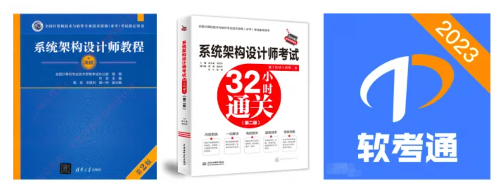

[软考官网](https://www.ruankao.org.cn/) 

考试分为三大项：综合知识，案例分析，论文
1. 综合知识：选择题，75个选择题，要至少对45个。（平时训练需达到55分以上）

2. 案例分析：5个简答题选3个，每个25分，平均每个得15分就行。（往往是4选3和3选3，因为嵌入式的题难得分）
   - 软件质量属性、存储架构、数据流图、UML 图、微服务架构和云原生架构
   - “质量属性效应树”几乎每年都会考，变化仅在于选项和具体的质量属性。
   - 主要考软件工程、项目管理、质量管理、架构设计这类的内容。比如给出一个架构设计，让你评价其优劣， 或指出在里面哪些场景下适合用哪些设计模式等。

3. 论文
   - 4选1，2500字左右
   - 会八股文，剩下的能自圆其说，让改卷的老师知道你是有技术的，就能过了
   - 准备了一个论文模板，又看了几篇范文，之后就放心大胆去考试了。所以我给自己定的策略就是：找到一个比较好的范文模板，照搬其结构，内容就按自己真实工作经历来写。
   - 重点放在了文章模板和结构上。比如，摘要的固定模板如何套用到我的个人经验里，正文的结构在不同情况下要怎么写，文章里有哪里不能写的禁忌(如暴露真实的公司和项目名)，有哪些必须要写进文章的内容。


```md
1. 计算机系统基础知识第：    单选  2-6分
2. 嵌入式基础知识：                单选、案例分析  5分
3. 计算机网络基础知识第：    单选 5分
4. 信息系统基础知识：            单选  2-6分
5. 信息安全技术基础知识：    单选 5分
6. 系统工程基础知识：            单选 2-5分
7. 软件工程基础知识：             单选、案例、论文 8-15分
8. 数据库设计基础知识：         单选（2-5分）、案例
9. 系统架构设计基础知识：     单选（2-5分）、案例、论文
10. 系统质量属性与架构评估： 单选（8-15分）、案例、论文
11. 软件可靠性基础知识：         单选（2-3）、论文
12. 软件架构的演化和维护：     单选（3-5）、案例、论文
13. 未来信息综合技术：              单选（3-5）、案例、论文

15. 信息系统架构设计理论与实践：   单选（3-5）、案例、论文
16. 层次式架构设计理论与实践：       单选（2-5）、案例
17. 云原生架构设计理论与实践：       单选（2-4）、案例、论文
18. 面向服务架构设计理论与实践：   单选（2-5）、案例
19. 嵌入式系统架构设计理论与实践：案例

20. 通信系统架构设计理论与实践：案例  非重点
21. 安全架构设计理论与实践：案例、论文
22. 大数据架构设计理论与实践：案例、论文
```


综合知识和案例分析，基本上靠刷题可以覆盖掉

- 2.5小时

**案例分析**

- 1.5小时
- 必选题是质量效应树和微服务架构
- 案例分析题的知识点重复率较高，例如软件质量属性、存储架构、数据流图、UML 图、微服务架构和云原生架构等。这些知识点在历年考试中频繁出现，如“质量属性效应树”几乎每年都会考，变化仅在于选项和具体的质量属性
- 掌握历年真题的案例分析知识点，多练习真题例题

**论文**

- 2小时
- 论文自己先准备几篇（架构评估、架构风格、架构设计这三篇是必备）

- 论文写作：十段式（项目概要+正文概要+项目背景+项目组成+子题目回应+正文论点3+总结+不足）


# 知识点

八大架构（信息系统、层次式、云原生、SOA、嵌入式、通信系统、安全、大数据），每个架构内会有概述、设计、优缺点、适用场景、示例等。

质量属性效用包括：性能、安全性、可用性、可修改性。


系统架构中的风险点、敏感点、权衡点的定义
- 风险点：架构设计中潜在的、存在问题的架构决策所带来的隐患
- 敏感点：为了实现某种特定的质量属性，一个或多个构件所具有的特性
- 权衡点：影响多个质量属性的特性，是多个质量属性的敏感点


基于DNS的负载均衡机制是什么
- 通过DNS解析将域名映射到多个服务器IP，实现流量分发


基于反向代理的负载均衡机制是什么
- 

# 考试资料

 

- 《系统架构设计师教程（第2版）》
- 《系统架构设计师考试32小时通关（第二版）》
- “软考通”APP


[中国计算机技术职业资格网](https://www.ruankao.org.cn/)

[中国计算机技术职业资格网](https://www.ruankao.org.cn/book/main.html)


[2024年上半年，一次通过软考高级架构师考试的备考秘诀](https://mp.weixin.qq.com/s/9aUXHJ7dXgrHuT19jRhCnw)

[临时抱佛脚必看｜一个月速通高级系统架构设计师！（低分飘过版）](https://mp.weixin.qq.com/s?__biz=MzIzOTU0NTQ0MA==&mid=2247536825&idx=1&sn=a28f7f17f8be69c1aa8f21f238f570a6&chksm=e92a6db6de5de4a0d36383de67f4821591402282c460290cc8521e89e929cfdf86452d5f8828&cur_album_id=3802373978908131332&scene=189#wechat_redirect) 

[软考高级架构师备考记录 - Nekonull's Garden](https://nekonull.me/posts/ruankao-architect/)


[Introduction · 系统架构设计师历年真题含答案与解析](https://ebook.qicoder.com/%E7%B3%BB%E7%BB%9F%E6%9E%B6%E6%9E%84%E8%AE%BE%E8%AE%A1%E5%B8%88/) 

[xxlllq/system_architect: :100: 2025年系统架构设计师（软考高级）备考资料。](https://github.com/xxlllq/system_architect?tab=readme-ov-file)

- [考试资料库-已下载](https://fchxxn.com/exam/view/product.html) 

- https://www.alipan.com/s/h7qKNZED55X 提取码: 3et6


新版系统架构设计师教程全篇知识点提炼

系统架构设计师教程（第2版）

[软考高级-系统架构设计师重难点知识分析及讲解视频](https://www.bilibili.com/video/BV11V411A77U/) 

[一文读懂UML | 轻松搞定·需求分析](https://www.zhihu.com/tardis/bd/art/405447739) 


复习方式是视频+真题+他人的论文


某多上花几块钱买了pdf版本的复习资料合集，里面有历年真题、教学视频、教材、考纲。这些足够用了

1. [系统架构设计师复习资料](https://github.com/xxlllq/system_architect) 
2. 历年真题(已出24年真题)，推荐网站：www.cheko.cc
3. 手机APP：软考通
4. [软考高级系统架构设计师视频教程-B站](https://www.bilibili.com/video/BV1YV411Y7t4/?spm=a2c6h.12873639.article-detail.7.38646572KL3BQx&from=search&seid=7781417321745921878&spm_id_from=333.337.0.0&vd_source=bd65c223ad05da7787aa7edaf82077eb) 