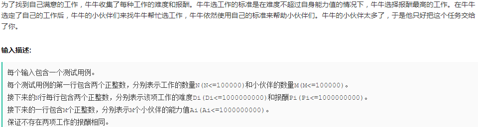

# CSS

- disposition: fixed 是相对于屏幕视口 viewport 的位置来确定元素的位置；

- css 属性 overflow 属性定义溢出元素内容区的内容会如何处理。如果值为 scroll，不论是否需要，用户代理都会提供一种滚动机制。

- border:none以及border:0的区别？

  1. 当定义了border:none，即隐藏了边框的显示，实际就是边框宽度为0；

  2. 当定义边框时,必须定义边框的显示样式.因为边框默认样式为不显示 none ,所以仅设置边框宽度,由于样式不存在,边框的宽度也自动被设置为0。

  3. border:0;浏览器对 border-width、border-color 进行渲染，占用内存。

     border:none;浏览器不进行渲染，不占用内存。

# JS

- JS API
  eval：返回字符串表达式中的值

  unEscape：返回字符串ASCI码

  escape：返回字符的编码

  parseFloat：返回实数
  
- JS 中的数字在内存中占 8个 字节，64bit

- JS 提供的全局函数：escape、unescape、eval、isFinite、isNaN、parseFloat、parseInt，setTimeout 是 window.setTimeout(由window提供)

## 事件队列，异步事件

  ```js
  // ------------------------------------------
  for(var i=0; i<3; ++i){
      setTimeout(function(){
          console.log(i+'');	// 输出3个3
      }, 0);
  }
  // 避免的方法有两种
  // 1
  for(var i=0;i<5;++i){
      (function(num){
      	setTimeout(function(){
      		console.log(num+ ' ');
      	}, 0);
      })(i);
  }
  // 2: 用 let 替换 var 声明 i
  for (let i = 0; i < 3; ++i) {
      setTimeout( ()=>console.log('@ ', i), 0);
  }
  ```

## 闭包

```js
// 情况1
function fn(){
    var n = 0;
    function add(){
        n++;
        console.log(n);
    }
    return {
        n: n,
        get: ()=> n,
        add: add
    }
}
var r1 = fn();	var r2 = fn();	r1.add();	r1.add();
console.log(r1.n);
r2.add();
// 输出：1 2 0 1, 第三个为什么不是 2

/* 情况2：如果 r1.n 是引用类型, 此时输出的值与前一个值相同 */
function fn(){
    let obj = {};
    obj.n = 0;
    function add(){
        obj.n++;
        console.log(obj.n);
    }
    return {
        n: obj,  // 不能用 n: obj.n, 必须是引用类型, 
        add: add // 因为函数返回是按值传递(复制), 如果返回的是基本数据类型, 
    }
}
var r1 = fn();	var r2 = fn();	r1.add();	r1.add();
console.log(r1.n.n);
r2.add();
// 输出 1 2 2 1
```

- 创建一个函数时，会创建一个作用域链，包含了该函数可以访问的作用域对象， 作用域链以数组的形式赋值给该函数的 [[Scopes]] 属性；例如当执行 fn() 时，会创建 add 函数，同时创建包含两个作用域对象的作用域链([[Scopes]] 数组有两个元素，Scopes[0] 代表的是外层函数 fn 的作用域对象，该对象只有 obj 一个属性；Scopes[1] 代表全局作用域对象)；
- 调用函数 add 时，会为函数创建一个作用域(执行环境)，然后**复制** add 函数的 Scopes 属性值(**基本数据类型与引用数据类型的区别**)，构建当前执行环境的作用域链，再将当前 add 函数的作用域对象加入到所构建的作用域链的前端，组成 add 函数所能访问的全部作用域对象。
- 第一种情况：`r1.n` 和 `fn` 内部的 `n` 不是同一个?；
- 第二种情况：obj 是引用数据类型，复制后的 Scopes 的属性值中的 obj 与原来声明的 obj 是指向相同的内存空间，因此 obj.n++ 会影响到原来的数据；

参考：JS 高阶程序设计 P179、P181

# 各种方法实现

## [手写 Promise](https://sicau-hsuyang.github.io/javascript/write/promise.html) 


## 实现 Array.reduce

```js
Array.prototype._reduce = function(cb){
  let ind = 0;
  let len = this.length;
  let initVal = null;
  if(arguments.length > 1)	initVal = arguments[1];
  else{
    while(ind < len && !this.hasOwnProperty(ind)){
      ind++;
    }
    initVal = this[ind++];
  }
  
  for(; ind < len; ind++){
    initVal = cb(initVal, this[ind], ind, this);
  }
  return initVal;
}
```


## Object.create

```js
Object.create = function(proto) {
    function _F() {}
    _F.prototype = proto;
    return new _F();
}
```

## 多维数组平铺

```js
function selfFlat(depth = 1){
  let arr = [].slice.call(this);
  if(depth === 0)	return arr;
  return arr.reduce((acc, cur) => {
    if(Array.isArray(cur)){
       // acc.concat(selfFlat.call(cur, depth-1));
       return [...acc, ...selfFlat.call(cur, depth-1)]
    }
    else{
      return acc = [...acc, cur];
    }
  }, []);
}

// 要求数组项不能包含逗号, 只能用逗号分隔
arr.join().split(',').map(i => print(i));
```

## 快排

思路：

1. xxx

```js
function quickSort(array, left=0, right=array.length - 1) {
    if (left < right) {
        // 得到基准元素位置
        pivotIndex = partition(array, left, right)
        quickSort(array, left, pivotIndex - 1)
        quickSort(array, pivotIndex + 1, right)
    }
    return array
}

function partition(array, left, right) {
    // 取第一个位置的元素作为基准元素
    const pivotValue = array[left]
    while (left < right) {
        /* 右边大于基准的数据不需要移动位置 */
        /* 这里或下面的循环，一定要确保有一处把相等的情况包含在内 */
        while (array[right] >= pivotValue && left < right) {
            right--
        }
        /* 将右边第一个扫描到的小于基准的数据移动到左边的空位 */
        array[left] = array[right];

        /* 左边小于基准的数据不需要移动位置 */
        while (array[left] < pivotValue && left < right) {
            left++
        }
        array[right] = array[left]
    }

    /* 这里right和left 相等了 */
    array[right] = pivotValue
    return right
}
const arr = [9, 3, 12, 90, 32, 4, 12, 983, 2, 5, -9, -23, 49];
log(quickSort(arr.slice()))
log(arr.sort((a,b)=>a - b))
```

## 数组排序并去重

```js
function sortRemoveDuplicate(oriArr){
    if(oriArr.length > 1){
        let middleInd = Math.floor(oriArr.length / 2);  // 数组中位数索引
        let middleVal = oriArr.splice(middleInd, 1)[0]; // 提取数组中位数赋值给middleVal
        // 相等时被过滤掉, 实现去重
        let left = oriArr.filter( el => el < middleVal );
        let right= oriArr.filter( el => el > middleVal );
        let leftArr = sortRemoveDuplicate(left);
        let rightArr = sortRemoveDuplicate(right);
        // 为了消除函数执行过程中对函数名( sortRemoveDuplicate )的依赖, 可以使用下面的方式
        // let leftArr = arguments.callee(left);
        return leftArr.concat(middleVal, rightArr);
    }else{
        return oriArr;
    }
}
```

要点
1. 二分法
2. Array.splice
3. 尾递归

## 函数柯里化

```js
function curry(fn) {
  if (fn.length <= 1) return fn;
  let gene = (...args) => {
    if (args.length >= fn.length) {
      return fn(...args);
    } else {
      return (...arg2) => gene(...args, ...arg2);
    }
  }
  return gene;
}
// 使用
function add(a, b, c, d) {
  return a + b + c + d;
}
let curryed = curry(add);
print( curryed(1,2)(3)(4) );
```

## 图像懒加载

img 的 src 属性先不赋值，监听滚动事件或 `IntersectionObserver`，当图像出现在视野中时才给 src 赋值。

```js

  
let imgs =  document.querySelectorAll('img')
// 可视区高度
let clientHeight = window.innerHeight || document.documentElement.clientHeight || document.body.clientHeight
function lazyLoad () {
  // 滚动卷去的高度
  let scrollTop = window.pageYOffset || document.documentElement.scrollTop || document.body.scrollTop
  for (let i = 0; i < imgs.length; i ++) {
    // 得到图片顶部距离可视区顶部的距离
    let x = clientHeight + scrollTop - imgs[i].offsetTop
    // 图片在可视区内
    if (x > 0 && x < clientHeight+imgs[i].height) {
      imgs[i].src = imgs[i].getAttribute('data')
    }
  }
}
setInterval(lazyLoad, 1000)
```


## 参考

- [一个合格的中级前端工程师要掌握的JavaScript 技巧](https://mp.weixin.qq.com/s?__biz=Mzg5ODA5NTM1Mw==&mid=2247483958&idx=1&sn=66a115a5ea1707f2947de0a8decefe3b&chksm=c06683a0f7110ab64021c9613f9d88bd47ec645e5a241859e9548f10c25958d735f62d0d1749&mpshare=1&scene=1&srcid=&key=06b6f34db6d09e012be03b7bef14060e321a7fbb4d11935feaea803d3af4fd7a8c5711e8666856a63385bea5cbe185461629077415a1f5e3adcf452bc16ae83de5648bdf8c1e6a85edd20de4a1603fbf&ascene=1&uin=Mjc2NDI1NDU2NA%3D%3D&devicetype=Windows+7&version=62060833&lang=zh_CN&pass_ticket=xxDfG3UAWJ1CvPVMnUqmt%2FAQ83Ih6iim%2FeHMcWKLZk0MttltZwQ3Tf2IdlzE5BYs)

- [JS 常用工具函数](https://mp.weixin.qq.com/s?__biz=Mzg5ODA5NTM1Mw==&mid=2247484390&idx=1&sn=c0c844f18ddade5bc96fc99d11b06103&chksm=c0668270f7110b662815eab075b0b12c452a59454f80035ae7998e9bb5cd9a15977acad8ee76&mpshare=1&scene=1&srcid=&sharer_sharetime=1567989742920&sharer_shareid=c0fa4bb765d12545f4439ab827814978&key=3e754fdb358244861665075a257e0962a2c20f2945caa4684dc19a63c9756a01305c6b216a3dbbf0b80b2e74ffec18360d1fa41ae555af14d1deed4ed62bcb9312523cbe877d5d512922dad0f0465b9a&ascene=1&uin=Mjc2NDI1NDU2NA%3D%3D&devicetype=Windows+7&version=62060833&lang=zh_CN&pass_ticket=D8igzih7KnA8%2F5LHQdRG6th5IVXvvQD7ukUD5HSt%2FLcfZ7gOforYJWqBjo9rYF%2FC)

# 字符串中不重复子串的长度的最大值

```js
var lengthOfLongestSubstring = function(s) {
    var start=0, end;
    var len = s.length;
    var hash = {};
    var count = 0, max = 0;
    if(len<2)   return len;  
    hash[s[start]] = start;
    count = 1;
    for(end=start+1; end<len; end++){
        if(typeof hash[s[end]] != 'undefined'){
            console.log(hash);
            max = count>max ? count : max;                        
            var startBuf = hash[s[end]] + 1;
            // 输出hash 表中的部分数据
            for(var i=start; i<=hash[s[end]]; i++){
                var ch = s[i];
                delete hash[ch];
            }
            start = startBuf;            
            console.log(max);
        } else {
            count = end - start + 1;
        }
        hash[s[end]] = end;
    }    
    max = count > max ? count : max;
    return max;
};
lengthOfLongestSubstring('abcabcbb');
```

# 网易

 


```js
var N=0, M=0, works=[], A=null;
var i=0, lineArr=null
while(true){
  i++;
  lineArr = readline().split(' ');
  if(i==1){
    N = parseInt(lineArr[0]); M=parseInt(lineArr[1]);    
  }
  else if(i>1 && i<=1+N){
    works.push({
      d: parseInt(lineArr[0]),
      p: parseInt(lineArr[1])
    });
  }
  else if(i==N+2){
    A = lineArr;
    break;
  }
}
console.log('A:', A);
// 2 排序
fastSort(works, 0, works.length-1);
var j=0, ind = 0, len = works.length;
var result = 0;
for(i=0; i<len; i++){
  ind = search(works, 0, len-1, parseInt(A[i]));
  for(j=0; j<=ind; j++){
    if(works[j].p > result)  result = works[j].p;
  }
  console.log(result);
}

//console.log('ind: ',ind);

/*
* 
*
*/
//排序
function fastSort(arr, start, end){
  if(start==end) return;
  var ind = part(arr, start, end);
  // console.log(ind);
  if(ind>start)  fastSort(arr, start, ind-1);
  if(ind<end)  fastSort(arr, ind+1, end);
}
function part(arr, start, end){
  if(end<start)  return console.log('error: end<start!');
  var ind = start, small=start-1;
  for(; ind<end; ind++){
    if(arr[ind].d<arr[end].d){
      swap(ind, ++small);
    }
  }
  swap(++small, end);
  function swap(ind1, ind2){
    var t=arr[ind1];
    arr[ind1]=arr[ind2];
    arr[ind2]=t;
  }
  return small;  
}

// 3. 查找
function search(arr, start, end, target){
  var len = arr.length;
  var midInd = ((end-start+1)>>1) + start;
  // console.log('midInd: ', midInd);
  
  if(arr[midInd].d <= target){
    if(midInd==(len-1) || arr[midInd+1].d > target)  return midInd;
    else  return search(arr, midInd+1, end, target);
  }
  else if(midInd==0)  return -2;
  else return search(arr, start, midInd-1, target);
}
```
