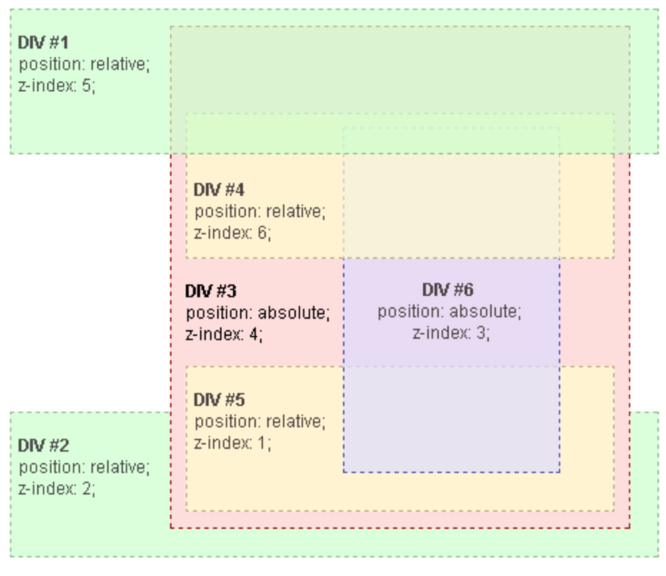
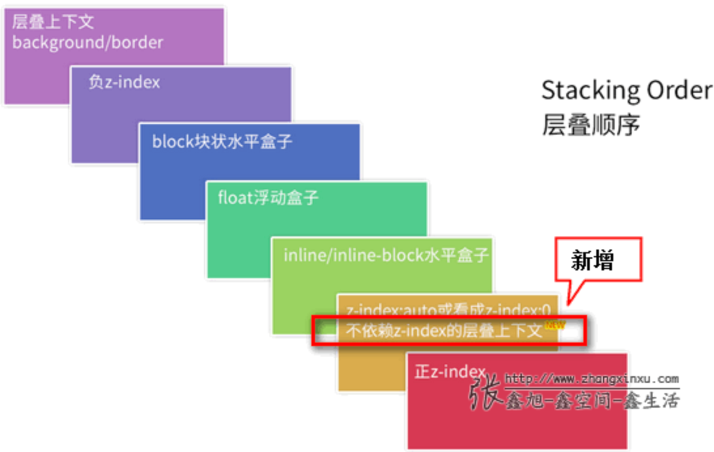

# 布局和包含块

> [布局和包含块](https://developer.mozilla.org/en-US/docs/Web/CSS/Containing_block#identifying_the_containing_block)  
>
> 包含块的作用（意义）：包含块会影响元素的定位和布局、大小。

`left` 、`margin`、`padding`（包括`margin-top` 和` padding-top`）的值是百分比时，它们的参考值就是包含块的 `width`。

- 初始包含块
  - The initial containing block has the dimensions of the viewport and is also the block that contains the `<html>` element.
  - `<html>`根元素所在包含块称为初始化包含块，它的大小和视口的大小一样。

## [格式化上下文（formatting context）](https://developer.mozilla.org/en-US/docs/Web/Guide/CSS/Block_formatting_context)  

> BFC元素特性表现原则就是，内部子元素再怎么翻江倒海，翻云覆雨都不会影响外部的元素。所以，避免margin穿透啊，清除浮动什么的也好理解了。

# 定位

> position: sticky fixed 参考点？
> [position-mdn](https://developer.mozilla.org/en-US/docs/Web/CSS/position) 

- z-index、left、top 对静态定位的元素无效。z-index 只作用于非静态定位元素和 `flex items` 。静态定位元素的 z-index 由该元素所在的 `stacking context` 决定。	

- 相对定位的元素以正常布局的位置为参考进行偏移，被偏移后，该元素偏移前所占的空间仍然还在，不会变化，也不会影响其他元素。

- 绝对定位脱离文档流，不在占由原有的空间，以 `containing element` 为参考（怎么确定 containing element [包含块](https://developer.mozilla.org/en-US/docs/Web/CSS/Containing_block#identifying_the_containing_block)）。left、top 指定该元素与包含块之间的距离。不会发生 margin 合并。

- fixed 固定定位：通常相对于视口的可视区域定位元素
  - fixed元素被另一个fixed元素包含的时候在chrome下fixed子元素的定位会受到父元素的影响。

- sticky
  - Sticky elements are "sticky" relative to the nearest ancestor with a "scrolling mechanism", which is determined by its ancestors' [position](https://developer.mozilla.org/en-US/docs/Web/CSS/position) property。scrolling mechanism 就是 overflow  is  `hidden`, `scroll`, `auto`, or `overlay`
  
  - The element is positioned according to the normal flow of the document, and then offset relative to its **nearest scrolling ancestor** and [containing block](https://developer.mozilla.org/en-US/docs/Web/CSS/Containing_block) (nearest block-level ancestor), including table-related elements, based on the values of `top`, `right`, `bottom`, and `left`. The offset does not affect the position of any other elements。
  
  - 粘性定位元素必须至少设置一个 top、left、right、bottom，没有超出设置的偏移之前元素视为相对定位，否则视为固定定位（直到该元素到达其父元素的边界）。


# z-index | stacking context（堆叠上下文）

  

div1、div2、div3 属于同一个 stacking context，div3 创建了一个新的包含了div4、div5、div6 的上下文，当两个不属于同一个上下文的元素比较 z-index 时，会一直向上直到使这两个元素属于同一个上下文。例如当 div4 与 div1比较 z-index时，div3被看作一个整体（z-index: 4）与 div1 比较。

- 技巧
  - 把 z-inde 看作版本号（目录号），从主版本依次进行比较。
  - 一个dom 元素如果没有形成新的 stacking context，那么在进行层叠顺序的比较时该元素等价于它所在的 stacking context 的层叠顺序。
  - 普通文本流中的元素，dom位置在后面的层叠顺序更高

- [什么情况会创建新的 stacking context？](https://developer.mozilla.org/en-US/docs/Web/CSS/CSS_Positioning/Understanding_z_index/The_stacking_context)  
  如果元素没有创建新的 stacking context 设置 z-index 无效。

- 参考
  [深入理解CSS中的层叠上下文和层叠顺序](https://www.zhangxinxu.com/wordpress/2016/01/understand-css-stacking-context-order-z-index/?shrink=1)  
    

# scale

[清除多余空白](https://jsfiddle.net/t5utds44/7)  

- 负margin 抵消多余的空白


# 文本截断 

- [文本强制两行超出就显示省略号](https://blog.csdn.net/Tracy_frog/article/details/77881808) 
  [多行文本溢出显示省略号-WEB前端开发](https://www.html.cn/archives/5206) 
  [2018年面试材料](https://mp.weixin.qq.com/s/GPQYKF-2wfBltrgziYTuRA ) 
  [纯 CSS 实现多行文字截断](https://mp.weixin.qq.com/s/QT1oyc-AUIqx_tOb8J6n-A) 
- [关于文字内容溢出用点点点(…)省略号表示-张鑫旭](https://www.zhangxinxu.com/wordpress/2009/09/%E5%85%B3%E4%BA%8E%E6%96%87%E5%AD%97%E5%86%85%E5%AE%B9%E6%BA%A2%E5%87%BA%E7%94%A8%E7%82%B9%E7%82%B9%E7%82%B9-%E7%9C%81%E7%95%A5%E5%8F%B7%E8%A1%A8%E7%A4%BA/#zxx_f) 
  [js判断文本溢出_js判断div文本是否溢出 - 云+社区 - 腾讯云](https://cloud.tencent.com/developer/information/js%E5%88%A4%E6%96%AD%E6%96%87%E6%9C%AC%E6%BA%A2%E5%87%BA) 

# 命名空间

解决 css 类名冲突

1. 创建命名空间

```ts
// 生成带命名空间的 className 字符串
// 支持对象类型和不限数量的 modifier，例如：
// const cls = createCls('namespace')
// cls('className')
// cls('className', 'modifier1', 'modifier2')
// cls('className', {'modifier1': true, 'modifier2': false}, 'modifier3')
export const createCls = (namespace) => (
  className: string,
  ...modifiers: Array<string | number | object>
) => {
  let primitiveResult = `${namespace}-${className}`;
  const modifierResult = modifiers.map(makeObjectClassName(primitiveResult)).join(' ');
  return primitiveResult + ' ' + modifierResult;
};

const makeObjectClassName = (primitiveResult: String) => (modifier) => {
  let result = "";
  if (typeof modifier === "string") {
    result = `${primitiveResult}--${modifier}`;
  } else {
    let keys = Object.keys(modifier).filter((k) => modifier[k]);
    keys.forEach((m) => (result += `${primitiveResult}--${m}`));
  }
  return result;
};
```

2. 使用

```vue
// 可以用组件名或页面的名字作命名空间
// createCls 可以直接挂到 vue 原型链上
const cls = createCls('checkbox');
// checkbox 组件模板
<template>
  <div class="cls('wrap')">
    <input class="cls('input', {focus: true})"/>
  </div>
</template>

<style>
  /* 这个组件的所有样式都写在这个类名下面 */
  .checkbox{
    &-wrap{
      color: red;
    }
    &-input{
      color: red;
    }
    &-input--focus{
      color: blue;
    }
  }
</style>
```

# 宽高等比例缩放

高度与宽度相关联，当 padding-top 的值是百分比时，是根据父元素的宽度来计算的（margin-top 也是）。

```html
<div class='container'><div class='placeholder'>占位, 撑开高度</div></div>
.container {
  width: 50%
	.placeholder {
    width: 100%;
    height: 0;
    padding-top: 100%;
  }
}
```

# `<link>` 和 `<script>` js 的区别

```html
<link href="/assets/js/app.js" rel="preload" as="script" />
<script src="/assets/js/app.js"></script>
```

link 预加载资源，但是不会执行js，script 会执行js

# CSS 生成器

- [三角形生成器](http://tool.uis.cc/sjmaker/)  
- [网格生成器](https://cssgrid-generator.netlify.app/)  
- [在线CSS编辑-EnjoyCSS](https://enjoycss.com/) 
- [平滑阴影](https://shadows.brumm.af/)  
- [CSS渐变](https://cssgradient.io/)  
- [花式边界半径](https://9elements.github.io/fancy-border-radius/)  
- [剪辑路径生成器](https://bennettfeely.com/clippy/)  
- [更改图像](https://neumorphism.io/#e0e0e0)  
- [多盒阴影生成器](https://htmlcssfreebies.com/box-shadow-generator-multiple/)  
- [SVG波浪](https://getwaves.io/) 
- [动画](https://angrytools.com/css/animation/)  [动画库](https://segmentfault.com/a/1190000023471689) 


