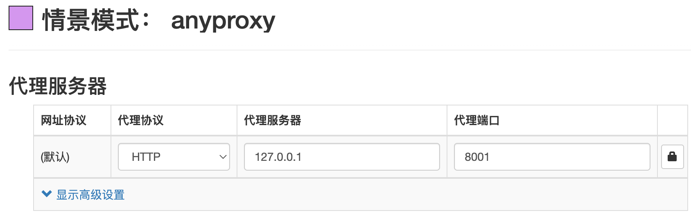
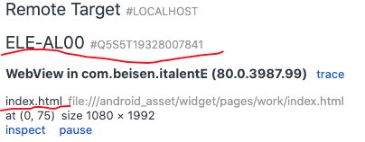
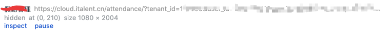

# 资源代理

> 目标：线上数据 + 本地代码

##  资源映射

若只想把线上某些 JS、CSS 文件代理到本地，需要明确线上文件和本地开发环境中文件的 URI，比如线上 `http://xxx.com/a.js` 对应本地 `http://127.0.0.1/b.js`。建议编译前端资源时带上某些标识符，不然像 `chunk-7b00cddc18ef6832104e.js` 这种无法判断对应本地那个文件。

若前端是单页面项目， html 文件被代理后不需要考虑 js、css 文件的映射。

## 工具

- **Chrome**

[查看chrome可执行文件路径、用户资料等](chrome://version/) 


1. 如果页面所在 Origin 和跨域请求资源所在 Origin 都是 HTTP 协议，那么可以用以下命令启动 Chrome 并实现<font color="red">跨域请求</font>，不需要服务端配置，也不用其他操作。

```javascript
open -a "Google Chrome dev" --args --disable-web-security --user-data-dir="/xx/temp"
```

2. Chrome 可以不使用插件，用命令行启动浏览器并指定代理服务器

```shell
/Applications/Google\ Chrome.app/Contents/MacOS/Google\ Chrome --disable-web-security --user-data-dir="xxx" --proxy-server="http://127.0.0.1:8500" --proxy-bypass-list="<-loopback>"

// chrome非安全模式
// chrome http://xx.com -–disable-extensions –-disable-sync –-disable-web-security -–proxy-server="http://127.0.0.1:8500"
```

windows 中执行命令如下：

```sh
"C:\Program Files\Google\Chrome Dev\Application\chrome.exe" --user-data-dir=D:\dev-soft\chrome-dev-user --disable-web-security

serve -l tcp://127.0.0.1:3000 D:\Desktop\proxy
```

部分参数只有在指定了 --user-data-dir 的情况下才生效，所以建议都指定 --user-data-dir 


用命令行参数指定代理服务器可以解决无法将【本地 IP+端口】代理到其他本地IP的其他端口的问题

[chrome 启动命令](https://himle.github.io/201609Chromium-%E5%91%BD%E4%BB%A4%E8%A1%8C%E5%90%AF%E5%8A%A8%E5%8F%82%E6%95%B0/) [官网](https://www.chromium.org/developers/how-tos/run-chromium-with-flags/) [翻译](https://www.cnblogs.com/gurenyumao/p/14721035.html) 
--incognito:  进入隐身模式——保证浏览网页时，不留下任何痕迹。
--disable-web-security:  不要强制执行同源策略


- [SwitchyOmega](https://chrome.google.com/webstore/detail/proxy-switchyomega/padekgcemlokbadohgkifijomclgjgif?utm_source=chrome-ntp-icon) 
SwitchyOmega 作正向代理，将页面请求转发给其他服务器，页面可以是通过 IP 或域名访问，域名甚至可以是任意的假域名（实现跨域）。

- 如何将域名解析到本地IP？
  - 修改本地 `/etc/hosts` 
  - 使用 SwitchHost 更方便的管理修改本地 hosts 文件，本质也是修改的 hosts 文件

- Nginx | AnyProxy
作为反向代理服务器，接收页面请求并转发给源服务器。

## 实现方案

1. vue 项目中通过配置 `vue.config.js` 的 `devServer.proxy` 字段实现代理，详情参考[devServer.proxy](https://cli.vuejs.org/zh/config/#devserver-proxy) 

`devServer.proxy` 匹配模式不能用 url 中的参数，没有在实际项目中使用。

2. [xSwitch](https://github.com/yize/xswitch) - Chrome 插件

一个用来做请求链接转发的 Chrome 浏览器插件，因为采用的是浏览器原生 API，安全性和性能能得到保障。
将请求进行 Redirect ，不算代理，但可以应付简单的需求。比如将线上某个 JS、CSS 文件重定向到本地。

3. Nginx 反向代理

利用 Nginx 的 `proxy_pass` 终端配置反向代理，例如：

```json
server {
    listen       9100;
    root ~/Desktop/dev;
    location /one {
        proxy_pass   http://127.0.0.1:3000/;
        add_header Cache-Control "no-cache, no-store, must-revalidate";
    }
    location /two {
        proxy_pass   http://127.0.0.1:3100/;
    }
    location / {
        proxy_pass   http://127.0.0.1:3100/;
    }
}
```

server 块标示一个[虚拟主机](https://developer.aliyun.com/article/539830)，此时我们如果调用的是 `http://localhost:9100` 时，会将这个请求转发到 `<proxy_pass>` 指定的端口上。

利用 Nginx 作反向代理需要配合 SwitchyOmega 插件或者修改本机 `/etc/hosts` 文件。

线上网址是通过 IP 或域名访问，可以配置 SwitchyOmega 插件将页面请求代理到 Nginx 监听的端口，再由 Nginx 进行转发。

若线上是通过域名访问，还可以不用 SwitchyOmega，通过修改 本机 `/etc/hosts` 文件，将域名解析到本地地址 (127.0.0.1)。`SwitchHost` 软件可以更方便的管理修改 `hosts` 文件。

用 Nginx 代理 https 服务需要配置证书，目前没有实现，了解的可以告知下。

4. [zan-proxy](https://youzan.github.io/zan-proxy/) 
> NodeJs 开发的代理服务器，与用 Nginx 作代理服务器类似，需要配合 SwitchyOmega 或修改本机 hosts 文件。
>
> 个人体验不好用，代理规则贼难用，并且代理 https 失败，无法安装并信任证书，查阅资料说和电脑系统有关，没继续研究。

5. [AnyProxy](https://github.com/alibaba/anyproxy) 
> AnyProxy是一个基于NodeJS的，可供插件配置的 HTTP/HTTPS 代理服务器。与用 Nginx 作代理服务器类似，需要配合 SwitchyOmega 或修改本机 hosts 文件。
> 
> 目前唯一成功代理 https 的方法

## 总结

> 正向代理

浏览器用 Chrome，实际使用中火狐浏览器无法代理 HTTPS 网址。

代理浏览器请求有两个方法：浏览器插件、命令行指定代理服务器

> 反向代理

转发请求到源服务器时，可以使用 nginx 或 anyproxy，实际使用中 nginx 无法代理 HTTPS 网址。

# [AnyProxy](https://github.com/alibaba/anyproxy) 

> AnyProxy是一个基于NodeJS的，可供插件配置的 HTTP/HTTPS 代理服务器。
>
> 线上前端资源代理到本地，浏览器访问线上地址，使用线上数据，将 web 资源代理到本地开发环境（<span style="color:red">注意: 操作的是线上的数据</span> ）。
>
> - 代理服务器配置: api 走线上, web资源走本地
> - 修改本地 api 配置, 改为生产环境, 使数据接口请求线上api地址

## 步骤

- SwitchyOmega 配置

正向代理，页面请求转发给其他代理服务器，可以是 AnyProxy 或者 Nginx 等。
 

- AnyProxy 配置

安装 AnyProxy 后配置代理规则，例如：
```js
// 使用线上的数据接口，将web资源代理到本地
const whiteList = ['?ImageId=', '?n=xxx'];
module.exports = {
  *beforeSendRequest(reqCfg) {
    if (whiteList.every(s => !reqCfg.url.includes(s))) {
      const nReqCfg = reqCfg.requestOptions;
      reqCfg.protocol = 'http';
      nReqCfg.hostname = '127.0.0.1';
      nReqCfg.port = '8080';
      return reqCfg;
    }
  },
  *beforeDealHttpsRequest(reqCfg) {
    return true;
  },
};
```
运行 anyproxy

```js
anyproxy --intercept --ignore-unauthorized-ssl --rule ./proxy-rule/src/local.js
// 1. 若需要代理 https 添加 intercept 指令
// 2. 代理使用自签名证书的 https 网站时，若提示 Error: unable to verify the first certificate
// 则加 ignore-unauthorized-ssl 指令
// 3. rule 指令指定使用的代理规则文件
```


## 报错处理

- 页面报错: `Invalid Host header`

```json
// 修改 vue.config.js 配置，设置本地开发环境服务器不检查 Host
devServer: {
  disableHostCheck: true
},
```

- 跨域：修改本地 api 接口为生产环境配置
- [访问自签名证书的 https 报错](https://github.com/alibaba/anyproxy/issues/340)：运行命令中增加 `--ignore-unauthorized-ssl` 
- [SwitchyOmega 不能代理本地地址](https://github.com/FelisCatus/SwitchyOmega/issues/1762) 
  - 用命令行启动chrome，在命令行参数中配置代理服务器
  - 用 version-70 的 Chromium，[下载地址](https://vikyd.github.io/download-chromium-history-version/#/) 
  
- 如果被代理的远程服务器是 HTTPS 协议，那本地开发服务器也需要是 HTTPS

## Example

> 环境

Mac: macOs Monterey v12.3.1

Node: v16.14.2

Chrome: 100.0.4896.127（正式版本） (x86_64)

anyproxy@4.1.3

SwitchyOmega: 2.5.21

> 代理ZBH测试集群

- 运行 `zproxy sdp.test`

- SwitchyOmega 配置
  - 新建情景模式，代理服务器配置为，协议：http，IP：127.0.0.1，代理端口：8500（anyproxy 的代理端口）
  
  - Chrome 页面访问测试集群 `https://47.108.48.141:25605/` 
  
  - 在该页面选中刚刚新建的那个 SwitchyOmega 模式
  
  - 修改项目 `config.js` 文件 `host` 的值为生产环境下的值，解决跨域问题
  
  - 修改 `vue.config.js` ，增加
  ```
  devServer: {
    disableHostCheck: true
  },
  ```

> 代理 sdp beta

- 运行 `zproxy sdp.beta`
- 剩余步骤同上

# nginx 代理

> nginx 代理 https

- [nginx如何处理一个请求-官网](https://tengine.taobao.org/nginx_docs/cn/docs/http/request_processing.html) 
  http://nginx.org/en/docs/beginners_guide.html
  http://nginx.org/en/docs/http/ngx_http_rewrite_module.html#break
- https://www.nginx.com/resources/wiki/start/topics/examples/full/
- [nginx配置-知乎](https://zhuanlan.zhihu.com/p/31202053) 
- [nginx 配置UI](https://www.digitalocean.com/community/tools/nginx?global.app.lang=zhCN) 
  [nginx location配置](https://cloud.tencent.com/developer/article/1701547) 
  [nginx location配置](https://segmentfault.com/a/1190000022315733) 
  [nginx location](https://www.jianshu.com/p/a16936455018) 
  [nginx location](https://www.google.com/search?q=nginx+location+%E9%85%8D%E7%BD%AE&oq=nginx+location+%E9%85%8D%E7%BD%AE&aqs=chrome..69i57j0i30l6j69i61.5874j0j7&sourceid=chrome&ie=UTF-8) 

> location

```json
location /js {
  proxy_pass   http://127.0.0.1:3000/demoJs;
}
```

如果 proxy_pass 的 UR L定向里包括 URI，那么请求中匹配到 location 中 URI 的部分会被 proxy_pass 后面 URL 中的 URI 替换。

如果 proxy_pass 的 URL 定向里不包括 URI，那么请求中的 URI 会保持原样传送给后端 server。

`$scheme://$host$request_uri`

不知道页面请求的端口  $server_port $remote_port


## 记录|思考

代理某个url，其他的请求不处理？

浏览器 转向  nginx
nginx 将指定的url转发到 本地服务器，其他的转发到源服务器

- 浏览器是否将web请求转发到 nginx ?
  - https 代理
  - 根据报错判断是哪个部分出错
- nginx 是否正确处理请求？


- rewrite  和 proxy 区别？
- nginx 开机启动

## [nginx 代理管理](https://nginxproxymanager.com/)

Nginx 经常用作反向代理，这个工具为反向代理提供一个 Web 管理界面

## 命令

nginx -s

nginx -t

# [xswitch](https://github.com/yize/xswitch) 

> 一个用来做请求链接转发的 [Chrome 浏览器插件](https://chrome.google.com/webstore/detail/xswitch/idkjhjggpffolpidfkikidcokdkdaogg)，因为采用的是浏览器原生 `API`，安全性和性能能得到保障。

# Whlstle

> 命令
- w2 start/restart/stop
- w2 start -p \<端口号\>

> 使用log 功能打印日志

- /http://www.baidu.com/   log://

# [移动端真机调试](https://mp.weixin.qq.com/s/GIVylU3poibE-vIg6sLy9w) 

> weinre 调试
> spy-debugger调试

- 前端 将远程页面代理到本机进行调试
- Charles 代理远程页面到本地，实际上访问本地资源。


- [移动端真机调试-凹凸实验室](https://aotu.io/notes/2017/02/24/Mobile-debug/index.html) **重点** 
  switchHost & Charles
  
- [前端页面调试](http://blog.ipalfish.com/?p=150) 
  
  - Charles 代理  & 移动端调试H5页面，
  - Android IOS 调试
  
- [抓包神器之Charles，常用功能都在这里了](https://cloud.tencent.com/developer/article/1032655) 

- [Charles抓包](https://juejin.im/post/5b4f005ae51d45191c7e534a#heading-20) 

   [一、安装与使用](#一安装与使用)

  [二、抓手机的请求包](#二抓手机的请求包)

  - [http请求抓包](#http请求抓包)
  - https请求抓包
    - [iPhone手机抓https包](#iphone手机抓https包)
    - [安卓（小米）手机抓https包](#安卓小米手机抓https包)

  [三、用本地文件替换线上文件](#三用本地文件替换线上文件)

  - [替换测试环境的文件](#替换测试环境的文件)
  - [替换生产环境的文件（跨域）](#替换生产环境的文件跨域)

  [四、其他](#四其他)

  - [筛选指定域下的请求](#筛选指定域下的请求)

  [参考文档](#参考文档) 

  

- [Charles代理到本地](https://juejin.im/post/5bd673dc6fb9a05ce46a1333) 

- [Charles使用](https://ningyu1.github.io/site/post/84-charles/) 

- https://juejin.im/post/5ad045d2f265da2385334555

> 需要注意的是，Chrome 和 Firefox 浏览器默认并不使用系统的代理服务器设置，而 Charles 是通过将自己设置成代理服务器来完成封包截取的，所以在默认情况下无法截取 Chrome 和 Firefox 浏览器的网络通讯内容。如果你需要截取的话，在 Chrome 中设置成使用系统的代理服务器设置即可，或者直接将代理服务器设置成 127.0.0.1:8888 也可达到相同效果。

## [ios调试](https://wiki.beisen-inc.com/pages/viewpage.action?pageId=230067462) 

> [使用 Safari 进行 UIWebView 的调试](https://mp.weixin.qq.com/s/6pYUMtf_7fM_1Zg7qrNIAA) 

## [H5 移动端调试](https://mp.weixin.qq.com/s/kaPGHiGI-ljPJQ5pqxE-5A) 

1.`Safari`：`iPhone` 调试利器，查错改样式首选；
2.`iOS` 模拟器：不需要真机，适合调试 `Webview` 和 `H5` 有频繁交互的功能页面；
3.`Charles`： `Mac OS` 系统首选的抓包工具，适合查看、控制网络请求，分析数据情况；
4.`Fiddler`：适合 `Windows` 平台，与 `Charles` 类似，查看、控制网络请求，分析数据情况；
5.`Spy-Debugger`：移动端调试的利器，便捷的远程调试手机页面、抓包工具；
6.`Whistle`：基于 `Node` 实现的跨平台 `Web` 调试代理工具；
7.`Chrome Remote Devices`：依赖 `Chrome` 来进行远程调试，适合安卓手机远程调试静态页；
8.`localhost` 转 `ip`：真机调试，适合远程调试静态页面；
9.`vConsole`：内置于项目，打印移动端日志，查看网络请求以及查看 `Cookie` 和 `Storage`；

## 总结

> **1.使用Chrome调试App中的WebView页面** 

将手机与电脑相连，并且打开手机的‘usb 调试’，然后在chrome中使用`chrome://inspect/` 查看页面DOM
1. remote target中显示当前手机
2. 手机上打开App调试包，调试包中包含了一段代码，有这段代码Chrome才能检测到WebView页面，
3. 手机进入页面后`chrome://inspect/`中会显示该页面
    

> **2.使用代理让手机访问本地页面，然后进行调试** 

------------------------------------------------------------------------------------

# Android & Chrome调试移动端页面

> 调试App中的H5页面时，首先要让App访问的资源从远程服务器转向本地，然后将手机与电脑通过数据线连接，使用Chrome的提供的`chrome://inspect/#devices`工具进行调试。调试步骤如下：

1. 打开手机上的"usb调试"选项，打开该选项后，当手机与电脑相连后才能在Chrome的`chrome://inspect/#devices`页面上查看到当前设备
2. 手机上安装需要调试的App的**调试包**，打开App内的H5页面后就能在Chrome上看到对应的页面路径
    
   上图中首页路径为`file://android_asset/xxx/index.html`，`file`协议说明打开的是手机内的本地页面，如果打开的远程页面则显示如下：
    

> 本地页面和远程页面的调试方式不同，以下分别介绍：

1. **调试远程页面**：

- 远程页面包含的 html、js 等资源是在本地开发完成后部署到远程服务器上，手机也是访问远程服务器上的资源，所以不需要使用手机进行真机调试，不用将手机与电脑相连，调试步骤如下：
- 本地运行项目代码，比如：`npm run start`，该命令通常会运行一个 webpack 服务器(或者其他服务器)，
  
  比如现在这个项目运行在本地的 3000 端口，在浏览器中通过 `http://0.0.0.0:3000/`、`http://127.0.0.1:3000/` 和 `http://localhost:3000/` 都能访问到该项目。
  
  （[`0.0.0.0`、`127.0.0.1`和`localhost`之间的区别](https://juejin.im/post/5d258b6ae51d454f73356dcf)） 。
  
- 项目中如果有请求远程服务器上的数据时，通过 `localhost:3000` 和 IP 地址作为 URL 访问项目存在跨域问题，所以需要配置 nginx 进行代理，步骤如下：
- 在本地电脑上安装并运行 nginx ( nginx 是一款服务器)，安装成功后在终端输入 `nginx -v` 会显示 nginx 的版本。
- 修改 nginx 配置文件，该配置文件一般在`/usr/local/etc/nginx/nginx.conf` ，找不到的话可以在终端输入`find / -name 'nginx.config'` 查找文件位置。
- nginx的详细配置见 https://zhuanlan.zhihu.com/p/31202053，此处只对用到的几个字段说明

  ```
  server {
      server_name abc.link; // 不能随便取，为了能解决跨域，需要填写指定的名字
      listen 80;
      root /xxx/xxx;
  
      location / {
          proxy_pass http://127.0.0.1:3000/;
      }
  }
  ```

  上述是一个 nginx.config 文件中的一个 server 区块，nginx 配置文件中的一个 server 区块表示一个虚拟主机，配置文件中可以包含多个 server 块。 `server_name abc.link;`  表示这个虚拟服务器的名字是 `abc.link`，我们在浏览器中输入 URL 时其中的域名部分就是 `abc.link`；`listen 80;`表示服务器监听的80端口，所以在 URL 中的端口就是80(可省略)，`root`指定了项目所在根目录，`location` 对应 URL 中的路径部分，`proxy_pass` 表示代理到 `http://127.0.0.1:3000/` 地址。

  <p style="color:red">总结: 上述配置的效果就是，当我们在浏览器中输入 http://abc.link/ 时，浏览器实际访问的是 http://127.0.0.1:3000, 该地址就是执行 npm run start 时开启的本地项目所在地址。</p>

- 在浏览器中输入 url 时，浏览器会根据对url中的域名进行解析得到域名对应的服务器ip地址，然后才能访问服务器上的资料。因为nginx服务器运行在本地电脑上，所以要让 abc.link 指向本机的ip(127.0.0.1)。所以设置 [SwitchHost](https://github.com/oldj/SwitchHosts) 为：`127.0.0.1  abc.link`。

2. **调试本地页面** 

  - 本地页面随App一起安装到手机，不需要网络也能访问，本地页面的路径如：`file://xxx/xxx`，

  - 调试本地页面需要将手机和电脑相连，然后对手机进行代理，把手机访问的资源指向电脑本地资源路径，步骤如下：

    1. 运行Charles，手机和电脑在同一个局域网下，连接同一个WiFi。进入Proxy--->Proxy Settings设置代理，

    2. 修改手机网络，设置代理，'服务器主机名'填写电脑IP地址，端口与Charles设置的端口一致，

    3. 配置nginx，指定电脑上项目所在路径

       ```
       server {
           server_name appdebug.italent.link;
       		listen       80;
           
           # talent-core
           location /new-italent-app {
               add_header Cache-Control "no-cache, no-store, must-revalidate";
               
               # new-italent-app的父级目录：
               root /Users/beisen/workspace/beisen/italent-app;
               autoindex on;
           }
       }
       ```

    4. 手机安装调试包，进入App，然后在`chrome://inspect/#devices`页面上就能看到手机上当前页面的路径，点击inspect就能开始调试本地页面了。


# Chrome开发者工具

调试面板说明 Style 面板中，优先级越高的规则，排列越靠前 Style 面板中：
- 通过层叠规则被覆盖的 CSS 规则，使用**删除线**文本显示；
- **灰色**条目是未定义的规则，在运行时被计算样式取代了，不是继承的 Style  (注：可以理解为无效的样式规则)；
- computed 面板中灰色的 CSS 属性表示该属性未在 Style 面板中定义(包括默认的属性)；
- [Chrome 移动端调试地址](chrome://inspect/#devices) 

# Chrome 调试

- console输出支持4种占位符：`%o d s f c`-->对应4种类型的数据：对象、整数、字符串、浮点数和css样式

  如：`console.log('对象：%o,  %c整数：%d',  {name:'czl'},   'color: yellow', 23);` 
  `%c` 之后的文本使用指定的css样式输出；

- `console.group()` 和 `console.groupEnd()` 开启和关闭输出块；

1. 清除指定代码位置之前的console并且屏蔽之后的console

   - 清除控制台之后的console.log、warn等输出：console.clear();
   - 屏蔽console.log：console.log = ()=>{}

2. chrome控制台中选中DOM元素

   - $('tagName') $('.class') $('#id') and $('.class #id') 等效于document.querySelector('')，返回与指定的CSS选择器相匹配的第一个元素；
   - $$('selector')：等效于document.querySelectorAll()，返回与指定的CSS选择器相匹配的所有元素的数组；
   - $0：

3. 查看某个DOM元素的事件监听器
   
   - getEventListeners($(‘selector’)) 返回一个对象数组，其中包含绑定到该元素的所有事件。
   - getEventListeners($(‘selector’)).eventName[0].listener 
   
     如：getEventListeners($(‘firstName’)).click[0].listener：返回选中元素的点击事件的监听器；
   
4. 输出调用栈
   console.trace()
5. `console.dirxml($0)` 输出指定的节点包含的HTML
6. console.assert(a===b, a);  当条件判断为false时才输出
7. console.dir

```js
$ // 简单理解就是 document.querySelector 而已。
$$ // 简单理解就是 document.querySelectorAll 而已。
$_ // 是上一个表达式的值
$0-$4 // 是最近5个Elements面板选中的DOM元素
dir // 其实就是 console.dir
keys // 取对象的键名, 返回键名组成的数组
values // 去对象的值, 返回值组成的数组
copy($0) // 拷贝选中节点的HTML到剪贴板
```

7. `monitor(函数名)` 和 `unmonitor(函数名)` ：当指定的函数被调用时控制台输出一条消息

8. 在线编辑网页

   ```js
   document.body.contentEditable = true;
   ```
   
9. 获取DOM的事件处理程序

   ```js
   var listens = getEventListeners($("selector"))
   listens.click[0].listener.toString();
   
   monitorEvents("dom", ["click", "mousedown"])
   unmonitorevent("dom");
   ```

> [灵活使用 console 让 js 调试更简单](https://juejin.im/post/5ca6bf5151882543fc5e3bb0) 

# vscode调试

> launch.json
>
> [参考](https://www.barretlee.com/blog/2019/03/18/debugging-in-vscode-tutorial/)  

```json
{
  "name": "调试 Node.js 程序",
  "type": "node",
  "request": "launch",  //launsh | attach
  // request，必填项，有两种类型，分别是 launch 和 attach，前者的意思就是 VSCode 会打开这个程序然后进入调试，后者的意思是你已经打开了程序，然后接通 Node.js 的内部调试协议进行调试
  
  "program": "${workspaceFolder}/src/index.js" //程序的启动入口；
  
  /*
  除了使用program字段指定程序入口，
  还可以使用runtimeExecutable 和 args 启动程序
  "runtimeExecutable": "node",  使用什么命令启动
  "args": [  启动时的参数
    "${workspaceFolder}/src/index.js"
  ]
  */
}
```
> launch.json
```
{
  "type": "node",
  "request": "launch",
  "runtimeExecutable": "node",
  "runtimeArgs": [
    "-r",
    "ts-node/register"
  ],
  "args": [
    "${workspaceFolder}/src/index.ts"
  ]
}
```

`runtimeArgs` 是为 `runtimeExecutable` 环境提供的配置，而 args 是为程序提供的配置。这个 JSON 的意思是：通过 node 来启动 `/src/index.ts`，在启动时为 node 注入一个 `ts-node/register` 模块，以便可以执行 ts 类型的文件。实际执行代码为：`node --inspect-brk=DEBUG_PORT -r ts-node/register ./src/index.ts` 

> 属性解释

- `${workspaceFolder}` ：给出工作区文件夹的根路径
- `${file}`在活动编辑器中打开的文件