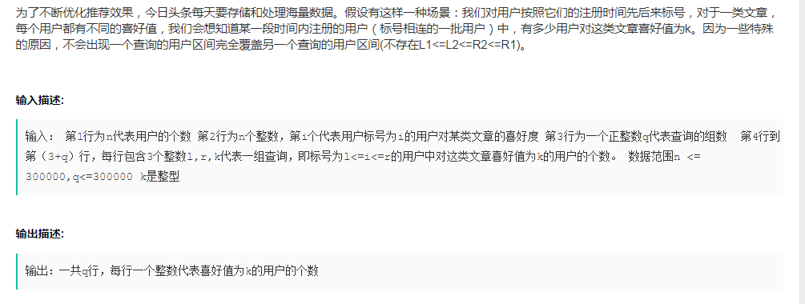
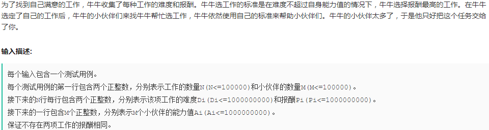

# CSS

- disposition: fixed 是相对于屏幕视口 viewport 的位置来确定元素的位置；

- css 属性 overflow 属性定义溢出元素内容区的内容会如何处理。如果值为 scroll，不论是否需要，用户代理都会提供一种滚动机制。

- border:none以及border:0的区别？

  1. 当定义了border:none，即隐藏了边框的显示，实际就是边框宽度为0；

  2. 当定义边框时,必须定义边框的显示样式.因为边框默认样式为不显示 none ,所以仅设置边框宽度,由于样式不存在,边框的宽度也自动被设置为0。

  3. border:0;浏览器对 border-width、border-color 进行渲染，占用内存。

     border:none;浏览器不进行渲染，不占用内存。

# JS

- JS API
  eval：返回字符串表达式中的值

  unEscape：返回字符串ASCI码

  escape：返回字符的编码

  parseFloat：返回实数
  
- JS 中的数字在内存中占8个 Byte

  

- JS 提供的全局函数：escape、unescape、eval、isFinite、isNaN、parseFloat、parseInt，setTimeout 是 window.setTimeout(由window提供)

## 事件队列，异步事件

  ```js
  function foo(){
      console.log('first ');
      setTimeout(function(){
          console.log('second! ');
      }, 5);
  }
  
  for(var i=0; i<10; i++){
      foo();
  }
  // 先输出10个 first, 再输出10个 second
  
  // ------------------------------------------
  for(var i=0; i<3; ++i){
      setTimeout(function(){
          console.log(i+'');	// 输出3个3
      }, 0);
  }
  // 避免的方法有两种
  // 1
  for(var i=0;i<5;++i){
      (function(num){
      	setTimeout(function(){
      		console.log(num+ ' ');
      	}, 0);
      })(i);
  }
  // 2: 用 let 替换 var 声明 i
  ```

## 闭包

```js
// 情况1
function fn(){
    var n = 0;
    function add(){
        n++;
        console.log(n);
    }
    return {
        n: n,
        add: add
    }
}
var r1 = fn();	var r2 = fn();	r1.add();	r1.add();
console.log(r1.n);
r2.add();
// 输出：1 2 0 1, 第三个为什么不是 2

/* 情况2：如果 r1.n 是引用类型, 此时输出的值与前一个值相同 */
function fn(){
    let obj = {};
    obj.n = 0;
    function add(){
        obj.n++;
        console.log(obj.n);
    }
    return {
        n: obj,  // 不能用 n: obj.n, 必须是引用类型, 
        add: add // 因为函数返回是按值传递(复制), 如果返回的是基本数据类型, 
    }
}
var r1 = fn();	var r2 = fn();	r1.add();	r1.add();
console.log(r1.n.n);
r2.add();
// 输出 1 2 2 1
```

- 创建一个函数时，会创建一个作用域链，包含了该函数可以访问的作用域对象， 作用域链以数组的形式赋值给该函数的 [[Scopes]] 属性；例如当执行 fn() 时，会创建 add 函数，同时创建包含两个作用域对象的作用域链([[Scopes]] 数组有两个元素，Scopes[0] 代表的是外层函数 fn 的作用域对象，该对象只有 obj 一个属性；Scopes[1] 代表全局作用域对象)；
- 调用函数 add 时，会为函数创建一个作用域(执行环境)，然后**复制** add 函数的 Scopes 属性值(**基本数据类型与引用数据类型的区别**)，构建当前执行环境的作用域链，再将当前 add 函数的作用域对象加入到所构建的作用域链的前端，组成 add 函数所能访问的全部作用域对象。
- 第一种情况：n 是基本数据类型，执行 add 函数，复制后的 Scopes 的属性值中的 n 不同于原始声明时的 n，所以 n++ 不会影响到原来声明的数据 n；
- 第二种情况：obj 是引用数据类型，复制后的 Scopes 的属性值中的 obj 与原来声明的 obj 是指向相同的内存空间，因此 obj.n++ 会影响到原来的数据；

参考：JS 高阶程序设计 P179、P181

- 逻辑短路

  ```js
  var a = 3<0 || typeof(3+'');
  alert(a);	// string, 不是true
  ```

## Stirng

- 'a'.charCodeAt()    返回字符的 ASCII 码；

# window API

- window.open(); // 在当前窗口打开一个新窗口, 只要是window对象的属性,在使用的时候就可以省略window；
- 浏览器内多个页签之间通讯的是：**cookie**、**localStorage**




## 字符串中不重复子串的长度的最大值

```js
var lengthOfLongestSubstring = function(s) {
    var start=0, end;
    var len = s.length;
    var hash = {};
    var count = 0, max = 0;
    if(len<2)   return len;  
    hash[s[start]] = start;
    count = 1;
    for(end=start+1; end<len; end++){
        if(typeof hash[s[end]] != 'undefined'){
            console.log(hash);
            max = count>max ? count : max;                        
            var startBuf = hash[s[end]] + 1;
            // 输出hash 表中的部分数据
            for(var i=start; i<=hash[s[end]]; i++){
                var ch = s[i];
                delete hash[ch];
            }
            start = startBuf;            
            console.log(max);
        }
        else{
            count = end - start + 1;
        }
        hash[s[end]] = end;
    }    
    max = count > max ? count : max;
    return max;
};
lengthOfLongestSubstring('abcabcbb');
```

## 网易



- 我的答案

  ```js
  var N=0, M=0, works=[], A=null;
  var i=0, lineArr=null
  while(true){
    i++;
    lineArr = readline().split(' ');
    if(i==1){
      N = parseInt(lineArr[0]); M=parseInt(lineArr[1]);    
    }
    else if(i>1 && i<=1+N){
      works.push({
        d: parseInt(lineArr[0]),
        p: parseInt(lineArr[1])
      });
    }
    else if(i==N+2){
      A = lineArr;
      break;
    }
  }
  console.log('A:', A);
  // 2 排序
  fastSort(works, 0, works.length-1);
  var j=0, ind = 0, len = works.length;
  var result = 0;
  for(i=0; i<len; i++){
    ind = search(works, 0, len-1, parseInt(A[i]));
    for(j=0; j<=ind; j++){
      if(works[j].p > result)  result = works[j].p;
    }
    console.log(result);
  }
  
  //console.log('ind: ',ind);
  
  /*
  * 
  *
  */
  //排序
  function fastSort(arr, start, end){
    if(start==end) return;
    var ind = part(arr, start, end);
    // console.log(ind);
    if(ind>start)  fastSort(arr, start, ind-1);
    if(ind<end)  fastSort(arr, ind+1, end);
  }
  function part(arr, start, end){
    if(end<start)  return console.log('error: end<start!');
    var ind = start, small=start-1;
    for(; ind<end; ind++){
      if(arr[ind].d<arr[end].d){
        swap(ind, ++small);
      }
    }
    swap(++small, end);
    function swap(ind1, ind2){
      var t=arr[ind1];
      arr[ind1]=arr[ind2];
      arr[ind2]=t;
    }
    return small;  
  }
  
  // 3. 查找
  function search(arr, start, end, target){
    var len = arr.length;
    var midInd = ((end-start+1)>>1) + start;
    // console.log('midInd: ', midInd);
    
    if(arr[midInd].d <= target){
      if(midInd==(len-1) || arr[midInd+1].d > target)  return midInd;
      else  return search(arr, midInd+1, end, target);
    }
    else if(midInd==0)  return -2;
    else return search(arr, start, midInd-1, target);
  }
  ```

  