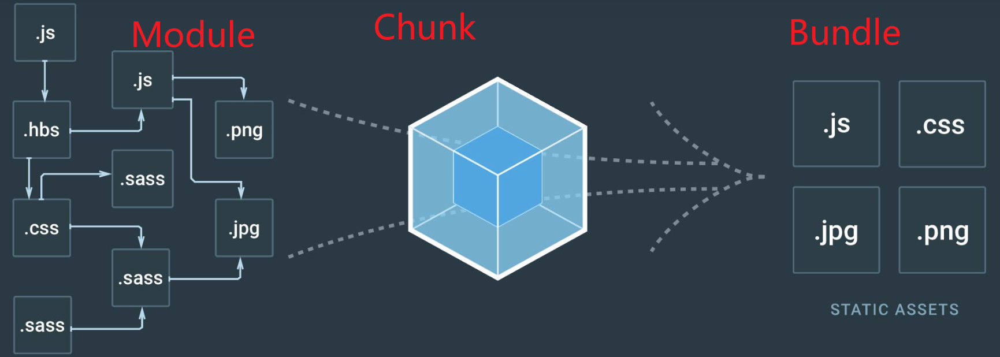
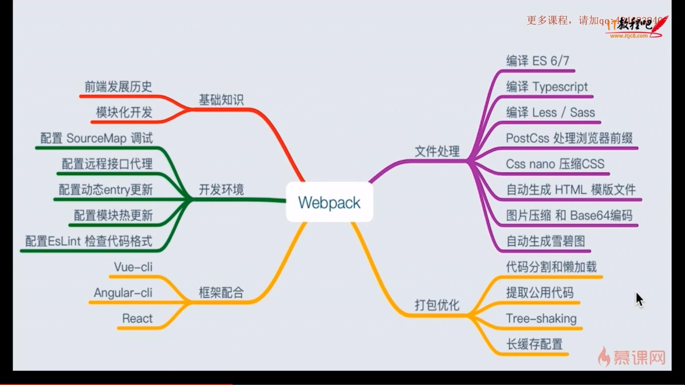

[webpack文档](https://webpack.docschina.org/concepts/) 

[createapp](https://createapp.dev/)：在线自定义 webpack 配置

[代码更新时自动编译](https://webpack.js.org/guides/development/#choosing-a-development-tool) 

1. webpack's [Watch Mode](https://webpack.js.org/configuration/watch/#watch)
2. [webpack-dev-server](https://github.com/webpack/webpack-dev-server) ：热加载，其他方式都没有
3. [webpack-dev-middleware](https://github.com/webpack/webpack-dev-middleware) 

> [代码拆分](https://webpack.js.org/guides/code-splitting/)

- SplitChunksPlugin：提取公共依赖
- [`mini-css-extract-plugin`](https://webpack.js.org/plugins/mini-css-extract-plugin): Useful for splitting CSS out from the main application.


# 目的

- 命名chunk: `output.chunkFilename: '[name].[hash:8].js'`
- webpack 提高编译速度: `rulesp[0].include = [paht.resolve(__dirname, 'src')]` 
-  性能优化: `cfg.optimization.splitChunks.chunks = "all"` 

> 前端项目配置

- 开发环境/生产环境
- 环境变量
- mock
- webpack-dev-server
- 开发环境公共样式分离为单独的css文件
- 生产环境需要压缩 HTML/CSS/JS 代码
 - 生产环境需要压缩图片
- 开发环境需要生成 sourcemap 文件
- 开发环境需要打印 debug 信息
- 开发环境需要 live reload 或者 hot reload 的功能

# 输出格式

相关配置项
1. mode
2. target
3. output.chunkFormat

# 概念

 
- module：源码、静态资源、less、ts、js 等
- [chunk](https://webpack.js.org/concepts/under-the-hood/#chunks)：多模块合成，如 entry import() splitChunk
modules are combined into chunks. Chunks combine into chunk groups and form a graph (ChunkGraph) interconnected through modules. When you describe an entry point - under the hood, you create a chunk group with one chunk.
modules 组合成 chunks，chunks 组合成 chunks group 并且形成由 module 连接成的 ChunkGraph
- bundle：最终输出的文件

webpack 的应用场景主要是 SPA (单页面富应用)，而 SPA 的核心是前端路由，那怎么算是SPA？在前后端分离的基础上加一层前端路由。通俗的讲，路由就是网址。专业的讲就是：每次GET、POST在服务器端有一个专门的正则配置列表，然后匹配到具体的路径后，分发到不同的Controller，进行各种操作，最后将HTML或数据返回给前端，这就完成了一次IO。

- 目前多数网站都是后端路由，也就是多页面，页面可以在服务端渲染好直接返回给浏览器，不用等待加载JS和CSS文件就能显示网页。缺点在于模本由后端维护或改写，前端开发需要安装整套的后端服务，必要时还需运用PHP、JAVA这类的非前端语言来改写HTML结构，所以HTML和数据、逻辑混为一谈。

- 然后就有了前后端分离的开发模式，后端只提供API返回数据，前端通过Ajax获取数据后，再用一定的方式渲染页面，这样后端专注于数据，前端专注于交互和可视化。缺点在于首屏渲染需要时间加载JS和CSS文件，这种开发模式被多数公司认同，也出现了很多前端技术栈，比如JQuary+artTemplate+Seajs(requirejs)+gulp 为主的开发模式可谓是万金油。

- 在Node出现后，这种现象得到了改善，即所谓的大前端，得益于Node和JavaScript的语言特性，HTML模本可以完全由前端控制，同步或异步渲染完全由前端自由决定，并由前端维护模板。


- webpack 是用来处理模块间的依赖关系，并对他们进行打包。
- webpack 基于node，在node环境下运行，可以使用ES6的模块加载方法;
- npm 命令根据 package.json 配置文件执行，在该文件中设置webpack使用的命令及哪个配置文件；
- `entry` 可以有多个，但`output` 只能有一个

## webpack结构

  


## 构建流程

从启动webpack构建到输出结果经历了一系列过程，它们是：

1. 解析webpack配置参数，合并从shell传入和`webpack.config.js`文件里配置的参数，生产最后的配置结果。
2. 注册所有配置的插件，好让插件监听 webpack 构建生命周期的事件节点，以做出对应的反应。
3. 从配置的 `entry` 入口文件开始解析文件构建 AST 语法树，找出每个文件所依赖的文件，递归下去。
4. 在解析文件递归的过程中根据文件类型和 loader 配置找出合适的 loader 用来对文件进行转换。
5. 递归完后得到每个文件的最终结果，根据 `entry` 配置生成代码块 `chunk`。
6. 输出所有 `chunk` 到文件系统。
7. 需要注意的是，在构建生命周期中有一系列插件在合适的时机做了合适的事情，比如 `UglifyJsPlugin` 会在 loader 转换递归完后对结果再使用 `UglifyJs` 压缩覆盖之前的结果。


# loader

loader 处理项目中各种类型的依赖文件，webpack 默认可以处理 JS、JSON 文件。

- webpack 只能理解 **JS** 和 **JSON** 文件，其他类型的文件需要用 loader 处理并被 loader 转换为有效的模块，然后添加到依赖图中。
- loader 可以将文件从不同的语言（如 TypeScript）转换为 JavaScript 或将内联图像转换为 data URL。loader 甚至允许你直接在 JavaScript 模块中 `import` CSS 文件！
- webpack 的其中一个强大的特性就是能通过 `import` 导入任何类型的模块（例如 `.css` 文件），
- 所有的 loader 按照**前置 -> 行内 -> 普通 -> 后置**的顺序执行
- `webpack.config.js` 中配置多个 loader 时按从后往前（从右往左）的顺序执行。

## 常用loader

- css文件处理：style-loader css-loader
- 字体和静态图像:  file-loader
```json
{
  test: /\.(png|svg|jpg|gif)$/,
	use: [
		'file-loader',
	],
},
```

- 压缩图像: [image-webpack-loader](https://github.com/tcoopman/image-webpack-loader)、[url-loader](https://webpack.docschina.org/loaders/url-loader)（图像转为base64） 

## 自定义loader

[编写loader](https://webpack.js.org/contribute/writing-a-loader/)  


## loader 和 plugin的区别

- webpakc中每个文件都视为一个模块，webpack 核心只能处理JS文件(模块)，所以需要loader对非JS文件进行转换，loader不影响构建流程；
- 对于loader，它是一个转换器，将A文件进行编译形成B文件，这里操作的是文件，比如将A.scss转换为A.css，单纯的文件转换过程。【导出为函数的模块，对匹配的文件进行转换；】
- plugin是一个扩展器，它丰富了webpack本身，针对是loader结束后。webpack打包的整个过程，它并不直接操作文件，而是基于事件机制工作，会监听webpack打包过程中的某些节点，执行广泛的任务，包括：打包优化，资源管理，注入环境变量。【带有apply方法的对象，apply方法被webpack的编译器调用；扩展webpack的功能，在构建过程中注入钩子函数实现；】
- [webpack 中 loader 和 plugin 的区别是什么](https://github.com/Advanced-Frontend/Daily-Interview-Question/issues/308)


# 插件

> 常用插件

- 生成html文件: html-webpack-plugin
- 压缩js代码: uglifyjs-webpack-plugin
- 定义环境变量: DefinePlugin，内置插件`webpack.DefinePlugin`
- 分离单独的css文件: extract-text-webpack-plugin
- 分离单独的css文件: [MiniCssExtractPlugin](https://webpack.docschina.org/plugins/mini-css-extract-plugin/#minimizing-for-production) 插件会将 CSS 提取到单独的文件中，为每个包含 CSS 的 JS 文件创建一个 CSS 文件，并且支持 CSS 和 SourceMaps 的按需加载

## 自定义插件

webpack 插件是一个具有 apply 方法的 JavaScript 对象。apply 方法会被 webpack compiler 调用，并且在 整个 编译生命周期都可以访问 compiler 对象。

> 如何自定义webpack插件

- JavaScript 命名函数
- 在插件函数prototype 上定义一个apply 方法
- 定义一个绑定到webpack 自身的hook
- 处理webpack内部特定数据
- 功能完成后调用webpack 提供的回调

```js
// ConsoleLogOnBuildWebpackPlugin.js
const pluginName = 'ConsoleLogOnBuildWebpackPlugin';

class ConsoleLogOnBuildWebpackPlugin {
  apply(compiler) {
    compiler.hooks.run.tap(pluginName, (compilation) => {
      console.log('webpack 构建正在启动！');
    });
  }
}
module.exports = ConsoleLogOnBuildWebpackPlugin;
```

https://www.webpackjs.com/contribute/writing-a-plugin/ 

# [code splitting](https://webpack.js.org/guides/code-splitting/)

# [Bundle Analysis](https://webpack.js.org/guides/code-splitting/#bundle-analysis)

# webpack配置

> [自定义配置UI](https://createapp.dev/webpack/vue--babel--typescript) 

# 依赖管理

> https://webpack.js.org/guides/dependency-management/

> 动态导入 require.context

[require.context](https://v4.webpack.js.org/guides/dependency-management/#requirecontext) 
[动态导入](https://v4.webpack.js.org/api/module-methods/#dynamic-expressions-in-import) 

`require('./template/' + name + '.ejs');`
`require.context('./test', false, /\.test\.js$/);`

使用 `import(somepath)` 动态导入资源时，资源路径不能完全是一个变量，必须以字符串开头。

如果路径指向父级目录，要避免出现循环引用

## 自动加载组件|路由

```js
var requireComponent = require.context("./src", true, /^Base[A-Z]/)
requireComponent.keys().forEach(function (fileName) {
  var cfg = requireComponent(fileName)
  cfg = cfg.default || cfg
  var componentName = cfg.name || fileName.replace(/^.+\//, '').replace(/\.\w+$/, '');
  Vue.component(componentName, cfg)
})
```

# svg处理

1. 读取 svg 文件
2. 压缩svg
    svgo-loader
3. 生成组件

# 问题

- 代码分离，路由懒加载，如果资源（组件）文件不在 `src` 目录下，使用动态 `import` 不会打包为多个 chunk
- `entry.page`
- contenthash: 根据资源内容创建出唯一 hash，但是资源没有变化，每次build时hash还是会变化。因为webpack 在入口 chunk 中，包含了某些 boilerplate(引导模板)，特别是 runtime 和 manifest。（译注：boilerplate 指 webpack 运行时的引导代码）。
- 我们将 `lodash` 安装为 `devDependencies` 而不是 `dependencies`，因为我们不需要将其打包到我们的库中，否则我们的库体积很容易变大。
- 现在，如果执行 `webpack`，你会发现创建了一个体积相当大的文件。如果你查看这个文件，会看到 lodash 也被打包到代码中。在这种场景中，我们更倾向于把 `lodash` 当作 `peerDependency`。也就是说，consumer(使用者) 应该已经安装过 `lodash` 。因此，你就可以放弃控制此外部 library ，而是将控制权让给使用 library 的 consumer
- [创建library](https://webpack.docschina.org/guides/author-libraries/) 

# 参考

[webpack定制前端开发环境](https://www.kancloud.cn/sllyli/webpack/1242347) 
[webpack 概念-解释](https://mp.weixin.qq.com/s?__biz=MjM5NTEwMTAwNg==&mid=2650306445&idx=1&sn=4ec67967ba6352fb168b4cf68af1930d&chksm=bef177ac8986feba165cd9bc818747832c52bba9100f634f61cc7911027acef2ba18adce5ba2&scene=21#wechat_redirect)
