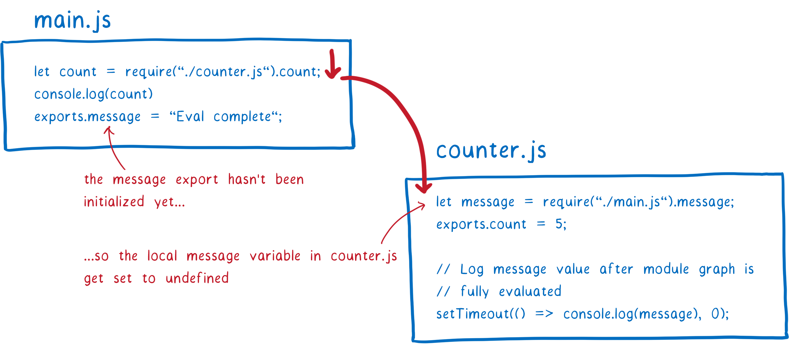
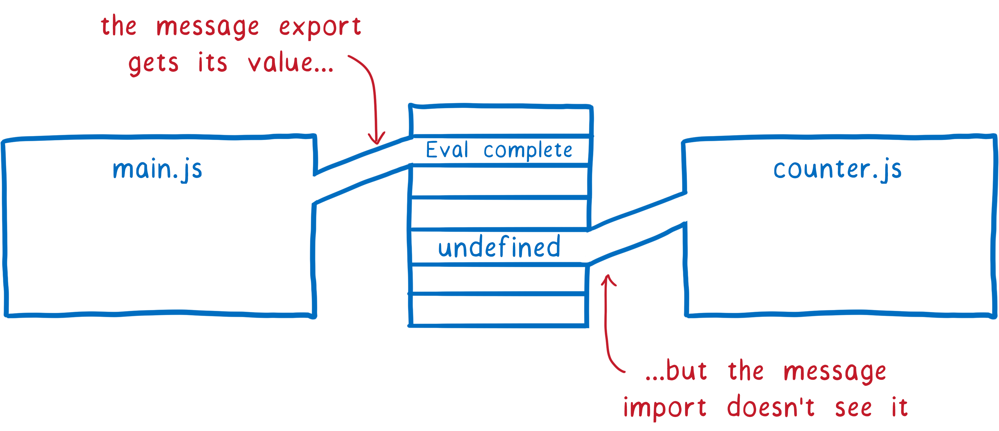

# 模块化规范

[前端模块化](https://juejin.cn/post/7071937253227888670) 

> 模块化  .mjs .cjs

1. 应用环境：服务端 & 客服端
2. 加载时期：编译时加载 & 运行时加载
3. 加载原理
4. 区别

> 模块化解决了什么问题

1. 解决命名污染、全局污染
2. 私有变量
3. 代码复用、共享代码、显示声明依赖关系

> 模块类型

CommonJs、[AMD(Asynchronous Module Definition)](https://github.com/amdjs/amdjs-api/wiki/AMD) 、[CMD(Common Module Definition)](https://github.com/seajs/seajs/issues/242) 、ESModule

- AMD(Asynchronous Module Definition)、UMD、CommonJS、ES Module（又称 JS Modules or ECMAScript modules）
- ES Modules 是 JS 官方标准，AMD、CommonJS、UMD都是不同的开发者在 JS 标准模块化系统出来之前创建的
- CommonJS，AMD，CMD，ES Modules 都是规范，RequireJs，SeaJS 是分别基于 AMD 和 CMD 的前端模块化具体实现，引入这两个库后，就可以按照规范进行模块化开发。
- UMD 是 AMD 和 CommonJS 的糅合，解决跨平台的问题，具体就是它会判断是否支持 Node.js 的模块（exports 是否存在），存在则使用 Node.js 模块模式。 再判断是否支持 AMD（define 是否存在），存在则使用 AMD 方式加载模块。


[Node module Package](https://nodejs.org/docs/latest/api/packages.html#modules-packages) 
[Node CommonJS](https://nodejs.org/docs/latest/api/modules.html#modules-commonjs-modules) 
[Node ES Module](https://nodejs.org/docs/latest/api/esm.html) 

NodeJS 中有 ES Module 和 CommonJS 两种模块化系统，一个 package 使用哪类系统由 package.json 中的 `type` 字段决定。但是 package 中的 `*.cjs` 文件一定会被解析为 CommonJS，`*.mjs` 文件一定会解析为 ES Module，这与 package.json 中的 `type` 字段无关。

# [Module package](https://nodejs.org/docs/latest/api/packages.html) 

> package enter（入口）
>
> [webpack package-export](https://webpack.js.org/guides/package-exports/) 

package.json 中的 `main` 和 `exports` 字段定义了包的入口。`exports` 可以定义多个入口，并且可以根据执行环境解析不同的入口。如果 `exports` 和 `main` 字段同时存在，在支持 `exports` 的Node版本中`exports`优先级高于`main`。


Using package subpath exports or subpath imports can provide the same containment organization benefits as folders as modules, and work for both require and import.

- 条件 exports
  在`exports`中可以使用条件导出来定义不同环境的不同入口，包括使用`import` 或 `require` 导入包。

```json
{
  "name": "my-package",
  "exports": {
    ".": "./lib/index.js",
    "./lib": "./lib/index.js",
    "./lib/index.js": "./lib/index.js",
    "./package.json": "./package.json",
    "./lib/*": "./lib/*.js",
    "./package.json": "./package.json"
  }
}

{
  "main": "./index.js",
  "exports": "./index.js"
}
// 条件导出
{
  "exports": {
    "import": "./index-module.js",
    "require": "./index-require.cjs"
    "./feature.js": {
      "node": "./feature-node.js",
      "default": "./feature.js"
    }
  },
  "type": "module"
}
// 嵌套导出
{
  "exports": {
    "node": {
      "import": "./feature-node.mjs",
      "require": "./feature-node.cjs"
    },
    "default": "./feature.mjs"
  }
}
```

> package.json imports 字段

package "imports" field to create private mappings that only apply to import specifiers from within the package itself.
```json
{
  "imports": {
    "#internal/*.js": "./src/internal/*.js",
    "#dep": {
      "node": "dep-node-native",
      "default": "./dep-polyfill.js"
    }
  }
}
```
where import '#dep' does not get the resolution of the external package dep-node-native (including its exports in turn), and instead gets the local file ./dep-polyfill.js relative to the package in other environments.


> package.json module 字段

Node.js 支持 ES Module 之前，若想在包中同时包含ES Module 和 CommonJS，可以在 package.json `main` 指定 CommonJS 入口点，`module` 指定 ES 模块入口点。这使得Node.js可以运行CommonJS入口点，而构建工具(如bundlers)则使用ES模块入口点（因为Node.js 忽略顶层的`module`字段）。


# ES Module

> import

- 服务器及浏览器环境下的通用模块加载方案，**编译时**确定模块的依赖关系；
- `import` 命令会提升，因为import命令是在编译阶段完成的，`import` 命令需要知道模块中导出的变量名(函数名、对象名)；
- `import` 命令会执行所加载的模块，若有多条相同的 `import` 语句，则只执行一次。

> export

export 可以出现在模块的任何位置，只要不在块级代码内。

```js
// 写法一
export var m = 1;
// 写法二
var m = 1;
export {m};
```

> 加载原理

- 编译时加载，静态分析，import 命令提前，生成【只读引用】，运行时再根据引用到模块中取值。接口与模块内部的值是动态绑定，多次加载只会执行一次。


- CommonJS 模块输出的是一个值的【拷贝】，ES6 模块输出的是值的【引用】。在 CommonJS 中一旦输出一个值，模块内部的变化就影响不到这个值。

- CommonJS 模块是【运行时】加载，ES6 模块是【编译时】输出接口。

- CommonJS 加载的是一个对象（ 即 module.exports 属性 ），该对象只有在脚本运行完才会生成。而 ES6 模块不是对象，它的对外接口只是一种静态定义，在代码静态解析阶段就会生成。

> 参考

- [JS modules](https://developer.mozilla.org/en-US/docs/Web/JavaScript/Guide/Modules) 
- [ESModule](https://blog.lbinin.com/frontEnd/JavaScript/Module-Import.html#esmodule) 

## 两种模块交互

- `import` 只能在 ES Module 中使用，`import` 可以导入 ES Module 和 CommonJS，如: `import fs from 'fs';`
- CommonJS 中可以使用 `import()` 导入 ES Module

ES Module 可以使用 `import` 导入 CommonJS 模块，CommonJS 模块中可以使用 `import()` 导入 ES Module 模块

- `module.exports` object is provided as the default export

# ES Module

> ES modules 即 JavaScript modules

```js
package.json
type module
```

- NodeJS 中默认使用的是 CommonJs
- 使用浏览器原生的 JS 模块化功能
- 什么是 JS Module？
  

一个 JS modules 就是一个可以 `export code` 的文件，其他的 JS 文件可以通过 `import`  该文件将其作为依赖然后使用文件中 `export` 的 `code`。

- Module Bundler？
  - A **module bundler** is a tool developers use to bundle an app's [modules](https://www.freecodecamp.org/news/javascript-es-modules-and-module-bundlers/#what-exactly-is-a-javascript-module) and dependencies into a single browser-compatible JavaScript file.
  - 常用的 module Bundler 有 webpack、browserify、rollup
  - module bundler 将 `require()` 和 `import` 打包为浏览器可以访问的文件
  - module bundler 从 entry point 入口开始构建依赖图，最后将将源码编译为浏览器兼容的 JS 文件并生成到 `dist/` 目录下


- 浏览器原生JS Module

```html
<script type="module" src="index.js"></script>

// index.js
import xx from xx.js

// 或者
<script type="module">
  import { test } from './module/lib-a.js';
</script>

// 动态导入
<script type="module">
  btn.onclick = async () => {
    const { fn } = await import('./xx.mjs');
    fn();
  }
</script>
// import() 不是函数，没有继承 Function.prototype, 只是语法像函数，就和 super() 类似
```

> type="module"

支持 JS module 的浏览器会忽略 `nomodule` scripts，因此可以对于不支持 Js module 的浏览器提供回退版本

```html
<script type="module" src="main.mjs"></script>
<script nomodule src="fallback.js"></script>
```

> preload modules

```html
<link rel="modulepreload" href="lib.mjs">
<link rel="modulepreload" href="main.mjs">
<script type="module" src="main.mjs"></script>
<script nomodule src="fallback.js"></script>
```
Without rel="modulepreload", the browser needs to perform multiple HTTP requests to figure out the full dependency tree. However, if you declare the full list of dependent module scripts with rel="modulepreload", the browser doesn’t have to discover these dependencies progressively.


> module script 和 普通 script 的区别

- The `async` attribute does not work for inline classic scripts, but it does work for inline `<script type="module">`
-  module scripts (and their imports) are fetched with CORS. 需要遵守跨域共享策略。
-  You can only use import and export statements inside modules, not regular scripts.（普通 script）
-  模块中自动使用严格模式
-  module script 创建一个顶级词法作用域，保留了 `await`，`this` 是 `undefined` 
-  module script 默认是 defered，主模块和所有依赖 modules 的下载和 HTML 解析同步进行
-  module script 即使导入多次也只会执行一次，而普通 script 引入多次就会执行多次
-  支持 module script 的浏览器中可以直接使用【箭头函数】、【`async-await`】 等
-  module script 支持动态导入，只在需要时才加载 Js 文件。static import 不能在普通 script 中使用，但是动态 import 可以。


因为普通 script 和 module script 有很多区别，JS 运行时需要区分哪些是 module script。浏览器环境中通过 `<script>` 上的 `type="module"` 区分。

On the Web，文件后缀不重要，只要 MiME type 正确（`Content-Type:text/javascript`），不过还是推荐使用 `.mjs` 作为 module script 文件后缀。NodeJS 环境中通过文件后缀区分。建议在浏览器环境中也使用对应的文件后缀，因为：

- 增强可读性
- 运行或 build 时，NodeJs、d8、Babel 会将 `.mjd` 解析为 module


> 动态加载

使用动态加载的模块作为单独的入口，建立新的依赖图

## [怎样工作](https://hacks.mozilla.org/2018/03/es-modules-a-cartoon-deep-dive/) 

模块之间构成一个依赖图，需要指定一个入口文件，查找所有的依赖关系。

source file => module record => module instance（包含 code 和 state）

code: 指令列表

state: 变量在任一时间的实际值。


> ES Module 运行步骤

1. Loader 获取 Js 文件，在浏览器环境下由 HTML 规范指定怎样加载文件。
2. JS 文件解析为 module records，然后实例化为模块实例、evaluation。


For ES modules, this happens in three steps.

1. **Construction** — find, download, and parse all of the files into module records.根据URL下载（浏览器）或从文件系统中加载（NodeJS）
2. **Instantiation** —find boxes in memory to place all of the exported values in (but don’t fill them in with values yet). Then make both exports and imports point to those boxes in memory. This is called linking.
   分配内存，暂不赋值，将 `export` 和 `import` 指向内存地址
3. **Evaluation** —run the code to fill in the boxes with the variables’ actual values.
   运行代码，为变量赋值

Construction、Instantiation、Evaluation 可以分别执行（异步）。CommonJS 中的依赖是一次性加载、实例化、evaluation，中间没有中断，CommonJS 同步loading 和 evaluating JS 文件。这是 ES Module 和 CommonJS 之间最大的区别。浏览器环境中需要从网络上下载文件，而 NodeJs 环境下是从文件系统中加载文件。


对于特定全局范围中的每个模块，将只有一个模块实例，loader 会缓存 module 实例，并且 loader 使用 module map 管理缓存。

一个 module 文件即使被 import 多次也只会 fetch 一次。

   

> Construction/Parsing

文件下载之后，接着将文件解析为 module record，然后 module record 被添加到 module map 中。

所有文件解析完成后，从最初的入口文件变为一堆 module records。下一步实例化 module 并将所有的实例 link 在一起。

> 实例化

一个 instance 包含了 code 和 state。state 存在内存中，实例化的过程就是将所有东西链接到内存。但是在 evaluation 之后内存中才用实际值赋值。

link 多次得到的结果是一样的。

ES Module 使用 live bindings ，`export` 和 `import` 某个变量时，指向相同的内存地址。


这步完成后，we have all of the instances and the memory locations for the exported/imported variables wired up。

> Evaluation（执行|运行）

JS 引擎执行代码为内存赋值，执行可能产生副作用，所以每个 module 应该只执行一次，这也是用 module map 的原因之一。每个 module 只有一个 module record，确保了每个 module 只会执行一次。

evaluation 执行多次得到的结果可能不同。


> Js 引擎如何运行一个 module

- Parsing: 读取 module 源码
- Loading: 递归加载所有 imported modules
- Linking: For each newly loaded module, the implementation creates a module scope and fills it with all the bindings declared in that module, including things imported from other modules.
  创建作用域，为变量赋值
- Run time: 执行新加载的 moudle 中的代码

## import & export

- `import` 和 `export` 都声明提前

```js
import _ from 'lodash';
// 等价于 import { default as _ } from 'lodash';
```


所有的 CommonJs 和 AMD modules 在 ES6 中有一个 `default` 导出。

```js
// ES6 equivalent of `var colors = require("colors/safe");`
import colors from "colors/safe";
```


- 从一个模块导入的值是只读的，不过导入的对象的属性可以修改
- JavaScript imports a module's code as live binding（热绑定），如果在模块内部修改了导出的值，引用该模块的代码也会更改

## 解决循环引用

```js
// main.js
Log(`main.js 开始`);
const aRes = require('./a.js');
Log(`main.js aRes 结果:`, aRes);
exports.val = 'main';
Log(`main.js end`);

// count.js
const mainRes = require('./main.js');
Log(`a.js 执行 mainRes`, mainRes);
const result = { val: 0 };
setTimeout(() => Log('a.js setTimeout', mainRes));
module.exports = result;

// node main.js 输出
$ main.js 开始
$ a.js 执行 mainRes {}
$ main.js aRes 结果: { val: 0 }
$ main.js end
$ a.js setTimeout { val: 'main' }

// ES Module 中出现循环引用会报错: Cannot access ** before initialization
```

> CommonJS

- `main.js` 先执行代码直到遇到 `require` 语句，然后加载 count.js 模块
- count.js 模块会尝试从 `main.js` 模块中获取 `message` 的值，但是 `main.js` 中剩余的代码还未执行，所以 `main.js` 返回 `undefined`。count.js 模块中JS 引擎为局部变量 message 分配内存并赋值为 `undefined`。
- JS 引擎继续执行代码直到 count.js 末尾
- 然后执行栈转向 main.js 继续执行剩余的 main.js 中的代码，main.js 中的 message 变量被初始化并分配内存。但是 main.js 和 count.js 中两个变量没有关联，因此 count.js 中依然是 `undefined`。

 

 


> ES Module


## ES Module 和 CommonJS 区别

- CommonJS 运行时，模块标识符中（导入module的路径，`require(a + '.js')`）中可以有变量，会执行代码直到遇到 `requires 语法` 然后加载 `require` 导入的模块。进行 module resolution 时变量已经有值。
  - You are executing all of the code in this module (up to the `require` statement) before you look for the next module. That means the variable will have a value when you go to do module resolution.
  - ES Module 执行代码之前要先构建依赖图（编译时），因此 `import x from 'xx'` 中不能有变量
  - `require` 可以出现在条件语句中

- ES Module `export` 和 `import` 某个变量时，指向<span style="color:red">相同的内存地址</span>。CommonJS 导出时，整个 export object 被拷贝，包括 number 都被拷贝
- ES modules have asynchronous execution.（ES Module 异步执行，CommonJS 同步执行）

## 值拷贝与引用拷贝的含义

> ES Module 环境

```js
// index.js
import { count, getCount, setCount } from './es-mod/a.js';
const log = console.debug.bind(console);

log(`count 初始值: ${count}`);
log('setCount', setCount());
log(`主模块中的 count: ${count}`);
log(`getCount: ${getCount()}`);

// es-mod/a.js
export let count = 0;
export const setCount = () => ++count;
export const getCount = () => count;
```

输出：

```js
count 初始值: 0
index.js:6 setCount 1
index.js:7 主模块中的 count: 1
index.js:8 getCount: 1
```

**结论：**

模块内的修改反映到模块外。ES Module 中是引用拷贝，导出的变量和模块内的变量指向同一个内存地址。并且导出的是只读的变量，模块外不能直接修改模块内的变量，只能调用模块内提供的方法修改模块内的数据。


> CommonJS

```js
// main.cjs
const { num, getNum, setNum } = require('./a.cjs');
const log = console.debug.bind(console);

log(`num 初始值: ${num}`);
log('setNum', setNum());
log(`主模块中的 num: ${num}`);
log(`getNum: ${getNum()}`);

// a.cjs
let num = 0;
const getNum = () => num;
const setNum = () => ++num;
module.exports = { num, getNum, setNum };
```

输出：

```js
num 初始值: 0
setNum
主模块中的 num: 0
getNum: 1
```

**结论：**

模块内的修改对模块外没有影响（基本数据类型）。CommonJS 中导出的是值的拷贝（浅拷贝）。

## 测试

- 模块内的修改是否影响使用该模块的地方

```js
const Log = (...args) => console.log('\n$', ...args);

// ========== main.js ==========
Log(`main.js 开始`);
const aRes = require('./a.js');
Log(`main a.js 结果:`, aRes);

aRes.val = 1;
setTimeout(() => Log('main.js setTimeout:', require('./a.js')), 5000);
Log(`main.js end`);

// ========== a.js ==========
Log(`a.js 执行`);
const result = { val: 0 };
setTimeout(() => {
  Log('a.js setTimeout:', result);
  result.val = 2;
}, 2000);
module.exports = result;

// ========== print ==========
$ main.js 开始
$ a.js 执行
$ main a.js 结果: { val: 0 }
$ main.js end
$ a.js setTimeout: { val: 1 }
$ main.js setTimeout: { val: 2 }
// ========== 结论 ==========
- 若将 main.js 中 ‘aRes.val = 1’ 改为 ‘aRes = 1’，将 a.js 中 ‘result.val = 2’ 改为 ‘result = 2’，输入变量的值都是{ val: 0 }
- CommonJS 导出的是浅拷贝，修改导出变量不会影响模块内和模块外的值，修改导出变量的属性会影响
- ES Module 中情况一样
```

- 【CommonJS】模块B、C导入同一个模块A，模块B中对模块A的修改是否影响模块C

```js
const Log = (...args) => console.log('\n$', ...args);
// ========== main.js ==========
Log(`main.js 开始`);
const aRes = require('./a.js');
Log(`main aRes 结果:`, aRes, '外部模块main中修改为1');

aRes.val = 1;
require('./b.js');

setTimeout(() => Log('main.js setTimeout 5000', require('./a.js')), 5000);
Log(`main.js end`);

// ========== a.js ==========
Log(`a.js 执行`);
const result = { val: 0 };

setTimeout(() => {
  Log('a.js setTimeout 2000', result, '模块内修改为2');
  result.val = 2;
}, 2000);

setTimeout(() => {
  Log('a.js setTimeout 9000', result);
}, 9000);

module.exports = result;

// ========== b.js ==========
const aRes2 = require('./a.js');
Log('b.js aRes2', aRes2);
setTimeout(() => {
  Log('b.js setTimeout 7000', aRes2, '外部模块b中修改为3');
  aRes2.val = 3;
}, 7000);

// ========== CommonJS print ==========
$ main.js 开始
$ a.js 执行
$ main aRes 结果: { val: 0 } 外部模块main中修改为1
$ b.js aRes2 { val: 1 }
$ main.js end
$ a.js setTimeout 2000 { val: 1 } 模块内修改为2
$ main.js setTimeout 5000 { val: 2 }
$ b.js setTimeout 7000 { val: 2 } 外部模块b中修改为3
$ a.js setTimeout 9000 { val: 3 }

// ========== 结论 ==========
- 如果a.js 中导出的是对象，在b.js中修改了对象的属性会影响其他模块中导入a.js的值，CommonJS 和 ES Module 中结果相同
- 若a.js 中导出的是非引用类型，则不会。并且若是 ES Module，是不能修改从其他模块导入的变量，只能修改变量的属性
```

- 【ES Module】模块B、C导入同一个模块A，模块B中对模块A的修改是否影响模块C

```js
// ===== main.js =====
Log(`main.js 开始`);
import aRes from './a.js';
Log(`main aRes 结果:`, aRes, '外部模块main中修改为1');

aRes.val = 1;
import './b.js';

setTimeout(() => Log('main.js setTimeout 5000', aRes), 5000);
Log(`main.js end`);

// ===== a.js =====
Log(`a.js 执行`);
const result = { val: 0 };

setTimeout(() => {
  Log('a.js setTimeout 2000', result, '模块内修改为2');
  result.val = 2;
}, 2000);

setTimeout(() => {
  Log('a.js setTimeout 9000', result);
}, 9000);

export default result;

// ===== b.js =====
import aRes2 from './a.js';
Log('b.js aRes2', aRes2);
setTimeout(() => {
  Log('b.js setTimeout 7000', aRes2, '外部模块b中修改为3');
  aRes2.val = 3;
}, 7000);

// =========== 输出 =================================
$ a.js 执行
$ b.js aRes2 { val: 0 }
$ main.js 开始
$ main aRes 结果: { val: 0 } 外部模块main中修改为1
$ main.js end
$ a.js setTimeout 2000 { val: 1 } 模块内修改为2
$ main.js setTimeout 5000 { val: 2 }
$ b.js setTimeout 7000 { val: 2 } 外部模块b中修改为3
$ a.js setTimeout 9000 { val: 3 }
```


> 参考

https://hacks.mozilla.org/2018/03/es-modules-a-cartoon-deep-dive/


# CommonJS

ES6之前的模块加载方案有 CommonJs 和 AMD，CommonJs 用于服务端， AMD 用于浏览器环境，两者都在**运行时**确定模块的依赖关系。

[CommonJS 规范](http://javascript.ruanyifeng.com/nodejs/module.html) 

> 导入模块

```js
const { stat, exists, readFile } = require('fs');
```


> 特点

同步加载、运行时加载（模块路径可以有变量）、不会提升、不会重复导入（同一个文件中导入同一个依赖或不同文件中导入同一个依赖）、值拷贝（浅拷贝）

- 同步加载，应用于服务端，API：`module.export`、`require`
- 一个文件就是一个模块，每个模块内部，module 变量代表当前模块。这个变量是一个对象，它的 exports 属性（即 module.exports）是对外的接口。加载某个模块，其实是加载该模块的 module.exports 属性。
  - `console.log(module.exports === exports)  // true`

- CommonJS 运行时加载并执行，意味着可以在表达式中使用`require`，并且`require`语句中可以有变量。输出值的拷贝(快照)，在内存中生成一个带有export、id等属性的对象，`export` 属性就是模块导出的值。
- 不同文件中多次导入同一个模块时只会执行一次，从缓存中取值。
- `require` 不会提升，`requier` 不会重复导入，`require` 命令第一次加载某个脚本的时候，就会**执行整个脚本**，然后在**内存生成一个「对象」**，此后如果继续 `require` 相同模块，也不会再次执行该模块，而是到缓存之中取出该对象。
   - 在其他位置引用某个模块，相当于得到的是该模块运行结果的副本（浅拷贝），修改模块导出的变量也不会影响模块内的变量，修改导出变量的属性会影响模块内变量的属性。
   - ESModule 则相反，也就是说，CommonJS 模块无论加载多少次，都**只会在第一次加载时运行一次**，以后再加载，就返回第一次运行的结果，除非**手动清除系统缓存**。

- require 命令的基本功能是，读入并执行一个 JavaScript 文件，然后返回该模块的 exports 对象。加载并执行模块时生成的对象结构：

```js
{
  id: '...', // 模块名
  exports: { ... }, // 模块输出的各个接口, 也就是通过 module.exports = {...} 或者 exports['xxx'] 赋值 的内容
  loaded: true, // 表示该模块的脚本是否执行完毕

  // ...还有很多其他属性
}
```

- 可以向 `exports` 上添加属性来导出任意类型的值，只能设置 `exports` 的属性，不能设置它的值，给 `exports` 赋值不会修改 module
不能直接用 `exports = xx`

- `module.exports` 可以设置它的属性，也可以设置它的值


# [Asynchronous Module Definition（AMD）](https://github.com/amdjs/amdjs-api/wiki/AMD)

> 异步加载，运行时加载，依赖前置，提前执行，不能按需加载

AMD 规范的实现之一 [requires.js](https://requirejs.org/) 

- 定义模块

```js
define([依赖], 回调);
```

- 加载模块

```js
require([依赖], 回调);
```

- 定义模块和加载模块时，可选的依赖加载完成后执行回调函数；
- requirejs 、req 、 require  等价

- Create default context.
  req({});

- node 表示 script 标签

- req.load = function (context, moduleName, url)

node.addEventListener('load', context.onScriptLoad, false);
node.addEventListener('error', context.onScriptError, false);

- req(cfg)

## define

- globalDefQueue.push([name, deps, callback])
  - takeGlobalQueue
  - 调用 takeGlobalQueue 的位置： intakeDefines context.makeRequire context.completeLoad

## require


# [Common Module Define（CMD）](https://github.com/seajs/seajs/issues/242)

实现：Sea.js

> 异步加载、依赖就近、按需加载、应用于浏览器端

- 定义模块

```js
define(function (require, exports, module)) {
 // other
}
```

- 加载模块

> AMD 与 CMD的区别

https://www.zhihu.com/question/20351507/answer/14859415
https://github.com/seajs/seajs/issues/277

对待依赖的方式：AMD 将依赖前置，先把依赖加载好，然后在回调里直接使用。CMD 是需要用到某个依赖的时候再加载。

# Universal Module Definition（UMD）

结合了 CMD 和 AMD 的跨平台方案

> example

```js
fn1(this, fn2);

function fn1 (global, factory) {
  typeof exports === 'object' && typeof module !== 'undefined' ? module.exports = factory() :
  typeof define === 'function' && define.amd ? define(factory) :
  (global = global || self, global.Vue = factory());
}

// jQuery等库代码
fn2() {
}
```

[手写UMD](https://cloud.tencent.com/developer/article/1805137) 

# 区别

AMD和CMD的主要区别在于：

1. 加载时机：AMD采用异步加载，CMD采用同步加载。
2. 依赖处理：AMD在定义模块时就需要声明所有的依赖关系，而CMD则是在运行时才会处理依赖关系。
3. 执行顺序：AMD会等待所有依赖模块都加载完成后再执行模块代码，而CMD则是遇到依赖模块就立即执行其代码。

总的来说，AMD适合浏览器环境，CMD适合服务器端环境。在实际开发中，可以根据具体情况选择合适的模块化规范。
