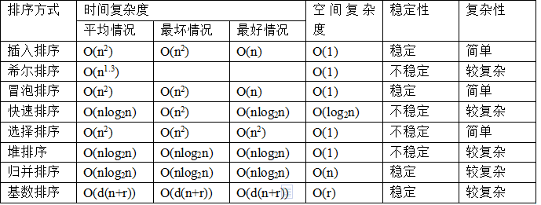

> **递归本质上就是一个栈结构。**

#### 树

###### 二叉树

> 二叉树：子节点个数最多为 2 个；

###### 完全二叉树

> 除最后一层外，其他每层节点都是满的，最后一层从左向右填满二叉树；

###### 平衡二叉树

> 任意节点的左右子树的高度之差不大于1；

###### 二叉查找树

> 二叉查找树：特殊的二叉树，左节点的值比其父节点的值小；此特性使二叉查找树的查找效率很高。 
>
> 遍历顺序：
>
> 1. 先序：先访问根节点--->左节点--->右节点；
>
>    ```js
>    function preOrder(node){
>      if(!node){
>        print(node.val);
>        preOrder(node.left);
>        preOrder(node.right);
>      }
>    }
>    ```
>
> 2. 中序：先访问左节点--->根节点(根节点在中间)--->右节点；
>
>    ```js
>    function inOrder(node){
>      if(!node){
>        inOrder(node.left);
>        print(node.val);
>        inOrder(node.right);
>      }
>    }
>    // 使用循环
>    function inOrder(root) {
>      let cur = root;
>      let arr = [], stack = [];
>      while(cur || stack.length>0){
>        while(cur){      
>          stack.push(cur);
>          cur = cur.left;
>        }
>        cur = stack.pop();
>        arr.push(cur.val);
>        cur = cur.right;
>      }
>      return arr;
>    };
>    ```
>
> 3. 后序：先访问左节点--->右节点--->根节点；


##### 堆

> 堆是具有以下性质的**完全二叉树**：每个结点的值都大于或等于其左右子结点的值，称为大顶堆；
>
> 或者每个结点的值都小于或等于其左右孩子结点的值，称为小顶堆。

##### 红黑树

#### 排序

排序一个长度为 n 的数组的时间复杂度是 O(nlogn)；

- 冒泡、选择、插入排序的耗时比较：冒泡 > 选择 > 插入；
- 高阶算法：希尔、归并、快速排序：
- 空间消耗、平均时间复杂度、最差时间复杂度；

#### 查找 

- 二分查找、哈希表查找、二叉查找树查找；
- 哈希表(散列表查找的时间复杂度是 O(1))

#### 方法总结

1. 查找二维数组上的搜索路径：**回溯法**；
2. 某个问题的最优解，且该问题可以分解为多个子问题，子问题也存在最优解，如果将每个小问题的最优解组合可以得到目标问题的最优解，这类情况可以考虑使用**动态规划**；
3. 在某种特殊情况下可以得到目标问题的最优解：**贪心算法**； 




