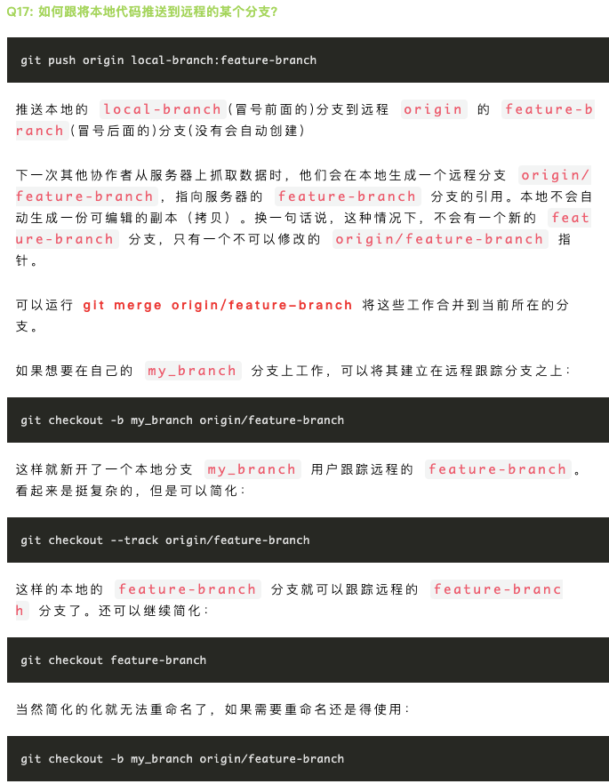

[Git官网](https://git-scm.com/) 

[国外网友制作的Git Cheat Sheet](https://gitee.com/liaoxuefeng/learn-java/raw/master/teach/git-cheatsheet.pdf) 

[Git骚操作](https://mp.weixin.qq.com/s/1wFDbOm-FJ_NlBYvxN05Ng) 

[团队合作必备的 Git 操作](https://mp.weixin.qq.com/s/xQY5oFjwV7EAcWxT_7njfw)  

**git \<command> [options] [arguments]**

- []: 可选
- <>:  必选
- {}:  单选

 


**pull rebase** 

```json
$ git stash
$ git pull --rebase
$ git push
$ git stash pop
```

**git rebase**

- [git merge 与 git rebase的区别](https://juejin.im/post/6844903603694469134)  
- [rebase](https://www.liaoxuefeng.com/wiki/896043488029600/1216289527823648)

# 配置

本地Git仓库和GitHub仓库之间的传输是通过SSH加密的，生成公钥私钥后，分发公钥，自己保留私钥。

- 生成SSH密钥

  ```
  1. 创建密钥
  ssh-keygen -t rsa -C <注册使用的邮箱>
  将 user/.ssh/id_rsa.pub 中的内容复制到Github/Setting/SSH and GPG keys
  2. 测试
  ssh -T git@github.com
  ```

  

- Git 是分布式版本管理，因此每台电脑需要自报家门。

  ```
  git config --global user.name "xxx"
  git config --global user.email "xxx"
  ```
  
  `global` 表示该电脑上的所有Git仓库都使用该配置信息。

- 配置命令别名，当常用的命令或长的命令用短的别名代替

  ```
  git config --global alias.last = cat-file commit HEAD
  % 用 last 代替 cat-file commit HEAD
  ```

- 设置`git commit`时打开的默认编辑器

  ```json
  // 指定使用sublime Text编辑commit
  修改或添加下面内容到git的全局配置文件.gitconfig，通常该文件在~/.gitconfig
  [core]
  	editor = '/Applications/Sublime Text.app/Contents/SharedSupport/bin/subl' -n -w
  
  或者命令行中输入
  git config --global core.editor "'/Applications/Sublime Text.app/Contents/SharedSupport/bin/subl' -n -w"
  ```

  

# 创建版本库

1. 本地创建

   ```tex
   git init
   ```

# 管理本地仓库

- 本地文件更新，且未 add 到暂存区，撤销本地更改。

  ```
  git restore <file>
  ```

- add 到暂存区(stage)，且未commit 到版本库，撤销add 更改，不影响本地文件。

  ```
  git restore --staged <file>
  ```
  
- 撤销最近的一次 commit 

  ```
  git revert HEAD
  在当前提交后面，新增一次提交，抵消掉上一次提交导致的所有变化。
  ```

- 修改commit的message

  ```
   git commit --amend "xxx"
   git commit -am "message";  //
  ```

- 版本回退 git reset

  git reset让最新提交的指针回到以前某个时点，该时点之后的提交都从历史中消失。
  默认情况下，git reset不改变工作区的文件（但会改变暂存区），--hard参数可以让工作区里面的文件也回到以前的状态。

  ```
  git reset HEAD^1  // 回退一个版本
  git reset --hard HEAD^1
  ```

- git diff：查看改动(谁和谁之间的改动？)

- 删除reflog 中的提交记录？

  ```
  git log --oneline
  git reflog
  git diff 工作区和版本库里面最新版本的区别：
  ```

# 远程仓库

本地Git仓库和GitHub仓库之间的传输是通过SSH加密的，生成公钥私钥后，分发公钥，自己保留私钥。

每个远程主机都有一个主机名，默认为 origin，

- 克隆远程仓库

  ```
  git clone git@github.com:xx.git [本地目录名]
  git clone -o <主机名> 地址
  ```

- 查看

  ```
  git remote -v
  ```

- 删除远程主机

  ```
  git remote rm <主机名>
  ```

- 重命名

  ```
  git remote rename <原主机名> <新主机名>
  ```

- 本地仓库关联远程仓库
  一个本地库可以关联多个远程库

  ```
  git remote add [shortname] <url>
  git remote add origin <url>
  ```

- 将本地仓库的当前分支推送到远程库。

  ```
  # git push <远程主机名> <本地分支名>:<远程分支名>
  git push -u origin master
  ```
  
- git fetch

  这个命令会访问远程仓库，从中拉取所有你还没有的数据。 执行完成后，你将会拥有那个远程仓库中所有分支的引用，不会自动与本地仓库合并，可以随时合并或查看。fetch 后可以使用在本地使用'远程库/分支'访问，相当于远程库在本地的副本。

  ```
  git fetch <远程仓库>  // 拉取远程仓库的全部分支的更新
  git fetch <远程仓库> <远程分支>
  git merge <远程库>/<分支>  // 将拉取的更新合并到当前分支
  origin/master
  ```

- 更新本地仓库到最新的版本，git pull
  git pull等于git fetch + git merge或fetch + git rebase。

  ```
  git pull <远程主机名> <远程分支名>:<本地分支名>
  默认与本地当前分支合并
  
  git pull origin master --allow-unrelated-histories
  ```

  
  
  git pull --rebase
  合并远程仓库的变化到当前分支
  
  - git merge
  - git rebase

# 分支

关键字：HEAD  master

每个分支都有一个指向该分支上提交节点的指针(引用)，如master 分支用master 指向节点，dev分支用dev 指向节点。在master分支上新增一个 `commit` 时，就会在该分支上新增一个节点，并且master 也会移动指向新的节点。HEAD 指向当前工作所在的分支中的位置，可以看作当前分支的别名，如HEAD指向master，master指向某个节点。[参考](https://www.liaoxuefeng.com/wiki/896043488029600/900003767775424)

- 查看分支

  ```
  git branch [-v | -a| -vv]
  -v: 查看本地分支
  -vv: 查看本地分支与远程分支之间的关联关系
  ```

- 新建分支

  ```
  git branch dev
  ```

- 切换分支

  ```
  git checkout dev #新版中使用 switch 替换checkout
  ```

  - 切换分支会更新本地文件和暂存区(index)，工作区中的修改会保存(kept)。工作区和提交到暂存区中的修改，切换到其他分支时，这些修改会带到其他分支去(在其他分支也能看到)。

- 新建并切换分支

  ```
  // 注意是从哪个分支新建
  git checkout -b dev / git swich -c dev
  ```
  
  **注：**在本地工作时要明确当前是在哪个分支上工作。
  
- 本地分支关联远程分支，建立追踪关系

  ```json
  //  如果远程已经有了feature-branch，通过git fetch拉到本地，并通过以下命令在本地新建了feature-branch，并同远程分支关联。
  git checkout -b feature-branch origin/feature-branch
  
  // 手动关联
  git branch --set-upstream-to=<origin/branch_name> 本地分支
  ```

- 本地分支push到远程分支

  ```json
  //
  git push <远程主机名> <本地分支名>:<远程分支名>
  git push origin local-branch:remote-branch
  ```

   

- 删除分支

  ```
  # 删除本地分支
  git branch -d <branchname>
  # 删除远程分支
  git push origin --delete <branchName>
  ```
  
- 进度尚未完成，保存进度。保存后工作区是干净的。

  切换分支会改变本地文件，如果本地修改未commit 是不能切换分支，但如果当前工作尚未完成不便提交 commit ，此使使用 stash 暂时保存本地文件。
  
  ```
  # 查看stash
  git stash list
  
  # 保存stash
  git stash
  
  # 恢复stash
  git stash pop/git stash apply
  
  # 删除stash
  git stash drop stash@{n}
  ```
  
  参考: [Bug分支](https://www.liaoxuefeng.com/wiki/896043488029600/900388704535136)
  
- 合并某个提交

  ```
  git cherry-pick
  ```

  [如何获取某个分支的某次提交内容？](https://mp.weixin.qq.com/s/1wFDbOm-FJ_NlBYvxN05Ng) 

- git pull

  ```json
  // 拉取远程origin仓库的remote-branch 分支，然后与本地的local-branch 分支合并
  git pull [origin] [remote-branch]:[local-branch]
  // 拉取远程仓库中与本地当前分支建立追踪关系的分支，然后与本地当前分支合并
  git pull 
  
  git pull --rebase origin master
  ```
  
  参考：[Git远程操作-阮一峰](https://www.ruanyifeng.com/blog/2014/06/git_remote.html) 
  
- git fetch
  拉取远程仓库的分支，在本地生成或更新本地的引用(`origin/remote-branch`)

  ```json
  // 默认拉取远程仓库的全部分支的更新
  git fetch [remote-repository] [remote-branch]
  // 拉取远程仓库的全部更新
  git fetch
  // 只拉取远程仓库中master分支的更新
  git fetch origin master
  ```

- 在本地分支与远程分支之间建立追踪关系

  ```json
  git branch --set-upstream local-branch origin/remote-branch
  ```

- 合并分支

  ```json
  // 将dev分支合并到当前所在分支，当前所在分支会更新，将其他分支上的修改补充到当前分支
  git merge dev  
  
  // 不使用fast forward快速合并
  git merge --no-ff -m "xx" dev
  
  git merge --abort
  
  git merge --allow-unrelated-histories
  
  git merge origin/remote-branch
  ```

- rebase模式合并？参考：[Git骚操作](https://mp.weixin.qq.com/s/1wFDbOm-FJ_NlBYvxN05Ng) 


**参考**：

- [Git远程操作-阮一峰](https://www.ruanyifeng.com/blog/2014/06/git_remote.html) 
- [Git骚操作](https://mp.weixin.qq.com/s/1wFDbOm-FJ_NlBYvxN05Ng) 

# 标签

Tag 与commit 相关联，创建的Tag存储在本地，不会自动上传到远程库，

- 查看Tag
  `git tag`

- 添加Tag

  ```
  git tag <TagName>
  % 默认将Tag添加到最新的commit上(HEAD指向的commit)，可以通过指定commit id，为指定的commit添加Tag.
  git tag <TagName> [commitId]
  
  git tag -a v1.4 -m "my version 1.4"
  % 添加带注释的Tag
  git tag -a <TagName> -m "xx" commitID
  ```

- 推送到远程
  `git push origin TagName` 
  `git push origin --tags` 

- 删除

  ```
  git tag -d TagName  % 删除本地Tag
  git push origin :refs/tags/v0.9 % 删除远程Tag
  ```

# Git Commit

**一次commit只对应一件事。**需清晰明了，说明本次提交的目的。

commit message格式为`$type: $description`。

type用于说明commit的类型，只允许使用以下类型。

```
* feat：新功能（feature）
* fix：修补bug
* docs：文档（documentation）
* style： 格式（不影响代码运行的变动）
* refactor：重构（即不是新增功能，也不是修改bug的代码变动）
* test：增加测试
* chore：构建过程或辅助工具的变动
```

比如：一个组件现在有2个bug，按照以前我们是把2个bug都改了，再commit。而现在需要，解决一个bug就提交一次，并在commit message中写上**fix: bug#1234**（bug号）。

# Commitizen

- [优雅的提交你的 Git Commit Message-掘金](https://juejin.im/post/5afc5242f265da0b7f44bee4) 
- [看下大厂 Git 提交规范是怎么做的-腾讯云](https://cloud.tencent.com/developer/article/1580371) 

# 理论

`HEAD` 文件存放的是当前所在分支的引用。

# 其他

- [Gitee](https://gitee.com/) 国内Git托管平台

## [Commit message 和 Change log 编写指南](https://www.ruanyifeng.com/blog/2016/01/commit_message_change_log.html) 

[git rebase 与 merge的区别](https://mp.weixin.qq.com/s/XDINQCV2uv7TMhCi-ldGSw) 


Gitee2020