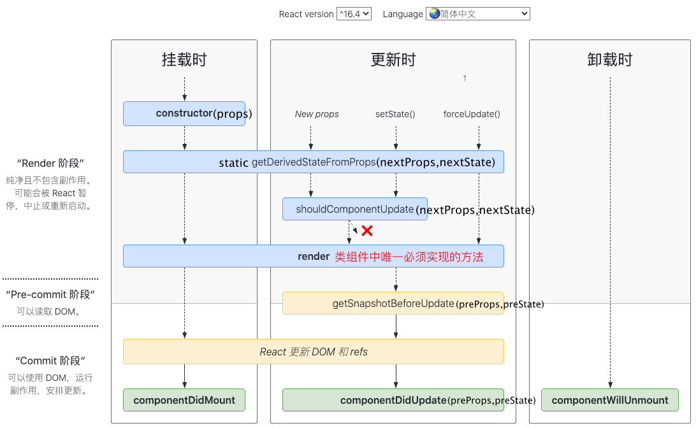

> React 还可以使用 Node 进行服务器渲染，或使用 React Native 开发原生移动应用。
> 虚拟DOM渲染成页面上的UI的几种场景：
>
>  1. 通过react-dom在浏览器上渲染，react-dom将虚拟dom节点转换为浏览器的dom节点。
>  2. 使用node在服务端渲染
>  3. 使用react native在手机上渲染
>  4. `<Contacts />` 和 `<Chat />` 之类的 React 元素本质就是对象（object），所以你可以把它们当作 props，像其他数据一样传递。这种方法可能使你想起别的库中“槽”（slot）的概念，但在 React 中没有“槽”这一概念的限制，你可以将任何东西作为 props 进行传递。

# React元素和组件

React 元素就是 JS 对象(一个轻量、不可变的虚拟DOM)，用于描述 UI。创建 React 元素的方法有两种：

  1)  `React.createElement` 

  2) `JSX` (JSX 是 `createElement` 的语法糖，本质还是调用的 `createElement` )。`<div/>` 和 `<MyCmp>` 都是React Element，`<div/>` 被渲染为DOM Node，`<MyCmp>` 被渲染为自定义组件。


**React 组件**  

创建组件有两种方法：

1. `class` :  render--> return，返回 React 元素
2. `function` : return ，返回 React 元素

`render` 不负责组件的实际渲染工作，实际的渲染由 React 负责。

# 概念思想

- 思想：

  1. Web 应用是一个状态机，视图与状态是一一对应的。
  2. 所有的状态，保存在一个对象里面。Redux 规定， 一个 State 对应一个 View。只要 State 相同，View 就相同。你知道 State，就知道 View 是什么样，反之亦然。

  

- 从概念上讲，React 分**两个阶段**工作：
  1. **渲染** 阶段会确定需要进行哪些更改，比如 DOM。在此阶段，React 调用 `render`，然后将结果与上次渲染的结果进行比较。
  2. **提交** 阶段发生在当 React 应用变化时。（对于 React DOM 来说，会发生在 React 插入，更新及删除 DOM 节点的时候。）在此阶段，React 还会调用 `componentDidMount` 和 `componentDidUpdate` 之类的生命周期方法。


> - 当 React 元素为用户自定义组件时，它会将 JSX 所接收的属性（attributes）转换为单个对象传递给组件（组件内部），这个对象被称之为 “props”。
>
> - 自定义组件名必须用大写字母开头，小写字母开头的被视为原生DOM标签
>
> - 组件无论是使用函数声明还是通过 class 声明，都决不能修改自身的 props。**单向数据流**
>
> - 得益于 setState() 的调用，React 能够知道 state 已经改变了，然后会重新调用 render() 方法来更新页面
>
> 
>
> - __state__
>
>   1. 不要直接修改state，这样不会重新渲染组件，应该使用 setState
>   2. 构造函数是唯一能给 state赋值的地方
>   3. setState() 自动将部分 state 合并到当前 state,
>   4.  state 只能由拥有它们的组件进行更改
> 
>
> 
> - 通过问自己以下三个问题，你可以逐个检查相应数据是否应该属于 state：
> 
>   1. 该数据是否是由父组件通过 props 传递而来的？如果是，那它应该不是 state
>   2. 该数据是否随时间的推移而保持不变？如果是，那它应该也不是 state。
>   3. 你能否根据其他 state 或 props 计算出该数据的值？如果是，那它也不是 state。


# ReactDom.render 

- ReactDom.render

  ```js
  function Button() {
    return <button id="btn">Say Hello</button>;
  }
  
  ReactDOM.render(
    <Button />,
    document.getElementById('container'),
    function() {
      // jQuery
      $('#btn').click(function() {
        alert('Hello!');
      });
    }
  );
  ```


# 组件

从概念上讲，React 组件一直更像是函数。

1. 函数组件(无状态组件)
   - 函数名必须大写开头，没有实例
   - 必须有返回值，可以返回 JSX对象或 null，当返回 JSX时，只能有一个根元素
2. class组件(有状态组件)
   组件可以维护其内部的状态数据（通过 `this.state` 访问）。当组件的状态数据改变时，组件会再次调用 `render()` 方法重新渲染对应的标记


> By default, React components (both the `function` type and the `class` type, if it extends `React.Component`) will re-render whenever their parent re-renders, or whenever you change their state with `setState`.
>
> An easy way to optimize a React component for performance is to make it a class, and make it extend `React.PureComponent` instead of `React.Component`. This way, the component will only re-render if its state is changed or if its *props have changed*. It will no longer mindlessly re-render every single time its parent re-renders; it will ONLY re-render if one of its props has changed since the last render.
>
> Here’s where immutability comes in: if you’re passing props into a `PureComponent`, you have to make sure that those props are updated in an immutable way. That means, if they’re objects or arrays, you’ve gotta replace the entire value with a new (modified) object or array. Just like with Bob – kill it off and replace it with a clone.
>
> If you modify the internals of an object or array – by changing a property, or pushing a new item, or even modifying an item *inside* an array – then the object or array is *referentially equal* to its old self, and a `PureComponent` will not notice that it has changed, and will not re-render. Weird rendering bugs will ensue.
>
> - 默认情况下，函数组件和继承自`React.Component` 的类组件在他们的父组件或 `state` 变化时会 re-render。

## 纯函数

1. 纯函数相同的输入一定返回相同的输出
2. 纯函数没用副作用，

What’s a “Side Effect”?

“Side effects” is a broad term, but basically, it means modifying things outside the scope of that immediate function. Some examples of side effects…

- Mutating/modifying input parameters, like `giveAwesomePowers` does
- Modifying any other state outside the function, like global variables, or `document.(anything)` or `window.(anything)`
- Making API calls
- `console.log()` 
- `Math.random()` 

# JSX

- JSX 仅仅只是  React.createElement(component, props, ...children) 函数的语法糖，Reacr.createElement函数返回一个对象(这类对象称为**React元素**)

  ```js
  <MyButton color="blue" shadowSize={2}>
    Click Me
  </MyButton>
  // 函数组件
  function MyButton(props){
      return <button>{ props.children }</button>;
  }
  ```
  
  标签MyButton被编译为变量（函数 MyButton）的直接引用，也可以使用对象属性的形式，`<Mybutton.DatePicker>`

- JSX 的 `{}` 中可以插入任意的 JS 表达式，如字符串字面量

  ```html
  <MyComponent message="hello world" />等价于
  <MyComponent message={'hello world'} />
    
  <MyComponent message="&lt;3" />等价于
  <MyComponent message={'<3'} />
  ```
  


# CSS

React 中不能直接使用 CSS 样式`<div style="background-color:red">`；

React 中用以下几种方式使用样式：

- 使用对象形式以 props.style 的形式，这种形式只作用于当前组件；

  ```js
  const Sider = () => {
    const style = {
      display: 'block',
      listStyleType: 'none'
    }
    return (
      <a style={style}>link to header.js</a>
    );
  }
  ```

- import 外部 CSS 文件，以类的形式应用样式表中的规则，等价于普通情况

  ```js
  import "/css/index.css";
  const comp = () => {
      return (
          <div className="xx"></div>
      );
  }
  ```

参考：[CSS 解决方案](https://juejin.im/post/5b39e63ae51d4562aa017c81)

# 数据(状态)

- React中只有两种数据(props和state)，数据向下流动；
  1. props：read-only只读，单向数据流
  2. state：组件内更新数据用setState

## setState

[参考](https://cloud.tencent.com/developer/article/1431167)

# 回调函数中的 this指向

class的方法默认不会绑定this，解决方法有三种：

1. class fields: create React App默认启用此语法，这种语法还处于试验性阶段！

   ```js
   class MyComp extends React.Component {
       handleClick = ()=>{
           // 此处的this已经绑定
       }
   }
   ```
   
2. 回调中使用箭头函数

   ```js
   <button onClick={ (e)=> this.handleClick(e)} ></button>
   ```
   
3. bind

   ```js
   class WordAdder extends React.Component {
       constructor(props) {
           super(props);
           this.state = {
               words: ['marklar']
           };
           this.handleClick = this.handleClick.bind(this);
       }
   
       handleClick() {
           // 如果constructor中没有用bind绑定this, 此处无法访问this.state, 
           // this指向undefined
           let words = this.state.words;
           console.log('call handleClick!');        
       }
   
       render() {
           return (
               <div>
                   <button onClick={this.handleClick} >按钮</button>
               </div>
           );
       }
   }
   ```

   


# 向事件处理程序传递参数

- 在循环中，通常我们会为事件处理函数传递额外的参数。例如，若 `id` 是你要删除那一行的 ID，以下两种方式都可以向事件处理函数传递参数：

  ```js
  <button onClick={(e) => this.deleteRow(id, e)}>Delete Row</button>
  
  <button onClick={this.deleteRow.bind(this, id)}>Delete Row</button>
  ```

  在这两种情况下，React 的事件对象 `e` 会被作为第二个参数传递。如果通过箭头函数的方式，事件对象必须显式的进行传递，而通过 `bind` 的方式，事件对象以及更多的参数将会被隐式的进行传递。


# 数组转换为元素列表

- 使用 Javascript 中的` map()`方法来遍历 `numbers` 数组。将数组中的每个元素变成 `<li>` 标签，最后我们将得到的数组赋值给 `listItems`

  ```js
  function NumberList(props) {
    const numbers = props.numbers;
    const listItems = numbers.map((number) =>
      <li key={number.toString()}>{number}</li>
    );
    return (
      <ul>{listItems}</ul>
    );
  }
  
  const numbers = [1, 2, 3, 4, 5];
  ReactDOM.render(
    <NumberList numbers={numbers} />,
    document.getElementById('root')
  );
  ```

  1. 如果没有指定显式的 key 值，那么 React 将默认使用索引用作为列表项目的 key 值。不建议使用索引作为key值
  2. 一个好的经验法则是：在 `map()` 方法中的元素需要设置 key 属性。

# key

- 数组元素中使用的 key 在其兄弟节点之间应该是独一无二的。然而，它们不需要是全局唯一的。当我们生成两个不同的数组时，我们可以使用相同的 key 值：
- https://zh-hans.reactjs.org/docs/reconciliation.html#recursing-on-children
- https://medium.com/@robinpokorny/index-as-a-key-is-an-anti-pattern-e0349aece318

# 组合 & 插槽

- 建议使用组合而非继承

- React中没有槽这个概念的限制，任何数据(包括React元素)都可以通过props传递，

  ```js
  // 借助props.children 传递组件的内容
  function WelcomeDialog() {
    return (
      <FancyBorder color="blue">
        <h1 className="Dialog-title">
        		Welcome
        </h1>
        <p className="Dialog-message">
        		Thank you for visiting our spacecraft!
        </p>
      </FancyBorder>
    );
  }
  
  function FancyBorder(props) {
    return (
      <div className={'FancyBorder FancyBorder-' + props.color}>
        {props.children}
      </div>
    );
  }
  
  // 传递多个组件的内容
  function SplitPane(props) {
    return (
      <div className="SplitPane">
        <div className="SplitPane-left">
          {props.left}
        </div>
  
        <div className="SplitPane-right">
          {props.right}
        </div>
      </div>
    );
  }
  
  function App() {
    return (
      <SplitPane
        left={ <Contacts /> }  
        right={ <Chat /> }
      />
    );
  }
  ```

# setState

setState(updater, [callback]]);  

updater可以是对象或函数，

callback是可选的，它将在 `setState` 完成合并并重新渲染组件后执行。通常，我们建议使用 `componentDidUpdate()` 来代替此方式。

在事件处理函数内部的setState是异步，需要用函数作setState的参数更新state

```js
setState((curState, props)=>{
  
})
```

无论您在React事件处理程序中使用多少个setState（）调用了多少个组件，它们在事件结束时只会产生一次重新渲染。


## Promise和定时器中执行setState

- Promise 和定时器中执行 setState 不是异步，也不是批处理

  ```js
  Promise.resolve().then(() => {
    // 不是异步, 不是批处理
    this.setState({ a: '子1' });
  	// 这里可以取到最新的 state
    
    // 每一个 setState 都会导致重渲染
    this.setState({ a: '子2' });
  });
  
  
  setTimeout(() => {
    this.setState({
      a: '子1',
    });
  	// 这里可以取到最新的值
  
    // 每次 setState 多会导致重渲染
    this.setState({
      a: '子2',
    });
  });
  ```


## 设置非受控组件的state

对于**不受控**的组件，当你想在 prop 变化（通常是 ID ）时重置 state 的话，可以选择以下几种方式：

- **建议: 重置内部所有的初始 state，使用 `key` 属性**
- 选项一：仅更改某些字段，观察特殊属性的变化（比如 `props.userID`）。`(getDriveStateFromProps)` 
- 选项二：使用 ref 调用实例方法。

# Ref

组件并不是真实的 DOM 节点，而是存在于内存之中的一种数据结构，叫做虚拟 DOM （virtual DOM）。只有当它插入文档以后，才会变成真实的 DOM 。根据 React 的设计，所有的 DOM 变动，都先在虚拟 DOM 上发生，然后再将实际发生变动的部分，反映在真实 DOM上，这种算法叫做 [DOM diff](http://calendar.perfplanet.com/2013/diff/) ，它可以极大提高网页的性能表现。

如果需要从组件获取真实 DOM 的节点，这时就要用到 `ref` 属性。

- 访问 DOM 节点或在 render 方法中创建的 React 元素

  ```js
  class MyComponent extends React.Component {
    constructor(props) {
      super(props);
      this.myRef = React.createRef();
      this.clickHandle = this.clickHandle.bind(this);
    }
    render() {
      return <div id="my-div" ref={this.myRef} />;
    }
    clickHandle()  {
   	// this.myRef.current指向 div#my-div
    }
  }
  ```

  当 ref 属性作用于 HTML 元素时，this.myRef.current指向原生DOM元素；当作用于自定义的class 组件时，指向组件实例。ref **不能作用于函数组件**(可以在函数组件内使用)，因为函数组件没有实例。

  不能这样使用`<函数组件 ref='myRef'>` 


# Context

> Context 主要应用场景在于很多不同层级的组件需要访问同样一些的数据，应用于**<Provider store={store}></Provider>**。Context 设计目的是为了共享那些对于一个组件树而言是“全局”的数据，

**参考**：https://zh-hans.reactjs.org/docs/context.html 

# [HOC(高阶组件)](https://zh-hans.reactjs.org/docs/higher-order-components.html) 

> HOC的作用是对现有的组件进行封装扩展，添加新的功能。
>
> 组件是将 props 转换为UI，高阶组件是将组件转换为新组件的函数（创建组件的函数，相当于组件工厂），因此高阶组件的参数是组件，返回值也是组件。
>
> HOC 是**纯函数**，没有副作用。HOC 不会修改传入的组件，也不会使用继承来复制其行为。相反，HOC 通过将组件**包装**在容器组件中来组成新组件。
>
> 高阶组件的实现方式本质上是装饰者设计模式。


# Diff

- [Diff官网](https://zh-hans.reactjs.org/docs/reconciliation.html)


# 生命周期

    


componentDidMount: 挂载-当组件添加到 DOM 树之后执行；

React组件的生命周期分为三个阶段：1. 挂载  2. 更新 3. 卸载。

​    当组件的props或state变化时，组件的render方法会重新执行并返回新的虚拟DOM对象。在组件重渲染的过程中依次调用componentWillReceiveProps及上述其他4个方法。componentShouldUpdate方法默认返回true，如果componentShouldUpdate返回false，componentShouldUpdate之后的方法就不会调用，也就不会生成新的虚拟DOM对象和使用Diff算法比较新旧虚拟DOM。实现性能优化。

**getDerivedStateFromProps**  : 在组件内部保存上一次的 `props` 来区分是`props` 还是 `state` 变化导致的重渲染。


# HOOK

> 我们推荐启用 [`eslint-plugin-react-hooks`](https://www.npmjs.com/package/eslint-plugin-react-hooks#installation) 中的 [`exhaustive-deps`](https://github.com/facebook/react/issues/14920) 规则。此规则会在添加错误依赖时发出警告并给出修复建议。
>
> ```
> // 你的 ESLint 配置
> {
>   "plugins": [
>     // ...
>     "react-hooks"
>   ],
>   "rules": {
>     // ...
>     "react-hooks/rules-of-hooks": "error", // 检查 Hook 的规则
>     "react-hooks/exhaustive-deps": "warn" // 检查 effect 的依赖
>   }
> }
> ```

Hook 就是 JavaScript **函数**。Hook 是 React 16.8 的新增特性。它可以让你在不编写 class 的情况下使用 state 以及其他的 React 特性，如生命周期函数。

```js
// 声明一个新的叫做 “count” 的 state 变量
const [count, setCount] = useState(0);
// 不像 class 中的 this.setState，更新 state 变量总是替换它而不是合并它。
// 变量定义为const!
```

Hook 为已知的 React 概念提供了更直接的 API：props， state，context，refs 以及生命周期。


Hook 就是 JavaScript 函数，但是使用它们会有两个额外的规则：

- 只能在**函数最外层**调用 Hook，不要在循环、条件判断或者子函数中调用。
- 只能在 **React 的函数组件**中调用 Hook。不要在其他 JavaScript 函数中调用。（还有一个地方可以调用 Hook —— 就是自定义的 Hook 中。）

**在组件之间复用状态逻辑和共享状态的方法：** 

1.  [render props](https://zh-hans.reactjs.org/docs/render-props.html) 和[高阶组件](https://zh-hans.reactjs.org/docs/higher-order-components.html) ：render props和高阶组件只渲染一个子节点。

2. **自定义HOOK：** 你可以使用 Hook 从组件中提取状态逻辑，使得这些逻辑可以单独测试并复用。**Hook 使你在无需修改组件结构的情况下复用状态逻辑**， 这使得在组件间或社区内共享 Hook 变得更便捷。


## 内置的HOOK

### state Hook

### Effect Hook

```js
useEffect(fnDoSomething(){
  return fnCleanSomenthing(){}
}, [dependA, dependB]);
```

- 告诉 React 组件需要在**渲染后**（包括首次渲染和组件更新后：componentDidMount、componentDidUpdate）执行某些操作。可以把 `useEffect` Hook 看做 `componentDidMount`，`componentDidUpdate` 和 `componentWillUnmount` 这三个函数的组合。

- 什么时候执行 useEffect：每次渲染时都会执行 Effect，React 会等待浏览器完成画面渲染之后才延迟调用 useEffect。当 useEffect 中有清除操作时，会先清除上一个Effect，然后执行当前 Effect。

  > 与 `componentDidMount`、`componentDidUpdate` 不同的是，在浏览器完成布局与绘制之后，传给 `useEffect` 的函数会延迟调用。这使得它适用于许多常见的副作用场景，比如设置订阅和事件处理等情况，因此不应在函数中执行阻塞浏览器更新屏幕的操作。
  >
  > 使用 [useLayoutEffect](https://zh-hans.reactjs.org/docs/hooks-reference.html#uselayouteffect) 可以避免延迟执行。

- 传递给 useEffect 的函数在每次渲染中都会有所不同（每次都创建一个新的函数），这是刻意为之的。事实上这正是我们可以在 effect 中获取最新的 count 的值，而不用担心其过期的原因。每次我们重新渲染，都会生成新的 effect，替换掉之前的。某种意义上讲，effect 更像是渲染结果的一部分 —— 每个 effect 属于一次特定的渲染。

  - 一旦 effect 的依赖发生变化，effect 就会被重新创建。
  - Effect拿到的总是定义它的那次渲染中的props和state

- Effect Hook通过返回一个函数，并在该函数中指定清除操作，每次渲染时都会执行Effect中的清除操作，而不是只在组件卸载时执行一次。
  组件首次渲染时不会执行 useEffect Hook 返回的函数，非首次渲染时，执行的顺序依次是:  render--> clean 函数-->useEffect 

- `an effect hook should return nothing or a clean up function.` 

- 一个组件中有多个 Effect Hook 时 React 将按照 effect 声明的顺序依次调用组件中的 effect。

## useMemo & useCallback

**1.useMemo** 

> - 把“创建”函数和依赖项数组作为参数传入 `useMemo`，它仅会在某个依赖项改变时才重新计算 memoized 值。这种优化有助于避免在每次渲染时都进行高开销的计算。
>
> - 记住，传入 `useMemo` 的函数会在**渲染期间**执行。请不要在这个函数内部执行与渲染无关的操作，诸如副作用这类的操作属于 `useEffect` 的适用范畴，而不是 `useMemo`。
>
> - 如果没有提供依赖项数组，`useMemo` 在每次渲染时都会计算新的值。
> - **使用场景**  
>   1. 缓存组件：父组件改变自身数据，不涉及子组件数据变化，不使用 useMemo 就会在父组件每次 render 时都渲染子组件。
>      - 类组件中可以利用继承 React.PureComponent 或者 shouldComponentUpdate 生命周期函数避免组件重复渲染。(React.PureComponent 浅层对比了 props 和 state)
>      - 函数式组件可以使用 useMemo 缓存组件可以避免组件重复渲染。或者使用 [React.memo(高阶组件)](https://zh-hans.reactjs.org/docs/react-api.html#reactmemo)，React.memo 默认对 props 作浅比较。
>   2. 缓存 props (引用比较)
>   3. 高消耗计算(计算属性)
>

```jsx
const main = useMemo(() => {
  console.debug('执行useMemo中的函数!');
  return (props.data || []).map((item, index) => {
    return <div key={index}>{item}</div>;
  });
}, [props.data]);

// 父组件
return (
  <div>
    <p>{count}</p>
    <button onClick={handleCount}>setCount</button>
    {main}
  </div>
);
```

**分析** 

- 当依赖`props.data`不变时，main的引用不变
- useMemo类似于计算属性，useMemo返回的是一个记忆后的**值**，这个值由其他数据计算得到并且与页面渲染有关(需要在页面上显示)。
- 上述demo中如果没有使用useMemo，则点击事件导致count更新并触发页面渲染时`main`也要重新计算(每次点击都会输出console.debug中的内容)，虽然main没有改变。
- `useMemo`是根据依赖(deps)缓存第一个入参(callback)执行后的值。

**2.[useCallback](https://zh-hans.reactjs.org/docs/hooks-reference.html#usecallback)** 

```js
const memoizedCallback = useCallback(
  () => {
    doSomething(a, b);
  },
  [a, b],
);
```

- 当依赖a、b不变时，memoized Callback的引用不变
- `useCallback`是根据依赖(deps)缓存第一个入参的(callback)。

**3.总结**

- `useMemo`缓存值，这个值(React元素)用于渲染页面或传递给子组件。
- `useCallback`缓存函数，这个函数通常传递给子组件，避免组件重复渲染。

**4.参考** 

- [useCallback、useMemo 分析 & 差别-github](https://github.com/monsterooo/blog/issues/37) 

## [使用useEffect发送请求-fetch](https://www.robinwieruch.de/react-hooks-fetch-data) 

1. [loadding & error处理](https://www.robinwieruch.de/react-hooks-fetch-data#error-handling-with-react-hooks) 
2. [将fetch data封装为自定义hook](https://www.robinwieruch.de/react-hooks-fetch-data#custom-data-fetching-hook) 
3. [使用useReducer进行fetch data](https://www.robinwieruch.de/react-hooks-fetch-data#reducer-hook-for-data-fetching) 
4. [abort-data-fetching-in-effect-hook](https://www.robinwieruch.de/react-hooks-fetch-data#abort-data-fetching-in-effect-hook)  

```jsx
import React, { Fragment, useState, useEffect } from 'react';
import axios from 'axios';
 
function App() {
  const [data, setData] = useState({ hits: [] });
  const [query, setQuery] = useState('redux');
  const [url, setUrl] = useState(
    'https://hn.algolia.com/api/v1/search?query=redux',
  );
  const [isLoading, setIsLoading] = useState(false);
  const [isError, setIsError] = useState(false);
 
  useEffect(() => {
    const fetchData = async () => {
      setIsError(false);
      setIsLoading(true);
 
      try {
        const result = await axios(url);
 
        setData(result.data);
      } catch (error) {
        setIsError(true);
      }
 
      setIsLoading(false);
    };
 
    fetchData();
  }, [url]);
 
  return (
    <Fragment>
      <input
        type="text"
        value={query}
        onChange={event => setQuery(event.target.value)}
      />
      <button
        type="button"
        onClick={() =>
          setUrl(`http://hn.algolia.com/api/v1/search?query=${query}`)
        }
      >
        Search
      </button>
 
      {isError && <div>Something went wrong ...</div>}
 
      {isLoading ? (
        <div>Loading ...</div>
      ) : (
        <ul>
          {data.hits.map(item => (
            <li key={item.objectID}>
              <a href={item.url}>{item.title}</a>
            </li>
          ))}
        </ul>
      )}
    </Fragment>
  );
}
```


- 自定义HOOK

  ```jsx
  const useHackerNewsApi = () => {
    const [data, setData] = useState({ hits: [] });
    const [url, setUrl] = useState(
      'https://hn.algolia.com/api/v1/search?query=redux',
    );
    const [isLoading, setIsLoading] = useState(false);
    const [isError, setIsError] = useState(false);
   
    useEffect(() => {
      const fetchData = async () => {
        setIsError(false);
        setIsLoading(true);
   
        try {
          const result = await axios(url);
   
          setData(result.data);
        } catch (error) {
          setIsError(true);
        }
   
        setIsLoading(false);
      };
   
      fetchData();
    }, [url]);
   
    return [{ data, isLoading, isError }, setUrl];
  }
  
  // 
  function App() {
    const [query, setQuery] = useState('redux');
    const [{ data, isLoading, isError }, doFetch] = useHackerNewsApi();
   
    return (
      <Fragment>
        <form onSubmit={event => {
          doFetch(`http://hn.algolia.com/api/v1/search?query=${query}`);
   
          event.preventDefault();
        }}>
          <input
            type="text"
            value={query}
            onChange={event => setQuery(event.target.value)}
          />
          <button type="submit">Search</button>
        </form>
   
        ...
      </Fragment>
    );
  }
  ```

  

**问题** 

1. useEffect的第二个参数没有、为空数组、非空数组3种情况时的运行情况？
   - 依赖数组为空时，改hook只在组件挂载时运行一次，在组件挂载和组件销毁时执行，并非每次渲染时运行。并且当依赖数组为空时 effect 内部的 props 和 state 就会一直持有其初始值。
   - 
2. 函数应该作为useEffect的依赖吗？

**参考** 

- [useEffect完整指南](https://overreacted.io/zh-hans/a-complete-guide-to-useeffect/) **重点** 
- **每一个组件内的函数（包括事件处理函数，effects，定时器或者API调用等等）会捕获某次渲染中定义的props和state** --闭包

## Context Hook & Reducer Hook & useRef

`useReducer` 更适合用于管理包含多个子值的 state 对象。

- demo

  ```js
  import React, { useReducer } from 'react';
  
  function reducer(state, action) {
    switch (action.type) {
      case 'add':
        return [...state, action.item];
      case 'remove':
        return [
          ...state.slice(0, action.index),
          ...state.slice(action.index + 1)
        ];
      default:
        throw new Error();
    }
  }
  
  function FavoriteMovies() {
    // useReducer接收一个reducer函数和一个初始化对象作为 input 参数
    // uesReducer返回一个状态对象和一个改变状态对象的函数dispatch，dispatch函数接收action对象作参数
    const [state, dispatch] = useReducer(reducer, [{ name: 'Heat' }]);
  
    return (
      // Use dispatch({ type: 'add', item: movie })
      // and dispatch({ type: 'remove', index })...
    );
  }
  ```

**useRef** 

> 可变引用`useRef()`保存可变数据，这些数据在更改时不会触发重新渲染。当 ref 是一个对象时它并不会把当前 ref 的值的变化 通知到我们。
>
> 场景：更新状态却不重新渲染组件

- demo

  ```js
  import React, { useRef, useEffect } from 'react';
  
  function CountMyRenders() {
    const countRenderRef = useRef(1);
    
    useEffect(function afterRender() {
      countRenderRef.current++;
    });
  
    return (
      <div>I've rendered {countRenderRef.current} times</div>
    );
  }
  ```

  


## 自定义HOOK

> 自定义 Hook 更像是一种约定而不是功能。如果函数的名字以 `use` 开头并调用其他 Hook，我们就说这是一个自定义 Hook，自定义hook只是用自己写的函数包裹原生的hook， `useSomething` 的命名约定可以让我们的 linter 插件在使用 Hook 的代码中找到 bug。
>
> **在两个组件中使用相同的 Hook 会共享 state 吗？**不会。自定义 Hook 是一种重用状态逻辑的机制(例如设置为订阅并存储当前值)，所以每次使用自定义 Hook 时，其中的所有 state 和副作用都是完全隔离的。


# 静态类型检查

组件的属性可以接受任意值，字符串、对象、函数等等都可以。有时，我们需要一种机制，验证别人使用组件时，提供的参数是否符合要求。你可以使用 [Flow](https://flow.org/) 或 [TypeScript](https://www.typescriptlang.org/) 等 JavaScript 扩展来对整个应用程序做类型检查。但即使你不使用这些扩展，React 也内置了一些类型检查的功能。

## PropTypes

要在组件的 props 上进行类型检查，你只需配置特定的 [propTypes](<https://react.docschina.org/docs/typechecking-with-proptypes.html>)属性：


## Flow & TypeScript

> Flow 或 TypeScript 来代替  PropTypes

- Flow是针对JS代码的静态类型检测器，
- TypeScript 是一种由微软开发的编程语言。它是 JavaScript 的一个类型超集，包含独立的编译器。作为一种类型语言，TypeScript 可以在构建时发现 bug 和错误，这样程序运行时就可以避免此类错误。


---

# 临时记录

在极少数情况下，你可能希望能隐藏组件，即使它已经被其他组件渲染。若要完成此操作，你可以让 `render` 方法直接返回 `null`，而不进行任何渲染；

在组件的 `render` 方法中返回 `null` 并不会影响组件的生命周期。例如，上面这个示例中，`componentDidUpdate` 依然会被调用；


`React.memo` 等效于 `PureComponent`，但它只比较 props。（你也可以通过第二个参数指定一个自定义的比较函数来比较新旧 props。如果函数返回 true，就会跳过更新。）