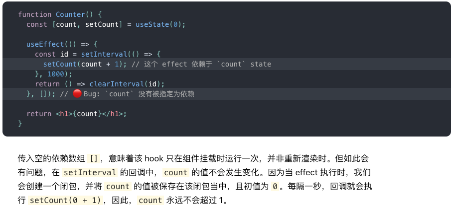

函数组件和类组件的默认属性怎么写？

```js
Cmp.defaultProps = {
  color: 'red'
}
```


箭头函数 displayName? 

TS不支持 函数组件.displayName 和 defaultProps

ts 声明全局函数

https://juejin.im/post/6844903612787720206  泛型组件

https://www.zhihu.com/question/279911703  TypeScript 如何完美地书写 React 中的 HOC

[React + TS 规范](https://libin1991.github.io/2019/06/03/React-TypeScript-50-%E6%9D%A1%E8%A7%84%E8%8C%83%E5%92%8C%E7%BB%8F%E9%AA%8C/) 

[React 组件模式 + TS - 蚂蚁金服](https://juejin.cn/post/6844903612787720206) 

[TypeScript 2.8下的终极React组件模式](https://cloud.tencent.com/developer/article/1469387) 


React 元素: `</div>`  和 `</MyCmp>` 

```tsx
const CMP: React.ReactHTMLElement<React.ReactHTML> = <h1></h1>;
const CMP: React.ReactHTMLElement<React.ReactHTML> = <InputWrap/>;
```


```ts
this.setState({
  loading: false,
  }, () => {
    resolve();
  },
);

this.setState(函数)

setState、Promise、setTimeout 微任务、宏任务
```


[create-subscription](https://github.com/facebook/react/tree/master/packages/create-subscription)  添加事件监听

**发布订阅**  

```js
import {createSubscription} from 'create-subscription';

const Subscription = createSubscription({
  getCurrentValue(sourceProp) {
    // 返回订阅的当前值（sourceProp）。
    return sourceProp.value;
  },

  subscribe(sourceProp, callback) {
    function handleSubscriptionChange() {
      callback(sourceProp.value);
    }

    // 订阅（例如：向订阅（sourceProp）添加事件监听器。
    // 每当订阅发生变化时，调用回调函数（新值）。
    sourceProp.subscribe(handleSubscriptionChange);
    
    // 返回取消订阅方法。
    return function unsubscribe() {
      sourceProp.unsubscribe(handleSubscriptionChange);
    };
  },
});

// 我们可以直接传递订阅的值，
// 而不是将可订阅的源传递给我们的 ExampleComponent：
<Subscription source={dataSource}>
  {value => <ExampleComponent subscribedValue={value} />}
</Subscription>;
```


Warning: componentWillReceiveProps has been renamed, and is not recommended for use. See https://fb.me/react-unsafe-component-lifecycles for details.

* Move data fetching code or side effects to componentDidUpdate.
* If you're updating state whenever props change, refactor your code to use memoization techniques or move it to static getDerivedStateFromProps. Learn more at: https://fb.me/react-derived-state
* Rename componentWillReceiveProps to UNSAFE_componentWillReceiveProps to suppress this warning in non-strict mode. In React 17.x, only the UNSAFE_ name will work. To rename all deprecated lifecycles to their new names, you can run `npx react-codemod rename-unsafe-lifecycles` in your project source folder.


[组件卸载时取消axios请求](https://gist.github.com/bvaughn/982ab689a41097237f6e9860db7ca8d6)  

> - HomeBrew npm yarn npx 创建项目，管理包  npx react-codemod
> - immer 源码解读


-------------

当调用一个对象的方法时，对象自身没有该方法，沿着原型链向上查找该方法时，在原型链上找到该方法时并调用该方法时，方法中的 this 指向？

Immer：Immutable的升级版

Mobx ：Redux 替换版

[箭头函数函数有闭包](https://zh-hans.reactjs.org/docs/hooks-faq.html#is-it-safe-to-omit-functions-from-the-list-of-dependencies)  

https://zh-hans.reactjs.org/docs/hooks-faq.html#what-can-i-do-if-my-effect-dependencies-change-too-often

 


**栈中存放基本数据类型，堆中存放引用类型**  

如果你传入了一个空数组（`[]`），effect 内部的 props 和 state 就会一直持有其初始值。

```js
function sayHi(person) {
  const name = person.name;
  setTimeout(() => {
    console.log('Hello, ' + name); // 改为console.log(person.name)
  }, 3000);
}

let someone = {name: 'Dan'};
sayHi(someone);

someone = {name: 'Yuzhi'};  // someone.name = 'two'
sayHi(someone);

someone = {name: 'Dominic'}; //someone.name = 'three'
sayHi(someone);

// 输出是什么？
```

[链接](https://overreacted.io/zh-hans/a-complete-guide-to-useeffect/) 

