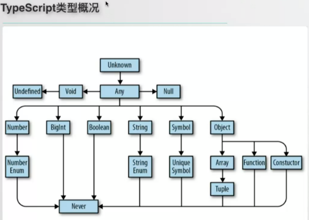

##### 如何定义一个类型，或得到一个类型？

- `keyof` 后面跟一个类型，获取该类型的所有 key，产生联合类型。
  `typeof` 后面跟一个变量，获取变量的类型。

  ```ts
  type State = Readonly<typeof initialState>;
  ```

- 类型别名

  ```tsx
  type Props = { 
   onClick(e: MouseEvent<HTMLElement>): void
   children?: ReactNode 
  }
   
  type RenderCallback = (args: ToggleableComponentProps) => JSX.Element;
  ```

  **`type` 和 `interface` 的区别？**  

- **类型断言**  

  ```tsx
  const initialState = {name: ''}
  type State = Readonly<typeof initialState>
  ```

- 查找类型
  从已有的类型中查找

  ```ts
  const initialState = {
    show: false,
  };
  type State = Readonly<typeof initialState>;
  type ToggleableComponentProps = {
    show: State['show'];
  };
  ```

- 从实现中推断类型

  ```ts
  type ToggleableComponentProps = {
    toggle: Toggleable['toggle'];
    // Toggleable 本来就是类型，不能是变量
  };
  
  export class Toggleable extends Component<Props, State> {
    readonly state: State = initialState;
    render() {
      // 
    }
    private toggle = (event: MouseEvent<HTMLElement>) => this.setState(updateShowState);
  }
  ```


##### `ReactNode` 、 `ReactElement` 和 `JSX.Element` 的区别？

-  `children?: React.ReactNode `  


#### 概况

  

  

上面的是父级，下面是子级，子级类型可以赋值给父级。

**TypeScript体系** 

**值 、变量 和 类型**  

- 类型的标注/推导确定
- 类型的检查，检查数据类型是否安全


#### TS资源

- [官网](https://www.typescriptlang.org/docs/home.html)  [中文](https://www.tslang.cn/) 
- [TS入门教程-阮一峰](https://ts.xcatliu.com/) 
- [非官方中文版](https://zhongsp.gitbook.io/typescript-handbook/) 
- [深入理解TS](https://jkchao.github.io/typescript-book-chinese/#why) 


#### 泛型参数组件

- 类组件定义及使用

  ```tsx
  // 定义泛型参数的组件
  class GenericComponent<P> extends React.Component<P> {
    internalProp: P;
    constructor(props: P) {
      super(props);
      this.internalProp = props;
    }
    render() {
      return null;
    }
  }
  
  type Props = { a: number; b: string };
  
  <GenericComponent<Props> a={10} b="hi" />; // OK
  <GenericComponent<Props> a={10} b={20} />; // Error
  ```

- 函数式组件

  ```tsx
  function GenericComponent<P>(props: P) {
    const internalProp = useRef(props)
    return null;
  }
  ```

- 箭头函数

  ```tsx
  // 这样会解析错误
  const GenericComponent = <P>(props: P) =>{
    const internalProp = useRef(props);
    return null;
  }
  
  // 泛型必须使用extends关键字才能解析
  const GenericComponent = <P extends any>(props: P) =>{
    const internalProp = useRef(props);
    return null;
  }
  ```

  

#### 关键字

extends ：ts 中的 extends 理解为扩展更合适，用 `& ` 可以实现和 `extends` 类似的效果。

implements：在 TypeScript 中，`implements`操作只是为`class`提供一种类型约束。

```ts
interface Alarm {
  alert(): void;
}
class Door {
}

class SecurityDoor extends Door implements Alarm,接口B {
  alert() {
    console.log('SecurityDoor alert');
  }
}

class Car implements Alarm {
  alert() {
    console.log('Car alert');
  }
}
```

- example

  ```ts
  (<any>result)[id] = (<any>first)[id];  // 类型断言
  
  
  interface Padder {
      getPaddingString(): string
  }
  class SpaceRepeatingPadder implements Padder {
      constructor(private numSpaces: number) { }
      getPaddingString() {
          return Array(this.numSpaces + 1).join(" ");
      }
  }
  ```
  
- 使用类型断言手动去除某个类型中的`null`和`undefined` 

  ```typescript
  name!.charAt(0)  // name为undefined 时会报错,!的意思是显式告诉编译器name不会为undefined
  
  name?.charAt(0) // name为undefined 时不会报错
  ```

- 函数类型

  ```typescript
  export interface ThemeContextValue {
    theme: Theme;
    onThemeChange: (theme: Theme) => void;
    handleClick?(e: React.MouseEvent<HTMLElement>):void;
  }
  ```


##### extends

使用 extends 给泛型添加约束

有时候我们定义的泛型不想过于灵活或者说想继承某些类等，可以通过 extends 关键字添加泛型约束。

```ts
interface ILengthwise {
  length: number;
}
function loggingIdentity<T extends ILengthwise>(arg: T): T {
  console.log(arg.length);
  return arg;
}

// 这时我们需要传入符合约束类型的值，必须包含必须的属性：
loggingIdentity(3);  // Error, number doesn't have a .length property
loggingIdentity({length: 10, value: 3});
```


#### 参考 

- [原始数据类型](https://ts.xcatliu.com/basics/primitive-data-types.html)
- [任意值](https://ts.xcatliu.com/basics/any.html)
- [类型推论](https://ts.xcatliu.com/basics/type-inference.html)
- [联合类型](https://ts.xcatliu.com/basics/union-types.html) 
- [对象的类型——接口](https://ts.xcatliu.com/basics/type-of-object-interfaces.html)
- [数组的类型](https://ts.xcatliu.com/basics/type-of-array.html)
- [函数的类型](https://ts.xcatliu.com/basics/type-of-function.html)
- [类型断言](https://ts.xcatliu.com/basics/type-assertion.html)
- [声明文件](https://ts.xcatliu.com/basics/declaration-files.html)
- [内置对象](https://ts.xcatliu.com/basics/built-in-objects.html)

#### 数据类型

> 类型是值的集合
>
> Undefined  只有`undefined`一个元素的集合
>
> Null  只有`null`一个元素的集合
>
> Boolean  有两个元素`false`和`true`的集合
>
> ...

**指定变量的类型**   


- 使用接口（Interfaces）来定义对象的类型

- 指定变量为函数

  ```ts
  interface Cat {
    name: string;
    run(): void;
    onBlur?: (value: string, e?: React.FocusEvent<HTMLInputElement>) => void;
  }
  
  listener: (ev: MouseEvent) => any  // 指定listener 是一个函数，同时指定该函数的输入输出类型
  
  let mySum: (x: number, y: number) => number = function (x: number, y: number): number {
      return x + y;
  };
  ```


TS简单的说就是为JS中的变量指定了类型，JS中的变量本身是没有类型的，比如：

```js
let x = 1;
x = 'anc';
x = [1,2,3];
```

上述中变量`x`既可以存储数字也可以存储字符串，JS中的某一个变量可以存储任意类型的值。有了TS就可以为变量指定一个类型，这样在编译阶段就可以检查变量是否赋予了正确的类型，提前发现错误，配合编辑器的语法提示能有效提高开发效率。


TS中描述类型的方法有：

1. 原始类型: numble  string   Boolean

2. 字面量类型：123  'abc'

3. 接口：描述一类对象的类型，例如：

   ```ts
   interface IPerson{
     name: string;
     age: number
   }
   
   let me: IPerson = {
     name: 'abc',
     aeg: 10
   }
   let you: IPerson = {
     name: 12,  // 报错：name必须是string
   }
   // 报错 you 必须同时包含 name 和 age 两个属性
   ```

   上述代码定义了一个名为`IPerson`的接口来表示'人'这一类对象的类型，如果某个对象被指定为`IPerson`这种类型，那这个对象就必须符合`IPerson`描述的特征，即包含`name`和`age `两个属性。

4. 别名
   与接口不同，接口定义了一种新的类型，别名只是对现有的类型声明了新的名字，别名通常与字面量类型、联合类型、交叉类型、泛型使用，例如：

   ```typescript
   // 为string起一个别名Name，
   type Name = string;
   let myName:Name = 'abc';
   
   // 等号右边是字符串字面量类型，Easing是这个字面量类型的别名
   type Easing = "ease-in" | "ease-out" | "ease-in-out";
   let easing: Easing = 'ease-in';
   let easing: Easing = 'other'; // 报错
   // easing这个变量只能被赋值为"ease-in" 或 "ease-out" 或 "ease-in-out"这三个字符串中的一个，赋值为其他值就会报错
   ```

5. `never`  `undefined`   `null` 
   `never`  `undefined`   `null` 是TS中三中特殊的类型

   - `never` 表示永远不存在的值的类型，即这个类型没有对应的值
   - `undefined`这个类型只有一个值，就是`undefined`
   - `null`与`undefined`同理
   
6. 联合类型
   多个类型的或运算，逆 `extends` ，生成的类型是参与运算的类型的父类型。

   ```typescript
   // 声明了NumOrStr为一个联合类型
   type NumOrStr = sting | number;
   
   let x: NumOrStr = 1; // success
   x = 'abc'; // success
   x = [1]; // error
   ```

7. 交叉类型
   和并多个类型

   ```typescript
   type Parent1 = {
     name: string;
   }
   type Parent2 = {
     age: number;
   }
   type Child = Parent1 & Parent2;
   
   // 子级类型可以赋值给父类型(属性只能多不能少)
   let my: Parent1 = {
     age: 2,
     name: ''
   }
   ```

8. 泛型：对类型的进一步抽象，与模板的概念相似，例如：

   ```typescript
   // 定义一个泛型函数
   function logging<T>(arg: T[]): T[] {
       console.log(arg.length);  // Array has a .length, so no more error
       return arg;
   }
   
   // 分别使用number 和 string 指定泛型的类型
   logging<number>([1,2,3]); // ok
   loggin<string>(['a','b','c']); // ok
   ```

   

#### 接口

> 使用接口（Interfaces）来定义对象的类型，它是对行为的抽象，而具体如何行动需要由类（classes）去实现（implement）。除了可用于[对类的一部分行为进行抽象](https://ts.xcatliu.com/advanced/class-and-interfaces.html#类实现接口)以外，也常用于对「对象的形状（Shape）」进行描述。

- demo

  ```typescript
  interface Person {
      name: string;
      age: number;
  }
  
  let tom: Person = {
      name: 'Tom',
      age: 25
  };
  
  // 有时候我们希望一个接口允许有任意的属性，可以使用如下方式
  interface Person {
      name: string;
      age?: number; // 可选
      [propName: string]: string | number; // 任意属性，一旦定义了任意属性，那么确定属性和可选属性的类型都必须是它的类型的子集。 
  }
  
  let tom: Person = {
      name: 'Tom',
      gender: 'male'
  };
  
  ```

- 使用接口定义类数组数据

  ```typescript
  function sum() {
      let args: {
          [index: number]: number;
          length: number;
          callee: Function;
      } = arguments;
  }
  ```


##### 接口继承

接口是一个类型，接口可以继承类和其他interface(包括自定义类)。
接口继承类的时候，只会继承它的实例属性和实例方法。

```ts
interface ApiError extends Error {
  code: number;
}
```

https://ts.xcatliu.com/advanced/class-and-interfaces.html  

##### interface 和 type 的区别

​    1)  interface 可以用于 extends 和 implements，type 不能；

​    2)  `type` 可以声明联合、交叉类型，interface 不能；

​    3)  `type` 可以与 `typeof ` 联用，从变量值推断类型；

​    4)  interface 存在声明合并的情况，可以用来重在函数，详解：https://www.tslang.cn/docs/handbook/declaration-merging.html

#### 泛型

> 泛型（Generics）是指在定义函数、接口或类的时候，不预先指定具体的类型，而在使用的时候再指定类型的一种特性。

- demo

  ```typescript
  function createArray<T>(length: number, value: T): Array<T> {
      let result: T[] = [];
      for (let i = 0; i < length; i++) {
          result[i] = value;
      }
      return result;
  }
  
  createArray<string>(3, 'x');
  ```

  

- 数组泛型

  ```typescript
  let fibonacci: Array<number> = [1, 1, 2, 3, 5];
  ```

#### 内置高级泛型

```ts
// extends 表示类型约束
function copy<T extends BaseType>(arg: T): T {
  return arg;
}
// 条件类型
type Extract<T, U> = T extends U ? T : never;
```


- 内置高级类型泛型： `Partial Required Pick Exclude Omit`  

  ```ts
  // 将所有接口变为可选
  type Partial<T> = { [P in keyof T]?: T[P] };
  
  // 将所有接口变为必选
  type Required<T> = { [P in keyof T]-?: T[P] };
  
  // 从 T 中取出 一系列 K 的属性
  type Pick<T, K extends keyof T> = { [P in K]: T[P] };
  
  type Readonly<T> = {
      readonly [P in keyof T]: T[P];
  };
  
  /**
   * Exclude from T those types that are assignable to U
   * T 是联合类型？
   */
  type Exclude<T, U> = T extends U ? never : T;
  
  /**
   * Extract from T those types that are assignable to U
   */
  type Extract<T, U> = T extends U ? T : never;
  
  /**
   * Construct a type with the properties of T except for those in type K.
   */
  type Omit<T, K extends keyof any> = Pick<T, Exclude<keyof T, K>>;
  ```

- `Record` :  `Record<K extends keyof any, T>` 的作用是将 `K` 中所有的属性的值转化为 `T` 类型。

  ```ts
  type Record<K extends keyof any, T> = {
      [P in K]: T;
  };
  
  
  interface PageInfo {
    title: string;
  }
  type Page = "home" | "about" | "contact";
  
  const x: Record<Page, PageInfo> = {
    about: { title: "about" },
    contact: { title: "contact" },
    home: { title: "home" }
  };
  ```

- Pick：从类型 T 中选中部分，得到选中的类型

  ```ts
  type Pick<T, K extends keyof T> = {
      [P in K]: T[P];
  };
  ```

- Exclude：从类型 T 中剔除部分类型，得到剩余的类型

  ```ts
  type Exclude<T, U> = T extends U ? never : T;
  ```

- Extract：从类型 T 中提取部分，得到提取的

  ```ts
  type Extract<T, U> = T extends U ? T : never;
  ```

- ReturnType：用于获取函数 `T` 的返回类型。

  ```ts
  type ReturnType<T extends (...args: any) => any> = T extends (...args: any) => infer R ? R : any;
  ```


参考：

[TS内置高级泛型](https://mp.weixin.qq.com/s?__biz=MzI2MjcxNTQ0Nw==&mid=2247484142&idx=1&sn=946ba90d10e2625513f09e60a462b3a7&scene=19#wechat_redirect)    

#### 声明文件

- demo.d.ts

  ```tsx
  export declare enum ButtonsPopoverConfigIconType {
      XiaoSen = "XiaoSen",
      Scan = "Scan",
      AppStore = "AppStore",
      Setting = "Setting"
  }
  export interface ButtonsPopoverConfig {
      positionX: number;
      buttons: Array<{
          iconType: ButtonsPopoverConfigIconType;
          title: string;
      }>;
  }
  
  export declare function openButtonsPopover(cfg: ButtonsPopoverConfig): Promise<ButtonsPopoverResult>;
  
  // 暴露在最外层的 interface 或 type 会作为全局类型作用于整个项目中，我们应该尽可能的减少全局变量或全局类型的数量。故最好将他们放到 namespace 下
  declare namespace jQuery {
    interface AjaxSettings {
      method?: 'GET' | 'POST'
      data?: any;
    }
    function ajax(url: string, settings?: AjaxSettings): void;
  }
  ```


- 声明合并：当一个变量有多种类型时(如：jQuery 既可以作为函数被调用也可以作为对象)
  可以组合多个声明语句，它们会合并起来。

  ```tsx
  declare function jQuery(selector: string): any;
  declare namespace jQuery {
      function ajax(url: string, settings?: any): void;
  }  
  ```

#### TS & React

##### 内置类型

React源码

```ts
type ComponentType<P = {}> = ComponentClass<P> | FunctionComponent<P>;
```


  ```ts
interface ReactDOM extends ReactHTML, ReactSVG { }

interface ReactElement<P = any, T extends string | JSXElementConstructor<any> = string | JSXElementConstructor<any>> {
  type: T;
  props: P;
  key: Key | null;
}

type ReactElement = ReactComponentElement | ReactDOMElement;

interface ReactComponentElement<
  T extends keyof JSX.IntrinsicElements | JSXElementConstructor<any>,
  P = Pick<ComponentProps<T>, Exclude<keyof ComponentProps<T>, 'key' | 'ref'>>
> extends ReactElement<P, Exclude<T, number>> { }


type ReactText = string | number;
type ReactChild = ReactElement | ReactText;

type ReactFragment = {} | ReactNodeArray;

type ReactNode = ReactChild | ReactFragment | ReactPortal | boolean | null | undefined;

interface ReactNodeArray extends Array<ReactNode> {}

//------------------------------------------------------
interface ReactDOM extends ReactHTML, ReactSVG { }
// ReactHIML:  a\h\div等

type ReactNode = ReactElement | ReactFragment | ReactText;

// type ReactElement = ReactComponentElement | ReactDOMElement;

interface ReactDOM extends ReactHTML, ReactSVG { }

type ReactDOMElement = {
  type : string,
  props : {
    children : ReactNodeList,
    className : string,
    etc.
  },
  key : string | boolean | number | null,
  ref : string | null
};

type ReactComponentElement<TProps> = {
  type : ReactClass<TProps>,
  props : TProps,
  key : string | boolean | number | null,
  ref : string | null
};

type ReactFragment = Array<ReactNode | ReactEmpty>;

type ReactNodeList = ReactNode | ReactEmpty;

type ReactText = string | number;

type ReactEmpty = null | undefined | boolean;
  ```

**[React Virtual DOM 术语](https://gist.github.com/sebmarkbage/fcb1b6ab493b0c77d589)**  

- ReactElement
- ReactNode


一些`React`的内置类型

- `React.ReactElement` —— 使用`React.createElement`创建的，可以简单理解为`React`中的`JSX`的元素
- `React.ReactNode` —— `<div>xxx</div>` xxx的合法类型
- `React.ReactDOM`
- 
- `React.CSSProperties` —— 组件内联的`style`对象的类型
- `React.RefObject` —— `React.createRef`创建的类型，只读不可改
- `React.MutableRefObject` —— `useRef`创建的类型，可以修改


**内置事件类型** 

- `React.MouseEventHandler<HEMLInputElement>`
- `React.ChangeEventHandler<HTMLInputElement>`
- `React.FocusEventHandler<HTMLInputElement>`


- 无状态组件

  ```
  
  import { SFC } from 'react'
  import { MouseEvent } from 'react'
  import * as React from 'react'
  interface IProps {
    onClick (event: MouseEvent<HTMLDivElement>): void,
  }
  const Button: SFC<IProps> = ({onClick, children}) => {
    return (
      <div onClick={onClick}>
        { children }
      </div>
    )
  }
  export default Button
  ```

- 函数组件
  函数组件定义的方式有两种：

  1. 使用`React.FC`

  ```typescript
  interface IProps {
    value: string;
    onClick(event: React.MouseEvent<HTMLButtonElement>): void
    // 使用React.FC定义函数式组件时不用声明children
  }
  const App: React.FC<IProps> = (props)=>{
    return <div>{children}</div>
  }
  ```

  2. 使用接口定义`props`

  ```typescript
  interface IProps{
    value: string;
    onClick(event: React.MouseEvent<HTMLButtonElement>): void
    children?: React.ReactNode; // 需要自己定义children的类型
  }
  function App(props:IProps){
    return <div>{children}</div>
  }
  ```