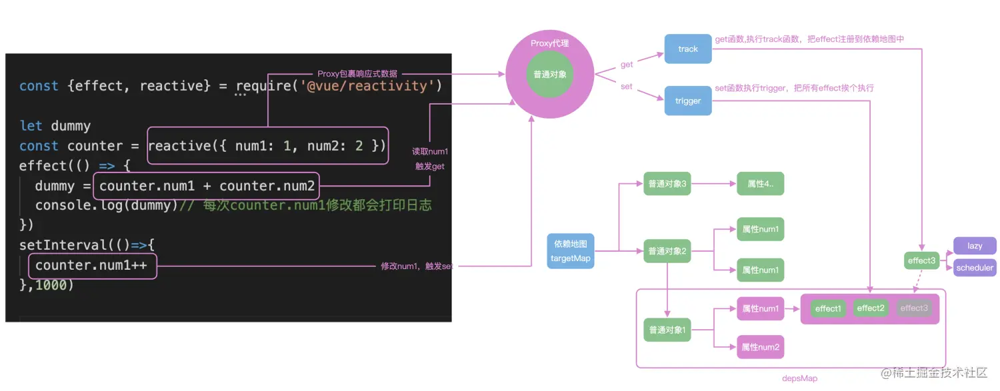

# TODO

- [vue2 源码](https://github.com/vuejs/vue) 
- [vue3](https://vuejs.org/guide/introduction.html) [源码](https://github.com/vuejs/core) 
- [Vue3 响应式是如何实现的](https://mp.weixin.qq.com/s/Os-yxAcIrcC9rvfXyyvPHA) 
- vue 设计与实现 前端开发-霍春阳
   
- vue 动态创建组件
  - `$mount('#app')` 组件会替换 `#app`  元素本身（`outerHtml`）

> 关键字
> 顶级作用域

# 新特性

- template 支持多个根标签
- 组合式API
- 组合式函数
- Teleport 内置组件
- Diff 算法的提升（静态标记、静态提升）

## 组件选项配置

- emits：声明组件触发的事件，（可选）
- expost
- `props` 和 事件名会自动格式转换，将驼峰转为短横线形式
- 双向绑定 `v-model` 的 props 由 `value` 改为 `modelValue`
- 多根节点？
- 用响应式API替换事件总线


# 组合式 API

> `<script setup>` 形式书写的组件模板被编译为了一个内联函数，和 `<script setup>` 中的代码位于同一作用域。不像选项式 API 需要依赖 this 上下文对象访问属性，被编译的模板可以直接访问 `<script setup>` 中定义的变量，无需一个代码实例从中代理。这对代码压缩更友好，因为本地变量的名字可以被压缩，但对象的属性名则不能。


- 仅调用 `setup()` 或 `<script setup>` 的代码一次。这使得代码更符合日常 JavaScript 的直觉，不需要担心闭包变量的问题。组合式 API 也并不限制调用顺序，还可以有条件地进行调用。
- Vue 的响应性系统运行时会自动收集计算属性和侦听器的依赖，因此无需手动声明依赖。
- 无需手动缓存回调函数来避免不必要的组件更新。Vue 细粒度的响应性系统能够确保在绝大部分情况下组件仅执行必要的更新。对 Vue 开发者来说几乎不怎么需要对子组件更新进行手动优化。

```js
export default {
  emits: ['inFocus', 'submit'],
  setup(props, ctx) {
    ctx.emit('submit')
  }
}
```

> 同时使用选项式API 和 组合式API
```js
<script>
// 使用普通的 <script> 来声明选项
export default {
  inheritAttrs: false
}
</script>

<script setup>
// ...setup 部分逻辑
</script>
```

- ref、isref、unref
- readonly
- watchEffect

## 宏

> 在使用 `<script setup>` 的单文件中直接使用某个【宏】，无需导入

- defineProps
- defineEmits：组件触发的事件

## 插槽

插槽内容无法访问子组件的数据。Vue 模板中的表达式只能访问其【定义时所处的作用域】，这和 JavaScript 的【词法作用域】规则是一致的。换言之
> 父组件模板中的表达式只能访问父组件的作用域；子组件模板中的表达式只能访问子组件的作用域。

## 代码复用

代码复用方式有：
- 组件：复用逻辑和UI
- 组合式函数：复用逻辑
- 自定义指令：处理DOM的逻辑

# 响应式

> reactive

```js
import { reactive } from 'vue'

export default {
  // `setup` 是一个专门用于组合式 API 的特殊钩子函数
  setup() {
    const state = reactive({ count: 0 })

    // 暴露 state 到模板
    return {
      state
    }
  }
}
```

1. 仅对对象类型有效（对象、数组和 `Map`、`Set` 这样的[集合类型](https://developer.mozilla.org/zh-CN/docs/Web/JavaScript/Reference/Global_Objects#使用键的集合对象)），而对 `string`、`number` 和 `boolean` 这样的 [原始类型](https://developer.mozilla.org/zh-CN/docs/Glossary/Primitive) 无效。
2. 因为 Vue 的响应式系统是通过属性访问进行追踪的，因此我们必须始终保持对该响应式对象的相同引用。这意味着我们不可以随意地“替换”一个响应式对象，因为这将导致对初始引用的响应性连接丢失。

> ref

Vue 提供了一个 [`ref()`](https://cn.vuejs.org/api/reactivity-core.html#ref) 方法来允许我们创建可以使用任何值类型的响应式 **ref**。

`ref()` 将传入参数的值包装为一个带 `.value` 属性的 ref 对象。

> watchEffect

## [响应式系统](https://cn.vuejs.org/guide/extras/reactivity-in-depth.html#how-reactivity-works-in-vue) 

```js
function reactive(obj) {
  return new Proxy(obj, {
    get(target, key) {
      track(target, key)
      return target[key]
    },
    set(target, key, value) {
      target[key] = value
      trigger(target, key)
    }
  })
}

function ref(value) {
  const refObject = {
    get value() {
      track(refObject, 'value')
      return value
    },
    set value(newValue) {
      value = newValue
      trigger(refObject, 'value')
    }
  }
  return refObject
}
```

# 源码

> 目录结构

代码仓库中有个 packages 目录，里面是 Vue 3 的主要功能的实现，包括

- reactivity 目录：数据响应式系统，这是一个单独的系统，可以与任何框架配合使用。
- runtime-core 目录：与平台无关的运行时。其实现的功能有虚拟 DOM 渲染器、Vue 组件和 Vue 的各种API，我们可以利用这个 runtime 实现针对某个具体平台的高阶 runtime，比如自定义渲染器。
- runtime-dom 目录: 针对浏览器的 runtime。其功能包括处理原生 DOM API、DOM 事件和 DOM 属性等。
- runtime-test 目录: 一个专门为了测试而写的轻量级 runtime。由于这个 rumtime 「渲染」出的 DOM 树其实是一个 JS 对象，所以这个 runtime 可以用在所有 JS 环境里。你可以用它来测试渲染是否正确。它还可以用于序列化 DOM、触发 DOM 事件，以及记录某次更新中的 DOM 操作。
- server-renderer 目录: 用于 SSR。尚未实现。
- compiler-core 目录: 平台无关的编译器. 它既包含可扩展的基础功能，也包含所有平台无关的插件。
- compiler-dom 目录: 针对浏览器而写的编译器。
- shared 目录: 没有暴露任何 API，主要包含了一些平台无关的内部帮助方法。
- vue 目录: 用于构建「完整构建」版本，引用了上面提到的 runtime 和 compiler。


> 核心

- 全局变量 【activeEffect】表示当前正在运行的副作用，只有 `ReactiveEffect.run()` 才会设置它的值
  - ReactiveEffect 的实例只有三类：watch、computed、render

- 将当前 effect 添加到依赖中，只有 `trackEffects(dep)` <== trackRefValue  <== RefImpl.get、ComputedRefImpl.get
- trackEffects  <== track <==

> 生命周期

- instance.emit('hook:beforeMount')


> ref 完成响应式更新UI

- 每个 `ref(1)` 会创建一个对象，该对象有一个访问属性 `value` 和 【dep】属性，【dep】是一个【ReactiveEffect】集合。
- `value get` 会执行 `dep.add(activeEffect!)` 和 `activeEffect!.deps.push(dep)`
- `value set` 会执行 `triggerRefValue`：遍历【dep】并执行 `effect.scheduler` （添加到队列）或 `effect.run`。

- 初始化组件时会创建一个【reactive effect for rendering】，并执行 `effect.run`（调用用户定义的 render 函数）。同时设置 【activeEffect】为该 effect。

> reactive 响应式更新 

- `reactive(obj)` 会创建一个 `Proxy` 实例 【proxy】，该【proxy】代理的目标对象的【get】【set】等捕捉器。
- 在【get】捕捉器中会执行 `track(target, TrackOpTypes.GET, key)`，将【activeEffect】添加到目标对象的 `key` 对应的依赖集合中。
- 在【set】捕捉器中执行  `trigger`：遍历【dep】并执行 `effect.scheduler` （添加到队列）或 `effect.run`。

> 处理数组

> [带编译时信息的虚拟DOM](https://cn.vuejs.org/guide/extras/rendering-mechanism.html#compiler-informed-virtual-dom) 
> 标记 vnode 的类型和更新类型


> 异步更新

- 只使用 Promise 

> 参考

- [透响应式原理](https://juejin.cn/post/7010941033554903076) 
- [博客](https://vue3js.cn/global/nextTick.html) 

---------------------------------------------------------------------------------

# Q

> SPA 一般要求后端提供 API 数据接口，但你也可以将 Vue 和如 [Inertia.js](https://inertiajs.com/) 之类的解决方案搭配使用，在保留侧重服务端的开发模型的同时获得 SPA 的益处

> 根组件实例 & 应用实例

同一个页面中创建多个共存的 Vue 应用，而且每个应用都拥有自己的用于配置和全局资源的作用域。


> 模板中的表达式将被沙盒化，仅能够访问到[有限的全局对象列表](https://github.com/vuejs/core/blob/main/packages/shared/src/globalsWhitelist.ts#L3)。该列表中会暴露常用的内置全局对象，比如 `Math` 和 `Date`。
> 没有显式包含在列表中的全局对象将不能在模板内表达式中访问，例如用户附加在 `window` 上的属性。然而，你也可以自行在 [`app.config.globalProperties`](https://cn.vuejs.org/api/application.html#app-config-globalproperties) 上显式地添加它们，供所有的 Vue 表达式使用。

> 将通用方法添加到 `app.config.globalProperties` 上

> 使用箭头函数，函数的 `this` 指向谁

```js
// x.vue 单文件
<script setup>
import { ref, onMounted } from 'vue'

// 响应式状态
const count = ref(0)

// 用来修改状态、触发更新的函数
function increment() {
  count.value++
}

// 生命周期钩子
onMounted(() => {
  console.log(`The initial count is ${count.value}.`)
})
</script>

<template>
  <button @click="increment">Count is: {{ count }}</button>
</template>
```

# [web component](https://cn.vuejs.org/guide/extras/web-components.html)

> 你可以用 Vue 来构建标准的 Web Component，这些 Web Component 可以嵌入到任何 HTML 页面中，无论它们是如何被渲染的。这个方式让你能够在不需要顾虑最终使用场景的情况下使用 Vue：因为生成的 Web Component 可以嵌入到旧应用、静态 HTML，甚至用其他框架构建的应用中。

[Web Components](https://developer.mozilla.org/en-US/docs/Web/Web_Components) 是一组 web 原生 API 的统称，允许开发者创建可复用的自定义元素 (custom elements)。

# [各种vue版本](https://github.com/vuejs/core/tree/main/packages/vue#which-dist-file-to-use) 

Which dist file to use