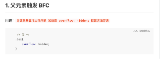
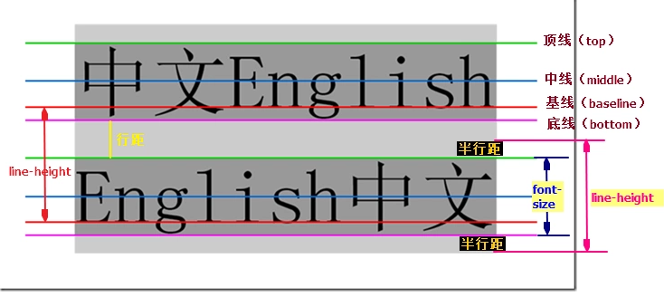

#### 常用布局

#### 移动端适配

布局的基础+基本的PC端布局+移动端适配

- [移动端适配-segmentFault](https://mp.weixin.qq.com/s?__biz=MjM5NTEwMTAwNg==&mid=2650216321&idx=2&sn=58a93b8805c4a60379543ea53d21ca1b&chksm=befe17a089899eb6c4983fb990778feea3c3abe61f500481b71358b295c0190d94e72983845a&scene=0&xtrack=1&key=5344cfa6bb5e8fd1fa6ad4542d2e7a57a5b9cf6e3ee918bea6abe13f0d0a9816f13bc6e087cafd792eb37a8fa2e3d5391f7efd085edc27b5886da4aafa3dccab8a580f3ba70ad2fc825bb6854c5808af&ascene=1&uin=Mjc2NDI1NDU2NA%3D%3D&devicetype=Windows+7&version=62060833&lang=zh_CN&pass_ticket=7SxYUoJzta5TNU5RVI%2BjHbbnce3fxtDzNEpJeH1sJL9HgWwKpR7%2BkDY9DiLljFpv) 
- [利用 vw 实现适配布局-凹凸实验室](https://aotu.io/notes/2017/04/28/2017-4-28-CSS-viewport-units/index.html) 


**vue 项目使用 vw**  

postcss-aspect-ratio-mini 

postcss-px-to-viewport

- 安装插件

  ```js
  npm i –save 
  postcss-aspect-ratio-mini 
  postcss-px-to-viewport 
  postcss-write-svg 
  postcss-cssnext 
  postcss-viewport-units 
  cssnano 
  cssnano-preset-advanced 
  postcss-import 
  postcss-url
  ```

- 配置 .postcssrc.js

  ```js
  module.exports = {
    "plugins": {
      // to edit target browsers: use "browserlist" field in package.json
      "autoprefixer": {},
      "postcss-import": {}, 
      "postcss-url": {}, 
      "postcss-aspect-ratio-mini": {}, 
      "postcss-write-svg": { 
        utf8: false 
      },
      "postcss-cssnext": {}, 
  
      "postcss-px-to-viewport": {
        viewportWidth: 750,      // 视窗的宽度，对应的是我们设计稿的宽度，一般是750
        viewportHeight: 1334,    // 视窗的高度，根据750设备的宽度来指定，一般指定1334，也可以不配置
        unitPrecision: 3,        // 指定`px`转换为视窗单位值的小数位数（很多时候无法整除）
        viewportUnit: 'vw',      // 指定需要转换成的视窗单位，建议使用vw
        selectorBlackList: ['.ignore', '.hairlines'],  // 指定不转换为视窗单位的类，可以自定义，可以无限添加,建议定义一至两个通用的类名
        minPixelValue: 1,       // 小于或等于`1px`不转换为视窗单位，你也可以设置为你想要的值
        mediaQuery: false       // 允许在媒体查询中转换`px`
      }
      
      "postcss-viewport-units":{}, 
      "cssnano": { 
        preset: "advanced", 
        autoprefixer: false, 
        "postcss-zindex": false 
      }
    }
  }
  ```

- 如果需要某些元素不使用vw单位，可以设置配置文件中的selectorBlackList里面的类名，该属性可无限添加，随便自定义，不需要转换的单位需要写在该类名上才可生效；

#### 媒体查询

- 媒体类型
  1. screen：彩色计算机
  2. print
  3. projection
  4. all：所有媒体(默认)

- 在`<link>`链接外部样式表时可以指定媒体类型，`<link media>`

#### `<a>` 伪类顺序

- link--visited--focus--hover--active
- active必须在hover后面，hover必须在link和visited后面；

#### CSS模块化

##### 模块化解决方案

1. 一类是彻底抛弃 CSS，使用 JS 或 JSON 来写样式。[Radium](https://github.com/FormidableLabs/radium)，[jsxstyle](https://github.com/petehunt/jsxstyle)，<u>react-style</u> 属于这一类。优点是能给 CSS 提供 JS 同样强大的模块化能力；缺点是不能利用成熟的 CSS 预处理器（或后处理器）。
2. 另一类是依旧使用 CSS，但使用 JS 来管理样式依赖（需要构建工具支持），代表是 [CSS Modules](https://github.com/css-modules/css-modules)。CSS Modules 能最大化地结合现有 CSS 生态和 JS 模块化能力，发布时依旧编译出单独的 JS 和 CSS。它并不依赖于 React，只要你使用 Webpack，可以在 Vue/Angular/jQuery 中使用。


- CSS modules？

  **`<style module>`**

- BEM策略：Block-Element-Modifier
  
  类命名策略：类名按  块-元素-修饰符 命名
  
  ```html
  <style>
      .c-Button {
          ...
      }
      .c-Button--close {
          ...
      }
  </style>
  ```

#### em, rem

- 2em：相对于当前元素的字体 大小，当前元素中小写字母M的宽度的2倍
- rem：相对于根元素(html中的`<html>`，也可以用伪元素::root表示根元素 )

#### 变量

- css中的变量相当与宏，作用只是将一个值替换为另一个值

  ```css
  html {
      /*自定义变量*/
      --base-color: blue;
  }
  :root{
    --base-color: blue;
  }
  p {
      color: var(--base-color);
  }
  ```

#### @import

- @import导入的样式表A相当于被导入的样式表中的额样式规则出现在@import的位置

  ```css
  /*相当于在此处定义样式规则*/
  @import url(common.css);
  ```
  
- 页面被加载的时，link会同时被加载，而@import引用的CSS会等到页面被加载完再加载；

- 如果你想样式表并行载入，以使页面更快，请使用LINK 替代`@import`。

#### 清除浮动

1. 浮动元素的后面一个元素设置 clear: both (也可以添加一个空元素用来添加该属性)；
2. 给浮动元素的容器元素设置 overflow:hidden 或 auto；
3. ::after 伪元素；

#### 视觉上清除一个元素

- `opacity:0;`  `visibility: hidden;` `display:none;` `index: 99`

  - `display` 影响布局，会导致回流，不会占据空间；`visibility` 和 `opacity` 会占据空间，不会导致回流。
  - 只有 `opacity` 能触发点击事件。
  - 父元素设置 `display` 和 `opacity` ，子元素一定会隐藏；父元素设置 `visibility` ，子元素 `visibility: visible` 子元素可以显示。

- 回流 & 重绘

  - `display` 导致回流， `visibility` 导致重绘

  - 在一般情况下，`opacity` 会触发重绘，即 `Recalculate style` => `Update Layer Tree`。不管你是否开启GPU提升为合成层与否。

    如果利用 `animation` 动画，对 `opacity` 做变化（`animation` 会默认触发GPU加速），则只会触发 GPU 层面的 composite，不会触发重绘。

https://segmentfault.com/a/1190000015116392  

#### 图像居中

1. 父元素固定宽高，利用定位及设置子元素margin值为自身的一半；

2. 父元素固定宽高，子元素设置position: absolute，margin：auto平均分配margin；

3. css3属性transform。子元素设置position: absolute; left: 50%; top: 50%;transform: translate(-50%,-50%);即可；

4. 将父元素设置成display: table, 子元素设置为单元格 display: table-cell；

5. 弹性布局display: flex。设置align-items: center; justify-content: center；

#### 元素垂直居中 

1. 父元素display:flex,align-items:center;
2. 元素绝对定位，top:50%，margin-top：-（高度/2）
3. 高度不确定用transform：translateY（-50%）
4. 父元素table布局，子元素设置vertical-align:center;

##### 水平对齐

- 对齐块级元素：`margin:0 auto;`  (宽度固定或者取百分比都可以)

- 块级元素中的行内元素

  ```css
  .box-contain {
    text-align: center;
  }
  .box-contain::after {
    display: inline-block;
    content: ''; 
    width: 100%;
    height: 0;
  }
  ```

##### 垂直对齐

- 作用于行内元素

  ```js
  .inline-ele {
    vertical-align: middle;
  }
  // 作用于 内联元素上
  
  // 容器元素设置 line-height 为容器高度，line-height 平均分配给行内框的上、下
  .container {
    font-size: 0;
    line-height: 800px;
  }
  ```


##### 未知宽高的水平垂直居中

- demo

  ```js
  /* 1. 绝对定位 + translate */
  .transform {
    position: absolute;
    left: 50%;
    top: 50%;
    transform: translate(-50%,-50%);
  }
  
  /* 2. flex布局*/
  .flex {
    display: flex;
    justify-content: center;//使子项目水平居中
    align-items: center;		//使子项目垂直居中
  }
  
  /* 3. table*/
  .table {
    display: table-cell;
    vertical-align: middle; //使子元素垂直居中
    text-align: center;     //使子元素水平居中
  }
  /* 4. inline-block*/
  .box {
    display: inline-block;
    margin: auto;
    text-align: center;    // 只有一行 & 强制换行时无效
  }
  ```

##### 参考

- [CSS 垂直居中](https://mp.weixin.qq.com/s?__biz=MjM5NTEwMTAwNg==&mid=2650215660&idx=1&sn=c1aeb94de8a3a4e23402068390cc811f&chksm=befe14cd89899ddbe29f3dd00212d6678af94606ee72ca0c54206d5e643cc0c684e64db44aa2&scene=0&key=f488c6fef5eafe9dddbfc3b904090949bf299ed3bba6ade392c7cdbda3053dfbb67d3c43bd13c69ff70503e95574b5574984ab793f52d9a8b00940664c531d3419d5a84018461bb07e019315e14adf33&ascene=1&uin=Mjc2NDI1NDU2NA%3D%3D&devicetype=Windows+7&version=62060720&lang=zh_CN&pass_ticket=Pn9cJyIWK2xt%2BmQltkMddf4S5oGoplFdiJ%2B16Yj6gD8L9Zd0WMlQ1u32%2FRJtZE1p) 

#### Flex布局

flex 布局分为三点：flex 容器、flex直系子元素的伸缩、flex子元素的对齐；

1. flex 容器：

   ```js
   .flex-contain {
     display: flex;
     flex-direction: row;
     flex-wrap: wrap;
     flex-flow: flex-direction flex-wrap; // 简写
   }
   ```

2. flex 元素的缩放

   ```js
   .flex-item {
     flex: flex-grow flex-shrink flex-basis; // 默认 1 1 auto
   }
   ```

3. flex 元素的对齐

   ```js
   // 全部item在主轴的对齐方式
   flex-contain {
    justify-content: center;  
   }
   // 全部item在副轴的对齐方式
   flex-contain {
     align-items: center;
   }
   
   // 多行时多个主轴的对齐方式
   flex-contain {
     align-content: center;
   }
   
   // 单个item在副轴的对齐方式
   flex-item {
     align-self: flex-end;
   }
   ```
   

#### [外边距塌陷（折叠）](https://developer.mozilla.org/en-US/docs/Web/CSS/CSS_Box_Model/Mastering_margin_collapsing)  

**上下相邻的两个块元素A,B，会合并共同的外边距**。A的**margin-botton**: 20px; B的**margin-top**: 10px; B的margin-top属性无效，较大的margin-botton才有效。两个垂直外边距接触到一起(没有边框的隔离)时会发生外边距折叠，即使一个元素嵌套另一个元素也不例外。

浮动元素和绝对定位的元素不会发生边距折叠。

#### img底像素空白

- [知乎](https://zhuanlan.zhihu.com/p/56815107) 

#### 布局和包含块

- [布局和包含块-MDN](https://developer.mozilla.org/en-US/docs/Web/CSS/Containing_block)  
- 所有毗邻的两个或更多盒元素的margin将会合并为一个margin共享之。毗邻的定义为：同级或者嵌套的盒元素，并且它们之间没有非空内容、Padding或Border分隔。
   

  ```css
  .parent{
  	content: "",
  	display: table;
  }
  ```


#### 视觉格式化模型

- [视觉格式化模型](https://developer.mozilla.org/zh-CN/docs/Web/Guide/CSS/Visual_formatting_model)  

#### HTML5新特性

[HTML5-MDN](https://developer.mozilla.org/zh-CN/docs/Web/Guide/HTML/HTML5) 

#### 文本对齐缩进

##### text-indent


##### text-align

- 应用于块级元素，不控制块元素自身的对齐，控制其元素内容(行内内容: 文本、图像等)的对齐

##### line-height

- 设置行内元素的height和width无效，通过设置`line-height`调整高度

##### vertical-align

- 指定行内元素（`display:inline`，如<span>）或表格单元格（table-cell）元素的垂直对齐方式。

- 应用于块级容器中的行内元素的垂直对齐方式，设置行内元素的 vertical-align

  

#### 行内框？

  

---

#### **块格式化上下文(BFC)？** 
