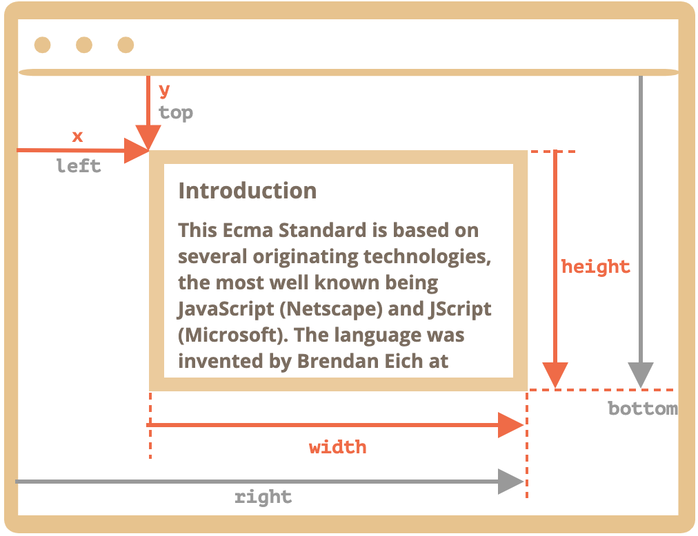

#### 页面生命周期

> - window.onload
> - window.onunload
> - window.onbeforeunload
> - document.addEventListener("DOMContentLoaded", fn);  DOMContentLoaded 只能用addEventListener监听
> - document.addEventListener('readystatechange', fn);
>   - 对应 document.readyState 属性，取值：loading | interactive | complete
>   - Loading: html 加载中
>   - interactive: html加载完成, dom 解析完成，可以操作dom，但是js、图像等资源还在加载，触发 DOMContentLoaded 事件
>   - complete: 资源完全加载，触发 window.onload

> 参考 [javascript.info](https://zh.javascript.info/onload-ondomcontentloaded) 

#### viewport | 视口

> - 缩放改变的是 `window.devicePixelRatio` 
> - 布局视窗可以通过<meta>标签设置viewport来修改。每个浏览器默认都会有一个设置，例如iOS，Android这些机型设置布局视窗宽度为980px，所以PC上的网页基本能在手机上呈现，只不过元素看上去很小，一般可以通过手指动双击缩放网页。

- 控制放大和缩小的就是视窗Viewport

- window.screen.width：获取屏幕的宽度，等于系统设置里面的屏幕分辨率，和页面没有关系（包括resize 、缩放）

- 什么是 viewport 视口
  - 可视区域，不包含滚动之外的内容
  - 视口 === 布局视口 === document.documentElement.clientWidth
  - layout viewport | visual viewport (布局视口)
  - https://developer.mozilla.org/en-US/docs/Glossary/Viewport  


#### 尺寸
> - getBoundingClientRect  
> - `clientHeight offsetHeight scrollHeight` 
> - `document.documentElement` : 与 `<html>` 标签相对应的根文档元素 

- `clientHeight` 内容区域加内边距，不包含滚动条和 border，可用于内容的文档的可见部分的 width/heigh，`inline` 元素获取的 clientWidth 和 clientHeight 为 0 ；

- `offsetWidth` 包含边框和滚动条的尺寸，不包含伪元素 (::before、::after)

- `scrollHeight` 包含滚动隐藏尺寸，包含伪元素，如果元素没有溢出，该值等于 clientHeight

- `window.innerWidth`: visual viewport 的宽度。页面缩放会影响该值，放大时值变小。

- `window.outerWidth`: 整个浏览器窗口的尺寸，包含从标签页顶部的尺寸

- 获取文档尺寸
  ````js
  const scrollHeight = Math.max(
    document.body.scrollHeight, document.documentElement.scrollHeight,
    document.body.offsetHeight, document.documentElement.offsetHeight,
    document.body.clientHeight, document.documentElement.clientHeight
  );
  ````

- `element.getBoundingClientRect()` 

  - viewport 内(以可视区域的左上角为坐标原点)，盒模型左上角和右小脚的坐标（x, y）
  - ie 不支持 element.getBoundingClientRect().x

      

  https://developer.mozilla.org/en-US/docs/Web/API/Element/getBoundingClientRect 

  [确定元素的尺寸-MDN](https://developer.mozilla.org/en-US/docs/Web/API/CSS_Object_Model/Determining_the_dimensions_of_elements) 

- `getComputedStyle(ele)`  只读
  `getComputedStyle(ele).getPropertyValue('font-size')`  使用全称查询。
  `getComputedStyle($0)['font-size']` 

##### 元素位置

- Element.clientTop/Element.clientLeft:  左/上边框的宽度
- Element.offsetTop:  元素的边框相对于最近的定位祖先元素的边框的距离
- Element.scrollTop:  元素内容区域滚动的距离

##### 鼠标位置

- event.pageY:  相对于页面左上角的垂直坐标
- event.clientY：相对于 viewport 左上角的垂直坐标

#### 滚动
- `window.pageYOffset` 
  以左上角为坐标原点，页面水平、垂直滚动的距离，只读

- `window.scrollBy()`  和 `window.scrollTo()` 
  `window.scrollBy(x, y)` 相对于当前位置滚动，`window.scrollTo(x, y)` 相对于文档左上角滚动

- `document.documentElement.scrollTop` 和 `document.body.scrollTop/Left`（safari）、`ele.scrollTop` 
  垂直滚动距离，可读可写
  
- `ele.scrollIntoView` 
  
- 判断是否溢出 

  ```js
   ele.clientWidth < ele.scrollWidth || ele.clientHeight < ele.scrollHeight
  ```

> [现代JS文档: size-and-scroll-window](https://zh.javascript.info/size-and-scroll-window) 
>
> [Jquery 拖拽 resize](https://www.runoob.com/jqueryui/example-resizable.html) 


#### 本地存储
> https://zh.javascript.info/localstorage 


#### history

> window.history.pushState | window.history.replaceState
> - pushState 和 replaceState 都会修改当前页面url，当时不会立即加载url，之后可能会加载url。
> - popstate事件只会在浏览器某些行为下触发， 比如点击后退、前进按钮(或者在JavaScript中调用history.back()、history.forward()、history.go()方法)。调用 history.pushState() 或者 history.replaceState() 不会触发 popstate 事件。 


#### 实现动画的方法

1. css:  transition animation
2. js: setTimeout、setInterval、requestAnimationFrame
3. **html5: canvas ?** 

参考:
> - [三维动画库](https://threejs.org/examples/#webgl_decals) 
> - [带圆角的三角形-动画](https://www.cnblogs.com/coco1s/p/15009605.html) 
> - [Animation](https://developer.mozilla.org/en-US/docs/Web/API/Canvas_API/Tutorial/Basic_animations)  


#### 新增运算符

- [可选链 空值运算符](https://developer.mozilla.org/zh-TW/docs/Web/JavaScript/Reference/Operators/Optional_chaining)  

#### DOM操作

- 监听DOM元素变化: [MutationObserver](https://developer.mozilla.org/en-US/docs/Web/API/MutationObserver/observe)  
- 监听DOM元素尺寸变化: [ResizeObserver](https://developer.mozilla.org/en-US/docs/Web/API/ResizeObserver)  
  - [Polyfill](https://github.com/juggle/resize-observer)  

- 监听DOM元素是否可见: [IntersectionObserver](https://developer.mozilla.org/en-US/docs/Web/API/IntersectionObserver/IntersectionObserver)  

