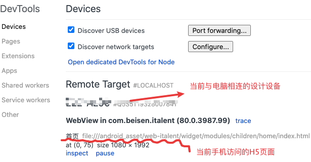
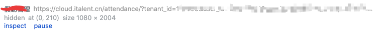

#### Chrome开发者工具

调试面板说明 Style 面板中，优先级越高的规则，排列越靠前 Style 面板中：
- 通过层叠规则被覆盖的 CSS 规则，使用**删除线**文本显示；
- **灰色**条目是未定义的规则，在运行时被计算样式取代了，不是继承的 Style  (注：可以理解为无效的样式规则)；
- computed 面板中灰色的 CSS 属性表示该属性未在 Style 面板中定义(包括默认的属性)；
- [Chrome 移动端调试地址](chrome://inspect/#devices) 


----

#### [H5 移动调试全攻略](https://mp.weixin.qq.com/s/kaPGHiGI-ljPJQ5pqxE-5A) 

1.`Safari`：`iPhone` 调试利器，查错改样式首选；
2.`iOS` 模拟器：不需要真机，适合调试 `Webview` 和 `H5` 有频繁交互的功能页面；
3.`Charles`： `Mac OS` 系统首选的抓包工具，适合查看、控制网络请求，分析数据情况；
4.`Fiddler`：适合 `Windows` 平台，与 `Charles` 类似，查看、控制网络请求，分析数据情况；
5.`Spy-Debugger`：移动端调试的利器，便捷的远程调试手机页面、抓包工具；
6.`Whistle`：基于 `Node` 实现的跨平台 `Web` 调试代理工具；
7.`Chrome Remote Devices`：依赖 `Chrome` 来进行远程调试，适合安卓手机远程调试静态页；
8.`localhost` 转 `ip`：真机调试，适合远程调试静态页面；
9.`vConsole`：内置于项目，打印移动端日志，查看网络请求以及查看 `Cookie` 和 `Storage`；


#### 代理调试

- [zan-proxy](https://youzan.github.io/zan-proxy/)  

#### [移动端真机调试](https://mp.weixin.qq.com/s/GIVylU3poibE-vIg6sLy9w) 

- chrome inspect应用场景有限。
- weinre调试
- spy-debugger调试


#### Chrome 调试

- console输出支持4种占位符：`%o d s f c`-->对应4种类型的数据：对象、整数、字符串、浮点数和css样式

  如：`console.log('对象：%o,  %c整数：%d',  {name:'czl'},   'color: yellow', 23);` 
  `%c` 之后的文本使用指定的css样式输出；

- `console.group()` 和 `console.groupEnd()` 开启和关闭输出块；

1. 清除指定代码位置之前的console并且屏蔽之后的console

   - 清除控制台之后的console.log、warn等输出：console.clear();

   - 屏蔽console.log：console.log = ()=>{}

2. chrome控制台中选中DOM元素

   - $('tagName') $('.class') $('#id') and $('.class #id') 等效于document.querySelector('')，返回与指定的CSS选择器相匹配的第一个元素；
   - $$('selector')：等效于document.querySelectorAll()，返回与指定的CSS选择器相匹配的所有元素的数组；
   - $0：

3. 查看某个DOM元素的事件监听器
   
   - getEventListeners($(‘selector’)) 返回一个对象数组，其中包含绑定到该元素的所有事件。
   
   - getEventListeners($(‘selector’)).eventName[0].listener 
   
     如：getEventListeners($(‘firstName’)).click[0].listener：返回选中元素的点击事件的监听器；
   
4. 输出调用栈
   console.trace()
   
5. `console.dirxml($0)` 输出指定的节点包含的HTML

6. console.assert(a===b, a);  当条件判断为false时才输出

7. console.dir

```js
$ // 简单理解就是 document.querySelector 而已。
$$ // 简单理解就是 document.querySelectorAll 而已。
$_ // 是上一个表达式的值
$0-$4 // 是最近5个Elements面板选中的DOM元素
dir // 其实就是 console.dir
keys // 取对象的键名, 返回键名组成的数组
values // 去对象的值, 返回值组成的数组
copy($0) // 拷贝选中节点的HTML到剪贴板
```

7. `monitor(函数名)` 和 `unmonitor(函数名)` ：当指定的函数被调用时控制台输出一条消息

8. 在线编辑网页

   ```js
   document.body.contentEditable = true;
   ```

9. 获取DOM的事件处理程序

   ```js
   var listens = getEventListeners($("selector"))
   listens.click[0].listener.toString();
   
   monitorEvents("dom", ["click", "mousedown"])
   unmonitorevent("dom");
   ```


**参考**

- [灵活使用 console 让 js 调试更简单](https://juejin.im/post/5ca6bf5151882543fc5e3bb0) 


#### Whlstle

##### 命令

- w2 start/restart/stop
- w2 start -p <端口号>


使用log 功能打印日志

- /http://www.baidu.com/   log://


#### 移动端调试

- 前端 将远程页面代理到本机进行调试

- Charles 代理远程页面到本地，实际上访问本地资源。

   

- [移动端真机调试-凹凸实验室](https://aotu.io/notes/2017/02/24/Mobile-debug/index.html) **重点** 
  switchHost & Charles
  
- [前端页面调试](http://blog.ipalfish.com/?p=150) 
  - Charles 代理  & 移动端调试H5页面，
  - Android IOS 调试
  
- [抓包神器之Charles，常用功能都在这里了](https://cloud.tencent.com/developer/article/1032655) 

- [Charles抓包](https://juejin.im/post/5b4f005ae51d45191c7e534a#heading-20) 

   [一、安装与使用](#一安装与使用)

  [二、抓手机的请求包](#二抓手机的请求包)

  - [http请求抓包](#http请求抓包)
  - https请求抓包
    - [iPhone手机抓https包](#iphone手机抓https包)
    - [安卓（小米）手机抓https包](#安卓小米手机抓https包)

  [三、用本地文件替换线上文件](#三用本地文件替换线上文件)

  - [替换测试环境的文件](#替换测试环境的文件)
  - [替换生产环境的文件（跨域）](#替换生产环境的文件跨域)

  [四、其他](#四其他)

  - [筛选指定域下的请求](#筛选指定域下的请求)

  [参考文档](#参考文档) 

  

- [Charles代理到本地](https://juejin.im/post/5bd673dc6fb9a05ce46a1333) 

- [Charles使用](https://ningyu1.github.io/site/post/84-charles/) 

- https://juejin.im/post/5ad045d2f265da2385334555

> 需要注意的是，Chrome 和 Firefox 浏览器默认并不使用系统的代理服务器设置，而 Charles 是通过将自己设置成代理服务器来完成封包截取的，所以在默认情况下无法截取 Chrome 和 Firefox 浏览器的网络通讯内容。如果你需要截取的话，在 Chrome 中设置成使用系统的代理服务器设置即可，或者直接将代理服务器设置成 127.0.0.1:8888 也可达到相同效果。

##### 总结

**1.使用Chrome调试App中的WebView页面** 

- 将手机与电脑相连，并且打开手机的‘usb 调试’，然后在chrome中使用`chrome://inspect/` 查看页面DOM
  1. remote target中显示当前手机
  2. 手机上打开App调试包，调试包中包含了一段代码，有这段代码Chrome才能检测到WebView页面，
  3. 手机进入页面后`chrome://inspect/`中会显示该页面
      

**2.使用代理让手机访问本地页面，然后进行调试** 


#### Vscode调试

launch.json

参考：https://www.barretlee.com/blog/2019/03/18/debugging-in-vscode-tutorial/ 

```json
{
  "name": "调试 Node.js 程序",
  "type": "node",
  "request": "launch",  //launsh | attach
  // request，必填项，有两种类型，分别是 launch 和 attach，前者的意思就是 VSCode 会打开这个程序然后进入调试，后者的意思是你已经打开了程序，然后接通 Node.js 的内部调试协议进行调试
  
  "program": "${workspaceFolder}/src/index.js" //程序的启动入口；
  
  /*
  除了使用program字段指定程序入口，
  还可以使用runtimeExecutable 和 args 启动程序
  "runtimeExecutable": "node",  使用什么命令启动
  "args": [  启动时的参数
    "${workspaceFolder}/src/index.js"
  ]
  */
}
```


launch.json
```
{
  "type": "node",
  "request": "launch",
  "runtimeExecutable": "node",
  "runtimeArgs": [
    "-r",
    "ts-node/register"
  ],
  "args": [
    "${workspaceFolder}/src/index.ts"
  ]
}
```

`runtimeArgs` 是为 `runtimeExecutable` 环境提供的配置，而 args 是为程序提供的配置。这个 JSON 的意思是：通过 node 来启动 `/src/index.ts`，在启动时为 node 注入一个 `ts-node/register` 模块，以便可以执行 ts 类型的文件。实际执行代码为：`node --inspect-brk=DEBUG_PORT -r ts-node/register ./src/index.ts` 

###### 属性解释

- `${workspaceFolder}` ：给出工作区文件夹的根路径
- `${file}`在活动编辑器中打开的文件

#### 配置

##### [Theme Color](https://code.visualstudio.com/api/references/theme-color) 


#### [ios调试](https://wiki.beisen-inc.com/pages/viewpage.action?pageId=230067462) 

- [使用Safari进行UIWebView的调试](https://mp.weixin.qq.com/s/6pYUMtf_7fM_1Zg7qrNIAA) 


----

#### Android & Chrome调试移动端页面

**思路**

调试App中的H5页面时，首先要让App访问的资源从远程服务器转向本地，然后将手机与电脑通过数据线连接，使用Chrome的提供的`chrome://inspect/#devices`工具进行调试。调试步骤如下：

1. 打开手机上的"usb调试"选项，打开该选项后，当手机与电脑相连后才能在Chrome的`chrome://inspect/#devices`页面上查看到当前设备

2. 手机上安装需要调试的App的**调试包**，打开App内的H5页面后就能在Chrome上看到对应的页面路径
    

   - 上图中首页路径为`file://android_asset/xxx/index.html`，`file`协议说明打开的是手机内的本地页面，如果打开的远程页面则显示如下：
      

本地页面和远程页面的调试方式不同，以下分别介绍：

- **调试远程页面**：远程页面包含的html、js等资源是在本地开发完成后部署到远程服务器上，手机也是访问远程服务器上的资源，所以不需要使用手机进行真机调试，不用将手机与电脑相连，调试步骤如下：

  - 本地运行项目代码，比如：`npm run start`，该命令通常会运行一个webpack服务器(或者其他服务器)，
     

    比如现在这个项目运行在本地的3000端口，在浏览器中通过`http://0.0.0.0:3000/`、`http://127.0.0.1:3000/`和`http://localhost:3000/`都能访问到该项目。（[`0.0.0.0`、`127.0.0.1`和`localhost`之间的区别](https://juejin.im/post/5d258b6ae51d454f73356dcf)） 。

  - 项目中如果有请求远程服务器上的数据时，通过`localhost:3000`和ip地址作为url访问项目存在跨域问题，所以需要配置nginx进行代理，步骤如下：

    - 在本地电脑上安装并运行nginx(nginx是一款服务器)，安装成功后在终端输入`nginx -v`会显示nginx 的版本。

    - 修改nginx配置文件，该配置文件一般在`/usr/local/etc/nginx/nginx.conf` ，找不到的话可以在终端输入`find / -name 'nginx.config'` 查找文件位置。

    - nginx的详细配置见https://zhuanlan.zhihu.com/p/31202053，此处只对用到的几个字段说明

      ```
      server {
          server_name abc.link; // 不能随便取，为了能解决跨域，需要填写指定的名字
          listen 80;
          root /xxx/xxx;
      
          location / {
              proxy_pass http://127.0.0.1:3000/;
          }
      }
      ```

      上述是一个nginx.config文件中的一个server区块，nginx配置文件中的一个server区块表示一个虚拟服务器，配置文件中可以包含多个server块。`server_name abc.link;` 表示这个虚拟服务器的名字是`abc.link`，我们在浏览器中输入url时其中的域名部分就是`abc.link`；`listen 80;`表示服务器监听的80端口，所以在url中的端口就是80(可省略)，`root`指定了项目所在根目录，`location`对应url中的路径部分，`proxy_pass`表示代理到`http://127.0.0.1:3000/`地址。

      总结：上述配置的效果就是，当我们在浏览器中输入`http://abc.link/` 时，浏览器实际访问的是`http://127.0.0.1:3000`，该地址就是执行`npm run start`时开启的本地项目所在地址。

    - 在浏览器中输入url时，浏览器会根据对url中的域名进行解析得到域名对应的服务器ip地址，然后才能访问服务器上的资料。因为nginx服务器运行在本地电脑上，所以要让abc.link指向本机的ip(127.0.0.1)。所以设置SwitchHost为：`127.0.0.1  abc.link`。
  
- **调试本地页面** 

  - 本地页面随App一起安装到手机，不需要网络也能访问，本地页面的路径如：`file://xxx/xxx`，

  - 调试本地页面需要将手机和电脑相连，然后对手机进行代理，把手机访问的资源指向电脑本地资源路径，步骤如下：

    1. 运行Charles，手机和电脑在同一个局域网下，连接同一个WiFi。进入Proxy--->Proxy Settings设置代理，

    2. 修改手机网络，设置代理，'服务器主机名'填写电脑IP地址，端口与Charles设置的端口一致，

    3. 配置nginx，指定电脑上项目所在路径

       ```
       server {
           server_name appdebug.italent.link;
       		listen       80;
           
           # talent-core
           location /new-italent-app {
               add_header Cache-Control "no-cache, no-store, must-revalidate";
               
               # new-italent-app的父级目录：
               root /Users/beisen/workspace/beisen/italent-app;
               autoindex on;
           }
       }
       ```

    4. 手机安装调试包，进入App，然后在`chrome://inspect/#devices`页面上就能看到手机上当前页面的路径，点击inspect就能开始调试本地页面了。

