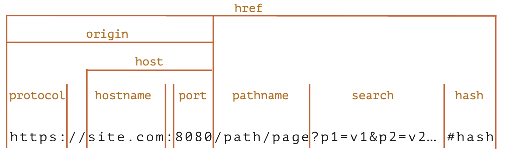
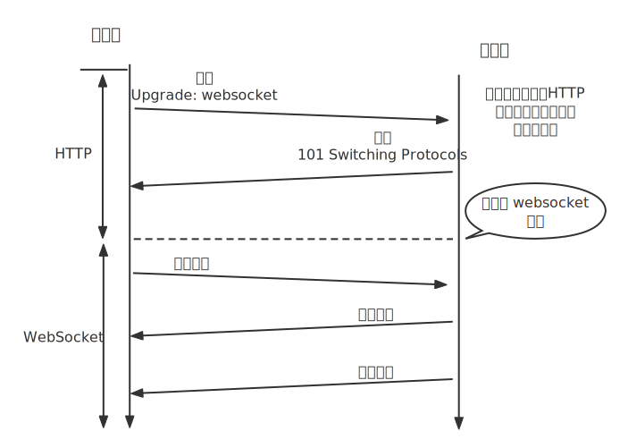
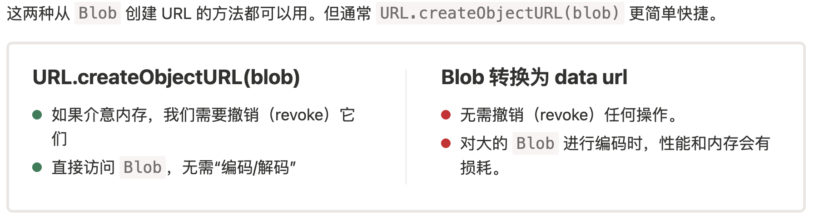

# 前端路由

前端路由是通过改变URL，在不重新请求页面的情况下，更新页面视图。改变URL且不会重载页面的方式：hash & H5 history.pushState replaceState

> HashHistory

- hash虽然出现在url中，但不会被包括在http请求中，它是用来指导浏览器动作的，对服务器端没影响，因此，改变hash不会重新加载页面。

- 可以为hash的改变添加监听事件：

  `window.addEventListener("hashchange",funcRef,false)`  

> TML5History

- pushState和replaceState两种方法的共同特点：当调用他们修改浏览器历史栈后，虽然当前url改变了，但浏览器不会立即发送请求该url，重载页面，这就为单页应用前端路由，更新视图但不重新请求页面提供了基础。
- 用户导航到新的状态，popstate事件就会被触发；


# 长列表(Table)渲染优化

> 方案

1. 虚拟列表：固定渲染一定数据的列表项

[vue-virtual-scroll-list 组件](https://github.com/tangbc/vue-virtual-scroll-list) 
[react-virtualized](https://github.com/bvaughn/react-virtualized) 

2. 懒加载

# [时区与JS中的Date](https://juejin.cn/post/6844903885505576968) 


# 事件循环

任务队列  宏任务（`macrotask  task job`）  微任务（`microtask`）执行栈  执行上下文。

event loop 负责调度和执行运行在线程中的每段代码。

有三种 event loop:
1. Window event loop
2. worker event loop：web workers、service workers、shared workers
3. worklet event loop


每个 `thread` 都有自己的事件循环，所以每个web worker都有自己的事件循环，所以它可以独立执行，而同源的所有窗口共享事件循环，因为它们可以同步通信。事件循环持续运行，执行排队的任何任务。事件循环有多个任务源，它们保证了该源中的执行顺序，但浏览器可以在循环的每次循环中选择从哪个源接收任务。这使得浏览器可以优先处理性能敏感的任务，例如用户输入。


- Q：执行微任务时又添加新的微任务到队列中，新添加的微任务什么时候执行？
  - 如果一个微任务通过调用 queueMicrotask() 将更多的微任务添加到队列中，这些新添加的微任务将在下一个任务运行之前执行。这是因为事件循环会一直调用微任务，直到队列中没有剩余的微任务，即使不断添加新的微任务。

## 执行上下文 execution context

JS 代码运行在执行上下文中，有三种情况会创建新的执行上下文：
1. 全局上下文（global context）
2. 函数上下文，每个函数运行在自己的执行上下文中
3. `eval`

## 宏任务 | 微任务

**宏任务、微任务保存在不同的队列中** 

1. 从 宏任务 队列（例如 “script”）中出队（dequeue）并执行最早的任务。【直到执行上下文结束】
2. 执行所有 微任务：
3. 当微任务队列非空时，出队（dequeue）并执行最早的微任务。
5. 如果有变更，则将变更渲染出来。
6. 如果宏任务队列为空，则休眠直到出现宏任务。
7. 转到步骤 1。

任务队列中，在每一次事件循环中，`macrotask` 只会提取一个执行，而 `microtask `会一直提取，直到 `microsoft `队列为空为止。微任务队列清空后，浏览器执行需要的渲染和绘制（如果有变更）。

也就是说如果某个 `microtask` 任务被推入到执行中，那么当主线程任务执行完成后，会循环调用该队列任务中的下一个任务来执行，直到该任务队列到最后一个任务为止。而事件循环每次只会入栈一个 `macrotask`，主线程执行完成该任务后又会检查 `microtasks`队列并完成里面的所有任务后再执行 `macrotask` 的任务。

macrotasks: setTimeout, setInterval, setImmediate, I/O, UI rendering;
microtasks: process.nextTick, Promise, MutationObserver；

> 微任务有

1. Promise
2. MutationObserver
3. queueMicrotask


```js
setTimeout(function () {
  console.debug("0");
}, 0);

let p = new Promise((resolve) => {
  console.debug("1");
  resolve();
});
p.then(() => console.debug("2")).finally(() => console.debug("3"));

console.debug("4");
// 1 4 2 3 0

// =======================
function test() {
  console.clear();
  setTimeout(() => {
    timerFunc(300);
    console.log('200-setTimeout-1')
  });

  console.log(0);
  const p = Promise.resolve()
  const timerFunc = (count) => {
    p.then(() => console.log(count))
  }

  timerFunc(100);

  console.log(1);

  timerFunc(101);

  console.log(2);

  setTimeout(() => {
    console.log('400-setTimeout-2');
    timerFunc(500);
    console.log(401);
  });

  Promise.resolve().then(() => console.log(102));
}
test(); // 0 1 2 100 101 102 200-setTimeout-1 300 400-setTimeout-2 401 500
```

## 特殊情况

代码触发的事件（element.onclick 或 dispatchEvent）会同步执行，不会添加到宏任务队列中。

```html
<button id="btn">按钮</button>
<script>
const log = console.debug.bind(console);
const btn = document.getElementById('btn');

const handler = (type) => {
  log('handler');

  setTimeout(() => log('setTimeout'));

  Promise.resolve().then(function () {
    log('promise');
  });

  queueMicrotask(() => log('queueMicrotask'));
};
btn.addEventListener('click', handler);
btn.addEventListener('CusEvent', handler);

log('start');

// btn.dispatchEvent(new CustomEvent('CusEvent'));
btn.click();

log('end');
</script>
```

在 Chrome、Firefox、Safari 中测试结果
- 输出：start、handler、end、promise、queueMicrotask、setTimeout
- 注释 `btn.click` ，取消 `btn.dispatchEvent` 注释，输出同上

## 参考

- [事件循环-宏任务和微任务-javascript.info](https://zh.javascript.info/event-loop) 
- [In depth: Microtasks and the JavaScript runtime environment](https://developer.mozilla.org/en-US/docs/Web/API/HTML_DOM_API/Microtask_guide/In_depth) 
- [JS 运行机制-事件循环-阮一峰](http://www.ruanyifeng.com/blog/2014/10/event-loop.html)
- [这一次，彻底弄懂 JavaScript 执行机制](https://juejin.im/post/59e85eebf265da430d571f89)
- [JavaScript 运行机制--Event Loop详解](https://juejin.im/post/5aab2d896fb9a028b86dc2fd)
- [腾讯-从 setTimeout 谈事件循环](http://www.alloyteam.com/2015/10/turning-to-javascript-series-from-settimeout-said-the-event-loop-model/#prettyPhoto)


# 跨域访问

 

## [同源策略](https://developer.mozilla.org/en-US/docs/Web/Security/Same-origin_policy) 

来源于某个 Origin 的 document(html) 或 脚本能否访问其他 Origin 的资源（localStoreage、Cookie、静态资源、xhr接口等）。

**同源**：两个源相同，哪两个源？脚本所在的源和脚本要访问的资源所在的源。

XMLHttpRequest 和 Fetch 都必须遵守同源策略。

## 跨域网络访问

**哪些请求需要遵守CORS**

1. XMLHttpRequest 和 Fetch 请求
2. 字体：CSS 中使用 `@font-face` 跨域引用字体文件
3. WebGL texture
4. Images/video frames drawn to a canvas using drawImage().
5. CSS Shapes from images.

获取 JS 文件没有同源限制

> [跨域资源共享-MDN](https://developer.mozilla.org/en-US/docs/Web/HTTP/CORS) 
>
> [CORS-博客](http://www.ruanyifeng.com/blog/2016/04/cors.html) 

CORS is a part of HTTP that lets servers specify any other hosts from which a browser should permit loading of content.

跨源资源共享 (CORS) 是一种基于 HTTP 标头的机制，它允许 Origin-A 指示浏览器应允许 Origin-A 以外的其它 Origin 加载 Origin-A 中的资源。

出于安全性，浏览器限制脚本内发起的跨源 HTTP 请求。 例如，XMLHttpRequest 和 Fetch API 遵循同源策略。这意味着使用这些 API 的 Web 应用程序只能从加载应用程序的同一个域请求 HTTP 资源，除非响应报文包含了正确 CORS 响应头。

Web页面或应用部署(运行在A服务器/PC上)，用户浏览器请求A服务器上的页面进行访问，A服务器响应请求并返回页面，浏览器显示页面。

页面中的 JS 通过 XMLHttpRequest 请求A服务器上的数据时，浏览器不会阻止。但请求B服务器上(第三方)的数据时，浏览器会根据 B 服务器上的跨域配置判断是否运行当前页面获取资源。

浏览器安全策略会阻止该请求，B服务器甚至没有看到页面发出的请求。跨域是浏览器的限制，chrome 可以允许跨域，并且不需要修改服务端配置。

域名与对应的 ip之间通信也算跨域，因为一个ip对应的主机可以有多个网站，对应多个域名。

> 现象

客户端发出一个 XHR 请求，请求方法为 POST，请求头中 Content-Type: application/json。
在 Firfox 浏览器中会出现两次 XHR 网络请求：

- 1)：方法为 OPTIONS 的预计检请求，请求头中 Access-Control-Request-Method：POST，Access-Control-Request-Headers：content-type。
  响应200，没有与 `Access-Control-Request-*` 相关的响应头，浏览器报错：CORS 预检响应的 'Access-Control-Allow-Headers'，不允许使用头 'content-type'
- 2)：客户端发出的 POST 请求，没有与 `Access-Control-Request-*` 相关的响应头，请求失败。

- 解决办法，在服务端判断当请求为预检请求（OPTIONS）时，设置以下响应头部：
```javascript
resp.writeHead(200, {
  'Access-Control-Allow-Methods': 'POST, GET, OPTIONS',
  'Access-Control-Allow-Headers': 'Content-Type',
  'Access-Control-Allow-Origin': 'some client addre',
});
resp.end();
```

> 总结

- 从浏览器角度来看跨源请求可以分为两类：【安全请求/Simple request】和【其他请求】，<b style="color:red">安全请求要满足的[条件](https://developer.mozilla.org/zh-CN/docs/Web/HTTP/CORS#%E7%AE%80%E5%8D%95%E8%AF%B7%E6%B1%82)。</b>

- 【安全请求】始终是被支持的，浏览器不会发送【预检请求】。当尝试发送【非安全请求】时，浏览器会先发送一个【预检请求（preflight）】到服务端，询问服务端是否接受该请求。

- 跨域时，默认情况下，Javascript 只能访问以下安全的响应头不字段：Cache-Control、Content-Language、Content-Type、Expires、Last-Modified、Pragma。如果想访问其他响应头部字段，需要在服务端响应中设置类似 Access-Control-Expose-Headers: Content-Length,API-Key

- 如果一个请求跨域了，浏览器始终会在请求头中添加 `Origin: https://domain.com` 字段。所以，`Access-Control-Allow-Origin`  响应字段需要在每个跨域的接口中返回，`Access-Control-Allow-Methods`、`Access-Control-Allow-Headers` 只需要在预检请求中返回。


> 相关的响应头部字段

- [Corss-Origin-Resource-Policy](https://developer.mozilla.org/en-US/docs/Web/HTTP/Cross-Origin_Resource_Policy_(CORP)) : 跨域策略，可选值为: `same-origin`、`same-site`、`cross-origin` 
  - As this policy is expressed via a *[response header](https://developer.mozilla.org/en-US/docs/Glossary/Response_header)*, the actual request is not prevented—rather, the browser prevents the *result* from being leaked by stripping the response body.
  - During a cross-origin resource policy check, if the header is set, the browser will deny `no-cors` requests issued from a different origin/site.
- [Access-Control-Allow-Origin](https://developer.mozilla.org/en-US/docs/Web/HTTP/Headers/Access-Control-Allow-Origin): 允许某个源或所有源访问
  - 响应头部字段，标识 response 可以被哪些请求所在 Origin 访问。
  - 服务端收到请求时，检查 request header 的 Origin, 如果允许该 Origin，则设置响应中的 Access-Control-Allow-Origin 值为该请求的 Origin。
  - 请求中没有 `credentials` 字段时，服务端响应的 `Access-Control-Allow-Origin: *` 才有效。
  - 当请求是 `credentialed requests` 时，服务端必须指定 `Access-Control-Allow-Origin` 的值为 `*` 之外的明确值。
  - 如果服务端指定了具体的域名而非“\*”，那么响应首部中的 Vary 字段的值必须包含 Origin。这将告诉客户端：服务器对不同的源站返回不同的内容。

- Access-Control-Allow-Credentials
  将 XMLHttpRequest 的 withCredentials 标志设置为 true，从而向服务器发送 Cookies。如果服务器端的响应中未携带 `Access-Control-Allow-Credentials: true`，浏览器将不会把响应内容返回给请求的发送者。

- Access-Control-Expose-Headers：在跨源访问时，XMLHttpRequest 对象的 getResponseHeader() 方法只能拿到一些最基本的响应头，该字段允许 JS 访问额外的响应头部字段。
- Access-Control-Max-Age：指定了 preflight 请求的结果能够被缓存多久


> 实际测试

- 正常的浏览器
  - 【http-http】用 XSwitch 可以成功将一个 http://serve-a/x.js 资源重定向到公网的 http://serve-b/x.js 上，并且 `serve-b/x.js` 设置了 `Corss-Origin-Resource-Policy: same-origin`，但是不能重定向到本地的 Js 文件。
  - 【https-http】用 XSwitch 不能将 https://serve-a/x.js 资源重定向到公网的 http://serve-b/x.js 上，报错为：`This request has been blocked; the content must be served over HTTPS.`。
  - 【https-https】若 https://serve-b/x.js 没有配置跨域的响应头部，XSwitch 可以将 https://serve-a/x.js 可以重定向到 https://serve-b/x.js
- 命令行启动浏览器并允许跨域
  - 【https-http】用 XSwitch 可以将 https://serve-a/x.js 资源重定向到本地的 http://127.0.0.1:9001/x.js 上


`Access-Control-Allow-Headers: 'Origin, X-Requested-With, Content-Type, Accept'`


> 正常浏览器测试场景

**(1).** nginx 没有配置跨域相关的 header

- 公网 139.xx 服务获取 http://127.0.0.1:123/demo.js （失败，报错"CORS"，用命令行启动浏览器可以解决）
- 公网 139.xx 服务获取 http://47.xx:8010/demo.js  **（成功）** 
- 127 服务获取公网 http://139.xx.xx/demo.js （成功）
- test.dev.host 服务获取 http://139.xx.xx/demo.js   test.dev.host 解析到127（成功）
- 总结
  - 本地127 或配置域名的 web 服务可以获取其他公网上的 Js 文件，公网不能获取本地 Js 文件，但另一位公网 Nginx 没有配置CORS时，从一个公网可以访问另一个公网的 Js 文件。
  - 一个公网访问跨域获取另一个公网服务商的图像


**(2).** nginx 配置跨域相关的 header

只配置 `Corss-Origin-Resource-Policy: same-origin` 没什么变化

## 跨域请求携带Cookie

默认情况下，跨域请求不会携带 Cookie，如果服务端需要 Cookie 或 HTTP Authentication 进行身份认证，则需要在客户端和服务端进行相关设置。

客户端使用 XMLHttpRequest 发送请求时
```js
xhr.withCredentials = true;
```

CORS 预检请求不能包含凭据，预检请求的响应必须指定 `Access-Control-Allow-Credentials: true` 来表明可以携带凭据进行实际的请求。

非预将请求的跨域请求，服务端设置响应头部字段：Access-Control-Allow-Credentials：true。浏览器会拒绝响应头中没有该配置的所有响应，不会将响应内容返回给 web content。

当服务端响应一个附带身份认证的跨域请求时，Access-Control-Allow-Origin 只能设置为一个明确的 Origin，Access-Control-Allow-Headers 和 Access-Control-Allow-Headers 也不能使用通配符，必须指定为明确的属性值列表。当 Access-Control-Allow-Origin 设置为某个明确的值时，该值可能会随着请求地址变化，这时响应头部的 Vary 字段应该包含 `Origin` ，以此来告诉客户端服务端对不同的 Origin 返回不同的响应。

**注意：**跨域请求的请求头中携带的 Cookie 是请求URL所在 Origin 的 Cookie，不是 web 页面所在 Origin 的 Cookie。这种情况同样遵守第三方 cookie 策略，如果浏览器禁用了第三方 cookie ，那响应中的 Set-Cookie 不会保存。


## 解决方案

1. JSONP：Js 文件可以跨域访问。通过动态创建 script，再请求一个带参网址实现跨域通信，通过 `<script>` 标签，在 url 中指定 callback 回调函数，当响应到来时调用回调函数，数据就是传递给回调函数的实参。

```js
function handle(response){
  console.log(response);
}
let script = document.createElement('script');
script.src = 'http://xxx.com/?callback=handle';
document.body.insertBefore(script, docuent.body.firstChild);
```

缺点：只支持 GET请求

2. CORS：跨域资源共享(Cross-origin resource sharing)，服务端设置 Access-Control-Allow-Origin 即可，前端无须设置，若要带 cookie 请求，前后端都需要设置。
   CORS 支持所有类型的请求方法；

3. postMessage 跨域：可以跨域操作的window属性之一，配合 iframe。
4. 代理跨域：起一个代理服务器，实现数据的转发；
5. document.domain + iframe 跨域：两个页面都通过 JS 强制设置 document.domain 为基础主域，就实现了同域。
  - 只支持主域相同，子域不同；
6. location.hash + iframe 跨域：a欲与b跨域相互通信，通过中间页c来实现。 三个页面，不同域之间利用 iframe 的 location.hash传值，相同域之间直接js访问来通信。
7. window.name + iframe 跨域：通过 iframe 的 src 属性由外域转向本地域，跨域数据即由 iframe 的 window.name 从外域传递到本地域。

## 参考

- [跨域，你需要知道的全在这里](https://juejin.im/entry/59feae9df265da43094488f6) 
- [跨域资源共享 CORS 详解 - 阮一峰的网络日志](https://www.ruanyifeng.com/blog/2016/04/cors.html) 
- [浏览器同源策略-postMessage](http://www.ruanyifeng.com/blog/2016/04/same-origin-policy.html) 
- [CORS 跨域发送 cookie](https://harttle.land/2016/12/28/cors-with-cookie.html#) 
- [Referrer Policy 的用法](https://www.ruanyifeng.com/blog/2019/06/http-referer.html) 
  1. 客服端：withCredentials=true;
  2. 服务端：Access-Control-Allow-Credentials=true; Access-Control-Allow-Origin: 单一域名

```js
access-control-allow-credentials: true
access-control-allow-headers: Content-Type
access-control-allow-origin: https://127.0.0.1:8087
```


# 网络请求

## XMLHttpRequest

> [长轮询、WebSocket、Server Sent Event](https://zh.javascript.info/network) 

**fetch 无法跟踪上传进度，跟踪下载进度需要知道响应头中的 `Content-Length`，使用 `XMLHttpRequest` 不存在这两个问题。** 


1. **XMLHttpRequest 实例的属性**

- readyState：xhr 的状态，0-4；
  - 0：unsent 未初始化，未调用open；
  - 1：opened，已建立服务器链接；【请注意，`open` 调用与其名称相反，不会建立连接。它仅配置请求，而网络活动仅以 `send` 调用开启。】调用 xhr.open 之后 readyState 表为 1，调用 send 之后也是 1
  - 2：headers_receive，接收到 response header；
  - 3：loading，接收到一个数据包，响应正在加载；
  - 4：done，完成，请求已完成；

- onreadystatechange：xhr的状态更新时触发该事件；
- onloadstart、onprogress、onload、onerror、ontimeout：通信的进度事件；
- status：HTTP 响应状态码；
- statusText：HTTP 响应状态说明；
- response\responseText：响应内容； 

> **事件**

| 事件名（按生命周期排序） | 描述                                                         |
| ------------------------ | ------------------------------------------------------------ |
| readystatechange         | readyState 属性变化时触发，除了变为 0（UNSENT）时            |
| loadStart                | 请求开始                                                     |
| progress                 | 一个响应数据包到达。在下载响应期间定期触发，报告已经下载了多少（Transmitting data.）<br> xhr.upload.onprogress 监听上传进度 |
| abort                    | 调用 `xhr.abort()` 取消了请求。                              |
| error                    | 发生连接错误，例如，域错误。不会发生诸如 404 这类的 HTTP 错误 |
| load                     | 请求成功完成                                                 |
| timeout                  | 由于请求超时而取消了该请求（仅发生在设置了 timeout 的情况下） |
| loadend                  | 在 `load`，`error`，`timeout` 或 `abort` 之后触发。          |

- error，abort，timeout 和 load 事件是互斥的，其中只有一种可能发生。readystate 的监听器在 onload、onerror、ontimeout 等之前执行。
- 下载进度 xhr.addEventListener('progress', fn)
- 上传进度 xhr.upload.addEventListener('progress', fn)，不是所有浏览器都支持

2. **使用**

- `xhr.open` 不会建立连接，仅配置请求，网络活动仅以 `send` 调用开启。
- `send` 会建立连接，并发送请求，调用 send 时 xhr 的状态必须是 1（OPENED）。
- 为了确保跨浏览器兼容，在 `open` 之前注册 `onreadystatechange` 事件监听器。
- setRequestHeader 必须在 open 方法之后，send() 方法之前；且 setRequestHeader 可以调用多次，最终的值采用追加得到。

```javascript
let xhr = new XMLHttpRequest();
xhr.onreadystatechange = function (){
  if(xhr.readyState == 4){
    if((xhr.status >= 200 && xhr.status < 300) || xhr.status == 304){
       result = xhr.responseText;
		}
  }
}
// 保证这些方法一定要是大写字母，否则其他一些浏览器（比如FireFox）可能无法处理这个请求
xhr.open('GET', url);
xhr.send(null);
```

3. **x-www-form-urlencoded  和 multipart/form-data 的区别**

- application/x-www-form-urlencoded 是默认的 Content-Type，这种方式是将表单中的数据编码成一个字符串（key1=val&key=val），再在 HTTP 请求的 body 中发送。它适用于表单中的数据量较少的情况，因为这种方式的数据会被编码成 URL 的参数形式。

- multipart/form-data 是一种将表单数据分割成多个部分发送的方式。这种方式适用于表单中的数据量比较大或者需要在表单中包含文件上传控件的情况。

- 在使用 multipart/form-data 时，表单数据会被分成多个部分，每个部分之间用分隔符隔开。每个部分由一个头信息和数据两部分组成，头信息中包含了数据的类型和编码方式等信息。
```javascript
// Create a new FormData object
var formData = new FormData();

// Append a file to the FormData object
formData.append('file', fileInput.files[0]);
// Append some text fields to the FormData object
formData.append('field1', 'value1');
formData.append('field2', 12344);

// Create a new XMLHttpRequest object
var xhr = new XMLHttpRequest();

// Open the connection and set the HTTP method to POST
xhr.open('POST', '/upload');

// 使用 XMLHttpRequest 或 Fetch API 和 FormData 发送 Content-Type 为 `multipart/form-data` 的 POST 请求时，不要在请求中明确设置 Content-Type
// 这样做会阻止浏览器使用边界表达式设置 Content-Type 标头，它将用于分隔请求正文中的表单字段。
// xhr.setRequestHeader('Content-Type', 'multipart/form-data');
xhr.send(formData);
```

4. **其他**

- [XMLHttpRequest Level 2 使用指南](http://www.ruanyifeng.com/blog/2012/09/xmlhttprequest_level_2.html) 

- 通常，当一个文档被卸载时（unloaded），所有相关的网络请求都会被中止。但是，keepalive 设置为 true 时，即使在离开页面后，也要在后台执行请求。所以，此选项对于我们的请求成功至关重要。

- 需要<b style="color:red">跟踪上传进度</b>时，那么我们应该在 xhr.upload 对象上监听 progress 事件，该事件在数据<b style="color:red">被发送</b>时触发，但是服务器是否接收到了？浏览器并不知道。

  - 或许它是由本地网络代理缓冲的（buffered），或者可能是远程服务器进程刚刚终止而无法处理它们，亦或是它在中间丢失了，并没有到达服务器。这就是为什么此事件仅适用于显示一个好看的进度条。
  - 要恢复上传，我们需要 **准确** 知道服务器接收的字节数。而且只有服务器能告诉我们，因此，需求额外的请求查询。


## [WebSocket](https://zh.javascript.info/websocket) 

> 浏览器与服务器进行全双工通信，可相互发送任意格式的数据。

WebSocket 没有跨源限制，可以发送/接收字符串和二进制数据。

WebSocket 建立在 HTTP 基础上，连接的发起方是客户端，WebSocket 连接建立后希望一直保持连接状态。

要实现 WebSocket 通信，在 HTTP 连接建立之后需要完成一次握手步骤：



<p align="center">WebSocket 通信</p>

> WebSocket API

```js
// websocket url 格式: ws://example.com/  wss://example.com/
const socket = new WebSocket('ws://game.example.com:1200/xx');
socket.onopen = function() {
  setInterval(() => {
    if (socket.bufferedAmount === 0) {
      socket.send('xxxx');
    }
  });
};
```

## [Server Sent Events](https://zh.javascript.info/server-sent-events) 

> EventSource

Server-Sent Events 规范描述了一个内建的类 EventSource，它能保持与服务器的连接，并允许从中接收事件。与 WebSocket 类似，其连接是持久的。但是两者之间有几个重要的区别：

| WebSocket                        | EventSource              |
| -------------------------------- | ------------------------ |
| WebSocket 协议                   | 常规 HTTP 协议           |
| 双向：客户端和服务端都能交换消息 | 单向：仅服务端能发送消息 |
| 二进制和文本数据                 | 仅文本数据               |

在很多应用中，`WebSocket` 有点大材小用，在简单场景下使用。

它还支持自动重新连接，而在 `WebSocket` 中这个功能需要我们手动实现。此外，它是一个普通的旧的 HTTP，不是一个新协议。

**限制**：HTTP/1 协议，一个激活状态的浏览器窗口最多只能有 6 个标签页连接到同一个服务，HTTP/2 增加到 100 tabs

## [长轮询](https://zh.javascript.info/long-polling) 

客户端发起一个请求，服务端挂起该请求，当需要发送新数据给客户端时返回响应并关闭连接。客户端收到响应后立即再发送一个请求，依次循环。

与 Server Sent Event 的区别，长轮询一个连接中服务端只能发送一次消息，Server Sent Event 可以在一个连接中多次发送消息。

# [cookie](https://developer.mozilla.org/en-US/docs/Web/HTTP/Cookies) 

> https://zh.javascript.info/cookie

服务器收到客户端的 HTTP 请求时，可以在响应头部中添加 `Set-Cookie`，浏览器会保存 Cookie 值并且在之后客户端向<span style="color:red">同一个服务器</span>发送 HTTP 请求时将 Cookie 值随请求头部发送到服务端。

Set-Cookie 时针对某个 Cookie 键值对的设置：
- 设置 Cookie 的有效时间 => Session、Expires、Max-Age
- 限制 Cookie 访问 =>`Secure`、`HttpOnly` 属性。Secure 标识当请求是 HTTPS 时才发送给服务端；HttpOnly 禁止 JS 读写 Cookie。
- 使用范围，哪些请求 URL 可以携带 Cookie =>Domain、Path、SameSite
  - 默认 Domain 是 Set-Cookie 的那个 Host（不含子域名），Domain 的值必须包含设置该 Cookie 的服务器的域名（如服务器的域名为 bb.aaa.com，Domain 的值为 aaa.com）。若设置 Domain 为某个域名A，域名A的子域也可以访问 Cookie。

- 哪些跨站(协议+域名)请求可以携带 Cookie => SameSite。
  - 网站A的页面上有个 `<a>` 标签链接到网站B，SameSite 设置为 Strict 的 Cookie 不会携带在请求头中，Lax 的 Cookie 会携带在请求头中。

**SameSite 属性**

当 SameSite 设置为 Strict 时，只有请求的 Initiator 与用户访问的页面的 Origin 相同时才会携带 Cookie。

## 第三方Cookie

如果一个 Cookie 的 Domain 属性值与用户访问的页面的协议+域名相同，该 Cookie 认为是 first-part cookie，否则视为第三方 cookie。
或 cookie 是由用户所访问的页面的域以外的域放置的，则称其为第三方 cookie。

第三方服务器可以根据同一浏览器在访问多个网站时发送给它的cookie创建用户浏览历史和习惯的配置文件。

# [本地存储](https://zh.javascript.info/data-storage) 

> Web 全局存储、通信


# 类型化数组 | ArrayBuffer

> 参考

[javascript.info](https://zh.javascript.info/arraybuffer-binary-arrays) 
[类型化数组-mdn](https://developer.mozilla.org/en-US/docs/Web/JavaScript/Typed_arrays) 


# [二进制数据&文件](https://zh.javascript.info/binary)

- File 类是 Blob 的子类
- Blob 可以转换为 data-url、字符串、ArrayBuffer、Stream。

1. **预览用户上传的图像**

```js
const img = document.createElement("img");
// ? fetch the images for actual upload later. 不知道有什么作用
img.file = file;

const reader = new FileReader();
reader.onload = (e) => {
  // base64 格式
  img.src = e.target.result;
};
reader.readAsDataURL(file); // File 类型

// 或者
// blob:http://host/xxx
img.src = URL.createObjectURL(file);
img.height = 60;
img.onload = () => {
  URL.revokeObjectURL(img.src);
}
```


2. **下载文件**
```js
const files = e.target.files;
const a = document.createElement('a');
a.href = URL.createObjectURL(files[0]);
a.download = `test-${files[0].name}`;
a.click();
URL.revokeObjectURL(a.href);
```

- 根据动态内容创建下载链接

```js
let link = document.createElement('a');
link.download = 'hello.txt';

let blob = new Blob(['Hello, world!'], {type: 'text/plain'});
link.href = URL.createObjectURL(blob);

link.click();
URL.revokeObjectURL(link.href);
```

- URL.createObjectURL 和 new FileReader().readAsDataURL 创建下载链接的区别

 


3. **FileRead**
> 异步读取文件或 raw data bufffers 的内容

- 读取文本文件的内容
```js
const file = e.target.files[0];
const reader = new FileReader()
reader.onload = (evt) => {
  console.debug(evt.target.result);
};
reader.readAsText(file);
```

4. **二进制转换为字符串**
> TextDecoder 和 TextEncoder

5. **[Stream](https://developer.mozilla.org/en-US/docs/Web/API/Streams_API)**

当我们需要处理大型 blob 时，将其转换为 stream 非常有用。你可以轻松地从 blob 创建 ReadableStream。Blob 接口的 stream() 方法返回一个 ReadableStream，其在被读取时返回 blob 中包含的数据。

```js
// 从 blob 获取可读流（readableStream）
const readableStream = blob.stream();
const stream = readableStream.getReader();

while (true) {
  // 对于每次迭代：value 是下一个 blob 数据片段
  let { done, value } = await stream.read();
  if (done) {
    // 读取完毕，stream 里已经没有数据了
    console.log('all blob processed.');
    break;
  }

  // 对刚从 blob 中读取的数据片段做一些处理
  console.log(value);
}
```


# 捕获异步错误

https://juejin.im/post/6844903830409183239#heading-4  

Promise 中 throw 的错误，无论是在构造函数中的同步代码还是在 then 回调中的异步代码都只能被 promise.catch 捕获，不能被外层的 `try-catch` 捕获。

reject 返回的错误也只能被 promise.catch 捕获。

总之：promise 会吞掉自身产生的错误，只能通过 promise.catch 捕获这些错误。

  ```js
  const promiseFetch = () => {
    return new Promise(reslove => {
      throw new Error('promise 同步');
      // reslove();
    });
  };
  
  function main() {
    try {
      promiseFetch().then(() => {
        // throw new Error("promise.then 异步"); // 只能被promise.catch 捕获
      }).catch(e => {
        console.debug('promise.catch e:', e);
      });
    } catch (e) {
      console.debug('try-catch e:', e);
    }
  }
  
  main();
  ```

### 利用Promise捕获异步错误  

> 当异步代码发生错误时，通过 reject 抛出错误，然后用 promise.catch 捕获错误。

```js
const p3 = () =>  new Promise((reslove, reject) => {
  setTimeout(() => {
    reject('async error');
  })
});

p3().catch(e => console.log(e));
```

# 搜索高亮
[单关键词、多关键词、多组多关键词](https://juejin.cn/post/6844903747944972295#apply) 


# 移动端

## 设备检测

- 是否是移动端

```js
isTouch = "ontouchstart" in window || navigator.msMaxTouchPoints;

const touchSupported = () => {
  return !!('ontouchstart' in window || window.DocumentTouch && document instanceof window.DocumentTouch);
}
```

[current-device](https://github.com/matthewhudson/current-device) 
[device-detector-js](https://github.com/etienne-martin/device-detector-js) 
[移动端检测方法](https://www.ruanyifeng.com/blog/2021/09/detecting-mobile-browser.html)  


# [时间国际化-格式化](https://mp.weixin.qq.com/s/fepgCR4hikmMwIG3Fbb9gQ) 


# 可视化

- [数据可视化 拓扑图](https://antv.vision/zh/) 
- [D3](https://observablehq.com/@d3/gallery) 
- [RATH](https://github.com/Kanaries/Rath/blob/master/docs/README-zh.md) 


# 图像编辑

- [图像编辑组件](https://github.com/scaleflex/filerobot-image-editor)
- [原生画图](https://developer.mozilla.org/zh-CN/docs/Learn/JavaScript/Client-side_web_APIs/Drawing_graphics)
- [fabricjs canvas api 封装](http://fabricjs.com/articles/)


# 页面截图

- [html2canvas](https://github.com/niklasvh/html2canvas)


# 浏览器兼容性

[IE 链接下载失效](https://stackoverflow.com/questions/46232980/click-giving-access-denied-in-ie11) 

# mock

[mockjs](https://github.com/nuysoft/Mock) 