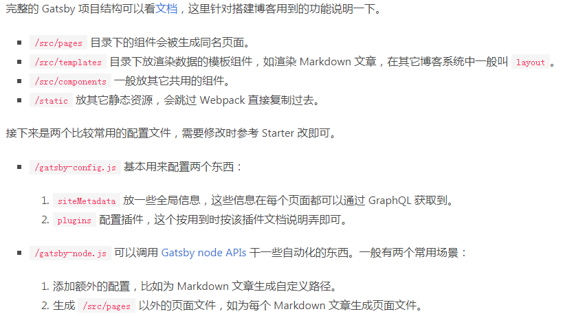

> Gatsby是一个基于 React 架构的静态站点生成器，可以让你体验React的所有优点。Gatsby有一个预先配置好的Webpack，使用它入门React会省下很多麻烦，此外Gatsby会根据你的目录结构自动生成路由。所有的HTML都会在服务器端渲染，弥补了客户端渲染的不足。

# 参考

- [Gatsby中文文档](https://www.gatsbyjs.cn/ )  
- [搭建 Gatsby-博客](https://blog.crimx.com/archives)    [Gatsby博客源码](https://github.com/crimx/blog-2019) 
- [starter](https://www.gatsbyjs.org/starters/email2vimalraj/gatsby-starter-tech-blog/) 
- [使用 Gatsby.js 搭建静态博客黑暗模式](https://mp.weixin.qq.com/s/NavizDLQXav-N2cYda8Bhg) 
- [Creating a Blog with Gatsby](https://www.gatsbyjs.com/blog/2017-07-19-creating-a-blog-with-gatsby/)  

# 环境搭建

- install Node and npm
- global install gatsby-cli:  `npm install -g gatsby-cli` 
- 创建项目：`gatsby new <dir> [starter]` 
- 运行服务器：`gatsby develop` 
- 然后在pages目录下添加.md文件就能自动生成新博客文章了。
  Gatsby 的核心自动把 `src/pages` 中的 React 组件转变为页面和 URL。比如：在 `src/pages/index.js` 和 `src/pages/about.js` 中的组件，会为网站的索引页（`/`）和 关于页（`/about`）自动创建基于文件名的页面。
  
- **命令** 
- npm i -g gatsby-cli
- gatsby new gatsby-blog https://github.com/gatsbyjs/gatsby-starter-blog (这里使用了gatsby官方提供的一个blog模板)
- 最后进入 gatsby-blog 文件夹，运行 gatsby develop
- 构建：gatsby build；Gatsby将为您的站点执行优化的生产构建，生成**静态HTML**和每个路由的JavaScript代码包。

**目录结构** 

  

# 部署
> Gatsby构建命令生成一个包含静态HTML和JavaScript文件的目录，您可以将其部署到静态站点托管服务中。

  - "gh-pages -d build"： Github 的 gh-pages 功能发布内容。
  - build 后push到username.github.io/repos的master分支;
  - 绑定域名：在项目的根目录新建`static` 文件夹，然后添加`CNAME`文件，写上自己的域名。
  - 域名解析：

[参考](https://www.gatsbyjs.com/docs/tutorial/part-one/#deploying-a-gatsby-site)  

# 布局组件

> 布局包括：页眉、页脚、侧边栏、导航栏

**利用两个插件实现 `.md` 到 `html` 的转换** 

- `yarn add gatsby-transformer-remark gatsby-source-filesystem`
- `gatsby-source-filesystem` (Source plugins) 获取数据， `gatsby-transformer-remark` (*transformer* plugins) 对 markdown 文件解析后会生成 `MarkdownRemark` 
- `gatsby-transformer-remark` 解析 Markdown 并获取文件里面的数据

**修改配置文件**

- gatsby-config.js

  ```javascript
  module.exports = {
    siteMetadata: {
      title: 'Gatsby Default Starter',
    },
    plugins: [
      'gatsby-plugin-react-helmet',
      // 添加以下两个插件，一个用于读取md文件，一个用于转换其为html
      'gatsby-transformer-remark',
      {
        resolve: 'gatsby-source-filesystem',
        options: {
          name: 'src',
          path: `${__dirname}/src`,
        },
      },
    ],
  }
  ```

- frontmatter
  `/page`目录下.md文件中的‘---’ 隔开的部分(frontmatter: 网站的基本资料)会被 `gatsby-transformer-remark` 插件识别，并保存到 `frontmatter` 部分。可以通过 graphql 查询并用于页面渲染

**模板**

- templates

  ```javascript
  //templates 模板
  import React from 'react';
  import Helmet from 'react-helmet';
  
  export default function Template({data}) {
    const {markdownRemark: post} = data;
    return (
      <div>
        <h1>{post.frontmatter.title}</h1>
      </div>
    )
  }
  ```

  参数 `data` 是由 GraphQL 传递进来的数据，也就是 Markdown 文件里面的内容。这些数据存放在markdownRemark变量当中，我们把它提取并存入post变量中，接着就可以透过`post.frontmatter.title` 使用 `frontmatter` 中的 `title` 内容。

**生成网页** 

- `/src/pages/*.js` 目录下的组件会自动生成相应路径的页面，但如果是其它类型的文件就不会了。

- 我们用 GraphQL 取得所有的文章，用 foreach 针对每一篇文章使用 createPage 建立新页面，这里则需要用到 path 和 postTemplate

  ```js
  createPage({
  	path: 页面对应的路由,
    component: 模板组件,
    context: {}, // 传递给模板组件的上下文 props.pageContext, 用户 graphql 的参数查询
  })
  ```

## 数据查询(GraphQL)

> Page queries live outside of the component definition — by convention at the end of a page component file — and are only available on page components.
>
> - page components: `src/pages/*.js` 目录下的组件
> - non-page components: 非 page components，如 Layout.js 不能使用 query 查询数据，改为 useStaticQuery

```
frontmatter {
	date(formatString: "DD MMMM, YYYY")
}

allFile {
	nodes {
		name
		relativePath
	}
}

allMarkdownRemark {
	edges {
	  node {
			html
			id
			frontmatter {
		  	title
			}
			parent {
		  	... on File {
				name
				relativePath
		  }
		}
	  }
	}
}
```

# 动态创建页面

> Gatsby 可以使用 GraphQL 查询数据并将查询结果映射为页面
>
> 步骤：
>
> 1. 查询数据
> 2. 数据映射为页面

当动态创建页面时，需要指定一个页面模板。

# API

- [`onCreateNode`](https://www.gatsbyjs.com/docs/reference/config-files/gatsby-node/#onCreateNode) 
- [`createPages`](https://www.gatsbyjs.com/docs/reference/config-files/gatsby-node/#createPages) 
