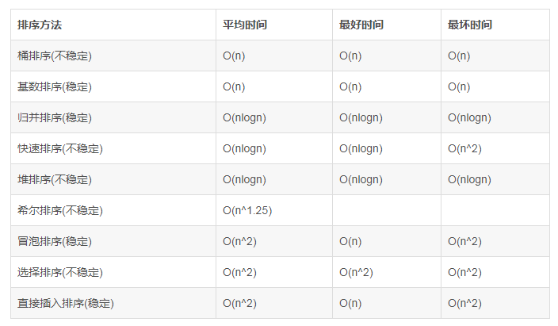

> 递归本质上就是一个栈结构

# 树

## 二叉树

> 二叉树：子节点个数最多为 2 个；

## 满树

```markdown
      d
    /   \
   b      f
  / \    / \
 a   c  e   g
```

## 完全二叉树

1. 除最后一层外，其他每层节点都是满的，最后一层从左向右填满二叉树
2. 如果树的深度为h，那么除了第 h 层，其他层的节点数都是满的，第 h 层有的节点数在 1 和 2h−1 之间。

```markdown
      1
    /   \
   2     3
  / \    /
 4   5  6
```


## 平衡二叉树

> 任意节点的左右子树的高度之差不大于1；


## 二叉查找树

二叉查找树：特殊的二叉树，左节点的值比其父节点的值小；此特性使二叉查找树的查找效率很高。 

遍历顺序：

1. 先序：先访问根节点--->左节点--->右节点；

```js
function preOrder(node, list = []){
 if(!node){
   list.push(node.val);
   preOrder(node.left, list);
   preOrder(node.right, list);
 }
}
```

2. 中序：先访问左节点--->根节点(根节点在中间)--->右节点；

```js
function inOrder(node){
  if(!node){
    inOrder(node.left);
    print(node.val);
    inOrder(node.right);
	}
}
// 使用循环
function inOrder(root) {
 let cur = root;
 let arr = [], stack = [];
 while(cur || stack.length>0){
   while(cur){      
     stack.push(cur);
     cur = cur.left;
   }
   cur = stack.pop();
   arr.push(cur.val);
   cur = cur.right;
 }
 return arr;
};
```

3. 后序：先访问左节点--->右节点--->根节点；

## 红黑树

红黑树（Red-Black Tree）是一种自平衡二叉搜索树，它通过在每个节点上添加一个存储位来确保树的平衡。这个存储位被称为“颜色”，它可以是红色或黑色。红黑树满足以下几个性质：

1. 每个节点都有一个颜色，要么是红色，要么是黑色。
2. 根节点是黑色的。
3. 每个叶子节点（NIL节点，空节点）都是黑色的。
4. 如果一个节点是红色的，则它的两个子节点都是黑色的。
5. 对于每个节点，从该节点到其所有后代叶子节点的简单路径上，均包含相同数目的黑色节点。

这些性质确保了红黑树具有良好的平衡性，使得其各种操作的时间复杂度都能够保持在 O(log n) 级别，其中 n 是树中节点的数量。因此，红黑树常常被用作实现集合、映射等数据结构的基础。


# 堆

堆是具有以下性质的**完全二叉树**：每个结点的值都大于或等于其左右子结点的值，称为大顶堆；

或者每个结点的值都小于或等于其左右孩子结点的值，称为小顶堆。


# 排序

排序一个长度为 n 的数组的时间复杂度是 O(nlogn)；

- 冒泡、选择、插入排序的耗时比较：冒泡 > 选择 > 插入；
- 高阶算法：希尔、归并、快速排序：
- 空间消耗、平均时间复杂度、最差时间复杂度；

[排序算法-动态图](https://blog.csdn.net/yushiyi6453/article/details/76407640) 

# 查找 

- 二分查找、哈希表查找、二叉查找树查找；
- 哈希表(散列表查找的时间复杂度是 O(1))

# 方法总结

1. 查找二维数组上的搜索路径：**回溯法**；
2. 某个问题的最优解，且该问题可以分解为多个子问题，子问题也存在最优解，如果将每个小问题的最优解组合可以得到目标问题的最优解，这类情况可以考虑使用**动态规划**；
3. 在某种特殊情况下可以得到目标问题的最优解：**贪心算法**； 




