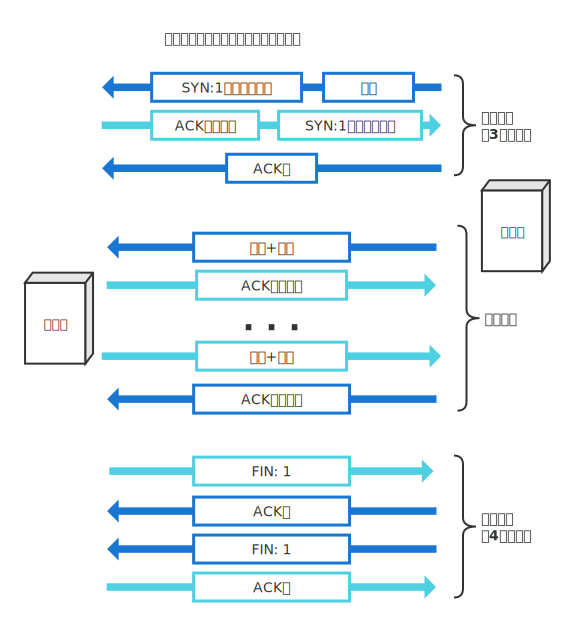
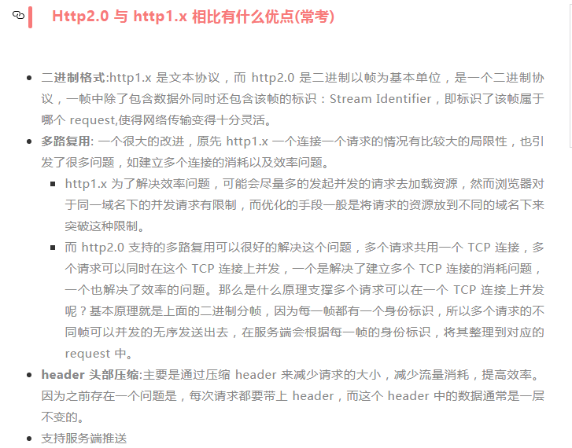

> - HTTP 协议是无状态的，不保留通信状态
> - TCP\IP 协议族按层次分别为：应用层(HTTP、FTP和DNS)、传输(TCP和UDP协议)、网络(IP协议)、数据链路层；
>- http 传输的数据都是未加密的，也就是明文的，网景公司设置了SSL协议来对http协议传输的数据进行加密处理，简单来说https协议是由http和ssl协议构建的可进行加密传输和身份认证的网络协议，比http协议的安全性更高。
> - HTTPS 的 SSL 加密是在**传输层**实现的；

# GET & POST 的区别

get和post虽然本质都是tcp/ip，但两者除了在http层面外，在tcp/ip层面也有区别。

浏览器实现上的区别：

- GET 利用 URL 携带参数，参数暴露，URL 长度有限制，进行 URL 编码，产生 1 个TCP 数据包；
- POST 长度没有限制，更加安全，支持多种编码方式，产生 2 个 TCP 包；
- 参数的传递：GET 使用 URL 或 cookie传递，POST使用body；
- 参数的长度：浏览器和服务端对 URL的长度有限制，HTTP协议没有限制参数的长度；
- GET可以被缓存，POST不能；

HTTP规范

- **幂等性**：同样的请求被执行一次与连续执行多次的效果是一样的，服务端的状态是一样的，没有副作用，幂等性只和服务端的状态有关；
- 在符合规范的情况下，GET、HEAD、PUT是幂等的；

PUT：使用请求中的负载创建或替换指定的资源；

参考：

- [HTTP协议详解-真的很经典](https://www.cnblogs.com/li0803/archive/2008/11/03/1324746.html)
- [HTTP 状态码](https://segmentfault.com/a/1190000018264501)


- [get & post的区别](https://mp.weixin.qq.com/s?__biz=MjM5NTEwMTAwNg==&mid=2650215796&idx=1&sn=37fe278e3afd9d185671521e1b3d5c12&chksm=befe155589899c43069f677ddf82f0148b700f1d22e987928b22428ccf3713dcc4286f1bef76&scene=0&key=2bb12b254a1b9904b99c3ffe46445fb36666779af33ad8645c57b2ed181b5a5ec645fcf932e6bec081a0fb951ec8d38b4d7f715e1ac2b86d1cdf3a0f974d5bae8b8bef9c428816cbd85b98ebf0b34f8d&ascene=1&uin=Mjc2NDI1NDU2NA%3D%3D&devicetype=Windows+7&version=62060720&lang=zh_CN&pass_ticket=Pn9cJyIWK2xt%2BmQltkMddf4S5oGoplFdiJ%2B16Yj6gD8L9Zd0WMlQ1u32%2FRJtZE1p)

# 状态码

- 200：OK 请求成功，一般用于 GET 和 POST；
- 304：Not modified 未修改，所请求的资源尚未修改，缓存可用，浏览器从缓存中获取数据；
- 301：永久重定向；
- 302：临时重定向；
- 304：Not Modified，GET 请求中带有 `If-Match\If-Modified-Since\If-None-Match\If-Range\If\UnModified-Since` 中任意一个字段，并且服务端资源未更新，可直接使用客户端**缓存**。
- 401：未认证
- 403：拒绝访问

# 缓存

> 缓存：指代理服务器或客户端将（用户）曾经访问过的数据保存在本地，当再次访问时拿来用。
>
> 一般的缓存服务器对于首次访问某个资源无效，并且每次访问都需要询问源web服务器（持有资源实体的服务器）资源是否更新。为了改善这点，一种方法是让web服务器每次资源更新时通知缓存服务器，使缓存服务器上的资源保持最新状态。内容分发（CDN）采用的缓存服务器具有这种功能。

## 缓存服务器

> 缓存服务器作为代理服务器的一种，部署在服务器端，当代理转发从服务器返回的响应时，代理服务器将会保存一份资源副本。
>
> 是否存在缓存？如何对数据进行缓存？
>
> 源服务器：保存了资源实体的服务器。

缓存服务器代替web服务器注册到DNS服务器中，用户客户端向缓存服务器发送请求。缓存服务器收到请求后判断（<span style="color:red">怎么判断？</span>）请求的数据是否已经保存在缓存中。

- 如果没有缓存数据，缓存服务器会以客户端的身份向web服务器发送请求。缓存服务器收到响应后将响应保存在缓存中（磁盘）并记录**保存的时间**，同时缓存服务器以服务器的身份将响应发送给用户客户端。
- 如果用户请求的资源在缓存服务器中有缓存数据，缓存服务器会添加一个`if-modefied-since`头部字段，字段的值就是上次保存的时间。然后缓存服务器将请求转发给web服务器。web服务器收到请求后根据`if-modefied-since`和资源的最后修改时间判断资源是否发生变化。如果数据没有变化web服务器会返回`304 Not Modified`。返回的消息到达缓存服务器后，缓存服务器就知道web服务器上的资源和本地缓存一样，就会将缓存的数据返回给用户。
- 如果web服务器根据`if-modefied-since`和资源的最后修改时间判断资源有变化，后续过程和没有命中缓存一样。

## 强缓存 & 协商缓存

> 缓存相关的字段：
>
> 通用字段：`Cache-Control`
>
> 实体字段：`Expires、Last-Modified`
>
> 请求字段中有：`If-Match、If-Modified-Since、If-Range、If-*、`
>
> 响应字段中有：`Etag`
>
> 请求和响应报文中都可以包含通用字段和实体字段

根据响应的 header 决定是哪种缓存；

强缓存：

- 在第一次请求资源时在http响应头设置一个过期时间，在时效内都将直接从浏览器进行获取，不发送请求，状态码为200；
- 强缓存相关字段有expires，cache-control，如果cache-control与expires同时存在的话，cache-control的优先级高于expires。
- expires：资源过期时间，服务端配置。

协商缓存：

- 发送请求到服务端，通过http响应头字段 **ETag** 或者 **Last-Modified** 等判断服务器上资源是否修改， 如果修改则从服务器重新获取，如果未修改则 **304** 指向浏览器缓存中进行获取；
- 协商缓存相关字段有Last-Modified/If-Modified-Since，Etag/If-None-Match

HTTP1.0

- 强缓存：Expires-以服务端时间为参考设置有效时间，服务端配置，Exprires的缺陷是必须保证服务端时间和客户端时间严格同步；
- 协商缓存：Last-Modified/If-Modified-Since(服务端/客户端)；

HTTP1.1

- 强缓存：Cache-Control: Max-Age，服务端配置，以客户端时间为参考，解决了客户端和服务端时间必须同步的问题；
- 协商缓存：Etag/If-None-Match：


> 缓存请求指令，如：Cache-Control: max-age:604800, no-cache

| 指令         | 描述                               |
| ------------ | ---------------------------------- |
| no-cache     | 强制向源服务器再次验证资源是否有效 |
| no-store     | 不缓存请求或响应                   |
| max-age=[秒] | 响应的最大Age值，缓存x秒后过期；   |

> 缓存响应指令，如: Cache-Control: private, no-store

| 指令     | 描述                       |
| -------- | -------------------------- |
| public   | 可向任意方提供响应缓存     |
| no-cache | 缓存前必须先确认其有效性   |
| no-store | 不缓存请求或响应的任何资源 |

> no-cache 和 no-store 的区别

- no-cache: 目的为了防止从缓存中返回过期资源
  - 强制要求缓存把请求提交给原始服务器进行验证，只使用协商缓存；不代表浏览器不缓存，而是在获取缓存前要向服务器确认资源是否被更改；
  - 请求中带有`no-cache` 时，中间的缓存服务器必须将客户端请求转发给源服务器
  - 响应中带有`no-cache` 时，缓存服务器不能对资源进行缓存 

- no-store: 禁止浏览器以及所有中间缓存存储任何版本的返回响应， 每次用户请求该资产时，都会向服务器发送请求，并下载完整的响应。

> Cache-Control: max-age:12333 & expires

- 请求中包含 max-age 时，如果判断缓存资源的缓存时间比指定的时间小，则返回缓存的资源，否则缓存服务器将请求转发给源服务器。
- 当响应中包含 max-age 时，表示响应中的资源保存为缓存的最长时间，并且缓存服务器不需要确认资源的有效性（向源服务器确认资源是否有效、更新）.
- 当 max-age 和 expires 同时存在时，HTTP1.1 优先处理 max-age 而忽略 expires，HTTP1.0 刚好相反。

> 条件请求
>
> 形如: `If-xxx` 的请求首部字段，源服务器收到附带条件的请求后，只有条件为真时，才会执行请求

- `If-Match:  xxx`，服务器对比字段值和资源的`ETag`值，当两者一致时执行请求，否则返回 412 响应。
- `If-Modified-Since: xxx`，如果在字段指定的日期之后 URI 对应的资源有更新，则服务器执行请求，否则返回 `304 Not Modified`。此时使用缓存服务器或客户端本地的缓存。资源的更新时间可以根据 `Last-Modified` 确定。

> 参考

- [浏览器缓存机制](https://mp.weixin.qq.com/s?__biz=MjM5NTEwMTAwNg==&mid=2650215884&idx=1&sn=0c014d58bee5b5fa5f357e23d456d5ed&chksm=befe15ed89899cfbc92c261fc5eb654cb3a8a6c6fac129ca4828ff1f10e1d36536aeac46b96a&scene=0&key=7a9b0290e45b2078b8b6f5dbd382511d3f9fbb0dd4c5d04f2760b44efa7d5197bbbbfa4ed1e2628017bfb681e01ed2e1e1419e5468205f1a35ea9a00503b089a3ddd778817c87b7b5baf251d7f9e7774&ascene=1&uin=Mjc2NDI1NDU2NA%3D%3D&devicetype=Windows+7&version=62060720&lang=zh_CN&pass_ticket=ykZiUCMsNd2S9UoFxD9hRE9rxPn7dK3oVQwLBFu%2FDuD60Ikn%2Fg9Ot5qQ8Vlo%2Bq11)
- [HTTP缓存-developers.google]([https://developers.google.com/web/fundamentals/performance/optimizing-content-efficiency/http-caching?hl=zh-cn#%E2%80%9Cno-cache%E2%80%9D%E5%92%8C%E2%80%9Cno-store%E2%80%9D](https://developers.google.com/web/fundamentals/performance/optimizing-content-efficiency/http-caching?hl=zh-cn#"no-cache"和"no-store"))


# TCP

> TCP的整体流程
>
> TCP头部格式
>
> - ACK: 表示接收数据序号字段有效，一般表示数据已被接收方收到
> - SYN: 发送方和接收方相互确认序号，表示连接操作
> - FIN: 表示断开连接

    

为了准确无误的将数据发送到目标处，TCP 协议采用了三次握手策略：

1. 客服端发送带有 SYN 标志的数据包给服务器；
2. 服务器接收数据后回复 ACK 表示可以收到数据，并同时发送一个带有 SYN 标志的数据包；
3. 客服端发送一个带 ACK 标志的数据包，表示可以收到对方的数据；

- 客户端：hello，你是server么？
- 服务端：hello，我是server，你是client么
- 客户端：yes，我是client

**四次挥手：**

> 因为是全双工的，所以需要四次挥手，断开连接可以由任意一方发起，HTTP1.0中是服务器发起，HTTP1.1中是客户端发起

- 主动方：客服端和服务器都可以主动发起挥手操作，发送 FIN 表明我的数据发送完了，但还可以接收数据；
- 被动方：收到通道关闭的信息，发送 ACK，我收到你发起的关闭请求；
- 被动方：数据发送完了后，发送 FIN 表明我的数据也发送完了；
- 主动方：发送 ACK ，启动定时器，等待一定时间，若没有接收到数据，表明对方已经关闭，于是自己也关闭连接；


# 建立连接 | 断开连接

> 建立连接（三次握手）
>
> 目的：通信双方交互控制信息，并确认双方是否能正常通信

1. 客户端发送一个只有头部信息没有数据的包，头部信息中的控制位 SYN 设置为1，ACK为0，并且带有一个序号初始值；SYN 代表发送方和接收方相互确认序号。
2. 服务端收到信息后，自身（某个套接字）状态改为正在连接，并返回一个带用SYN为1、ACK为1、带有序号初始值的响应，ACK表示数据已经收到。
3. 客户端收到SYN为1，表示连接成功，再发送一个ACK为置为1的包，告诉服务端成功收到数据。

> 断开连接（四次挥手），客户端和服务端都可以发起断开连接的请求，并且都是类似的各子收发两次。

Server   === FIN:1 ===>  Client
Server   <=== ACK号 ===  Client
Server   <=== FIN:1 ===>  Client
Server   === ACK号 ===>  Client

> 参考：[握手挥手](https://mp.weixin.qq.com/s?__biz=MzIyMTQ4OTM3NQ==&mid=2247491009&idx=2&sn=dc0b5681a2c3c47d67d30b4cbef77413&chksm=e83aac71df4d2567f9ddb889ec9a18d16f3441132537735e18e5877f032c1de2794d5bd32c45&scene=0&xtrack=1&key=06b6f34db6d09e0101135d0e0f9471fcbe1d399270588f3ad15472f2c5038299378bdf793d0001442f9536eb18b1fc12e8da26baae99321b1d200be29c24dea273ac2354cb7533b61a9c59681526cf14&ascene=1&uin=Mjc2NDI1NDU2NA%3D%3D&devicetype=Windows+7&version=62060833&lang=zh_CN&pass_ticket=hiTxquONQPaTvJxKQrJMJK72ymiupUbRqLJ4%2BR9RU6XsgbR5F7RWrWrttNQHvORo) 

## 持久化连接

- HTTP 协议的初始版本中，每进行一次 HTTP 通信就要断开一次 TCP 连接，比如浏览器浏览一个包含了多张图片的 HTML 页面，在发送请求访问 HTML 页面的同时，还会请求页面里包含的图片、CSS等其他资源，每次的请求多会造成无谓的 TCP 连接建立和断开。

- 为了解决上述问题，提出了持久化连接，持久化连接的特点是只要任意一端没有明确提出断开连接，则保持 TCP 连接状态。

- HTTP1.1 的默认连接时持久化连接，客户端会在持久化连接上连续发送请求。HTTP1.1 之前的默认连接都是非持久化连接，想要维持持久化连接需要指定 `Connection: Keep-Alive; Keep-Alive: timeout=10` 

# HTTPS 的缺点

1. 握手阶段更加耗时；
2. 缓存不如 HTTP 高效；
3. SSL 证书需要绑定 IP ，不能再同一个 IP 地址上绑定多个域名，更加对 IVP4 资源的消耗；

# http1.0 & http1.1

- http1.0 默认使用短连接，一次TCP连接只进行一次请求响应，响应结束后断开连接，一次请求就会建立一个TCP连接；
- http1.1默认使用长连接，同一TCP连接可以被多个请求复用，并且可以在同一连接中同时发送多个请求，服务器按顺序进行响应，会导致队头阻塞；在tcp连接保持期间，如果没有数据包发送，需要双方发**检测包**以维持此连接；长连接的请求报文中有 `Connection: keep-alive`；

## JSONP

- 缺点：

  JSON只支持get，因为script标签只能使用get请求；
  JSONP需要后端配合返回指定格式的数据；

# HTTP 的缺点

1. 使用未加密的明文通信，内容可能被窃听。解决方法对通信进行加密或对内容加密。
   - 对通信进行加密：使用 SSL 建立 HTTPS。
   - 对传输的内容进行加班：加密报文主体，要求客户端和服务器同时具有加密、解密的功能。
2. 未验证通信双方的身份，可能遭遇伪装。使用证书，确认通信双方的身份。
3. 无法验证报文的完整性，数据在传输的过程中可能遭遇篡改。
   如何防篡改：
   - MD5 和 SHA-1 等散列值校验方法。
   - 数字签名。


# HTTP 与 HTTPS 的区别

1. HTTP + 加密 + 认证 + 完整性保护 = HTTPS
2. http是超文本传输协议，信息是明文传输，https则是具有安全性的ssl加密传输协议。
3. 使用不同的链接方式，端口也不同，一般而言，http协议的端口为80，https的端口为**443**；
4. http的连接很简单，是无状态的；HTTPS协议是由SSL+HTTP协议构建的可进行加密传输、身份认证的网络协议，比http协议安全。
5. https协议需要到ca申请证书，一般免费证书较少，因而需要一定费用。

# HTTPS 工作原理

> HTTPS 不是应用层的一种新协议，只是 HTTP 通信接口部分用 SSL 和 TLS 协议代替了，就是身披 SSL 协议外壳的 HTTP。
>
> 一般 HTTP 直接和 TCP 通信，当使用 SSL 时，HTTP 和 SSL 通信，SSL 再和 TCP 通信。

> 两种加密方式：对称加密、公开密钥加密

- **对称加密**(也叫共享密钥加密)：加密和解密使用相同的密钥。要解密就要密钥，怎么把密钥安全的发送给对方？
- **公开密钥加密**(非对称加密)使用一对非对称的密钥，一把为公开密钥，另一个叫私钥，公钥是公开发布的，私钥是私人的不能让其他人知道。
- 通信双方传输数据时，发送方使用**对方**的公开密钥对数据进行加密并发送，接收方收到加密后的数据后使用自己的私钥进行解密（<span style="color:red">公钥加密，私钥解密</span>）。
- HTTPS 采用的混合加密机制，因为非对称加密更复杂，处理速度慢。因此先使用非对称加密【传输对称加密时使用的密钥】，再用对称加密的方式传输其他信息(报文)。

> 证书的来源及使用
>
> 公钥证书、数字证书、证书是一个东西

使用公开密钥加密收发数据时，需要确定公钥的真实信，数字证书认证机构（CA）就是解决该问题。

1. 服务器运营人员向 CA 机构申请公钥；

2. CA 机构对申请的公钥做**数字签名**，并将该公钥放入公钥证书后绑定在一起后颁发给服务器；

   CA 机构用自己的私钥对申请的公钥进行**数字签名**并颁发公钥证书给服务器。

   公钥证书包含了服务器的公钥和 CA 机构的数字签名。

3. 客户端验证来自服务器的证书是否是 CA 机构签发的：

   服务器会将证书发送给客户端，客户端根据**CA 机构的公钥**对收到的证书上的**数字签名**进行验证，验证通过便可知道证书是否是 CA 机构颁发的，即服务器的公钥是否真实可信。

4. CA 机构的公钥必须安全的转交给客户端，多数浏览器开发商会事先在内部植入常用 CA 机构的公钥。

> HTTPS 通信步骤

- 客户使用 https url 访问服务器，则要求 web 服务器建立 ssl 链接。
- web服务器接收到客户端的请求之后，会将携带了**公钥**的证书传输给客户端。
- 客户端和 web 服务器端开始协商 SSL 链接的安全等级，也就是加密等级。
- 客户端浏览器通过双方协商一致的安全等级，生成**会话密钥**(随机数)，然后通过服务器的**公钥**来加密会话密钥(**非对称加密**)，并将会话密钥传送给服务端。
- 服务器通过自己的私钥解密出会话密钥，之后客服端与服务器之间的数据传输都通过该会话密钥加密后传输(对称加密)。

> 参考：[HTTPS的传输过程](https://mp.weixin.qq.com/s?__biz=MzIyMTQ4OTM3NQ==&mid=2247491009&idx=2&sn=dc0b5681a2c3c47d67d30b4cbef77413&chksm=e83aac71df4d2567f9ddb889ec9a18d16f3441132537735e18e5877f032c1de2794d5bd32c45&scene=0&xtrack=1&key=06b6f34db6d09e0101135d0e0f9471fcbe1d399270588f3ad15472f2c5038299378bdf793d0001442f9536eb18b1fc12e8da26baae99321b1d200be29c24dea273ac2354cb7533b61a9c59681526cf14&ascene=1&uin=Mjc2NDI1NDU2NA%3D%3D&devicetype=Windows+7&version=62060833&lang=zh_CN&pass_ticket=hiTxquONQPaTvJxKQrJMJK72ymiupUbRqLJ4%2BR9RU6XsgbR5F7RWrWrttNQHvORo) 

# 数字签名

> 数字证书、数字签名、HTTPS加密解密
>
> 公钥 私钥 数字签名 证书 CA证书 自签证书

[数字签名是什么-阮一峰](http://www.ruanyifeng.com/blog/2011/08/what_is_a_digital_signature.html) 

> 自签证书

独立构建的认证机构叫自认证机构，有自认证机构颁发的证书称为【自签名证书】

使用 OpenSSL 程序可以构建属于自己的自认证机构并给自己的服务器颁发证书。但该服务器证书在互联网上不可作为证书使用。

[使用 OpenSSL 生成证书和私钥](https://ningyu1.github.io/site/post/51-ssl-cert/)：

```tex
sudo openssl req -x509 -nodes -days 365 -newkey rsa:2048 -subj "/C=US/ST=CA/O=MyOrg, Inc./CN=127.0.0.1" -keyout selfsigned.key -out selfsigned.crt
```


[使用arcme.sh 生成免费证书](https://github.com/acmesh-official/acme.sh/wiki/%E8%AF%B4%E6%98%8E) 

# 认证

> 确认是谁在访问服务器

为了确认是谁在访问服务器，需要核对的信息包括：

- 密码：只有本人知道的字符串信息
- 动态令牌：仅限本人持有的设备内显示的一次性密码（TwoFA）
- 数字证书：仅限本人（终端）持有的信息
- 生物认证：指纹、虹膜等本人生理信息
- IC卡：仅限本人持有的信息

> 双因素认证

用户设备 + 用户双重认证，比如客户端证书认证客户端设备，账号密码认证用户，这样可以确认是用户本人使用匹配的设备访问服务器。

> HTTP 使用的认证方式

- BASIC 认证
- DIGEST 认证
- SSL 客户端认证：SSL 客户端认证借助 HTTPS 客户端证书完成认证。
- FormBase 认证（基于表单认证）

# Cookie

> 因为 HTTP 是无状态协议，无法实现状态管理，之前已经认证成功（如登录成功）的用户状态无法通过协议层面保存下来。当该用户下一次继续访问时，服务端也无法将该用户与其他用户进行区分。所以使用 Cookie 管理回话（Session）。

Web网站为了管理用户状态(登录状态)会通过浏览器将一些数据临时写入用户的计算机内。当用户访问该Web网站时，自动将之前存放的数据发送给服务器。

1. 客户端发送登录信息（如账号、密码）；
2. 服务器发放包含 `Session ID` 的 Cookie，将用户的认证状态和 `Session ID` 绑定后记录在服务器端，记录用户认证状态；
3. 客户端收到服务器发送的 Cookie 后保存在本地，在之后的请求之后浏览器自动发送 Cookie；
4. 服务端收到来自客户端的 Cookie 后通过验证 `Session ID` 识别用户及用户认证状态；

`Session ID` 用以区分用户的标识符，相当于身份证。

| 首部字段   | 类型 | 说明                                                  |
| ---------- | ---- | ----------------------------------------------------- |
| Set-Cookie | 响应 | 开始状态管理所使用的Cookie信息，通知客户端保存 Cookie |
| Cookie     | 请求 | 发送给服务器的Cookie信息                              |

> Cookie 字段

结构：`k1=v1; k2=v2;`

| 字段     | 字段值                           | 说明                                                         |
| -------- | -------------------------------- | ------------------------------------------------------------ |
| secure   | Set-Cookie: name:value; secure   | 只有 https 才发送 Cookie                                     |
| HttpOnly | Set-Cookie: name:value; HttpOnly | 使用 JS 不能读取带有 HttpOnly 属性的 Cookie 内容，主要为了防止跨站脚本攻击（XSS） |

> Js 操作 Cookie

Js 中可以通过 `document.cookie` 对 Cookie 进行 CRUD

## Cookie | localStorage | sessionStorage 区别

三者都保存在浏览器端，并且是同源；

- 在请求响应的过程中，请求头每次都会携带cookie，在浏览器和服务器端来回传递，存储容量只有大约 4K 左右；
- sessionStorage 和 localStorage 不会把数据发给服务器，仅在浏览器中保存，存储大小约 5M；
- sessionStorage 在浏览器窗口关闭后清除，不能持久保持；localStorage 在窗口关闭后依然存在，除非手动清除；Cookie 在设置的过期时间之前一直有效(即使窗口关闭，若没有设置失效时间则在关闭浏览器后失效)；
- localStorage 和 Cookie 在所有同源窗口中都是共享的；

- 应用场景：
  - 从安全性来说，因为每次http请求都回携带cookie信息，这样子浪费了带宽，所以cookie应该尽可能的少用，此外cookie还需要指定作用域，不可以跨域调用，限制很多，但是用户识别用户登陆来说，cookie还是比storage好用；
  - localstorage可以用来在页面传递参数，sessionstorage可以用来保存一些临时的数据，防止用户刷新页面后丢失了一些参数；

- cookie 与 httpOnly & secure
  - cookie 由服务器创建，HttpOnly 是包含在Set-Cookie HTTP**响应**头文件中的附加标志。如果某一个Cookie 选项被设置成 HttpOnly = true 的话，那此Cookie 只能通过服务器端修改，JS 无法读取到cookie信息(`document.cookie`)，这样能有效的防止XSS攻击；（`document.cookie`无法访问带有 httponly 属性的 cookie）。
  - 标记为 `Secure` 的 Cookie 只应通过被 HTTPS 协议加密过的请求发送给服务端。
  - `cookie` 和 `set-cookie`

> Cookie 和 session 的区别，localstorage 和 sessionstorage 的区别

- Cookie 和 session 都可用来存储用户信息，**cookie存放于客户端**，**session存放于服务器端**，因为cookie存放于客户端有可能被窃取，所以cookie一般用来存放不敏感的信息，敏感的信息用session存储；session可以存放于文件，数据库，内存中都可以，cookie可以服务器端响应的时候设置，也可以客户端通过 JS 设置 cookie 会在请求时在http首部发送给客户端，cookie一般在客户端有大小限制，一般为4K，
- 同域名的资源请求时，浏览器会默认带上本地的cookie；

> [彻底理解 cookie、session、token](https://mp.weixin.qq.com/s/tkWPYyO_inTG1X76V-MKoQ) 
>
> - cookie 和 token 都是由服务器生成，发送给浏览器


# 网络攻击

从浏览器那里接收到得 HTTP 请求的全部内容都可以在客户端任意篡改。

在 HTTP 请求报文内容加载攻击代码就能发起对 Web 应用的攻击，通过 URL 查询字段、表单、HTTP 首部、Cookie 等途径把攻击代码传入，若 Web 应用存在安全漏洞则会被攻击者窃取内部信息或管理权限。

> 攻击模式

针对 Web 应用的攻击模式有两类

- 主动攻击：直接针对服务器上的资源进行攻击，攻击者需要能访问服务器资源，代表有：
  - SQL 注入：针对 Web 应用的数据库攻击
  - OS 命令注入：通过 Web 应用执行非法的操作系统命令
- 被动攻击：利用圈套策略执行攻击代码，攻击者在页面设置陷阱，用户触发陷阱并把含有攻击代码的 HTTP 请求发送给 Web 应用，执行攻击代码。代表有：
  - 跨站脚本攻击
  - 跨站点请求伪造

> 跨站脚本攻击

跨站脚本攻击(XSS, Cross Site Scripting)：网站(HTML 文档)被注入了非法恶意脚本(element.innerHTML 插入`<script>` 标签)；

- 解决方法

1:内容安全策略：`script-self`
2:符号转义：<>（尖括号）、”（引号）、 ‘（单引号）、%（百分比符号）、;(分号)、()（括号）、&（& 符号）、+（加号）等转义；

> 跨站请求伪造CSRF

- 解决方法：

1：检查referer字段；
2：添加校验Token；
3：通过输入验证码校验合法请求；


> 提高安全性

输入验证、输出转义

## 内容安全策略

- `CSP` 的主要目的是防止跨站脚本攻击（XSS）。

- 启用 CSP 的两种方法：
  1. HTTP 头信息的 `Content-Security-Policy` 的字段；
  2. HTML 文件的 `<meta>` 标签；

- `script-src` 和 `object-src` 是必设的，除非设置了`default-src`。
  因为攻击者只要能注入脚本，其他限制都可以规避。而`object-src`必设是因为 Flash 里面可以执行外部脚本；

```json
Content-Security-Policy: script-src 'self'; object-src 'none';
style-src cdn.example.org third-party.org; child-src https:
```

参考：[Content Security Policy 入门教程-阮一峰](http://www.ruanyifeng.com/blog/2016/09/csp.html) 

# 前端优化

1. CDN 分发：首次加载缓存无效，使用CDN进行内容分发，进静态内容分发到CDN上；
2. 加快请求速度：预解析DNS，减少域名数，并行加载；
   `<meta http-equiv='X-dns-prefetch-control' content='on'>`
3. 缓存：HTTP 协议缓存请求，离线缓存 manifest，离线数据缓存localStorage。
4. 减少请求的次数：合并资源，减少HTTP 请求数，minify / gzip 压缩，webP，lazyLoad。
5. 路由懒加载，组件按需加载；
6. 渲染：JS/CSS优化，加载顺序，服务端渲染，pipeline。

# HTTP 2.0

1. 首部压缩（http头部压缩，减少体积）
2. 二进制分帧：http1.X的解析是基于**文本**的；
请求和响应会被分解成一一个的帧，并对他们采用二进制格式编码，每个帧都会在一个 TCP 链路中无序的传输，同一个请求的帧有相同的Stream Identifier，当帧到达服务端之后，就可以根据 Stream Identifier 来重新组合得到完整的请求。
3. 允许多路复用：同一个连接中可以同时发送多个请求或响应，并且请求和响应不需要按顺序对应，避免了队头阻塞（一条 TCP 连接上可以处理多个 HTTP 请求）；
4. 内容安全，因为http2.0是基于https；

 