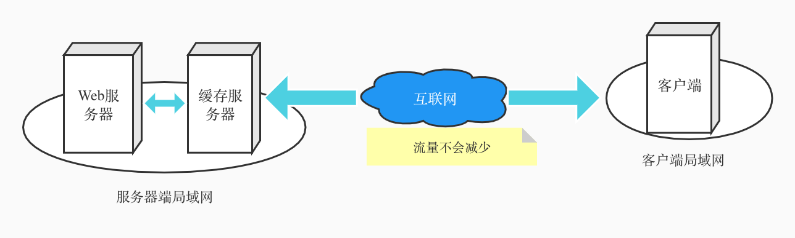
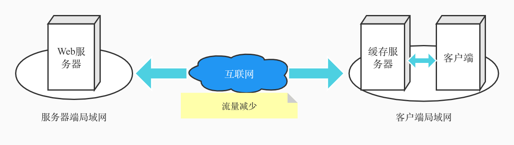

#### 代理

> 代理按部署位置分为正向代理和反向代理，正向代理部署在客户端，反向代理部署在web服务器端。

 
<p align="center">缓存服务器部署在服务器端</p>

 
<p align="center">缓存服务器部署在客户端</p>


1. 正向代理

- 正向代理的特点是需要在用户浏览器上设置。使用正向代理需要在浏览器的“代理服务器”中填写正向代理的IP。当浏览器设置了正向代理时，浏览器的所有请求会直接发给代理服务器。正向代理接收用户发送的请求然后自己伪装成客户端向web服务器发送消息。
- 正向代理可以实现缓存和防火墙的功能。
  - 代理服务器可以缓存用户访问过的数据，当再次请求时直接从位于公司内网的代理服务器获取，请求不需要经过互联网，也不需要web服务器处理，访问速度很快。
  - 用户的请求都发向代理服务器，代理服务器可以查看请求的内容并判断是否允许用户访问，例如禁止用户访问危险或与工作无关的网站。包过滤方式的防火墙只能根据网络包头部的IP、端口等信息判断，无法实现上述目的。

- 在我们常用的浏览器中，浏览器类的软件，通常都是默认如果你设置了系统代理，就会**通过系统代理来访问外部网络**，例如 Chrome、Firefox 等。
- 如果我们设置 HTTP 或者 SOCKS5 代理，那么启用系统代理的应用，就会将所有的请求全部转发到这个代理服务器，通过代理服务器进行访问。通常这对应着我们的 ssr 客户端里的`系统代理模式-> 全局模式`,这种模式下，使用系统代理的软件，**所有的网络请求就全部会通过系统代理设置的代理服务器。** 

2. 反向代理

- 反向代理通过DNS解析引导的方式将客户端请求导向代理服务器，<u>网络包中的接收方IP就是代理服务器</u>。web服务器端的[缓存服务器](./HTTP/缓存)就是一种反向代理。
- 判断转发目标
  - 因为用户请求的网络包中的接收方IP就是代理服务器，当代理服务器代理了多台web服务器时，从接收方IP无法判断用户请求的是哪个web服务器是哪个web服务器上的资源。一种方法是在代理服务器上配置，例如当请求的URI为`/dir1`目录时，转发给web服务器A，当请求的URI为`/dir2`目录时，转发给web服务器B。服务器端的缓存服务器只能向事先设置好的目标进行转发。


##### [前端配置本地代理方法总结](https://juejin.im/post/5c0a6be4f265da616f6fc79c) 

- SwitchyOmega代理、Charles代理、Nginx代理
- 使用nginx进行代理配置
- 不过本机用 `Nginx` 代理一般得配合改 hosts 文件，在 hosts 文件里将 `test.server.com`(自己瞎编的一个域，这里满足 `*.server.com` 就能通过后端的校验) 指向 localhost即可。启动 `Nginx` 指定监听 80 端口，这样访问 `test.server.com` 的时候（实际上访问的就是 `localhost:80`） 就会被 `Nginx` 给代理了。配置好了之后，访问 `ad.server.com/`就是线上环境，改成 `test.server.com/` 就是本机环境了，无痛切换，非常舒服。

##### 参考

- [代理软件的代理模式介绍](https://gaoliang.me/post/ssr-v2ray-proxy-analysis/) 

#### 反向代理 & 重定向 & 负载均衡

##### 反向代理

- 概念：
  反向代理（Reverse Proxy）方式是指以代理服务器来接受Internet上的连接请求，然后将请求转发给内部网络上的服务器，并将从服务器上得到的结果返回给Internet上请求连接的客户端，此时代理服务器对外就表现为一个服务器。
- 为什么需要反向代理
  1. 可以起到保护网站**安全**的作用，因为任何来自Internet的请求都必须先经过代理服务器；保护了真实的web服务器，web服务器对外不可见，外网只能看到反向代理服务器，而反向代理服务器上并没有真实数据，因此，保证了web服务器的资源安全
  2. **缓存**静态资源，加速Web请求。
- nginx 配置
  nginx反向代理主要通过 **proxy_pass** 来配置，将你项目的开发机地址填写到proxy_pass后面，正常的格式为proxy_pass URL即可；

###### 反向代理与正向代理的区别

代理是是谁：客服端 & 服务端

- 正向代理是客户端知道目的服务器在哪里，然后通过代理服务器去访问客户端不能直接访问的目标服务器，而目标服务器并不知道客户端通过什么来访问的， 即 **正向代理代理的是客户端**；典型的翻墙。
- 反向代理中，外部网络对于内部网络具体的情况是不可见的，而代理服务器来代理内部网络来返回所要的数据(当然静态文件可以放在Nginx，这个静动分离再说)，而服务端知道请求的来源以及数据**反向代理代理的是服务端** 。

参考

- [反向代理-正向代理](https://juejin.im/post/5b2cf79af265da596019661e) 
- [反向代理](https://juejin.im/post/5b01336af265da0b8a67e5c9) 

###### Nginx 配置反向代理

- server块可以理解为一个虚拟主机，此时我们如果调用的是http://localhost:8182时，会将这个请求转发到http://localhost:8082,因此实际处理这个请求的是http://localhost:8082

  ```
  server {
  	listen       8182;
  	server_name  localhost;
  	...
  	location / {
  		proxy_pass http://localhost:8082;
  		...
  	}
  }
  ```

#### Nginx配置

- 指定配置文件位置
  nginx -c xx.conf
- nginx -s reload
- nginx -s stop
- 测试配置文件是否正确
  nginx -t -c xx.conf
- 查看进程号
  - ps -ef | grep nginx
  - kill -QUIT 进程号
  - kill -9 nginx: 强制停止


##### 参考

- [nginx如何处理一个请求-官网](https://tengine.taobao.org/nginx_docs/cn/docs/http/request_processing.html) 
- [nginx配置-知乎](https://zhuanlan.zhihu.com/p/31202053) 